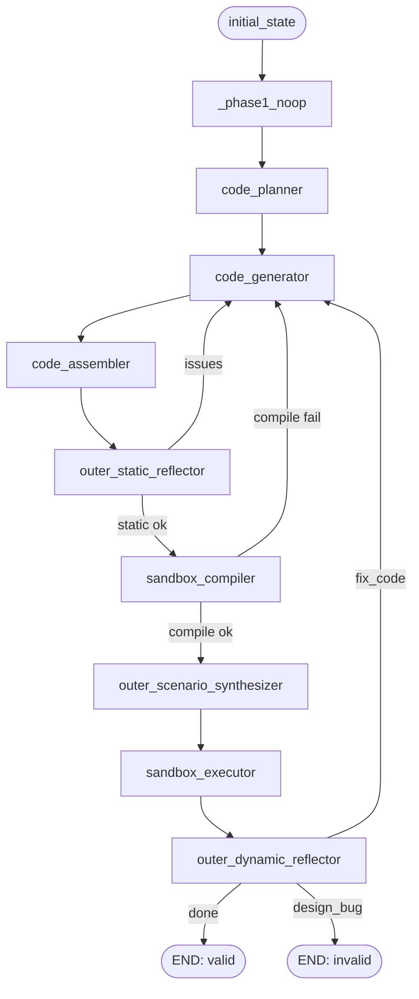

# 06 · LangGraph 骨架

> 依赖:01(CascadeState)、02(session/redis/mongo/logging)、03(ToolRegistry)、04(森林)、05(LLMClient + TraceContext)
> 交付物:`BasePipelineStep`(模板方法)+ `PipelineStepFactory` + `RunEventBus` + `TraceSink`(MongoDB) + Phase1/2/3 三阶段 LangGraph 组装脚手架 + **可插拔 Handler 基类**(为 07 章责任链准备) + 空壳节点 + 端到端 no-op 跑通
> 验收:
> 1. 给定一个空 Pipeline(所有 step 都是 no-op),提交一个 WorkflowRun,能跑完三阶段并落 `workflow_run.final_verdict = valid`
> 2. 每个 step 的 trace 都写进 MongoDB `run_step_details`,包含 input_state / output_state / llm_calls(此时为空) / tool_calls(空)
> 3. Redis pub/sub 广播每一步 step_started / step_completed 事件
> 4. `tests/unit/langgraph/*` 全绿

---

## 6.1 模块总览

```
app/langgraph/
├── __init__.py
├── errors.py                 流水线专属异常
├── state.py                  CascadeState re-export(以 01 章为准;本章不再扩展)
├── events.py                 RunEventBus(观察者)+ 事件类型定义
├── trace_sink.py             TraceSink(Mongo 写入)
├── steps/
│   ├── __init__.py           STEP_REGISTRY 自动扫描
│   ├── base.py               ★ BasePipelineStep(模板方法) + Handler 基类
│   ├── factory.py            PipelineStepFactory
│   ├── phase1/
│   │   ├── __init__.py       Phase1 Handler 注册表 + 路由函数(07 章细化)
│   │   ├── structure_check.py  Handler 1:结构合法性(07 章实现)
│   │   └── scenario_run.py     Handler 2:场景执行对比(07 章实现)
│   ├── phase2/
│   │   └── (08 章)
│   └── phase3/
│       └── (09 章)
├── router.py                 PhaseRouter(状态机路由)
├── pipeline.py               CascadePipeline(组装 StateGraph)
└── runtime.py                run_workflow(入口) + 超时控制
```

---

## 6.2 异常

```python
# app/langgraph/errors.py
from app.domain.errors import DomainError, BusinessError, DependencyError

class PipelineError(DomainError):            code = "PIPELINE_UNEXPECTED"
class StepFailed(PipelineError):             code = "PIPELINE_STEP_FAILED"
class IterationExhausted(BusinessError):     code = "PIPELINE_ITERATION_EXHAUSTED"
class WorkflowTimeout(DependencyError):      code = "PIPELINE_TIMEOUT"
class HandlerRouteError(PipelineError):      code = "PIPELINE_HANDLER_ROUTE"
```

---

## 6.3 CascadeState 扩展

在 01 章 `CascadeState` 基础上,追加**责任链执行轨迹**字段(为 07 章准备):

```python
# app/langgraph/state.py
"""
本章的 state 就是 01 章 §1.7.4 的 `CascadeState`。所有字段(含 Phase1 责任链 / 场景 /
node_outputs / handler_traces)都在 01 章已经声明;本模块只做两件事:
  1. 再导出一份同名 alias 方便 import(`app.langgraph.state.CascadeState`)
  2. 给将来可能的"LangGraph 层专属字段"留一个扩展口(v1 为空)
"""
from app.domain.run.state import CascadeState, initial_state, HandlerTrace, Decision  # re-export
```

`raw_graph_json` 的结构遵循 01 章 §1.4 森林 JSON:`{bundles, node_instances, edges, metadata}`。

---

## 6.4 RunEventBus(观察者)

```python
# app/langgraph/events.py
from dataclasses import dataclass, asdict
from typing import Literal, Any
import json
from redis.asyncio import Redis
from app.utils.clock import utcnow

EventType = Literal[
    "run_started", "run_finished",
    "phase_started", "phase_finished",
    "step_started", "step_completed",
    "handler_started", "handler_completed",
    "tool_called", "llm_called",
    "iteration_hit",
]

@dataclass(frozen=True, slots=True)
class RunEvent:
    type: EventType
    run_id: str
    ts: str                                  # ISO-8601
    phase: int | None = None
    step_id: str | None = None
    node_name: str | None = None
    handler_name: str | None = None
    payload: dict | None = None

def channel_of(run_id: str) -> str: return f"run:{run_id}:events"

class RunEventBus:
    """基于 Redis pub/sub 的事件广播。写入方只 emit,订阅方(WS、Metrics)自己连。"""
    def __init__(self, redis: Redis) -> None:
        self._r = redis

    async def emit(self, event: RunEvent) -> None:
        await self._r.publish(channel_of(event.run_id), json.dumps(asdict(event)))

    async def emit_simple(self, etype: EventType, run_id: str, **kw) -> None:
        evt = RunEvent(type=etype, run_id=run_id, ts=utcnow().isoformat(), **kw)
        await self.emit(evt)
```

**订阅侧**(11 章 WS gateway 会用):订阅 `run:{run_id}:events` 通道,把消息转发给 WebSocket 客户端。

---

## 6.5 TraceSink(MongoDB 写入)

```python
# app/langgraph/trace_sink.py
from typing import Any
from app.utils.sanitize import sanitize
from app.utils.clock import utcnow
from app.infra.mongo.collections import RUN_STEP_DETAILS, SANDBOX_TRACES

class TraceSink:
    """把每一步的全量 trace 写进 MongoDB。不做查询。"""

    SCHEMA_VERSION = 1

    def __init__(self, mongo_db) -> None:
        self._db = mongo_db

    async def write_step_detail(
        self, *,
        run_id: str,
        step_id: str,
        phase: int,
        node_name: str,
        iteration: int,
        handler_name: str | None,
        input_state: dict,
        output_state: dict,
        tool_calls: list[dict],
        llm_calls: list[dict],
        decision: str | None = None,
        decision_reason: str | None = None,
        status: str = "success",
        error: str | None = None,
    ) -> str:
        """写一条 run_step_details 文档,返回 ObjectId hex"""
        doc = {
            "schema_version": self.SCHEMA_VERSION,
            "run_id": run_id,
            "step_id": step_id,
            "phase": phase,
            "node_name": node_name,
            "iteration": iteration,
            "handler_name": handler_name,
            "input_state": sanitize(input_state),
            "output_state": sanitize(output_state),
            "tool_calls": sanitize(tool_calls),
            "llm_calls": sanitize(llm_calls),
            "decision": decision,
            "decision_reason": decision_reason,
            "status": status,
            "error": error,
            "created_at": utcnow(),
        }
        r = await self._db[RUN_STEP_DETAILS].insert_one(doc)
        return str(r.inserted_id)

    async def write_sandbox_trace(self, **kw) -> str:
        """09 章用。接口先定好"""
        doc = {"schema_version": self.SCHEMA_VERSION, "created_at": utcnow(), **kw}
        r = await self._db[SANDBOX_TRACES].insert_one(doc)
        return str(r.inserted_id)
```

---

## 6.6 ToolCallTraceContext(补强 LLM trace)

LLM 调用由 05 章的 `LLMTraceContext` 记录;**Tool(解释器) 调用** 由 07/08 章触发,也需要一个 context:

```python
# app/langgraph/trace_sink.py (续)
import contextvars

class ToolCallTraceContext:
    """Tool 调用轨迹的 contextvar buffer。用法同 LLMTraceContext。"""
    _buf: contextvars.ContextVar[list[dict] | None] = contextvars.ContextVar("tool_call_buf", default=None)

    def begin_scope(self) -> None: self._buf.set([])
    def record(self, entry: dict) -> None:
        b = self._buf.get()
        if b is not None: b.append(entry)
    def end_scope(self) -> list[dict]:
        out = list(self._buf.get() or [])
        self._buf.set(None)
        return out
```

> `ctx.trace` 在 03 章的 `SimContext` 里就是这个对象(或 None)。解释器 record 一次,Step 基类结尾 `end_scope` 取走。

---

## 6.7 PipelineStep 协议与 BasePipelineStep(模板方法)

```python
# app/langgraph/steps/base.py
from abc import ABC, abstractmethod
from typing import ClassVar, Protocol, runtime_checkable
from time import perf_counter_ns
from app.langgraph.state import CascadeState
from app.langgraph.events import RunEventBus, RunEvent
from app.langgraph.trace_sink import TraceSink, ToolCallTraceContext
from app.langgraph.errors import StepFailed
from app.llm.decorators.trace import LLMTraceContext
from app.repositories.base import SqlRepoBase
from app.utils.ids import new_id
from app.utils.clock import utcnow
from app.infra.logging import get_logger

log = get_logger(__name__)

@runtime_checkable
class PipelineStep(Protocol):
    name: ClassVar[str]
    phase: ClassVar[int]
    async def execute(self, state: CascadeState) -> CascadeState: ...

class BasePipelineStep(ABC):
    """模板方法。子类只需要实现 _do(state)。

    模板固化的横切关注点:
      - 生成 step_id + 写 run_step(MySQL 摘要)
      - 打开 LLM trace scope + Tool trace scope
      - emit step_started / step_completed
      - 执行 _do(state)
      - 收集 LLM/Tool trace,写 MongoDB 全量
      - 异常统一包装为 StepFailed
    """
    name: ClassVar[str] = ""
    phase: ClassVar[int] = 0

    def __init__(
        self, *,
        event_bus: RunEventBus,
        trace_sink: TraceSink,
        llm_trace_ctx: LLMTraceContext,
        tool_trace_ctx: ToolCallTraceContext,
        run_step_repo,                       # 10 章补齐 Repo;本章用 Protocol
    ) -> None:
        self._events = event_bus
        self._trace = trace_sink
        self._llm_ctx = llm_trace_ctx
        self._tool_ctx = tool_trace_ctx
        self._run_step_repo = run_step_repo

    async def execute(self, state: CascadeState) -> CascadeState:
        step_id = new_id("s")
        t0 = perf_counter_ns()

        self._llm_ctx.begin_scope()
        self._tool_ctx.begin_scope()

        await self._events.emit(RunEvent(
            type="step_started", run_id=state["run_id"], ts=utcnow().isoformat(),
            phase=self.phase, step_id=step_id, node_name=self.name,
        ))

        try:
            new_state = await self._do(state)
            duration_ms = (perf_counter_ns() - t0) // 1_000_000

            llm_calls = self._llm_ctx.end_scope()
            tool_calls = self._tool_ctx.end_scope()

            mongo_ref = await self._trace.write_step_detail(
                run_id=state["run_id"],
                step_id=step_id,
                phase=self.phase,
                node_name=self.name,
                iteration=self._iteration_of(state),
                handler_name=new_state.get("current_handler"),
                input_state=_strip_heavy(state),
                output_state=_strip_heavy(new_state),
                tool_calls=tool_calls,
                llm_calls=llm_calls,
                decision=new_state.get("decision"),
                status="success",
            )

            await self._run_step_repo.create(
                id=step_id,
                run_id=state["run_id"],
                phase=self.phase,
                node_name=self.name,
                iteration_index=self._iteration_of(state),
                status="success",
                mongo_ref=mongo_ref,
                duration_ms=int(duration_ms),
                started_at=utcnow(),
                summary=self._summary(new_state),
            )

            await self._events.emit(RunEvent(
                type="step_completed", run_id=state["run_id"], ts=utcnow().isoformat(),
                phase=self.phase, step_id=step_id, node_name=self.name,
                payload={"status": "success", "duration_ms": duration_ms},
            ))
            return new_state

        except Exception as e:
            duration_ms = (perf_counter_ns() - t0) // 1_000_000
            llm_calls = self._llm_ctx.end_scope()
            tool_calls = self._tool_ctx.end_scope()
            log.exception("step_failed", step=self.name)

            try:
                await self._trace.write_step_detail(
                    run_id=state["run_id"], step_id=step_id, phase=self.phase,
                    node_name=self.name, iteration=self._iteration_of(state),
                    handler_name=state.get("current_handler"),
                    input_state=_strip_heavy(state), output_state={},
                    tool_calls=tool_calls, llm_calls=llm_calls,
                    status="failed", error=str(e),
                )
                await self._run_step_repo.create(
                    id=step_id, run_id=state["run_id"], phase=self.phase,
                    node_name=self.name, iteration_index=self._iteration_of(state),
                    status="failed", mongo_ref=None,
                    duration_ms=int(duration_ms), started_at=utcnow(),
                    summary={}, error_message=str(e)[:2000],
                )
            finally:
                await self._events.emit(RunEvent(
                    type="step_completed", run_id=state["run_id"], ts=utcnow().isoformat(),
                    phase=self.phase, step_id=step_id, node_name=self.name,
                    payload={"status": "failed", "error": str(e)[:500]},
                ))
            raise StepFailed(f"{self.name}: {e}") from e

    @abstractmethod
    async def _do(self, state: CascadeState) -> CascadeState: ...

    def _iteration_of(self, state: CascadeState) -> int:
        """子类按需覆盖;默认 0"""
        return 0

    def _summary(self, state: CascadeState) -> dict:
        """MySQL run_step.summary 的内容;子类按需覆盖"""
        return {}


def _strip_heavy(state: dict) -> dict:
    """减肥 state:去掉 raw_graph_json、composite_code 这类大字段,只留指针"""
    HEAVY = {"raw_graph_json", "composite_code", "code_skeleton"}
    out = {}
    for k, v in state.items():
        if k in HEAVY:
            if v is None: out[k] = None
            else: out[k] = {"__omitted__": True, "size_hint": len(str(v))}
        else:
            out[k] = v
    return out
```

### 6.7.1 Handler 基类(Phase1 责任链骨架)

```python
# app/langgraph/steps/base.py (续)

class HandlerStep(BasePipelineStep):
    """Phase1 的"责任链 Handler"基类。

    每个 Handler:
      - 是一个独立的 LangGraph 节点(继承 BasePipelineStep 拿 trace/事件)
      - _do(state) 里跑自己的业务,把结果写进 state["handler_traces"] 和 state["decision"]
      - 通过 route_next(state) 返回下一个节点名或 END

    Phase1 的整体路由函数会读 state["decision"] 和 state["current_handler"] 来分派。
    """
    phase = 1
    handler_order: ClassVar[int] = 0              # 在 Phase1 里的默认位置(小的先)
    next_on_pass: ClassVar[str | None] = None     # 过了去哪;None = Phase1 末尾
    next_on_fail: ClassVar[str | None] = None     # 不过去哪;None = END(判 invalid)

    async def _do(self, state):
        state["current_handler"] = self.name
        await self._events.emit(RunEvent(
            type="handler_started", run_id=state["run_id"], ts=utcnow().isoformat(),
            phase=1, handler_name=self.name,
        ))
        trace: dict = {
            "handler_name": self.name,
            "started_at": utcnow().isoformat(),
            "status": "pass",
            "summary": "",
            "details": {},
            "errors": [],
        }
        try:
            outcome = await self._handle(state, trace)
            trace["finished_at"] = utcnow().isoformat()
            state["handler_traces"].append(trace)
            state["decision"] = "handler_pass" if outcome == "pass" else "handler_fail"
            await self._events.emit(RunEvent(
                type="handler_completed", run_id=state["run_id"], ts=utcnow().isoformat(),
                phase=1, handler_name=self.name,
                payload={"status": trace["status"]},
            ))
            return state
        except Exception as e:
            trace["status"] = "error"
            trace["errors"].append({"kind": "exception", "msg": str(e)})
            trace["finished_at"] = utcnow().isoformat()
            state["handler_traces"].append(trace)
            raise

    @abstractmethod
    async def _handle(self, state, trace) -> str:
        """实现业务。返回 "pass" 或 "fail"。向 trace["errors"] / details 填内容。"""
```

---

## 6.8 STEP_REGISTRY 与 PipelineStepFactory

```python
# app/langgraph/steps/__init__.py
from __future__ import annotations
import importlib, pkgutil
from app.langgraph.steps.base import BasePipelineStep

STEP_REGISTRY: dict[str, type[BasePipelineStep]] = {}

def _scan() -> None:
    from app.langgraph import steps as _pkg
    for _, pkgname, ispkg in pkgutil.iter_modules(_pkg.__path__):
        if not ispkg: continue                              # 只扫 phase1/phase2/phase3 三个子包
        sub = importlib.import_module(f"{_pkg.__name__}.{pkgname}")
        for _, modname, _ in pkgutil.iter_modules(sub.__path__):
            mod = importlib.import_module(f"{sub.__name__}.{modname}")
            for attr in vars(mod).values():
                if (isinstance(attr, type)
                    and issubclass(attr, BasePipelineStep)
                    and attr is not BasePipelineStep
                    and attr.name):
                    if attr.name in STEP_REGISTRY:
                        raise RuntimeError(f"duplicate step {attr.name}")
                    STEP_REGISTRY[attr.name] = attr

_scan()
```

```python
# app/langgraph/steps/factory.py
from dataclasses import dataclass
from app.langgraph.steps.base import BasePipelineStep, HandlerStep
from app.langgraph.steps import STEP_REGISTRY
from app.langgraph.events import RunEventBus
from app.langgraph.trace_sink import TraceSink, ToolCallTraceContext
from app.llm.client import LLMClient
from app.tool_runtime.registry import ToolRegistry
from app.services.design_validator import DesignValidator
from app.services.forest_parser import ForestParser

@dataclass(slots=True)
class StepDeps:
    event_bus: RunEventBus
    trace_sink: TraceSink
    tool_trace_ctx: ToolCallTraceContext
    llm_client: LLMClient
    tool_registry: ToolRegistry
    design_validator: DesignValidator
    forest_parser: ForestParser
    run_step_repo: any               # 10 章接入
    settings: any

    def kwargs_for(self, cls: type[BasePipelineStep]) -> dict:
        """按 step 类需要注入的依赖返回 dict"""
        base = dict(
            event_bus=self.event_bus,
            trace_sink=self.trace_sink,
            llm_trace_ctx=self.llm_client.trace_ctx,
            tool_trace_ctx=self.tool_trace_ctx,
            run_step_repo=self.run_step_repo,
        )
        # Handler 或普通 Step 可能额外依赖。由子类通过类属性 depends_on 声明:
        extra: dict = {}
        for dep in getattr(cls, "depends_on", ()):
            if dep == "llm":            extra["llm"] = self.llm_client
            elif dep == "tool_registry":extra["tool_registry"] = self.tool_registry
            elif dep == "design_validator": extra["design_validator"] = self.design_validator
            elif dep == "forest_parser":extra["forest_parser"] = self.forest_parser
            elif dep == "settings":     extra["settings"] = self.settings
            else: raise ValueError(f"unknown dep {dep} for {cls.__name__}")
        return {**base, **extra}

class PipelineStepFactory:
    def __init__(self, deps: StepDeps) -> None:
        self._deps = deps

    def make(self, step_name: str) -> BasePipelineStep:
        cls = STEP_REGISTRY.get(step_name)
        if cls is None:
            raise KeyError(f"unknown step {step_name}")
        return cls(**self._deps.kwargs_for(cls))

    def list_phase(self, phase: int) -> list[type[BasePipelineStep]]:
        return [c for c in STEP_REGISTRY.values() if c.phase == phase]

    def list_phase1_handlers(self) -> list[type[HandlerStep]]:
        hs = [c for c in STEP_REGISTRY.values()
              if issubclass(c, HandlerStep)]
        return sorted(hs, key=lambda c: c.handler_order)
```

**Step 子类声明依赖**的方式:

```python
class ScenarioRunHandler(HandlerStep):
    name = "scenario_run"
    handler_order = 20
    depends_on = ("llm", "tool_registry", "forest_parser", "settings")

    def __init__(self, *, llm, tool_registry, forest_parser, settings, **base_kw):
        super().__init__(**base_kw)
        self._llm = llm
        # ...
```

---

## 6.9 PhaseRouter(状态机路由)

```python
# app/langgraph/router.py
from typing import Any
from langgraph.graph import END
from app.langgraph.steps.factory import PipelineStepFactory

class PhaseRouter:
    """收集每个 Phase 的路由规则。由 pipeline.py 在组装 StateGraph 时消费。

    当前规则:
      Phase1: 依次跑各个 HandlerStep(按 handler_order),任一 fail → END(invalid);全通过 → 进 Phase2
      Phase2: code_planner → code_generator → code_assembler → 进 Phase3
      Phase3: outer_static_reflector → sandbox_compiler → (fix_code→back to phase2)
              → outer_scenario_synthesizer → sandbox_executor → outer_dynamic_reflector
              done / design_bug / fix_exhausted / fix_code 根据 decision 分派
    """
    def __init__(self, factory: PipelineStepFactory, settings) -> None:
        self._f = factory
        self._s = settings

    # ---------- Phase1 ----------
    def phase1_order(self) -> list[str]:
        return [c.name for c in self._f.list_phase1_handlers()]

    def after_phase1_handler(self, current: str) -> Any:
        """传给 StateGraph.add_conditional_edges 的路由函数的 factory。
        返回一个闭包,lambda state -> next step name or END
        """
        order = self.phase1_order()
        def _route(state):
            if state.get("decision") == "handler_fail":
                state["phase1_verdict"] = "invalid"
                state["final_verdict"] = "invalid"
                return END
            # 下一个 handler
            try:
                idx = order.index(current)
            except ValueError:
                return END
            if idx + 1 < len(order):
                return order[idx + 1]
            # 全过
            state["phase1_verdict"] = "valid"
            state["decision"] = "done"
            return "code_planner"        # Phase2 入口
        return _route

    # ---------- Phase2 ----------
    def after_code_assembler(self) -> Any:
        def _route(state):
            return "outer_static_reflector"
        return _route

    # ---------- Phase3 ----------
    def after_outer_static(self) -> Any:
        def _route(state):
            if state.get("static_issues"):
                return "code_generator"         # 回修
            return "sandbox_compiler"
        return _route

    def after_sandbox_compiler(self) -> Any:
        def _route(state):
            cr = state.get("compile_result") or {}
            if not cr.get("ok"):
                # 编译失败 → 回修
                state["outer_fix_iter"] = state.get("outer_fix_iter", 0) + 1
                if state["outer_fix_iter"] >= self._s.OUTER_FIX_MAX:
                    state["final_verdict"] = "inconclusive"
                    return END
                return "code_generator"
            return "outer_scenario_synthesizer"
        return _route

    def after_outer_dynamic(self) -> Any:
        def _route(state):
            d = state.get("decision")
            if d == "done":
                state["phase3_verdict"] = "done"
                state["final_verdict"] = "valid"
                return END
            if d == "design_bug":
                state["phase3_verdict"] = "design_bug"
                state["final_verdict"] = "invalid"
                return END
            if d == "fix_code":
                state["outer_fix_iter"] = state.get("outer_fix_iter", 0) + 1
                if state["outer_fix_iter"] >= self._s.OUTER_FIX_MAX:
                    state["phase3_verdict"] = "fix_exhausted"
                    state["final_verdict"] = "inconclusive"
                    return END
                return "code_generator"
            return END
        return _route
```

---

## 6.10 Pipeline 变体(多图,按 variant 动态组装)

> **业务驱动**:并不是所有 Run 都需要跑完三阶段。
> - 做方案推演时,**只验证设计对不对**(只跑 Phase1),省 LLM 成本
> - 做代码预览时,**跑 Phase1 + Phase2**(设计对 + 代码能生成),不需要硬件级编译
> - 完整验收,**跑三阶段**
>
> 把 Pipeline 做成按 **PipelineVariant 枚举** 动态组装的 Builder。前端触发 Run 时带 variant 参数。

### 6.10.1 Variant 枚举

```python
# app/langgraph/pipeline.py
from enum import Enum

class PipelineVariant(str, Enum):
    PHASE1_ONLY  = "phase1_only"    # 只跑 Phase1,Handler 链最后一个 pass → END(valid)
    UP_TO_PHASE2 = "up_to_phase2"   # Phase1 pass → Phase2 完成 → END(valid),不编译不沙箱
    FULL         = "full"           # 三阶段完整
```

`WorkflowRun.options.variant` 存 variant 字符串;默认 `full`。

### 6.10.2 PipelineBuilder(策略模式 + 组合)

```python
# app/langgraph/pipeline.py (续)
from typing import Any
from langgraph.graph import StateGraph, END
from app.langgraph.state import CascadeState
from app.langgraph.steps.factory import PipelineStepFactory
from app.langgraph.router import PhaseRouter

class PipelineBuilder:
    """按 PipelineVariant 装配不同的 LangGraph。

    设计:
      - Phase1 链永远在
      - UP_TO_PHASE2 / FULL 时才加 Phase2 节点
      - FULL 时才加 Phase3 节点
      - variant 只变"接入哪些节点"和"Phase1 最末 Handler pass 后的下一跳",其他保持
    """

    def __init__(self, factory: PipelineStepFactory, router: PhaseRouter) -> None:
        self._f = factory
        self._r = router
        self._cache: dict[PipelineVariant, Any] = {}

    def get(self, variant: PipelineVariant):
        if variant not in self._cache:
            self._cache[variant] = self._build(variant)
        return self._cache[variant]

    def _build(self, variant: PipelineVariant):
        g = StateGraph(CascadeState)

        # ---------- Phase1 ----------
        handler_order = self._r.phase1_order()
        if not handler_order:
            g.add_node("_phase1_noop", _noop_step)
            g.set_entry_point("_phase1_noop")
            # 无 handler 的兜底:根据 variant 直接下一跳或 END
            if variant is PipelineVariant.PHASE1_ONLY:
                g.add_edge("_phase1_noop", END)
            elif variant is PipelineVariant.UP_TO_PHASE2:
                g.add_edge("_phase1_noop", "code_planner")
            else:
                g.add_edge("_phase1_noop", "code_planner")
        else:
            for name in handler_order:
                g.add_node(name, self._f.make(name).execute)
            g.set_entry_point(handler_order[0])
            for name in handler_order:
                g.add_conditional_edges(
                    name, self._r.after_phase1_handler(name, variant=variant)
                )

        if variant is PipelineVariant.PHASE1_ONLY:
            return g.compile()

        # ---------- Phase2 ----------
        g.add_node("code_planner",   self._f.make("code_planner").execute)
        g.add_node("code_generator", self._f.make("code_generator").execute)
        g.add_node("code_assembler", self._f.make("code_assembler").execute)
        g.add_edge("code_planner",   "code_generator")
        g.add_edge("code_generator", "code_assembler")

        if variant is PipelineVariant.UP_TO_PHASE2:
            # Phase2 完成后直接 END(结果看 compose 成功否)
            g.add_conditional_edges("code_assembler",
                                     self._r.after_code_assembler(variant=variant))
            return g.compile()

        # ---------- Phase3 ----------
        g.add_node("outer_static_reflector",     self._f.make("outer_static_reflector").execute)
        g.add_node("sandbox_compiler",           self._f.make("sandbox_compiler").execute)
        g.add_node("outer_scenario_synthesizer", self._f.make("outer_scenario_synthesizer").execute)
        g.add_node("sandbox_executor",           self._f.make("sandbox_executor").execute)
        g.add_node("outer_dynamic_reflector",    self._f.make("outer_dynamic_reflector").execute)

        g.add_conditional_edges("code_assembler",          self._r.after_code_assembler(variant=variant))
        g.add_conditional_edges("outer_static_reflector",  self._r.after_outer_static())
        g.add_conditional_edges("sandbox_compiler",        self._r.after_sandbox_compiler())
        g.add_edge("outer_scenario_synthesizer",           "sandbox_executor")
        g.add_edge("sandbox_executor",                     "outer_dynamic_reflector")
        g.add_conditional_edges("outer_dynamic_reflector", self._r.after_outer_dynamic())

        return g.compile()

async def _noop_step(state):
    return state
```

### 6.10.3 PhaseRouter 要按 variant 感知

`after_phase1_handler` 需要知道当前 variant(Phase1 最末 Handler pass 之后去哪):

```python
# app/langgraph/router.py 伪代码(6.9 已有的基础上改)
from app.langgraph.pipeline import PipelineVariant

class PhaseRouter:
    # ...
    def after_phase1_handler(self, current: str,
                             variant: "PipelineVariant" = None):
        order = self.phase1_order()
        def _route(state):
            if state.get("decision") == "handler_fail":
                state["phase1_verdict"] = "invalid"; state["final_verdict"] = "invalid"
                return END
            idx = order.index(current)
            if idx + 1 < len(order):
                return order[idx + 1]
            # 最后一个 handler pass:
            state["phase1_verdict"] = "valid"
            state["decision"] = "done"
            if variant is PipelineVariant.PHASE1_ONLY:
                state["final_verdict"] = "valid"
                return END
            return "code_planner"
        return _route

    def after_code_assembler(self, variant: "PipelineVariant" = None):
        def _route(state):
            cr = state.get("compile_result")
            if variant is PipelineVariant.UP_TO_PHASE2:
                # 只要 composite_code 不为空就 valid;失败的话由 step 抛
                state["phase2_status"] = "success"
                state["final_verdict"] = "valid"
                return END
            return "outer_static_reflector"
        return _route
```

### 6.10.4 对外入口(`WorkflowRuntime` 接收 variant)

```python
# app/langgraph/runtime.py
import asyncio
from app.config import Settings
from app.langgraph.pipeline import PipelineBuilder, PipelineVariant
from app.langgraph.state import CascadeState, initial_state
from app.langgraph.errors import WorkflowTimeout
from app.langgraph.events import RunEventBus, RunEvent
from app.utils.clock import utcnow

class WorkflowRuntime:
    def __init__(self, builder: PipelineBuilder, events: RunEventBus, settings: Settings) -> None:
        self._b = builder; self._e = events; self._s = settings

    async def run(self, *, run_id: str, graph_version_id: str, raw_graph_json: dict,
                  variant: PipelineVariant = PipelineVariant.FULL,
                  provided_scenarios: list[dict] | None = None) -> CascadeState:
        state = initial_state(run_id, graph_version_id, raw_graph_json, provided_scenarios)
        state.setdefault("options", {})["variant"] = variant.value   # 落 trace 方便查
        await self._e.emit(RunEvent(
            type="run_started", run_id=run_id, ts=utcnow().isoformat(),
            payload={"variant": variant.value},
        ))
        pipeline = self._b.get(variant)
        try:
            final = await asyncio.wait_for(
                pipeline.ainvoke(state),
                timeout=self._s.WORKFLOW_GLOBAL_TIMEOUT,
            )
        except asyncio.TimeoutError:
            await self._e.emit(RunEvent(
                type="run_finished", run_id=run_id, ts=utcnow().isoformat(),
                payload={"status": "timeout"},
            ))
            raise WorkflowTimeout(f"run {run_id} exceeded {self._s.WORKFLOW_GLOBAL_TIMEOUT}s")
        await self._e.emit(RunEvent(
            type="run_finished", run_id=run_id, ts=utcnow().isoformat(),
            payload={"final_verdict": final.get("final_verdict"), "variant": variant.value},
        ))
        return final
```

### 6.10.5 Bootstrap 装配

```python
# app/bootstrap.py (替换原 CascadePipeline 装配)
builder = PipelineBuilder(factory, router)
runtime = WorkflowRuntime(builder, event_bus, settings)
container.pipeline_builder = builder
container.workflow_runtime = runtime
```

### 6.10.6 variant 对 state 的影响

- `variant=PHASE1_ONLY`:`phase1_verdict=valid` 时 `final_verdict=valid`(不进 Phase2 也算成功);`invalid` 同原逻辑
- `variant=UP_TO_PHASE2`:Phase2 完成 → `phase2_status=success` + `final_verdict=valid`;Phase2 抛异常走常规 StepFailed 路径
- `variant=FULL`:完全按 04 章 Router 规则

外部消费方(10 章 WorkflowFacade / 11 章 Celery 任务)要把 variant 从 `RunTriggerDTO.options["variant"]` 透传进来。DTO 建议:

```python
# app/schemas/run.py (追加)
from enum import Enum
class RunVariant(str, Enum):
    phase1_only  = "phase1_only"
    up_to_phase2 = "up_to_phase2"
    full         = "full"

class RunTriggerDTO(BaseModel):
    graph_version_id: str
    scenarios:        list[ScenarioInDTO] = []
    variant:          RunVariant = RunVariant.full
    options:          dict = {}
```

### 6.10.7 为什么不拆成三个独立 Pipeline 类

- 三阶段的 state 是**同一份 `CascadeState`**,字段也共享
- LangGraph 的 `StateGraph` 构造成本低,按需重建缓存起来即可
- 同一个 Factory / Router 可以服务所有 variant
- 策略:**一套节点定义,三套组装**。符合"节点独立可插"的主张


---

## 6.11 骨架 Step 占位(phase1/2/3 各 1 个,未注册)

> 这些是"空壳"占位,保证在 07/08/09 章没完成时也能跑通骨架测试。07/08/09 章的真实实现会覆盖 / 替换。

```python
# app/langgraph/steps/phase1/__init__.py
# 07 章会在这里填 structure_check.py / scenario_run.py
# 本章先不放任何实际 handler,让 CascadePipeline 走 _phase1_noop 分支
```

```python
# app/langgraph/steps/phase2/code_planner.py
from app.langgraph.steps.base import BasePipelineStep
class CodePlannerStep(BasePipelineStep):
    name = "code_planner"; phase = 2
    async def _do(self, state):
        state["code_skeleton"] = state.get("code_skeleton") or {"modules": []}
        return state

# phase2/code_generator.py
class CodeGeneratorStep(BasePipelineStep):
    name = "code_generator"; phase = 2
    async def _do(self, state):
        state["code_units"] = state.get("code_units") or []
        return state

# phase2/code_assembler.py
class CodeAssemblerStep(BasePipelineStep):
    name = "code_assembler"; phase = 2
    async def _do(self, state):
        state["composite_code"] = state.get("composite_code") or {"files": {}}
        return state
```

```python
# app/langgraph/steps/phase3/outer_static_reflector.py
class OuterStaticReflectorStep(BasePipelineStep):
    name = "outer_static_reflector"; phase = 3
    async def _do(self, state):
        state["static_issues"] = []
        return state

# phase3/sandbox_compiler.py
class SandboxCompilerStep(BasePipelineStep):
    name = "sandbox_compiler"; phase = 3
    async def _do(self, state):
        state["compile_result"] = {"ok": True}
        return state

# phase3/outer_scenario_synthesizer.py
class OuterScenarioSynthesizerStep(BasePipelineStep):
    name = "outer_scenario_synthesizer"; phase = 3
    async def _do(self, state):
        state["sandbox_cases"] = state.get("sandbox_cases") or []
        return state

# phase3/sandbox_executor.py
class SandboxExecutorStep(BasePipelineStep):
    name = "sandbox_executor"; phase = 3
    async def _do(self, state):
        state["execution_results"] = []
        return state

# phase3/outer_dynamic_reflector.py
class OuterDynamicReflectorStep(BasePipelineStep):
    name = "outer_dynamic_reflector"; phase = 3
    async def _do(self, state):
        state["decision"] = "done"
        return state
```

**骨架完成后,提交一个空 run 必然端到端跑通,final_verdict=valid**。这是 06 章的验收标准。

---

## 6.12 Runtime(入口 + 全局超时)

```python
# app/langgraph/runtime.py
import asyncio
from app.config import Settings
from app.langgraph.pipeline import CascadePipeline
from app.langgraph.state import CascadeState, initial_state
from app.langgraph.errors import WorkflowTimeout
from app.langgraph.events import RunEventBus, RunEvent
from app.utils.clock import utcnow

class WorkflowRuntime:
    """WorkflowFacade(10 章)调这里启动一次 pipeline。"""
    def __init__(self, pipeline: CascadePipeline, events: RunEventBus, settings: Settings) -> None:
        self._p = pipeline; self._e = events; self._s = settings

    async def run(self, *, run_id: str, graph_version_id: str, raw_graph_json: dict) -> CascadeState:
        state = initial_state(run_id, graph_version_id, raw_graph_json)
        await self._e.emit(RunEvent(
            type="run_started", run_id=run_id, ts=utcnow().isoformat(),
        ))
        try:
            final = await asyncio.wait_for(
                self._p.run(state),
                timeout=self._s.WORKFLOW_GLOBAL_TIMEOUT,
            )
        except asyncio.TimeoutError:
            await self._e.emit(RunEvent(
                type="run_finished", run_id=run_id, ts=utcnow().isoformat(),
                payload={"status": "timeout"},
            ))
            raise WorkflowTimeout(f"run {run_id} exceeded {self._s.WORKFLOW_GLOBAL_TIMEOUT}s")
        await self._e.emit(RunEvent(
            type="run_finished", run_id=run_id, ts=utcnow().isoformat(),
            payload={"final_verdict": final.get("final_verdict")},
        ))
        return final
```

---

## 6.13 Bootstrap 装配

```python
# app/bootstrap.py (追加)
from app.langgraph.events import RunEventBus
from app.langgraph.trace_sink import TraceSink, ToolCallTraceContext
from app.langgraph.steps.factory import StepDeps, PipelineStepFactory
from app.langgraph.router import PhaseRouter
from app.langgraph.pipeline import CascadePipeline
from app.langgraph.runtime import WorkflowRuntime
from app.services.design_validator import DesignValidator

def build_container(settings):
    # ... 前面已有
    event_bus = RunEventBus(redis)
    trace_sink = TraceSink(mdb)
    tool_trace_ctx = ToolCallTraceContext()
    design_validator = DesignValidator()

    # run_step_repo 的具体实现等 10 章,但可以先用 SQL 会话构造
    from app.repositories.run_step_repo import SqlRunStepRepo       # 10 章会建
    # 这里提供一个 "per-step 现拿 session" 的包装
    from contextlib import asynccontextmanager
    class _RunStepRepoProxy:
        def __init__(self, sf): self._sf = sf
        async def create(self, **kw):
            async with self._sf() as s:
                r = SqlRunStepRepo(s); await r.create(**kw); await s.commit()
    run_step_repo = _RunStepRepoProxy(sf)

    deps = StepDeps(
        event_bus=event_bus, trace_sink=trace_sink,
        tool_trace_ctx=tool_trace_ctx, llm_client=llm_client,
        tool_registry=tool_registry, design_validator=design_validator,
        forest_parser=forest_parser, run_step_repo=run_step_repo,
        settings=settings,
    )
    factory = PipelineStepFactory(deps)
    router = PhaseRouter(factory, settings)
    pipeline = CascadePipeline(factory, router)
    runtime = WorkflowRuntime(pipeline, event_bus, settings)

    container.event_bus = event_bus
    container.trace_sink = trace_sink
    container.tool_trace_ctx = tool_trace_ctx
    container.pipeline = pipeline
    container.workflow_runtime = runtime
```

**执行时序**:

```
WorkflowFacade.trigger(run_id)   (10 章)
      ↓
Celery.run_workflow(run_id)      (11 章)
      ↓
WorkflowRuntime.run(...)         (本章)
      ↓
CascadePipeline.run(state)       (本章,走 langgraph)
      ↓
每个节点: BasePipelineStep.execute(state)
      ├─ open trace scopes
      ├─ _do(state)
      ├─ close trace scopes + 写 Mongo
      └─ emit events
```

---

## 6.14 一个可视化:空骨架 Pipeline



07 章完成后,`_phase1_noop` 会被替换成实际 Handler 链(`structure_check → scenario_run → ...`)。

---

## 6.15 测试要点

### 6.15.1 单元

- `tests/unit/langgraph/test_state.py`:
  - `initial_state` 字段齐全;lists/dicts 是独立实例
- `tests/unit/langgraph/test_events.py`:
  - `emit` 往 Redis publish 成功(fakeredis);payload 可 JSON 解析
- `tests/unit/langgraph/test_trace_sink.py`:
  - `write_step_detail` 写入 mongomock,查回来字段正确
  - sanitize 生效(敏感字段变 `***`)
- `tests/unit/langgraph/test_base_step.py`:
  - 一个继承 `BasePipelineStep` 的 FakeStep,`_do` 返回修改后的 state
  - `execute` 后:events 发了 2 条(started/completed);Mongo 写了 1 条;run_step_repo.create 被调用 1 次
  - `_do` 抛异常:status=failed;raise StepFailed;Mongo 和 MySQL 都落败记录
- `tests/unit/langgraph/test_handler_base.py`:
  - `_handle` 返回 "pass" → state.decision = handler_pass;traces 追加一条 status=pass
  - 返回 "fail" → status=fail + decision=handler_fail
  - 抛异常 → status=error;异常重抛

### 6.15.2 路由

- `tests/unit/langgraph/test_router.py`:
  - Phase1 handler_pass 顺着往下,最后一个 → code_planner
  - Phase1 任意 handler_fail → END,final_verdict=invalid
  - Phase3 compile fail → code_generator;outer_fix_iter 累加;到 OUTER_FIX_MAX → END inconclusive

### 6.15.3 集成(空骨架端到端)

```python
# tests/integration/test_pipeline_noop.py
async def test_noop_pipeline_completes(container_with_mocks):
    runtime = container_with_mocks.workflow_runtime
    final = await runtime.run(
        run_id="r_test", graph_version_id="gv_test",
        raw_graph_json={"bundles": [], "node_instances": [], "edges": [], "metadata": {}},
    )
    assert final["final_verdict"] == "valid"

    # mongo trace 里每个 step 都写了
    mdb = container_with_mocks.mongo_db
    docs = list(await mdb.run_step_details.find({"run_id": "r_test"}).to_list(100))
    assert {d["node_name"] for d in docs} >= {
        "code_planner", "code_generator", "code_assembler",
        "outer_static_reflector", "sandbox_compiler",
        "outer_scenario_synthesizer", "sandbox_executor", "outer_dynamic_reflector",
    }
```

### 6.15.4 超时

- 把 WORKFLOW_GLOBAL_TIMEOUT 设 1 秒,Mock 一个慢 step,`run` 应抛 WorkflowTimeout 且 emit `run_finished{status: timeout}`

---

## 6.16 易错点

1. **state 是 TypedDict,必须用 dict 操作**——langgraph 库对 state 的要求是可 copy + 可 JSON 序列化。**不要在 state 里放 Tool 值对象、Forest 值对象这类 frozen dataclass**(放会直接跑通但 mongo 序列化失败)。只存原始 JSON / 基础类型
2. **_strip_heavy**:大字段占 mongo 很凶。raw_graph_json 已经在 `graph_version.snapshot` 里,`composite_code` 已经在 `code_snapshot` 里,**不要**再重复写进 step trace
3. **LLM trace scope 的边界**:必须在 `execute` 的入口 `begin_scope`、退出 `end_scope`。否则同一进程并发多个 Run 时会串味(contextvar 是 per-task 的,协程间天然隔离,但**线程** `call_sync` 会跨线程——这就是为什么 05 章用独立后台 loop)
4. **`emit` 失败不能破坏业务**:Redis 掉线时广播失败,但不能让 pipeline 挂。装 `RunEventBus` 时在 `emit` 里 try/except,只 log
5. **Celery 任务传递 state**:state 必须 JSON 可序列化。我们的 `CascadeState` 是 TypedDict(本质 dict),OK。不要加任何非 JSON 兼容对象

---

## 6.17 本章交付物清单

- [ ] `app/langgraph/errors.py`
- [ ] `app/langgraph/state.py` CascadeState 扩展 + initial_state
- [ ] `app/langgraph/events.py` RunEventBus + RunEvent
- [ ] `app/langgraph/trace_sink.py` TraceSink + ToolCallTraceContext
- [ ] `app/langgraph/steps/base.py` BasePipelineStep + HandlerStep
- [ ] `app/langgraph/steps/__init__.py` STEP_REGISTRY 扫描
- [ ] `app/langgraph/steps/factory.py` StepDeps + PipelineStepFactory
- [ ] `app/langgraph/router.py` PhaseRouter
- [ ] `app/langgraph/pipeline.py` CascadePipeline
- [ ] `app/langgraph/runtime.py` WorkflowRuntime + 超时
- [ ] `app/langgraph/steps/phase2/*.py` 3 个空壳
- [ ] `app/langgraph/steps/phase3/*.py` 5 个空壳
- [ ] `app/bootstrap.py` 装配追加
- [ ] `tests/unit/langgraph/*` 全绿
- [ ] `tests/integration/test_pipeline_noop.py` 端到端 noop 跑通

---

下一份:[07_Phase1_JSON层.md](./07_Phase1_JSON层.md)  ★ 核心章
