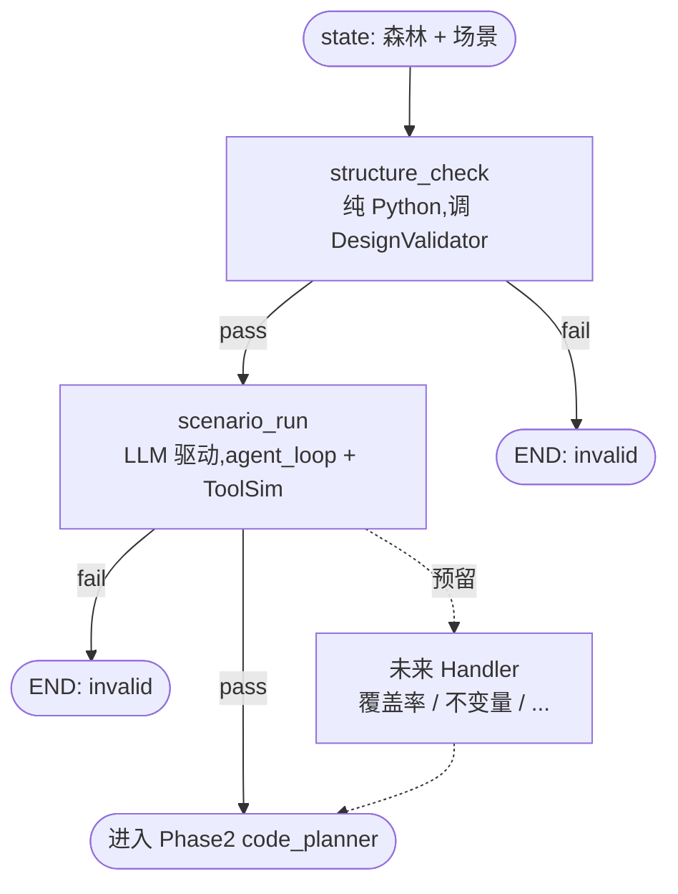
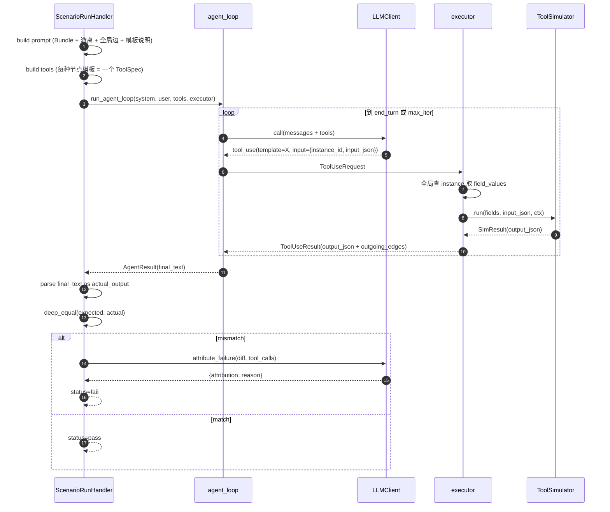

# 07 · Phase1 · JSON 层(责任链 + LLM 驱动)

> **本章是核心章**。严格按 §2.x 共识实现:
> - Phase1 = **责任链**,每个 Handler 独立、可插拔、可断链
> - v1 首批 2 个 Handler:**结构合法性**(纯 Python)、**场景执行对比**(LLM 驱动)
> - 解释器(ToolSimulator)**JSON 入 JSON 出**
> - LLM 在 Phase1 扮演 **森林执行的驱动者**——通过 tool-call 决定调哪个节点、传什么 JSON
> - 判定原则:**字段级精确对比**。`{status:ok}` vs `{status:success}` = 不对
> - **森林模型**:Bundle + 节点实例(含游离)+ 全局边;DAG 是计算视图,不存储
> - 未来新增 Handler(覆盖率 / 不变量 / 数据流类型 / ...)= 新增一个类 + `handler_order`,其它代码不动
>
> 依赖:03(NodeTemplate + ToolSimulator + Registry)、04(森林、DesignValidator、DagComputeVisitor)、05(LLMClient、agent_loop)、06(LangGraph 骨架、HandlerStep)
>
> 验收:
> 1. 给一张合法森林 + 1 条场景,Handler 2 跑通整图,actual_output 与 expected 一致,Phase1 判 valid
> 2. 设计有缺陷的森林(输出故意不符合)→ Handler 2 一次 agent_loop 内产出不符 actual → Phase1 判 invalid,**不进入 Phase2**
> 3. 结构非法森林(有环 / Bundle 引用缺失)→ Handler 1 直接拒 → Phase1 判 invalid,**不进入 Handler 2**
> 4. 把 `ScenarioRunHandler` 从注册表临时摘掉,只剩 `StructureCheckHandler` → Phase1 仍可跑通(责任链可缩)
> 5. Phase1 trace 完整:每次 LLM 调用、每次 ToolSimulator 调用、每场景的 actual/expected 都落 Mongo
> 6. 覆盖率 ≥ 85%

---

## 7.1 模块总览

```
app/langgraph/steps/phase1/
├── __init__.py
├── base.py                   Phase1HandlerBase
├── structure_check.py        ★ Handler 1
├── scenario_run.py           ★ Handler 2
├── prompt.py                 system/initial_user prompt 模板
├── executor.py               ToolUseRequest → ToolSimulator 执行器
├── comparator.py             actual vs expected 严格字段对比
└── attribution.py            失败归因(LLM 辅助,不影响路由)

app/domain/run/scenario.py    Scenario 值对象 / ScenarioResult
app/repositories/json_case_repo.py  t_json_case SQL 实现
```

---

## 7.2 Phase1 责任链图景



**路由规则**(06 章 `PhaseRouter.after_phase1_handler` 已实现):

- 任一 Handler `status=pass` → 下一个(按 `handler_order`);最后一个 → `code_planner`
- 任一 Handler `status=fail` → END;`phase1_verdict=invalid`;`final_verdict=invalid`
- 任一 Handler `status=error`(抛异常)→ `StepFailed` 冒泡,整个 run failed

---

## 7.3 场景数据模型

### 7.3.1 值对象

```python
# app/domain/run/scenario.py
from dataclasses import dataclass, field
from typing import Any, Mapping

@dataclass(frozen=True, slots=True)
class Scenario:
    """Phase1 Handler 2 消费的最小单元。
    一条场景 = 一次"输入 → 期望输出"的整森林跑动预期。
    """
    scenario_id: str
    name: str
    input_json: Mapping[str, Any]               # 整森林的输入
    expected_output: Mapping[str, Any]          # 整森林的期望输出
    tables: Mapping[str, list] = field(default_factory=dict)   # 注入给 ToolSimulator.ctx
    description: str = ""                       # 给 LLM 看的中文说明
    target_root: str | None = None              # 限定从某个节点实例作为 root 开始;None = 从森林里所有 root 选

@dataclass(slots=True)
class ScenarioResult:
    scenario_id: str
    actual_output: Any
    match: bool
    mismatch_detail: dict | None = None
    node_outputs: dict = field(default_factory=dict)
    tool_call_count: int = 0
    llm_call_count: int = 0
    duration_ms: int = 0
    attribution: str | None = None
    attribution_reason: str | None = None
    agent_stopped_reason: str = ""
    error: str | None = None
```

### 7.3.2 DTO 在 01 章(`ScenarioInDTO` / `RunTriggerDTO`)已定义,此处不重复。

### 7.3.3 Repository

```python
# app/repositories/json_case_repo.py
from abc import ABC, abstractmethod
from sqlalchemy import select, update
from app.repositories.base import SqlRepoBase
from app.models.mysql.json_case import JsonCaseRow
from app.utils.ids import new_id

class JsonCaseRepo(ABC):
    @abstractmethod
    async def create_many(self, run_id: str, scenarios: list[dict]) -> list[str]: ...
    @abstractmethod
    async def update_result(self, case_id: str, *,
                            actual_output_json: dict | None, verdict: str, reason: str | None) -> None: ...
    @abstractmethod
    async def list_by_run(self, run_id: str) -> list[JsonCaseRow]: ...

class SqlJsonCaseRepo(SqlRepoBase, JsonCaseRepo):
    async def create_many(self, run_id, scenarios):
        ids: list[str] = []
        for s in scenarios:
            cid = s.get("scenario_id") or new_id("jc")
            self._s.add(JsonCaseRow(
                id=cid, run_id=run_id,
                scenario_name=s["name"],
                input_json=s["input_json"],
                expected_output_json=s["expected_output"],
                actual_output_json=None, verdict=None, reason=None,
                created_by_step_id=s.get("step_id", ""),
            ))
            ids.append(cid)
        return ids

    async def update_result(self, case_id, *, actual_output_json, verdict, reason):
        await self._s.execute(
            update(JsonCaseRow).where(JsonCaseRow.id == case_id).values(
                actual_output_json=actual_output_json, verdict=verdict, reason=reason,
            )
        )

    async def list_by_run(self, run_id):
        return list((await self._s.execute(
            select(JsonCaseRow).where(JsonCaseRow.run_id == run_id)
        )).scalars().all())
```

---

## 7.4 Phase1HandlerBase

```python
# app/langgraph/steps/phase1/base.py
from app.langgraph.steps.base import HandlerStep

class Phase1HandlerBase(HandlerStep):
    """统一基类。以后多 Handler 公共行为放这里。"""
    phase = 1
```

---

## 7.5 Handler 1:structure_check(纯 Python)

```python
# app/langgraph/steps/phase1/structure_check.py
from app.langgraph.steps.phase1.base import Phase1HandlerBase
from app.services.design_validator import DesignValidator
from app.services.forest_parser import ForestParser
from app.domain.graph.errors import GraphParseError

class StructureCheckHandler(Phase1HandlerBase):
    """Handler 1:森林结构合法性。

    调用 04 章 DesignValidator(多 Visitor):
      - 无环
      - 节点引用有效(边、Bundle 指向的 instance_id 必须存在)
      - 边语义合法(semantic ∈ 源节点模板的 edge_semantics)
      - 无自环、无重复边、无 Bundle 归属冲突
      - 节点 field_values 符合 template.input_schema

    不碰 LLM、不调 Tool。纯 Python。
    通过 → state.decision=handler_pass;不通过 → handler_fail。
    """
    name = "structure_check"
    handler_order = 10
    depends_on = ("design_validator", "forest_parser")

    def __init__(self, *, design_validator: DesignValidator,
                 forest_parser: ForestParser, **base_kw):
        super().__init__(**base_kw)
        self._validator = design_validator
        self._parser = forest_parser

    async def _handle(self, state, trace) -> str:
        raw = state["raw_graph_json"]
        try:
            forest = self._parser.parse_readonly(
                graph_version_id=state.get("graph_version_id", ""),
                version_number=0,
                snapshot=raw,
            )
        except GraphParseError as e:
            trace["status"] = "fail"
            trace["summary"] = "forest parse failed"
            trace["errors"].append({"code": e.code, "message": e.message, "extra": e.extra})
            return "fail"

        report = self._validator.run(forest)
        trace["details"]["warnings"]      = report.warnings
        trace["details"]["bundle_count"]  = len(forest.bundles)
        trace["details"]["node_count"]    = len(forest.node_instances)
        trace["details"]["edge_count"]    = len(forest.edges)
        trace["details"]["orphan_count"]  = sum(1 for n in forest.node_instances if n.bundle_id is None)

        if not report.ok:
            trace["status"] = "fail"
            trace["summary"] = f"{len(report.errors)} structural errors"
            trace["errors"] = report.errors
            return "fail"

        # 把 parsed_forest 缓存进 state 供 Handler 2 用(JSON,非值对象)
        state["parsed_forest"] = raw
        trace["status"] = "pass"
        trace["summary"] = (f"ok: {len(forest.bundles)} bundle(s), "
                            f"{len(forest.node_instances)} node(s), "
                            f"{len(forest.edges)} edge(s)")
        return "pass"
```

---

## 7.6 Handler 2:scenario_run(LLM 驱动)

拆 4 个文件:prompt / executor / comparator / attribution。

### 7.6.1 Prompt 模板(按 Bundle + 游离 + 全局边描述森林)

```python
# app/langgraph/steps/phase1/prompt.py
from dataclasses import dataclass
from typing import Any
import json
from app.domain.graph.nodes import CascadeForest, Bundle, NodeInstance, Edge

SYSTEM_HEADER = """\
你是"级跳设计平台"的森林执行引擎。给你一张森林:含若干 Bundle(大节点,代码层对应 class/function)\
+ 若干游离节点实例(孤儿小节点,代码层对应独立代码片段)+ 全局边(可跨 Bundle)。
你的任务:

1. 从森林里找一个入口(入度 0 的节点实例)开始,通过 tool_use 依次让每个节点实例执行
2. 每次 tool_use 只调一个节点实例。工具参数 = (instance_id, input_json);节点实例的 field_values 会由执行器自动从森林里取出,你不需要指定
3. 每次调用返回该节点的 output_json + 当前节点的 outgoing_edges(可走哪些 semantic 到哪个下游 instance_id)
4. 根据 output_json 的内容决定走哪条 outgoing_edge,然后调下游节点
5. 跨 Bundle 的调用和同 Bundle 内一样;Bundle 只是组织分组,不影响执行
6. 整图走完后(无出边 / 所有分支都落到"终止类"节点),用一条普通文本消息返回**一段合法 JSON** 描述对外的最终输出

规则:
- 不要伪造节点输出:必须通过 tool_use 拿真实输出
- 工具调用 is_error=true → 停止执行,在最终 JSON 里用 "__error__" 字段说明失败节点
- 顶多 {MAX_ITERATIONS} 次 tool_use
- 最终消息**只发一段合法 JSON**,不要任何前后解释文字
"""

FOREST_HEADER  = "# 森林结构"
BUNDLES_HEADER = "## Bundles(大节点)"
ORPHANS_HEADER = "## 游离节点实例(孤儿,不属于任何 Bundle)"
EDGES_HEADER   = "## 边(全局,可跨 Bundle)"
TPLS_HEADER    = "## 节点模板说明"

@dataclass(frozen=True, slots=True)
class PromptBundle:
    system: str
    initial_user: str

def build_prompt_bundle(
    forest: CascadeForest,
    *,
    scenario_input: Any,
    scenario_description: str = "",
    max_iterations: int = 20,
) -> PromptBundle:
    parts: list[str] = [SYSTEM_HEADER.format(MAX_ITERATIONS=max_iterations), "", FOREST_HEADER, ""]

    # Bundles
    parts.append(BUNDLES_HEADER)
    if not forest.bundles:
        parts.append("(无)")
    for b in forest.bundles:
        parts.append(f"- {b.bundle_id}  name={b.name}  members={list(b.node_instance_ids)}")

    # 游离
    orphans = [n for n in forest.node_instances if n.bundle_id is None]
    parts.append("")
    parts.append(ORPHANS_HEADER)
    if not orphans:
        parts.append("(无)")
    else:
        for n in orphans:
            parts.append(
                f"- {n.instance_id}  template={n.template_snapshot.name}  "
                f"name={n.instance_name}"
            )

    # 节点实例详细(不按 Bundle 分,一次列全)
    parts.append("")
    parts.append("## 节点实例(全部)")
    for n in forest.node_instances:
        bid = n.bundle_id or "(orphan)"
        parts.append(
            f"- {n.instance_id}  template={n.template_snapshot.name}  bundle={bid}  "
            f"name={n.instance_name}  fields={json.dumps(dict(n.field_values), ensure_ascii=False)}"
        )

    # 边
    parts.append("")
    parts.append(EDGES_HEADER)
    for e in forest.edges:
        parts.append(f"- {e.src} --[{e.semantic}]--> {e.dst}")

    # 节点模板说明(按 name 去重)
    parts.append("")
    parts.append(TPLS_HEADER)
    for tpl_desc in _render_template_descs(forest):
        parts.append(tpl_desc)

    system = "\n".join(parts)
    user = _render_initial_user(scenario_input, scenario_description)
    return PromptBundle(system=system, initial_user=user)

def _render_template_descs(forest: CascadeForest) -> list[str]:
    seen: dict[str, str] = {}
    for n in forest.node_instances:
        t = n.template_snapshot
        if t.name in seen: continue
        out_edges = ", ".join(es.field for es in t.edge_semantics) or "(无出边)"
        seen[t.name] = (
            f"### {t.name}  ({t.display_name})\n"
            f"类别: {t.category};出边语义: {out_edges}\n"
            f"描述:\n{t.description}\n"
            f"output_schema: {json.dumps(dict(t.output_schema), ensure_ascii=False)}\n"
        )
    return list(seen.values())

def _render_initial_user(scenario_input: Any, description: str) -> str:
    note = f"\n场景说明: {description}" if description else ""
    return (
        f"场景输入 JSON(整森林入口):\n"
        f"```json\n{json.dumps(scenario_input, ensure_ascii=False, indent=2)}\n```\n"
        f"请开始执行,直到产出最终输出。{note}"
    )
```

### 7.6.2 Executor(按节点类型 ToolSpec + 全局查 instance_id)

```python
# app/langgraph/steps/phase1/executor.py
from dataclasses import dataclass
from time import perf_counter_ns
from typing import Any
import json
from app.domain.graph.nodes import CascadeForest, NodeInstance
from app.domain.run.sim import SimContext
from app.domain.tool.tool import Engine
from app.llm.types import ToolSpec, ToolUseRequest, ToolUseResult
from app.tool_runtime.registry import ToolRegistry
from app.langgraph.trace_sink import ToolCallTraceContext
from app.tool_runtime.errors import SimulatorInputInvalid, SimulatorOutputInvalid
from app.infra.metrics import TOOL_CALLS, TOOL_CALL_DUR

@dataclass(slots=True)
class NodeExecContext:
    forest: CascadeForest
    tables: dict[str, list]
    run_id: str
    tool_registry: ToolRegistry
    llm_client: Any
    tool_trace: ToolCallTraceContext
    node_outputs: dict[str, dict]
    per_node_limit: int = 20
    per_node_counter: dict[str, int] = None     # type: ignore[assignment]
    def __post_init__(self):
        if self.per_node_counter is None:
            self.per_node_counter = {}

def build_tool_specs(forest: CascadeForest) -> list[ToolSpec]:
    """每种节点模板 → 一个 ToolSpec。LLM 调用时在 input.instance_id 指定实例"""
    seen: dict[str, ToolSpec] = {}
    for n in forest.node_instances:
        t = n.template_snapshot
        if t.name in seen: continue
        input_schema = {
            "type": "object",
            "required": ["instance_id", "input_json"],
            "properties": {
                "instance_id": {"type": "string",
                                "description": f"森林里类型为 {t.name} 的某个节点实例 id"},
                "input_json":  {"description": "传给该节点的输入 JSON"},
            },
            "additionalProperties": False,
        }
        seen[t.name] = ToolSpec(
            name=t.name,
            description=(f"调用一次类型为 {t.name} 的节点实例执行。"
                         f"{t.display_name}。详见 system 节点模板说明。"),
            input_schema=input_schema,
        )
    return list(seen.values())

def find_node(forest: CascadeForest, instance_id: str) -> NodeInstance:
    """全局查找 instance_id"""
    for n in forest.node_instances:
        if n.instance_id == instance_id: return n
    raise KeyError(instance_id)

def make_executor(ctx: NodeExecContext):
    async def _exec(req: ToolUseRequest) -> ToolUseResult:
        t0 = perf_counter_ns()
        # 1. 解析参数
        try:
            instance_id = req.input["instance_id"]
            input_json  = req.input["input_json"]
        except Exception as e:
            return _err(req.id, f"bad tool input: {e}")

        # 2. 全局定位节点实例
        try:
            node = find_node(ctx.forest, instance_id)
        except KeyError as e:
            return _err(req.id, f"instance not found: {e}")

        # 3. 节点模板名与 tool 名一致
        if node.template_snapshot.name != req.name:
            return _err(req.id,
                f"template mismatch: you called {req.name} but instance {instance_id} is {node.template_snapshot.name}")

        # 4. 防死循环
        n = ctx.per_node_counter.get(instance_id, 0) + 1
        ctx.per_node_counter[instance_id] = n
        if n > ctx.per_node_limit:
            return _err(req.id, f"instance {instance_id} called too many times (>{ctx.per_node_limit})")

        # 5. 调对应 ToolSimulator
        sim = ctx.tool_registry.simulator_of(node.template_snapshot)
        sim_ctx = SimContext(
            run_id=ctx.run_id, instance_id=instance_id,
            table_data=dict(ctx.tables),
            llm=ctx.llm_client, trace=ctx.tool_trace,
        )
        try:
            r = sim.run(dict(node.field_values), dict(input_json), sim_ctx)
        except SimulatorInputInvalid as e:
            return _err(req.id, f"input invalid: {e}", engine=sim.engine.value, template=req.name)
        except SimulatorOutputInvalid as e:
            return _err(req.id, f"output invalid: {e}", engine=sim.engine.value, template=req.name)
        except Exception as e:
            return _err(req.id, f"simulator error: {e}", engine=sim.engine.value, template=req.name)

        duration_ms = (perf_counter_ns() - t0) // 1_000_000

        # 6. trace
        ctx.tool_trace.record({
            "template_name": req.name,
            "template_version": node.template_snapshot.version,
            "definition_hash": node.template_snapshot.definition_hash,
            "engine": r.engine_used.value,
            "instance_id": instance_id,
            "bundle_id": node.bundle_id,
            "field_values": dict(node.field_values),
            "input_json": input_json,
            "output_json": r.output,
            "duration_ms": int(duration_ms),
            "error": r.error,
            "llm_fallback_used": (r.engine_used is Engine.LLM
                                  and node.template_snapshot.simulator.engine is Engine.HYBRID),
            "llm_call_ref": r.llm_call_ref,
        })
        TOOL_CALLS.labels(
            tool_name=req.name, engine=r.engine_used.value,
            verdict="ok" if r.error is None else "error",
        ).inc()
        TOOL_CALL_DUR.labels(tool_name=req.name, engine=r.engine_used.value).observe(duration_ms / 1000)

        # 7. 累积
        ctx.node_outputs[instance_id] = r.output

        # 8. 回给 LLM:output + 该节点出边清单
        payload = {
            "output_json": r.output,
            "outgoing_edges": _outgoing_edges(ctx.forest, instance_id),
        }
        return ToolUseResult(
            tool_use_id=req.id,
            content=json.dumps(payload, ensure_ascii=False),
            is_error=False,
        )

    return _exec

def _err(tool_use_id: str, msg: str, **meta) -> ToolUseResult:
    return ToolUseResult(
        tool_use_id=tool_use_id,
        content=json.dumps({"error": msg, **meta}, ensure_ascii=False),
        is_error=True,
    )

def _outgoing_edges(forest: CascadeForest, instance_id: str) -> list[dict]:
    """列出从 instance_id 出发的所有边(全局,不限 Bundle)"""
    ids = {n.instance_id: n for n in forest.node_instances}
    return [
        {"semantic": e.semantic, "dst": e.dst,
         "dst_template": ids[e.dst].template_snapshot.name if e.dst in ids else None,
         "dst_bundle":   ids[e.dst].bundle_id              if e.dst in ids else None}
        for e in forest.edges if e.src == instance_id
    ]
```

**执行器的关键设计点**:

1. **Tools 按节点模板类型去重**。LLM 调用时用 `input.instance_id` 指定具体实例
2. **field_values 由执行器自动取**。LLM 不用猜配置,避免胡编
3. **Bundle 透明**:执行器在全森林里找 instance,不关心实例在哪个 Bundle;但 trace 里记录了 bundle_id 便于诊断
4. **outgoing_edges 里附 dst_bundle**:LLM 能看到"下一步要跨到哪个 Bundle",有助于语义理解
5. **防死循环**:per-instance 调用上限 + `agent_loop.max_iterations` 兜底

### 7.6.3 Comparator

```python
# app/langgraph/steps/phase1/comparator.py
"""字段级精确对比。v1 不做语义等价。"""
from typing import Any

def deep_equal(a: Any, b: Any) -> bool:
    if type(a) is not type(b):
        # int/float 互换允许,bool 不允许和数字互换
        if (isinstance(a, (int, float)) and isinstance(b, (int, float))
            and not isinstance(a, bool) and not isinstance(b, bool)):
            return a == b
        return False
    if isinstance(a, dict):
        if set(a.keys()) != set(b.keys()): return False
        return all(deep_equal(a[k], b[k]) for k in a)
    if isinstance(a, list):
        if len(a) != len(b): return False
        return all(deep_equal(x, y) for x, y in zip(a, b))
    return a == b

def diff_report(expected: Any, actual: Any, path: str = "$") -> list[dict]:
    """扁平差异列表,落 trace 与前端展示"""
    out: list[dict] = []
    if type(expected) is not type(actual):
        if not (isinstance(expected, (int, float)) and isinstance(actual, (int, float))
                and not isinstance(expected, bool) and not isinstance(actual, bool)):
            out.append({"path": path, "kind": "type_mismatch",
                        "expected": expected, "actual": actual})
            return out
    if isinstance(expected, dict):
        ek, ak = set(expected.keys()), set(actual.keys())
        for k in sorted(ek - ak):
            out.append({"path": f"{path}.{k}", "kind": "missing_key", "expected": expected[k]})
        for k in sorted(ak - ek):
            out.append({"path": f"{path}.{k}", "kind": "extra_key", "actual": actual[k]})
        for k in sorted(ek & ak):
            out.extend(diff_report(expected[k], actual[k], f"{path}.{k}"))
    elif isinstance(expected, list):
        if len(expected) != len(actual):
            out.append({"path": path, "kind": "length_mismatch",
                        "expected_len": len(expected), "actual_len": len(actual)})
        for i, (e, a) in enumerate(zip(expected, actual)):
            out.extend(diff_report(e, a, f"{path}[{i}]"))
    else:
        if expected != actual:
            out.append({"path": path, "kind": "value_mismatch",
                        "expected": expected, "actual": actual})
    return out
```

对比规则:
- `dict`:key 集合**完全一致**;value 递归
- `list`:长度相等 + 逐位相等
- 标量:`==`(允许 int/float 互换;禁止 bool 和数字互换)
- **不做语义等价**:`{"status":"ok"}` ≠ `{"status":"success"}`

### 7.6.4 Attribution(失败归因,LLM 辅助)

```python
# app/langgraph/steps/phase1/attribution.py
"""失败时让 LLM 归一句因。不影响路由,只写 trace"""
import json
from typing import Any
from app.llm.client import LLMClient
from app.llm.types import LLMRequest

_SYSTEM = """\
你是设计审查助理。下面给你一次森林执行的完整轨迹(工具调用链 + 每步输出)\
+ 预期输出 + 实际输出。请用一个 JSON 告诉我失败归因:

{
  "attribution": "design_bug" | "scenario_bug" | "simulator_bug" | "unknown",
  "reason": "一两句中文说明",
  "offending_instances": ["n_xxx"]
}

- design_bug:森林/节点配置错(最常见)
- scenario_bug:expected 不合理
- simulator_bug:解释器 bug(罕见)
- unknown:拿不准
仅回 JSON,无其他文字。
"""

_OUT_SCHEMA = {
    "type": "object",
    "required": ["attribution", "reason"],
    "properties": {
        "attribution": {"type": "string",
                        "enum": ["design_bug", "scenario_bug", "simulator_bug", "unknown"]},
        "reason": {"type": "string"},
        "offending_instances": {"type": "array", "items": {"type": "string"}},
    },
    "additionalProperties": False,
}

async def attribute_failure(
    *, llm: LLMClient, scenario: dict, actual: Any, diff: list[dict],
    tool_call_trace: list[dict], run_id: str,
) -> dict:
    summary = {
        "scenario_name": scenario["name"],
        "input_json": scenario["input_json"],
        "expected_output": scenario["expected_output"],
        "actual_output": actual,
        "diff": diff,
        "tool_calls": [{"instance_id": tc["instance_id"],
                        "template": tc["template_name"],
                        "bundle": tc.get("bundle_id"),
                        "input": tc["input_json"],
                        "output": tc["output_json"]}
                       for tc in tool_call_trace],
    }
    try:
        resp = await llm.call(LLMRequest(
            system=_SYSTEM,
            user=json.dumps(summary, ensure_ascii=False, indent=2),
            output_schema=_OUT_SCHEMA,
            node_name=f"attribute:{run_id}",
            temperature=0.0, max_tokens=512,
        ))
        return resp.parsed_json
    except Exception as e:
        return {"attribution": "unknown", "reason": f"llm_failed: {e}",
                "offending_instances": []}
```

### 7.6.5 ScenarioRunHandler 主类

```python
# app/langgraph/steps/phase1/scenario_run.py
import json
from time import perf_counter_ns
from typing import Any
from app.langgraph.steps.phase1.base import Phase1HandlerBase
from app.langgraph.steps.phase1.prompt   import build_prompt_bundle
from app.langgraph.steps.phase1.executor import (
    NodeExecContext, build_tool_specs, make_executor,
)
from app.langgraph.steps.phase1.comparator   import deep_equal, diff_report
from app.langgraph.steps.phase1.attribution  import attribute_failure
from app.llm.agent_loop import run_agent_loop
from app.llm.errors import LLMUnavailable
from app.services.forest_parser import ForestParser
from app.tool_runtime.registry import ToolRegistry

class ScenarioRunHandler(Phase1HandlerBase):
    """LLM 驱动森林执行,对每个场景跑一遍,字段级对比 actual vs expected。

    任何场景失败 → Handler fail → Phase1 END → final=invalid。

    state 入口:
      - parsed_forest: Handler 1 产出的森林 dict
      - provided_scenarios / scenarios: 场景列表
    state 出口:
      - scenario_results:每场景执行结果
      - node_outputs:所有场景累积的"最后一次执行的节点输出"
    """
    name = "scenario_run"
    handler_order = 20
    depends_on = ("llm", "tool_registry", "forest_parser", "settings")

    def __init__(self, *, llm, tool_registry: ToolRegistry,
                 forest_parser: ForestParser, settings, **base_kw):
        super().__init__(**base_kw)
        self._llm = llm
        self._registry = tool_registry
        self._parser = forest_parser
        self._settings = settings

    async def _handle(self, state, trace) -> str:
        parsed = state.get("parsed_forest") or state.get("raw_graph_json")
        forest = self._parser.parse_readonly(
            graph_version_id=state.get("graph_version_id", ""),
            version_number=0, snapshot=parsed,
        )
        scenarios: list[dict] = state.get("scenarios") or state.get("provided_scenarios") or []
        state["scenarios"] = scenarios

        if not scenarios:
            trace["status"] = "fail"
            trace["summary"] = "no scenarios provided"
            trace["errors"].append({"code": "NO_SCENARIO",
                                    "message": "Phase1 Handler 2 requires at least one scenario"})
            return "fail"

        results: list[dict] = []
        any_fail = False

        for s in scenarios:
            r = await self._run_one(forest, s, run_id=state["run_id"])
            results.append(self._result_to_dict(r))
            if not r.match or r.error:
                any_fail = True

        state["scenario_results"] = results
        merged: dict = {}
        for r in results:
            merged.update(r.get("node_outputs", {}))
        state["node_outputs"] = merged

        if any_fail:
            trace["status"] = "fail"
            trace["summary"] = (f"{sum(1 for r in results if not r['match'] or r['error'])}"
                                f"/{len(results)} scenarios failed")
            trace["details"]["scenario_results"] = results
            trace["errors"] = [
                {"code": "SCENARIO_FAIL",
                 "scenario_id": r["scenario_id"],
                 "mismatch_detail": r.get("mismatch_detail"),
                 "attribution": r.get("attribution"),
                 "attribution_reason": r.get("attribution_reason")}
                for r in results if not r["match"] or r.get("error")
            ]
            return "fail"

        trace["status"] = "pass"
        trace["summary"] = f"{len(results)}/{len(results)} scenarios passed"
        trace["details"]["scenario_results"] = results
        return "pass"

    async def _run_one(self, forest, scenario: dict, *, run_id: str):
        from app.domain.run.scenario import ScenarioResult
        t0 = perf_counter_ns()

        max_iter = getattr(self._settings, "PHASE1_AGENT_MAX_ITER", 20)
        pb = build_prompt_bundle(
            forest=forest,
            scenario_input=scenario["input_json"],
            scenario_description=scenario.get("description", ""),
            max_iterations=max_iter,
        )
        tools = build_tool_specs(forest)

        exec_ctx = NodeExecContext(
            forest=forest, tables=scenario.get("tables", {}),
            run_id=run_id,
            tool_registry=self._registry,
            llm_client=self._llm,
            tool_trace=self._tool_ctx,
            node_outputs={},
            per_node_limit=getattr(self._settings, "PHASE1_PER_NODE_CALL_LIMIT", 20),
        )
        executor = make_executor(exec_ctx)

        try:
            agent_result = await run_agent_loop(
                provider=self._llm,
                system=pb.system,
                initial_user=pb.initial_user,
                tools=tools,
                tool_executor=executor,
                max_iterations=max_iter,
                model=None, temperature=0.0,
                node_name=f"scenario:{scenario.get('scenario_id', scenario['name'])}",
            )
        except LLMUnavailable as e:
            return ScenarioResult(
                scenario_id=scenario.get("scenario_id", ""),
                actual_output=None, match=False,
                error=f"llm unavailable: {e}",
                duration_ms=(perf_counter_ns() - t0) // 1_000_000,
                agent_stopped_reason="llm_error",
            )

        try:
            actual = _parse_final_json(agent_result.final_text)
        except Exception as e:
            return ScenarioResult(
                scenario_id=scenario.get("scenario_id", ""),
                actual_output=agent_result.final_text, match=False,
                error=f"final_text not json: {e}",
                duration_ms=(perf_counter_ns() - t0) // 1_000_000,
                agent_stopped_reason=agent_result.stopped_reason,
                tool_call_count=agent_result.tool_call_count,
                llm_call_count=len(agent_result.steps),
                node_outputs=dict(exec_ctx.node_outputs),
            )

        expected = scenario["expected_output"]
        match = deep_equal(expected, actual)
        mismatch = None if match else diff_report(expected, actual)

        attribution = None
        attribution_reason = None
        if not match:
            tc_trace = self._tool_ctx.snapshot() if hasattr(self._tool_ctx, "snapshot") else []
            try:
                attr = await attribute_failure(
                    llm=self._llm, scenario=scenario, actual=actual,
                    diff=mismatch or [], tool_call_trace=tc_trace, run_id=run_id,
                )
                attribution = attr.get("attribution")
                attribution_reason = attr.get("reason")
            except Exception:
                attribution = "unknown"
                attribution_reason = None

        return ScenarioResult(
            scenario_id=scenario.get("scenario_id", ""),
            actual_output=actual, match=match,
            mismatch_detail={"diff": mismatch} if mismatch else None,
            node_outputs=dict(exec_ctx.node_outputs),
            tool_call_count=agent_result.tool_call_count,
            llm_call_count=len(agent_result.steps),
            duration_ms=(perf_counter_ns() - t0) // 1_000_000,
            attribution=attribution,
            attribution_reason=attribution_reason,
            agent_stopped_reason=agent_result.stopped_reason,
        )

    @staticmethod
    def _result_to_dict(r) -> dict:
        from dataclasses import asdict
        return asdict(r)

def _parse_final_json(text: str) -> Any:
    cleaned = text.strip()
    if cleaned.startswith("```"):
        cleaned = cleaned.strip("`")
        if cleaned.startswith("json"): cleaned = cleaned[4:]
        cleaned = cleaned.strip()
    return json.loads(cleaned)
```

---

## 7.7 执行时序



---

## 7.8 端到端小例子

### 7.8.1 森林 JSON

```json
{
  "bundles": [
    { "bundle_id": "bnd_main", "name": "主流",
      "node_instance_ids": ["n_parse", "n_out"] }
  ],
  "node_instances": [
    { "instance_id": "n_parse",
      "template_id": "tpl_idx",  "template_version": 1,
      "template_snapshot": { /* IndexTableLookup 完整快照 */ },
      "instance_name": "查路由表",
      "field_values": { "EntrySize": 4, "MaxEntryNum": 2, "Mask": null } },
    { "instance_id": "n_out",
      "template_id": "tpl_out",  "template_version": 1,
      "template_snapshot": { /* OutputGate 快照 */ },
      "instance_name": "出口",
      "field_values": {} }
  ],
  "edges": [
    { "edge_id": "e_1", "from": "n_parse", "to": "n_out",
      "edge_semantic": "next_on_hit" }
  ],
  "metadata": {}
}
```

### 7.8.2 场景

```json
{
  "scenario_id": "jc_1", "name": "命中",
  "input_json": {"key": 2},
  "expected_output": {"result": {"hit": true, "value": "b", "index": 1}},
  "tables": { "entries": [{"key":1,"value":"a"},{"key":2,"value":"b"}] }
}
```

### 7.8.3 LLM 期望行为

1. 读 system(森林 + IndexTableLookup / OutputGate description)+ user(`{"key":2}`)
2. tool_use `IndexTableLookup` { instance_id: "n_parse", input_json: {"key": 2} }
3. executor 调 IndexTableLookupSim → `{"hit":true,"value":"b","index":1}`
4. LLM 看 outgoing_edges = [{semantic:"next_on_hit", dst:"n_out"}]
5. tool_use `OutputGate` { instance_id: "n_out", input_json: {"hit":true,...} }
6. executor 调 OutputGateSim → `{"result":{"hit":true,...}}`
7. end_turn,text = `{"result":{"hit":true,"value":"b","index":1}}`
8. deep_equal = true → pass

---

## 7.9 Phase1 路由衔接

06 章 `PhaseRouter.after_phase1_handler` 已覆盖:

- Handler 1 fail → END, final=invalid
- Handler 1 pass → 下一个 handler_order(= Handler 2)
- Handler 2 fail → END, final=invalid
- Handler 2 pass → `code_planner`
- **动态追加 Handler**:新 Handler 类继承 `Phase1HandlerBase`、声明 `name` + `handler_order`、放进 `phase1/` 任一 `.py` 文件,自动被 STEP_REGISTRY 扫描 + 自动进路由链,**其他代码不动**

---

## 7.10 配置

```python
# app/config.py (追加)
PHASE1_AGENT_MAX_ITER: int = 20
PHASE1_PER_NODE_CALL_LIMIT: int = 20
PHASE1_LLM_MODEL: str | None = None
```

Bootstrap 无新增单例。Handler 通过 `depends_on` 自动注入。

### 7.10.1 WorkflowFacade 接入场景(10 章细化)

`POST /api/runs` 接收 `scenarios: list[ScenarioInDTO]`,WorkflowFacade:
1. 先写入 `t_json_case`(`SqlJsonCaseRepo.create_many`)
2. 启动时把 scenarios 放进 `initial_state["provided_scenarios"]`
3. Handler 2 完成后,回写 actual / verdict 到 `t_json_case`

---

## 7.11 测试要点

### 7.11.1 单元

```python
# tests/unit/phase1/test_comparator.py
def test_deep_equal_dict_order(): ...
def test_deep_equal_int_float_mix(): assert deep_equal(1, 1.0)
def test_deep_equal_bool_not_int(): assert not deep_equal(True, 1)
def test_diff_missing_key():
    d = diff_report({"a": 1, "b": 2}, {"a": 1})
    assert d == [{"path": "$.b", "kind": "missing_key", "expected": 2}]
def test_diff_value_mismatch():
    d = diff_report({"status": "ok"}, {"status": "success"})
    assert d[0]["kind"] == "value_mismatch"
```

```python
# tests/unit/phase1/test_prompt.py
def test_prompt_contains_instances():
    forest = _mk_minimal_forest()
    pb = build_prompt_bundle(forest, scenario_input={"x": 1})
    # 全部节点出现
    assert "n_parse" in pb.system and "n_out" in pb.system
    # 边出现
    assert "next_on_hit" in pb.system
    # 节点模板说明去重
    assert pb.system.count("### IndexTableLookup") == 1

def test_prompt_shows_orphans_and_bundles():
    # 一个 bundle + 一个游离节点
    forest = _mk_forest_with_orphan()
    pb = build_prompt_bundle(forest, scenario_input={})
    assert "游离节点实例" in pb.system
    assert "(orphan)" in pb.system
```

```python
# tests/unit/phase1/test_executor.py
async def test_executor_routes(forest, mock_registry):
    ctx = NodeExecContext(forest=forest, tables={"entries":[...]},
                          run_id="r", tool_registry=mock_registry,
                          llm_client=None, tool_trace=FakeTraceCtx(),
                          node_outputs={})
    ex = make_executor(ctx)
    req = ToolUseRequest(id="tu_1", name="IndexTableLookup",
                         input={"instance_id":"n_parse", "input_json":{"key":2}})
    r = await ex(req)
    assert not r.is_error
    data = json.loads(r.content)
    assert data["output_json"]["hit"] is True
    # outgoing_edges 含 dst_bundle / dst_template
    assert data["outgoing_edges"][0]["dst"] == "n_out"

async def test_executor_template_name_mismatch(): ...
async def test_executor_per_node_limit(): ...
async def test_executor_instance_not_found(): ...
```

```python
# tests/unit/phase1/test_structure_check_handler.py
async def test_pass_on_valid(handler, state):
    s = await handler.execute(state)
    assert s["handler_traces"][-1]["status"] == "pass"
async def test_fail_on_cycle(handler, state_with_cycle):
    s = await handler.execute(state_with_cycle)
    assert s["handler_traces"][-1]["status"] == "fail"
    assert any(e["code"] == "VALIDATION_GRAPH_HAS_CYCLE"
               for e in s["handler_traces"][-1]["errors"])
async def test_fail_on_bundle_ref_missing(handler, state_bundle_bad):
    s = await handler.execute(state_bundle_bad)
    assert s["handler_traces"][-1]["status"] == "fail"
```

### 7.11.2 集成(MockProvider)

```python
# tests/integration/phase1/test_scenario_run_happy.py
async def test_happy_path(container, minimal_forest_state, mock_llm):
    # mock_llm 脚本:
    #   step1: tool_use IndexTableLookup(n_parse, {key:2})
    #   step2: tool_use OutputGate(n_out, {hit:true,value:"b",index:1})
    #   step3: end_turn, text='{"result":{"hit":true,"value":"b","index":1}}'
    handler = container.pipeline_step_factory.make("scenario_run")
    state = minimal_forest_state_with_scenario(...)
    new_state = await handler.execute(state)
    assert new_state["handler_traces"][-1]["status"] == "pass"
    assert new_state["scenario_results"][0]["match"] is True

async def test_mismatch_fails_phase1(container, ...): ...
async def test_cycle_blocks_handler2(container, ...): ...
async def test_handler_can_be_dropped(container, ...):
    """monkeypatch STEP_REGISTRY 去掉 scenario_run,pipeline 仍能到 Phase2"""
```

### 7.11.3 健壮性

- LLM final_text 非 JSON → `match=false + error`,不崩
- LLM 超时 → `LLMUnavailable` → match=false + error
- executor 抛异常 → ToolUseResult(is_error=true);agent_loop 兜底
- 归因 LLM 失败 → `attribution=unknown`,不影响路由

---

## 7.12 易错点

1. `forest_parser.parse_readonly` 同步;大森林可考虑 `to_thread`(v1 规模不压力)
2. LLM 瞎编 instance_id:executor 必严格回 is_error
3. `agent_loop.max_iterations` 设太小会过早截断
4. `node_outputs` 只保留"最后一次";多次调用覆盖(v1 可接受)
5. final_text 不解析 JSON 后不要"让 LLM 再写一次",避免失败循环
6. 归因只写 trace,不改 match 结果
7. 业务敏感字段:scenarios 里的 input_json 可能含敏感数据,写进 system prompt → LLM 厂商;**业务层** Review 时脱敏,本章不处理
8. 多场景并发:v1 串行跑;v2 并发要给每个场景独立 begin/end trace scope

---

## 7.13 v1 显式不做

- ❌ LLM 合成测试场景
- ❌ 内层 SDD 反思循环(design-v5 §6.8)
- ❌ 语义模糊比对
- ❌ 覆盖率 / 不变量 / 数据流类型 检查

所有未来功能 = 一个新 Handler 的事,本章架构已完全支持。

---

## 7.14 本章交付物清单

- [ ] `app/domain/run/scenario.py`
- [ ] `app/repositories/json_case_repo.py` + SQL 实现
- [ ] `app/langgraph/steps/phase1/__init__.py`
- [ ] `app/langgraph/steps/phase1/base.py`
- [ ] `app/langgraph/steps/phase1/structure_check.py`
- [ ] `app/langgraph/steps/phase1/prompt.py`
- [ ] `app/langgraph/steps/phase1/executor.py`
- [ ] `app/langgraph/steps/phase1/comparator.py`
- [ ] `app/langgraph/steps/phase1/attribution.py`
- [ ] `app/langgraph/steps/phase1/scenario_run.py`
- [ ] `app/config.py` 追加三个 Phase1 参数
- [ ] `tests/unit/phase1/*`
- [ ] `tests/integration/phase1/*`

---

## 7.15 架构共识落地自检

| 共识 | 落地 |
| --- | --- |
| 责任链 + Handler | `HandlerStep`(06) + `handler_order` + 自动扫描 + 路由 |
| 可增量插 Handler | STEP_REGISTRY + `handler_order` 排序 + 无中心列表 |
| 解释器 JSON 进出 | `ToolSimulator.run(fields, input_json, ctx) → SimResult.output`(03)|
| 上下游纯 JSON 传递 | executor 直接序列化回 LLM,LLM 再 tool-call 下一个 |
| LLM 读节点模板 doc 驱动全森林 | `build_prompt_bundle` 拼节点模板 description 进 system;`build_tool_specs` 把每种模板暴露为 tool |
| 字段级精确判定 | `deep_equal` + `diff_report` |
| `{status:ok}` vs `{status:success}` = 不对 | `test_diff_value_mismatch` 覆盖 |
| 有节点不对就是错 | Handler 2 任一场景 mismatch 或 error → fail |
| 不进入代码生成 | 06 章 router handler_fail → END |
| Bundle 是组织分组,不影响执行 | executor 全局查 instance;Bundle 仅在 trace / prompt 里记录 |
| DAG 不存储,是视图 | 04 章 `DagComputeVisitor`;Phase1 不依赖 DAG,直接用全森林拓扑 |
| LLM 归因(不决定路由) | `attribute_failure` 只写 trace |
