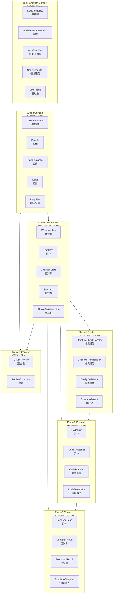
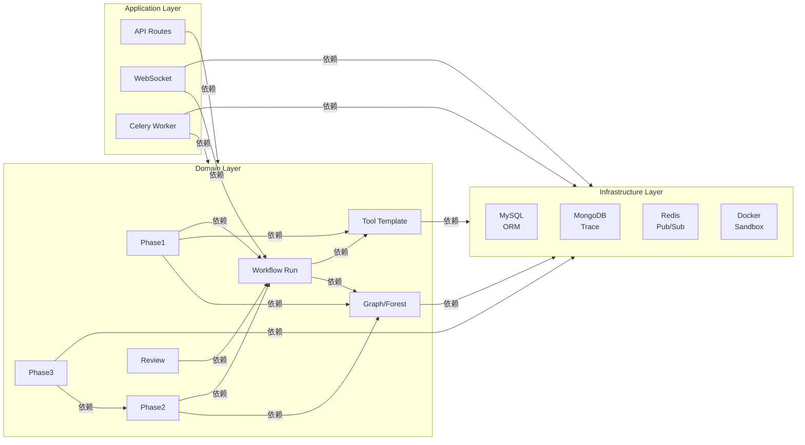
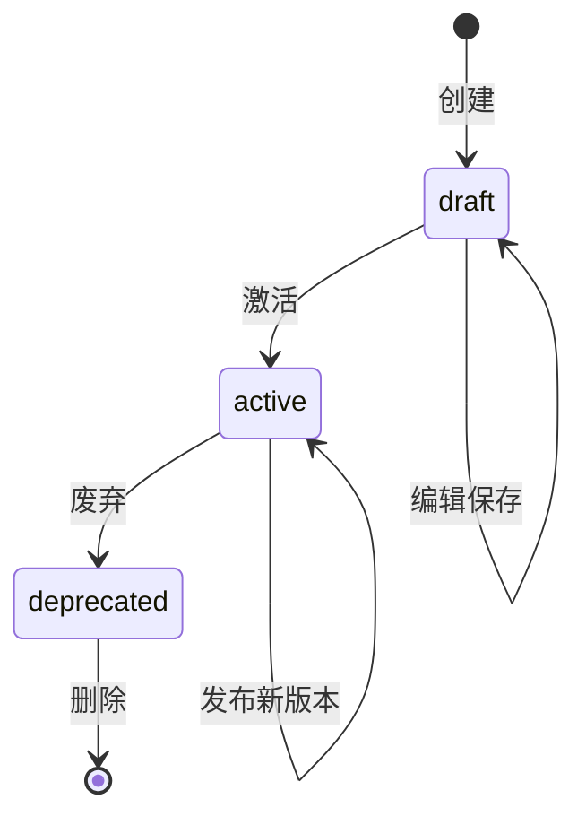
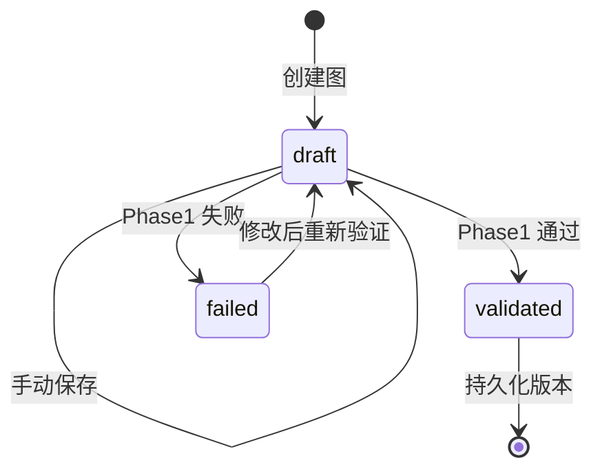
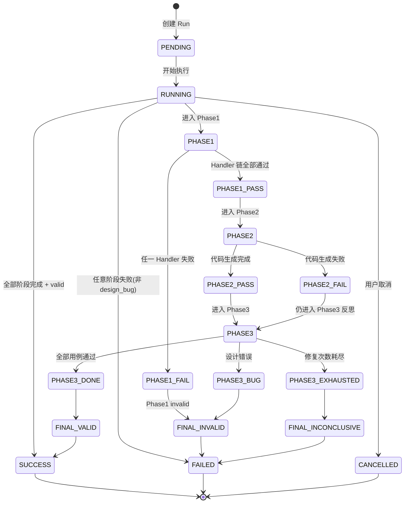
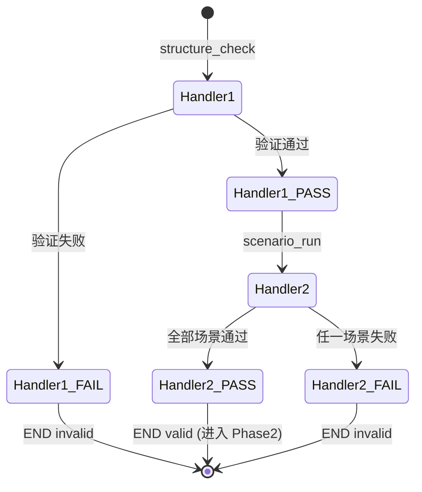
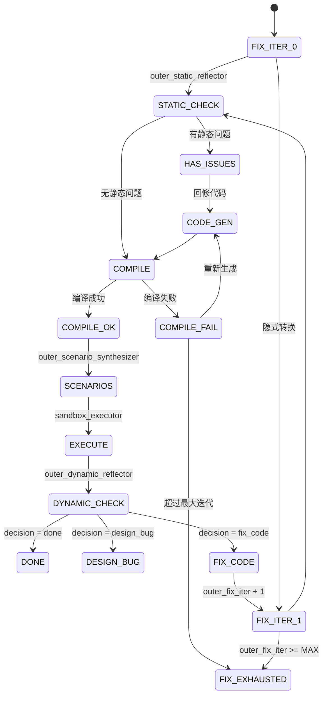
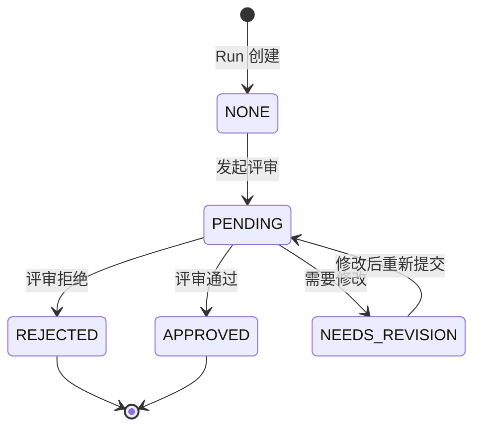
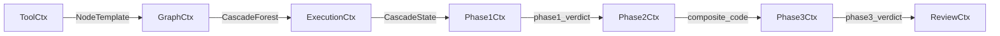

# DDD 模块级设计文档

> 本文档基于项目现有设计文档(00-07 章)，应用 DDD 原则重新组织模块划分与领域建模。
>
> 版本: v1.0
> 状态: 设计稿，供评审

---

## 1. 顶层架构总览

### 1.1 限界上下文(Bounded Context)划分



### 1.2 模块依赖关系



### 1.3 模块清单

| 模块 | 限界上下文 | 核心职责 | 关键领域模型 |
|------|-----------|---------|------------|
| `app/domain/tool/` | Tool Template | 节点模板注册、版本化、模拟器 | `NodeTemplate`, `NodeTemplateVersion`, `NodeSimulator` |
| `app/domain/graph/` | Graph | 森林结构、DAG 计算、拓扑排序 | `CascadeForest`, `Bundle`, `NodeInstance`, `Edge`, `DagView` |
| `app/domain/run/` | Execution | 工作流执行、状态机、场景管理 | `WorkflowRun`, `RunStep`, `Scenario`, `CascadeState` |
| `app/langgraph/steps/phase1/` | Phase1 | JSON 层验证、责任链 Handler | `StructureCheckHandler`, `ScenarioRunHandler` |
| `app/langgraph/steps/phase2/` | Phase2 | C++ 代码生成 | `CodePlanner`, `CodeGenerator`, `CodeAssembler` |
| `app/langgraph/steps/phase3/` | Phase3 | 沙箱编译与执行 | `SandboxCompiler`, `SandboxExecutor` |
| `app/domain/review/` | Review | 人工评审、批注 | `GraphReview`, `ReviewComment` |
| `app/infra/` | Infrastructure | 数据库、消息队列、沙箱 | MySQL Session, MongoDB, Redis, Docker |

---

## 2. 各模块详细设计

### 2.1 Tool Template Context (工具模板上下文)

#### 2.1.1 限界上下文职责

管理所有节点模板(NodeTemplate/Tool)的全生命周期：
- 模板的创建、编辑、版本化
- 模板的模拟器注册与执行
- 全局模板与私有模板的权限管理

#### 2.1.2 核心领域模型

**聚合根: NodeTemplate**

```
NodeTemplate (Aggregate Root)
├── id: str                    # tpl_xxxxxxxx
├── name: str                  # 唯一标识 PascalCase
├── display_name: str
├── category: str
├── scope: Scope               # GLOBAL | PRIVATE
├── owner_id: int | None
├── current_version_id: str
├── status: TemplateStatus      # DRAFT | ACTIVE | DEPRECATED
├── created_at: datetime
├── updated_at: datetime
└── versions: List[NodeTemplateVersion]  # 由 Repository 加载
```

**实体: NodeTemplateVersion**

```
NodeTemplateVersion (Entity)
├── id: str                    # tpv_xxxxxxxx
├── template_id: str
├── version_number: int
├── definition: NodeTemplateDefinition  # 值对象
├── definition_hash: str
├── change_note: str
├── created_by: int
└── created_at: datetime
```

**值对象: NodeTemplateDefinition**

```python
@dataclass(frozen=True)
class NodeTemplateDefinition:
    description: str             # 已 join 的单串
    input_schema: dict          # JSON Schema
    output_schema: dict         # JSON Schema
    simulator: JsonSimulatorSpec
    edge_semantics: tuple[EdgeSemantic, ...]
    code_hints: CodeGenerationHints
    extensions: dict
```

**值对象: EdgeSemantic**

```python
@dataclass(frozen=True)
class EdgeSemantic:
    field: str                  # 出边字段名
    description: str             # 中文说明
```

**值对象: JsonSimulatorSpec**

```python
@dataclass(frozen=True)
class JsonSimulatorSpec:
    engine: Engine              # PURE_PYTHON | LLM | HYBRID
    python_impl: str | None    # pure_python 时必填
    llm_fallback: bool
```

**值对象: CodeGenerationHints**

```python
@dataclass(frozen=True)
class CodeGenerationHints:
    style_hints: tuple[str, ...]
    forbidden: tuple[str, ...]
    example_fragment: str
```

#### 2.1.3 状态机

**NodeTemplate 状态机**



**状态转换规则:**
- `draft → active`: 首次发布时自动转换
- `active → active`: 每次保存新版本自动完成
- `deprecated`: 管理员手动操作，不可逆

#### 2.1.4 模块接口

```python
class NodeTemplateRepository(ABC):
    """聚合根 NodeTemplate 的仓储接口"""
    async def create(self, dto: NodeTemplateCreateDTO, user_id: int) -> str: ...
    async def get(self, template_id: str) -> NodeTemplate: ...
    async def update(self, template_id: str, dto: NodeTemplateUpdateDTO) -> int: ...
    async def list(self, *, scope, owner_id, category, status) -> list[NodeTemplate]: ...
    async def soft_delete(self, template_id: str) -> None: ...
    async def fork_to_private(self, template_id: str, owner_id: int) -> str: ...

class NodeSimulatorFactory:
    """领域服务：创建模拟器实例"""
    def create(self, template: NodeTemplate) -> NodeSimulator: ...

class NodeTemplateRegistry:
    """领域服务：模板注册表（带缓存）"""
    async def get(self, name, owner_id, scope, version) -> NodeTemplate: ...
    def simulator_of(self, template: NodeTemplate) -> NodeSimulator: ...
    async def invalidate(self, template_id: str) -> None: ...
```

---

### 2.2 Graph Context (图结构上下文)

#### 2.2.1 限界上下文职责

管理级跳图的核心数据结构：
- 森林(多 DAG 的集合)的结构管理
- Bundle、节点实例、边的 CRUD
- DAG 拓扑计算与验证
- 森林的版本化管理

#### 2.2.2 核心领域模型

**聚合根: CascadeForest**

```python
@dataclass(frozen=True)
class CascadeForest:
    """森林 = 多 DAG 的集合"""
    graph_version_id: str
    version_number: int
    bundles: tuple[Bundle, ...]
    node_instances: tuple[NodeInstance, ...]
    edges: tuple[Edge, ...]
    metadata: Mapping[str, Any]

    # 便捷查询
    def node_by_id(self, instance_id: str) -> NodeInstance: ...
    def bundle_by_id(self, bundle_id: str) -> Bundle: ...
    def orphans(self) -> list[NodeInstance]: ...
```

**实体: Bundle**

```python
@dataclass(frozen=True)
class Bundle:
    """大节点：若干小节点的容器"""
    bundle_id: str
    name: str
    description: str
    node_instance_ids: tuple[str, ...]  # 引用 NodeInstance.instance_id
```

**实体: NodeInstance**

```python
@dataclass(frozen=True)
class NodeInstance:
    """小节点：对应代码片段"""
    instance_id: str
    template_snapshot: NodeTemplate  # 冻结的模板快照
    instance_name: str
    field_values: Mapping[str, Any]
    bundle_id: str | None            # 归属的 Bundle，None = 游离
```

**实体: Edge**

```python
@dataclass(frozen=True)
class Edge:
    """边：连接两个节点实例"""
    edge_id: str
    src: str                        # 源 instance_id
    dst: str                        # 目标 instance_id
    semantic: str                   # 边语义，对应源模板的 edge_semantics.field
```

**视图对象: DagView**

```python
@dataclass(frozen=True)
class DagView:
    """DAG 视图：从森林计算出来"""
    dag_index: int
    root: str                       # root instance_id
    node_ids: tuple[str, ...]
    edge_ids: tuple[str, ...]
    spans_bundles: tuple[str, ...]
```

#### 2.2.3 状态机

**GraphVersion 状态机**



**重要说明**: 森林 JSON 本身是无状态的，只有 `Graph` 和 `GraphVersion` 有状态。森林的结构验证通过 Visitor 模式完成。

#### 2.2.4 Visitor 模式(领域服务集合)

```python
class ForestVisitor(ABC):
    """访问者接口：对森林的只读遍历"""
    def visit_forest(self, f: CascadeForest) -> Any: ...
    def visit_bundle(self, b: Bundle) -> Any: ...
    def visit_node(self, n: NodeInstance) -> Any: ...
    def visit_edge(self, e: Edge) -> Any: ...

# 具体 Visitor(领域服务)
class CycleCheckerVisitor(ForestVisitor):
    """环检测"""
    def visit_forest(self, f: CascadeForest) -> None: ...

class NodeRefCheckerVisitor(ForestVisitor):
    """引用检查：边/Bundle 指向的 instance_id 必须存在"""
    def visit_forest(self, f: CascadeForest) -> None: ...

class EdgeSemanticVisitor(ForestVisitor):
    """边语义验证"""
    def visit_forest(self, f: CascadeForest) -> None: ...

class SchemaValidationVisitor(ForestVisitor):
    """字段值 Schema 验证"""
    def visit_node(self, n: NodeInstance) -> None: ...

class DagComputeVisitor(ForestVisitor):
    """DAG 视图计算"""
    def visit_forest(self, f: CascadeForest) -> list[DagView]: ...

class TopologicalIterator:
    """拓扑排序迭代器"""
    def __init__(self, forest: CascadeForest) -> None: ...
    def __iter__(self) -> Iterator[NodeInstance]: ...
```

#### 2.2.5 模块接口

```python
class CascadeForestBuilder:
    """领域服务：构建森林"""
    def build(self, snapshot: dict, resolver: TemplateResolver) -> CascadeForest: ...
    def freeze_snapshot(self, raw: dict) -> dict: ...  # 保存时冻结 template_snapshot

class DesignValidator:
    """聚合多个 Visitor，产出 ValidationReport"""
    def run(self, forest: CascadeForest) -> ValidationReport: ...

class GraphRepository(ABC):
    async def create(self, name, description, owner_id) -> str: ...
    async def get(self, graph_id: str) -> CascadeGraph: ...
    async def update_meta(self, graph_id, name, desc) -> None: ...
    async def soft_delete(self, graph_id: str) -> None: ...

class GraphVersionRepository(ABC):
    async def save_new(self, graph_id, snapshot, ...) -> GraphVersion: ...
    async def get(self, version_id: str) -> GraphVersion: ...
    async def get_by_number(self, graph_id, version_number) -> GraphVersion: ...
```

---

### 2.3 Execution Context (执行流水线上下文)

#### 2.3.1 限界上下文职责

这是**最关键的限界上下文**，管理整个工作流执行的生命周期：
- `WorkflowRun` 聚合根的状态管理
- 三阶段流水线(Phase1/Phase2/Phase3)的编排
- 执行上下文的创建与追踪
- **所有状态变更必须通过状态机**

#### 2.3.2 核心领域模型

**聚合根: WorkflowRun**

```python
class WorkflowRunStatus(Enum):
    PENDING = "pending"
    RUNNING = "running"
    SUCCESS = "success"
    FAILED = "failed"
    CANCELLED = "cancelled"

class Phase1Verdict(Enum):
    VALID = "valid"
    INVALID = "invalid"
    INCONCLUSIVE = "inconclusive"

class Phase3Verdict(Enum):
    DONE = "done"
    DESIGN_BUG = "design_bug"
    FIX_EXHAUSTED = "fix_exhausted"

@dataclass
class WorkflowRun:
    """工作流执行聚合根"""
    id: str
    graph_version_id: str
    status: WorkflowRunStatus
    phase1_verdict: Phase1Verdict | None
    phase2_status: str | None           # SUCCESS | FAILED
    phase3_verdict: Phase3Verdict | None
    final_verdict: str | None           # VALID | INVALID | INCONCLUSIVE
    review_status: str | None          # NONE | PENDING | APPROVED | REJECTED
    started_at: datetime | None
    finished_at: datetime | None
    triggered_by: int
    error_code: str | None
    error_message: str | None
    options: dict
    idempotency_key: str | None
```

**实体: RunStep**

```python
@dataclass
class RunStep:
    id: str
    run_id: str
    phase: int                        # 1 | 2 | 3
    node_name: str
    iteration_index: int
    status: str                      # SUCCESS | FAILED | SKIPPED
    mongo_ref: str | None
    duration_ms: int
    started_at: datetime
    summary: dict
    error_message: str | None
```

**值对象: CascadeState**

```python
class CascadeState(TypedDict, total=False):
    """贯穿三阶段的执行状态"""
    # 元信息
    run_id: str
    graph_version_id: str

    # Phase1
    raw_graph_json: dict
    parsed_forest: dict | None
    validation_errors: list[dict]
    phase1_verdict: Literal["valid", "invalid", "inconclusive"] | None
    handler_traces: list[HandlerTrace]
    current_handler: str | None
    scenarios: list[dict]              # 用户提供的测试场景（合并 provided_scenarios + scenarios）
    scenario_results: list[dict]
    node_outputs: dict[str, dict]

    # Phase2
    code_skeleton: dict | None
    code_units: list[dict]
    composite_code: dict | None
    code_snapshot_ids: list[str]
    static_issues: list[dict]

    # Phase3
    compile_result: dict | None
    sandbox_cases: list[dict]
    execution_results: list[dict]
    outer_fix_iter: int
    phase3_verdict: Literal["done", "design_bug", "fix_exhausted"] | None

    # 决策
    decision: Decision
    final_verdict: Literal["valid", "invalid", "inconclusive"] | None

    # 溯源
    messages: list[dict]
    step_history: list[str]
```

**值对象: Scenario**

```python
@dataclass(frozen=True)
class Scenario:
    scenario_id: str
    name: str
    input_json: Mapping[str, Any]
    expected_output: Mapping[str, Any]
    tables: Mapping[str, list]
    description: str
    target_root: str | None
```

#### 2.3.3 状态机设计(核心)

**WorkflowRun 主状态机**



**Phase1 Handler 链状态机**



**Phase3 迭代状态机**



#### 2.3.4 状态变更规则(不变式)

```python
class WorkflowRunStateMachine:
    """WorkflowRun 状态机：所有状态变更必须走这里"""

    VALID_TRANSITIONS = {
        WorkflowRunStatus.PENDING: {WorkflowRunStatus.RUNNING},
        WorkflowRunStatus.RUNNING: {
            WorkflowRunStatus.SUCCESS,
            WorkflowRunStatus.FAILED,
            WorkflowRunStatus.CANCELLED,
        },
        WorkflowRunStatus.SUCCESS: set(),
        WorkflowRunStatus.FAILED: set(),
        WorkflowRunStatus.CANCELLED: set(),
    }

    def transition(run: WorkflowRun, new_status: WorkflowRunStatus) -> WorkflowRun:
        if new_status not in self.VALID_TRANSITIONS.get(run.status, set()):
            raise InvalidStateTransition(
                f"Cannot transition from {run.status} to {new_status}"
            )
        return run.model_copy(update={"status": new_status, "updated_at": utcnow()})

    def can_start_phase(run: WorkflowRun, phase: int) -> bool:
        """只有 RUNNING 状态才能进入下一阶段"""
        return run.status == WorkflowRunStatus.RUNNING

    def record_phase_result(run: WorkflowRun, phase: int, verdict: str) -> WorkflowRun:
        """记录阶段结果"""
        updates = {}
        if phase == 1:
            updates["phase1_verdict"] = verdict
        elif phase == 2:
            updates["phase2_status"] = verdict
        elif phase == 3:
            updates["phase3_verdict"] = verdict
        return run.model_copy(update=updates)
```

#### 2.3.5 模块接口

```python
class WorkflowRunRepository(ABC):
    async def create(self, run: WorkflowRun) -> str: ...
    async def get(self, run_id: str) -> WorkflowRun: ...
    async def update_status(self, run_id: str, status: WorkflowRunStatus) -> None: ...
    async def finish(self, run_id: str, verdict: str) -> None: ...

class WorkflowRuntime:
    """工作流运行时"""
    async def run(self, run_id, graph_version_id, raw_graph_json,
                  variant, provided_scenarios) -> CascadeState: ...

class PipelineBuilder:
    """按 PipelineVariant 组装 LangGraph"""
    def get(self, variant: PipelineVariant) -> StateGraph: ...

class PhaseRouter:
    """阶段路由决策"""
    def after_phase1_handler(self, current: str) -> Callable: ...
    def after_phase2_assembler(self) -> Callable: ...
    def after_phase3_dynamic(self) -> Callable: ...
```

---

### 2.4 Phase1 Context (JSON 验证上下文)

#### 2.4.1 限界上下文职责

Phase1 是在**执行流水线上下文**内运行的子领域，负责：
- 森林结构的合法性验证
- 场景驱动的 JSON 层执行
- **设计意图对不对**的判定

#### 2.4.2 核心领域模型

**领域服务: StructureCheckHandler**

```python
class StructureCheckHandler(HandlerStep):
    """Handler 1: 纯 Python 结构检查"""
    name = "structure_check"
    handler_order = 10

    async def _handle(self, state: CascadeState, trace: dict) -> str:
        # 调 DesignValidator.run(forest)
        # 返回 "pass" 或 "fail"
```

**领域服务: ScenarioRunHandler**

```python
class ScenarioRunHandler(HandlerStep):
    """Handler 2: LLM 驱动的场景执行"""
    name = "scenario_run"
    handler_order = 20

    async def _handle(self, state: CascadeState, trace: dict) -> str:
        # 对每个 Scenario 运行完整森林
        # 字段级对比 actual vs expected
        # 返回 "pass" 或 "fail"
```

**值对象: ScenarioResult**

```python
@dataclass
class ScenarioResult:
    scenario_id: str
    actual_output: Any
    match: bool
    mismatch_detail: dict | None
    node_outputs: dict
    tool_call_count: int
    llm_call_count: int
    duration_ms: int
    attribution: str | None       # design_bug | scenario_bug | simulator_bug | unknown
    attribution_reason: str | None
    agent_stopped_reason: str
    error: str | None
```

**值对象: ValidationReport**

```python
@dataclass
class ValidationReport:
    errors: list[dict]           # [{"code": "...", "message": "...", "extra": {...}}]
    warnings: list[dict]         # [{"code": "...", "instance_id": "..."}]

    @property
    def ok(self) -> bool: return not self.errors
```

#### 2.4.3 状态机

Phase1 Handler 链的状态由 `CascadeState.decision` 字段表达：

```python
# decision 字段的可能值
Decision = Literal[
    "in_progress",                # 初始状态
    "handler_pass",               # 当前 Handler 通过
    "handler_fail",               # 当前 Handler 失败
    "fix_spec",                   # 内层 SDD 反思
    "add_scenario",               # 内层 TDD 反思
    "fix_code",                   # 外层代码回修
    "design_bug",                 # 设计本身有问题
    "done",                       # 完成
]
```

#### 2.4.4 关键设计决策

**反模式修复 1: 从模型输出推断状态**

❌ 原问题:
```python
# 错误做法：从 LLM 输出文本推断设计是否正确
if "design error" in llm_output:
    verdict = "invalid"
```

✅ 正确做法:
```python
# 严格字段级对比
match = deep_equal(expected_output, actual_output)
verdict = "valid" if match else "invalid"
```

**反模式修复 2: content 中嵌入结构化数据**

❌ 原问题:
```python
# 错误做法：在文本 content 中嵌入 JSON
content = f"Node output: {json.dumps(output)}. Next step is..."
```

✅ 正确做法:
```python
# 严格分离
output_json: dict          # 纯 JSON
outgoing_edges: list[dict]  # 纯 JSON
content = json.dumps({"output_json": output_json, "outgoing_edges": outgoing_edges})
```

---

### 2.5 Phase2 Context (代码生成上下文)

#### 2.5.1 限界上下文职责

将经过 Phase1 验证的森林转换为 C++ 代码：
- Bundle → class/function
- NodeInstance → 内联代码片段
- Edge → 调用/跳转关系

#### 2.5.2 核心领域模型

**实体: CodeUnit**

```python
@dataclass
class CodeUnit:
    """单个大节点生成的代码单元"""
    bundle_id: str
    bundle_name: str
    language: str                    # "cpp"
    code: str
    node_instances: list[str]         # 包含的小节点 ID
```

**实体: CodeSnapshot**

```python
@dataclass
class CodeSnapshot:
    """一次代码生成的快照"""
    id: str
    run_id: str
    iteration: int
    source: str                      # initial | fixed_after_static | fixed_after_dynamic
    files: dict[str, str]            # {filepath: content}
    overall_hash: str
    issues_fixed: list[dict]
    node_to_code: dict[str, str]    # {instance_id: code_fragment}
```

**值对象: CodeSkeleton**

```python
@dataclass
class CodeSkeleton:
    """代码结构规划"""
    modules: list[dict]               # [{name, type, deps}]
    bundle_order: list[str]           # 拓扑排序后的 bundle 顺序
```

#### 2.5.3 模块接口

```python
class CodePlannerStep(BasePipelineStep):
    """Phase2 Step 1: 规划代码结构"""
    name = "code_planner"
    phase = 2

    async def _do(self, state: CascadeState) -> CascadeState:
        state["code_skeleton"] = self._plan(state["parsed_forest"])
        return state

class CodeGeneratorStep(BasePipelineStep):
    """Phase2 Step 2: 逐节点生成"""
    name = "code_generator"
    phase = 2

class CodeAssemblerStep(BasePipelineStep):
    """Phase2 Step 3: 组装成完整程序"""
    name = "code_assembler"
    phase = 2

    async def _do(self, state: CascadeState) -> CascadeState:
        state["composite_code"] = self._assemble(
            state["code_units"],
            state["code_skeleton"]
        )
        return state
```

---

### 2.6 Phase3 Context (沙箱验证上下文)

#### 2.6.1 限界上下文职责

在 Docker 沙箱中编译和运行 C++ 代码：
- 静态代码分析
- 编译验证
- 真实用例执行
- **代码实现对不对**的判定

#### 2.6.2 核心领域模型

**实体: SandboxCase**

```python
@dataclass
class SandboxCase:
    """沙箱测试用例"""
    id: str
    run_id: str
    scenario_name: str
    input_bytes: bytes | None
    input_spec: dict                 # JSON Schema for input
    expected: dict
    actual: dict | None
    verdict: str | None              # pass | fail | error
    duration_ms: int
    timeout: bool
```

**值对象: CompileResult**

```python
@dataclass
class CompileResult:
    ok: bool
    exit_code: int
    stdout: str
    stderr: str
    duration_ms: int
    artifacts: dict[str, str]         # {binary_name: path}
```

**值对象: ExecutionResult**

```python
@dataclass
class ExecutionResult:
    case_id: str
    verdict: str                     # pass | fail | error | timeout
    stdout: bytes
    stderr: bytes
    exit_code: int
    duration_ms: int
    error: str | None
```

**值对象: SandboxTrace**

```python
@dataclass
class SandboxTrace:
    """沙箱执行全量记录"""
    run_id: str
    kind: str                        # compile | test_run
    snapshot_id: str
    case_id: str | None
    cmd: list[str]
    stdin: bytes | None
    stdout: str
    stderr: str
    exit_code: int
    signal: str | None
    duration_ms: int
    cpu_peak_pct: float | None
    mem_peak_mb: int | None
```

#### 2.6.3 模块接口

```python
class SandboxCompiler:
    """沙箱编译服务"""
    async def compile(self, code: dict[str, str],
                      image: str) -> CompileResult: ...

class SandboxExecutor:
    """沙箱执行服务"""
    async def run(self, binary: str, cases: list[SandboxCase],
                  timeout: int) -> list[ExecutionResult]: ...

class OuterStaticReflectorStep(BasePipelineStep):
    """Phase3 Step 1: 静态反思"""
    name = "outer_static_reflector"
    phase = 3

class SandboxCompilerStep(BasePipelineStep):
    """Phase3 Step 2: 编译"""
    name = "sandbox_compiler"
    phase = 3

class OuterScenarioSynthesizerStep(BasePipelineStep):
    """Phase3 Step 3: 用例合成"""
    name = "outer_scenario_synthesizer"
    phase = 3

class SandboxExecutorStep(BasePipelineStep):
    """Phase3 Step 4: 执行"""
    name = "sandbox_executor"
    phase = 3

class OuterDynamicReflectorStep(BasePipelineStep):
    """Phase3 Step 5: 动态反思 + 决策"""
    name = "outer_dynamic_reflector"
    phase = 3
```

---

### 2.7 Review Context (评审上下文)

#### 2.7.1 限界上下文职责

人工评审和批注功能：
- 对 WorkflowRun 结果的评审
- 评审意见和批注

#### 2.7.2 核心领域模型

**聚合根: GraphReview**

```python
class ReviewStatus(Enum):
    NONE = "none"
    PENDING = "pending"
    APPROVED = "approved"
    REJECTED = "rejected"
    NEEDS_REVISION = "needs_revision"

@dataclass
class GraphReview:
    id: str
    run_id: str
    reviewer_id: int
    verdict: ReviewStatus | None
    summary: str
    finished_at: datetime | None
    created_at: datetime
```

**实体: ReviewComment**

```python
@dataclass
class ReviewComment:
    id: str
    review_id: str
    author_id: int
    target_type: str                # node_instance | bundle | edge | graph
    target_ref: str                  # 具体引用
    body: str
    resolved: bool
    resolved_by: int | None
    resolved_at: datetime | None
    created_at: datetime
```

#### 2.7.3 状态机

**Review 状态机**



---

## 3. 数据建模

### 3.1 聚合根与仓储映射

| 聚合根 | 存储位置 | 主键前缀 |
|--------|---------|---------|
| NodeTemplate | MySQL `t_node_template` | `tpl_` |
| NodeTemplateVersion | MySQL `t_node_template_version` | `tpv_` |
| CascadeGraph | MySQL `t_cascade_graph` | `g_` |
| GraphVersion | MySQL `t_graph_version` | `gv_` |
| WorkflowRun | MySQL `t_workflow_run` | `r_` |
| RunStep | MySQL `t_run_step` | `s_` |
| GraphReview | MySQL `t_graph_review` | `rv_` |
| ReviewComment | MySQL `t_review_comment` | `cm_` |

### 3.2 值对象的存储策略

| 值对象 | 存储位置 | 备注 |
|--------|---------|------|
| CascadeForest (snapshot) | MySQL `t_graph_version.snapshot` (JSON) | 保存时冻结 |
| NodeTemplateDefinition | MySQL `t_node_template_version.definition` (JSON) | - |
| CascadeState | MongoDB `run_step_details` | 序列化后存储 |
| SandboxTrace | MongoDB `sandbox_traces` | TTL 90天 |
| CodeSnapshot | MySQL `t_code_snapshot` (JSON) | - |
| ScenarioResult | MySQL `t_json_case` | Phase1 用例结果 |

### 3.3 MongoDB 集合

```python
# run_step_details
{
    "_id": ObjectId,
    "run_id": "r_xxxxxxxx",
    "step_id": "s_xxxxxxxx",
    "phase": 1 | 2 | 3,
    "node_name": "structure_check",
    "iteration": 0,
    "handler_name": "structure_check | scenario_run | ...",
    "input_state": {...},        # 减肥后的 state
    "output_state": {...},
    "tool_calls": [...],         # 每次 NodeSimulator 调用的记录
    "llm_calls": [...],          # 每次 LLM 调用的记录
    "decision": "handler_pass",
    "decision_reason": "...",
    "status": "success | failed",
    "error": "...",
    "schema_version": 1,
    "created_at": ISODate()
}

# sandbox_traces
{
    "_id": ObjectId,
    "run_id": "r_xxxxxxxx",
    "kind": "compile | test_run",
    "snapshot_id": "cs_xxxxxxxx",
    "case_id": "sc_xxxxxxxx | null",
    "cmd": ["cmake", "..."],
    "stdin": Binary,
    "stdout": "...",
    "stderr": "...",
    "exit_code": 0,
    "signal": null,
    "duration_ms": 1234,
    "cpu_peak_pct": 45.2,
    "mem_peak_mb": 128,
    "meta": {...},
    "schema_version": 1,
    "created_at": ISODate()
}
```

---

## 4. 关键设计决策

### 4.1 状态机强制执行

**决策**: 所有状态变更必须通过状态机，不允许直接修改状态字段。

```python
# 错误做法
run.status = WorkflowRunStatus.SUCCESS

# 正确做法
run = state_machine.transition(run, WorkflowRunStatus.SUCCESS)
```

**实现**: 状态机作为 `WorkflowRun` 聚合根的内部组件，确保不变量。

### 4.2 阶段间解耦

**决策**: Phase1/Phase2/Phase3 之间通过 `CascadeState` 传递信息，不直接调用。

```python
# Phase1 完成
state["phase1_verdict"] = "valid"
state["decision"] = "done"

# Phase2 根据 phase1_verdict 决定是否执行
if state.get("phase1_verdict") != "valid":
    return state  # 跳过 Phase2
```

### 4.3 森林 JSON 的快照原则

**决策**: 保存图版本时，必须冻结所有 `template_snapshot`。

```python
async def freeze_snapshot(self, raw_snapshot: dict) -> dict:
    """保存时给每个 node_instance 填 template_snapshot"""
    for n in out.get("node_instances", []):
        tpl = await self._registry.get_by_id(n["template_id"])
        n["template_snapshot"] = _template_to_snapshot_dict(tpl)
    return out
```

**原因**: 防止模板定义变更后，已保存的图版本语义丢失。

### 4.4 模拟器的无状态设计

**决策**: `NodeSimulator` 必须无状态，可并发复用。

```python
class NodeSimulator(ABC):
    @abstractmethod
    def run(self, fields: dict, input_json: dict, ctx: SimContext) -> SimResult:
        """无状态：所有外部数据通过 ctx 注入"""
```

**原因**: 森林可能有多个相同类型的节点实例，模拟器必须可并发执行。

---

## 5. 未来演进方向

| 功能 | 说明 | 影响模块 |
|------|------|---------|
| 多节点模板版本并行执行 | 同一模板多个版本共存于同一森林 | Graph Context |
| 内层 SDD/TDD 反思循环 | Phase1 内迭代优化设计 | Phase1 Context |
| 覆盖率 Handler | 新增 Handler 检查分支覆盖率 | Phase1 Context |
| 协作编辑 | 多人同时编辑同一张图 | Graph Context |
| 节点模板 A/B 实验 | 对比不同模板定义的效果 | Tool Template Context |

---

## 6. 附录

### 6.1 术语对照表

| DDD 术语 | 项目术语 |
|---------|---------|
| Aggregate Root | CascadeForest, WorkflowRun, NodeTemplate, GraphReview |
| Entity | Bundle, NodeInstance, Edge, RunStep, GraphVersion, CodeSnapshot, SandboxCase |
| Value Object | NodeTemplateDefinition, EdgeSemantic, CascadeState, Scenario, SimResult, DagView |
| Domain Service | NodeSimulator, DesignValidator, NodeTemplateRegistry, WorkflowRuntime |
| Repository | NodeTemplateRepo, GraphRepo, WorkflowRunRepo |

### 6.2 状态机汇总

| 聚合根 | 状态字段 | 状态值 |
|--------|---------|--------|
| NodeTemplate | status | draft / active / deprecated |
| WorkflowRun | status | pending / running / success / failed / cancelled |
| WorkflowRun | phase1_verdict | valid / invalid / inconclusive |
| WorkflowRun | phase3_verdict | done / design_bug / fix_exhausted |
| WorkflowRun | final_verdict | valid / invalid / inconclusive |
| GraphReview | verdict | none / pending / approved / rejected / needs_revision |
| RunStep | status | success / failed / skipped |

### 6.3 跨上下文边界



---

*文档版本: v1.0*
*创建日期: 2026-04-27*
*下次评审: 需求变更时*
