# D3A 顶层模块级设计文档

> **范围**：D3A 系统的顶层模块级设计 — 限界上下文、模块清单、状态机、分布式与可靠性、扩展机制。
>
> **读者**：架构 / 评审 / 实现负责人。
>
> **约束**：本设计在 D3A 节点 Schema、D3A → 目标语言映射等具体业务字段上保持留白（见第 10 章），承载体（结构、接口、状态机、可靠性骨架）已完整给出。

------

## 目录

- [第 1 章 顶层架构与分布式视图](#第-1-章-顶层架构与分布式视图)
- [第 2 章 模块清单（59 个模块）](#第-2-章-模块清单59-个模块)
- [第 3 章 Node/Graph 域模块详细设计](#第-3-章-nodegraph-域模块详细设计)
- [第 4 章 Execution/Phase1 域模块详细设计](#第-4-章-executionphase1-域模块详细设计)
- [第 5 章 Phase2/Phase3/Review 域模块详细设计](#第-5-章-phase2phase3review-域模块详细设计)
- [第 6 章 应用层 / 集成层 / 横切关注点 / 基础设施](#第-6-章-应用层--集成层--横切关注点--基础设施)
- [第 7 章 13 个状态机完整规约](#第-7-章-13-个状态机完整规约)
- [第 8 章 分布式与可靠性设计](#第-8-章-分布式与可靠性设计)
- [第 9 章 扩展性机制](#第-9-章-扩展性机制)
- [第 10 章 D3A 留白与术语 / 错误码 / 事件总表](#第-10-章-d3a-留白与术语--错误码--事件总表)

------

## 第 1 章 顶层架构与分布式视图

### 1.1 设计目标与非功能需求

| 维度         | 目标                                                         | 量化指标（参考）                          |
| ------------ | ------------------------------------------------------------ | ----------------------------------------- |
| **可用性**   | 多副本部署，单节点故障不影响服务                             | 99.9%                                     |
| **可扩展性** | 水平扩展 API/Worker；按扩展类型分级承诺接入成本（见下表）     | 加节点不停机                              |
| **健壮性**   | 任意阶段崩溃可恢复；非法状态转移强制拒绝                     | 每个 Run 可断点续跑                       |
| **一致性**   | Run 状态强一致；图快照不可变                                 | 状态变更通过状态机，乐观锁兜底            |
| **可观测性** | 全链路追踪、指标、审计                                       | trace_id 贯穿、P99 < 2s                   |
| **安全性**   | 多租户隔离；沙箱强隔离；密钥不落盘                           | RBAC、Docker 网络隔离                     |
| **演进能力** | Schema 平滑升级；模板/代码生成目标插件化                     | 同时支持 N-1, N 两版                      |
| **成本可控** | LLM Token 预算管理；按 Phase/Step 选模型                     | 单 Run Token 上限可配；Fallback 切换 < 5s |

**扩展接入成本承诺（按类型分级）**：

| 扩展类型 | 接入工作量 |
|---------|------------|
| 新 Handler / Validator / Simulator | ≤200 行（实现 ABC + 注册） |
| 新 LLM Provider | ≤300 行（实现 ABC + 配置 fallback） |
| 新 SandboxRuntime | ≤500 行（实现 ABC + 工厂） |
| 新 CodegenTarget | ≤500 行（实现 ABC + 模板集） |
| 新 Phase | 800–1500 行（需扩状态机 + variant + 错误码 + 事件） |

### 1.2 架构分层

Cross-Cutting 不作为中间"层"，是任意层都可引用的正交维度；Domain 层通过 Repository 接口与 Infrastructure 解耦，遵循依赖倒置。

```
┌─────────────────────────────────────────────────────────┐
│  Edge Layer (边缘层)                                     │
│   外部入口：REST API / WebSocket / Webhook              │
└──────────────────┬──────────────────────────────────────┘
                   │
┌──────────────────▼──────────────────────────────────────┐
│  Application Layer (应用层)                              │
│   编排领域服务，事务边界，DTO 转换，DI 容器              │
│   api-gateway / websocket-pusher / worker-runtime       │
│   pipeline-builder / pipeline-variant / idempotency     │
└──────────────────┬──────────────────────────────────────┘
                   │
┌──────────────────▼──────────────────────────────────────┐
│  Domain Layer (领域层)                                   │
│   核心业务逻辑、聚合根、值对象、领域服务、状态机           │
│   tool / graph / execution / phase1 / phase2 /         │
│   phase3 / review                                        │
│                                                          │
│   ★ Domain 只定义 Repository 接口（ABC），不 import       │
│     任何基础设施包（SQLAlchemy/motor/redis/docker）       │
└──────────────────┬──────────────────────────────────────┘
                   │ (通过 DI 注入实现)
┌──────────────────▼──────────────────────────────────────┐
│  Integration Layer (集成层 / 抗腐层 ACL)                 │
│   外部系统适配（LLM / 沙箱），抗腐层                      │
│   llm-provider / llm-tool-use / llm-output-schema /    │
│   llm-prompt-cache / llm-agent-loop / llm-cost-ctrl /  │
│   sandbox-runtime                                        │
└──────────────────┬──────────────────────────────────────┘
                   │
┌──────────────────▼──────────────────────────────────────┐
│  Infrastructure Layer (基础设施)                         │
│   实现 Domain 定义的 Repository 接口                     │
│   mysql-store / mongo-trace / redis-pubsub /            │
│   docker-driver / schema-migration                      │
└─────────────────────────────────────────────────────────┘

┌─────────────────────────────────────────────────────────┐
│  ⊥ Cross-Cutting (正交维度，非层级，任何层可引用)          │
│    trace-bus / metrics / audit-log /                    │
│    auth-rbac / feature-flag / secret-vault              │
└─────────────────────────────────────────────────────────┘
```

### 1.3 限界上下文（Bounded Context）总览

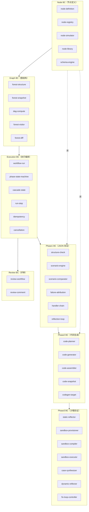

### 1.4 分布式部署拓扑

```
                            ┌─────────────────┐
                            │   Load Balancer │ (HAProxy / Nginx)
                            └────┬───────┬────┘
                                 │       │
                ┌────────────────┘       └────────────────┐
                │                                          │
        ┌───────▼──────┐                          ┌───────▼──────┐
        │  API Node 1  │                          │  API Node N  │
        │  (FastAPI)   │  ...  水平扩展  ...      │  (FastAPI)   │
        └──────┬───────┘                          └──────┬───────┘
               │                                          │
               └──────────────────┬───────────────────────┘
                                  │
        ┌─────────────────────────┼─────────────────────────┐
        │                         │                         │
   ┌────▼────┐              ┌─────▼─────┐            ┌──────▼─────┐
   │ MySQL   │              │  MongoDB  │            │   Redis    │
   │ Primary │◄────同步────►│  Replica  │            │  Cluster   │
   │ +Replica│              │   Set     │            │ (3 master) │
   └─────────┘              └───────────┘            └────┬───────┘
                                                          │
                                                          │ Pub/Sub + Streams
                                                          │
        ┌─────────────────────────────────────────────────┼─────────────────┐
        │                         │                       │                 │
  ┌─────▼──────┐           ┌──────▼──────┐         ┌──────▼──────┐    ┌────▼────┐
  │ Worker 1   │           │ Worker 2    │         │ Worker N    │    │  Cron   │
  │ (Celery)   │           │ (Celery)    │   ...   │ (Celery)    │    │ Beat    │
  │ phase1/2   │           │ phase1/2    │         │ phase3 (沙箱)│    │ (单例)  │
  └─────┬──────┘           └─────┬───────┘         └──────┬──────┘    └─────────┘
        │                        │                        │
        │                        │                        ▼
        │                        │              ┌─────────────────┐
        │                        │              │ Docker Sandbox  │
        │                        │              │  Pool (隔离网络) │
        │                        │              └─────────────────┘
        │                        │
        └────────────────────────┴────────► LLM Provider (Claude / OpenAI)
```

**拓扑要点：**

1. **API 层**：完全无状态；每个节点持有 DB 连接池、Redis 连接池；通过 LB 任意路由。
2. **Worker 层**：分队列部署
   - `phase1_queue`: CPU 密集 + LLM IO，多实例
   - `phase2_queue`: LLM IO 密集，多实例
   - `phase3_queue`: 沙箱密集，需要 Docker Daemon，**仅部署在带 Docker 的节点**
   - `low_priority_queue`: 后台清理、Schema 迁移
3. **状态存储**：
   - MySQL：业务主数据 + 状态字段（用于状态机的乐观锁）
   - MongoDB：trace 与执行明细（写多读少，分片友好）
   - Redis：分布式锁、Pub/Sub、幂等键缓存、限流
4. **领导选举**：Cron Beat、特定后台任务（如孤儿 Run 清理）必须单例运行 → 使用 Redis Redlock 选主
5. **沙箱**：独立的 Worker Pool，每次任务启动一个一次性容器，资源配额 + 网络隔离 + cgroup

### 1.5 模块依赖总图

```mermaid
flowchart LR
    subgraph Edge["Edge"]
        AG[api-gateway]
        WS[websocket-pusher]
    end

    subgraph App["Application"]
        WK[worker-runtime]
        PB[pipeline-builder]
        PV[pipeline-variant]
    end

    subgraph Domain["Domain (只定义接口)"]
        NODE[Node 5个]
        GRAPH[Graph 5个]
        EXEC[Execution 5个]
        P1B[Phase1 6个]
        P2B[Phase2 5个]
        P3B[Phase3 7个]
        REV[Review 2个]
    end

    subgraph Integr["Integration"]
        LLM[LLM 6个]
        SBX[sandbox-runtime]
    end

    subgraph Cross["⊥ Cross-Cutting (正交)"]
        TR[trace-bus]
        MX[metrics]
        AU[audit-log]
        AR[auth-rbac]
        FF[feature-flag]
        SV[secret-vault]
    end

    subgraph Infra["Infrastructure (实现接口)"]
        DB[mysql-store]
        MG[mongo-trace]
        RD[redis-pubsub]
        DK[docker-driver]
        SM[schema-migration]
    end

    AG --> App
    WS --> App
    App --> Domain
    App -.DI注入.-> Infra
    Domain -.接口.-> Infra
    Domain --> Integr
    Integr --> Infra
    Cross -.被任何层引用.-> Domain
    Cross -.被任何层引用.-> App
    Cross -.被任何层引用.-> Integr
    Cross --> Infra
```

**依赖规则（强制）：**

- 上层可依赖下层；下层**不得**依赖上层
- **Domain 层只定义接口**（Repository ABC、Gateway ABC），由 Application 层通过 DI 注入 Infrastructure 实现
- Domain 层代码中**不允许** `import sqlalchemy`、`import motor`、`import redis`、`import docker`
- 同层模块之间**优先通过领域事件解耦**，必要时通过定义良好的接口直接调用
- Cross-Cutting 是正交维度，任何层可引用，但 Cross-Cutting 不得反向依赖业务层
- Integration 层是抗腐层（ACL）：领域代码**不允许**直接 import LLM SDK / Docker SDK

### 1.6 核心交互序列（Run 完整生命周期）

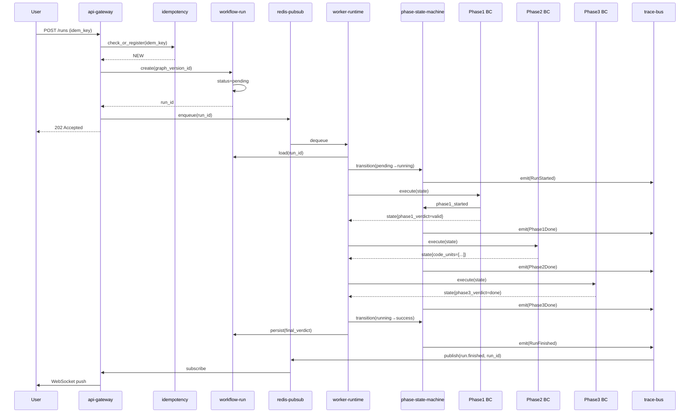

------

## 第 2 章 模块清单（59 个模块）

### 2.1 全模块目录

| #                                                            | 模块                | 层级        | 限界上下文 | 主语言 | 部署单元    | 关键依赖（Port 接口 ★ 标注）            |
| ------------------------------------------------------------ | ------------------- | ----------- | ---------- | ------ | ----------- | --------------------------------------- |
| **L1 Domain — Node（5 个）**                                 |                     |             |            |        |             |                                         |
| 1.1                                                          | node-definition     | Domain      | Node       | Python | API+Worker  | schema-engine                           |
| 1.2                                                          | node-registry       | Domain      | Node       | Python | API+Worker  | ★NodeRegistryPort, ★CachePort           |
| 1.3                                                          | node-simulator      | Domain      | Node       | Python | Worker      | llm-agent-loop                          |
| 1.4                                                          | node-library        | Domain      | Node       | Python | API         | node-definition, auth-rbac              |
| 1.5                                                          | schema-engine       | Domain      | Node       | Python | shared lib  | jsonschema                              |
| **L1 Domain — Graph（5 个）**                                |                     |             |            |        |             |                                         |
| 2.1                                                          | forest-structure    | Domain      | Graph      | Python | API+Worker  | node-registry                           |
| 2.2                                                          | forest-snapshot     | Domain      | Graph      | Python | API+Worker  | ★GraphRepositoryPort                    |
| 2.3                                                          | dag-compute         | Domain      | Graph      | Python | shared lib  | networkx                                |
| 2.4                                                          | forest-visitor      | Domain      | Graph      | Python | shared lib  | -                                       |
| 2.5                                                          | forest-diff         | Domain      | Graph      | Python | API         | dag-compute                             |
| **L1 Domain — Execution（5 个，idempotency 已迁至应用层）**  |                     |             |            |        |             |                                         |
| 3.1                                                          | workflow-run        | Domain      | Execution  | Python | API+Worker  | ★WorkflowRunRepositoryPort              |
| 3.2                                                          | phase-state-machine | Domain      | Execution  | Python | shared lib  | trace-bus                               |
| 3.3                                                          | cascade-state       | Domain      | Execution  | Python | shared lib  | -                                       |
| 3.4                                                          | run-step            | Domain      | Execution  | Python | Worker      | ★RunStepRepositoryPort, ★TraceStorePort |
| 3.5                                                          | cancellation        | Domain      | Execution  | Python | API+Worker  | ★CancellationPort                       |
| **L1 Domain — Phase1（6 个，新增 phase1-reflector）**        |                     |             |            |        |             |                                         |
| 4.1                                                          | structure-check     | Domain      | Phase1     | Python | Worker      | forest-visitor                          |
| 4.2                                                          | scenario-engine     | Domain      | Phase1     | Python | Worker      | node-simulator, llm-agent-loop          |
| 4.3                                                          | scenario-comparator | Domain      | Phase1     | Python | shared lib  | -                                       |
| 4.4                                                          | failure-attribution | Domain      | Phase1     | Python | Worker      | -                                       |
| 4.5                                                          | handler-chain       | Domain      | Phase1     | Python | shared lib  | trace-bus                               |
| 4.6                                                          | phase1-reflector    | Domain      | Phase1     | Python | Worker      | llm-agent-loop, scenario-engine         |
| **L1 Domain — Phase2（5 个）**                               |                     |             |            |        |             |                                         |
| 5.1                                                          | code-planner        | Domain      | Phase2     | Python | Worker      | dag-compute, llm-agent-loop             |
| 5.2                                                          | code-generator      | Domain      | Phase2     | Python | Worker      | codegen-target, llm-agent-loop          |
| 5.3                                                          | code-assembler      | Domain      | Phase2     | Python | Worker      | codegen-target                          |
| 5.4                                                          | code-snapshot       | Domain      | Phase2     | Python | Worker      | ★CodeSnapshotRepositoryPort             |
| 5.5                                                          | codegen-target      | Domain      | Phase2     | Python | shared lib  | -                                       |
| **L1 Domain — Phase3（7 个）**                               |                     |             |            |        |             |                                         |
| 6.1                                                          | static-reflector    | Domain      | Phase3     | Python | Worker      | llm-agent-loop                          |
| 6.2                                                          | sandbox-provisioner | Domain      | Phase3     | Python | Worker      | sandbox-runtime                         |
| 6.3                                                          | sandbox-compiler    | Domain      | Phase3     | Python | Worker      | sandbox-runtime                         |
| 6.4                                                          | sandbox-executor    | Domain      | Phase3     | Python | Worker      | sandbox-runtime                         |
| 6.5                                                          | case-synthesizer    | Domain      | Phase3     | Python | Worker      | llm-agent-loop                          |
| 6.6                                                          | dynamic-reflector   | Domain      | Phase3     | Python | Worker      | llm-agent-loop                          |
| 6.7                                                          | fix-loop-controller | Domain      | Phase3     | Python | Worker      | phase-state-machine                     |
| **L1 Domain — Review（2 个）**                               |                     |             |            |        |             |                                         |
| 7.1                                                          | review-workflow     | Domain      | Review     | Python | API         | ★ReviewRepositoryPort                   |
| 7.2                                                          | review-comment      | Domain      | Review     | Python | API         | ★CommentRepositoryPort                  |
| **L2 Application（6 个，idempotency 从 Domain 迁入）**       |                     |             |            |        |             |                                         |
| 8.1                                                          | api-gateway         | App         | -          | Python | API Node    | All Domain                              |
| 8.2                                                          | websocket-pusher    | App         | -          | Python | API Node    | redis-pubsub                            |
| 8.3                                                          | worker-runtime      | App         | -          | Python | Worker Node | All Phase                               |
| 8.4                                                          | pipeline-builder    | App         | Execution  | Python | Worker      | LangGraph                               |
| 8.5                                                          | pipeline-variant    | App         | Execution  | Python | shared lib  | feature-flag                            |
| 8.6                                                          | idempotency         | App         | -          | Python | API+Worker  | redis-pubsub, mysql-store               |
| **L3 Integration（6 个）**                                   |                     |             |            |        |             |                                         |
| 9.1                                                          | llm-provider        | Integration | -          | Python | shared lib  | secret-vault                            |
| 9.2                                                          | llm-tool-use        | Integration | -          | Python | shared lib  | -                                       |
| 9.3                                                          | llm-output-schema   | Integration | -          | Python | shared lib  | schema-engine                           |
| 9.4                                                          | llm-prompt-cache    | Integration | -          | Python | shared lib  | redis-pubsub                            |
| 9.5                                                          | llm-agent-loop      | Integration | -          | Python | shared lib  | llm-*                                   |
| 9.6                                                          | sandbox-runtime     | Integration | -          | Python | shared lib  | docker-driver                           |
| **L4 Cross-Cutting（侧切面，7 个，新增 llm-cost-governor）** |                     |             |            |        |             |                                         |
| 10.1                                                         | trace-bus           | Cross       | -          | Python | shared lib  | mongo-trace, redis-pubsub               |
| 10.2                                                         | metrics             | Cross       | -          | Python | shared lib  | Prometheus client                       |
| 10.3                                                         | audit-log           | Cross       | -          | Python | shared lib  | mysql-store                             |
| 10.4                                                         | auth-rbac           | Cross       | -          | Python | shared lib  | mysql-store                             |
| 10.5                                                         | feature-flag        | Cross       | -          | Python | shared lib  | redis-pubsub                            |
| 10.6                                                         | secret-vault        | Cross       | -          | Python | shared lib  | env / KMS                               |
| 10.7                                                         | llm-cost-governor   | Cross       | -          | Python | shared lib  | redis-pubsub, metrics                   |
| **L5 Infrastructure（5 个）**                                |                     |             |            |        |             |                                         |
| 11.1                                                         | mysql-store         | Infra       | -          | Python | shared lib  | SQLAlchemy                              |
| 11.2                                                         | mongo-trace         | Infra       | -          | Python | shared lib  | motor                                   |
| 11.3                                                         | redis-pubsub        | Infra       | -          | Python | shared lib  | redis-py                                |
| 11.4                                                         | docker-driver       | Infra       | -          | Python | shared lib  | docker SDK                              |
| 11.5                                                         | schema-migration    | Infra       | -          | Python | CLI + Cron  | alembic                                 |

> **统计**：领域层 35 + 应用层 6 + 集成层 6 + 横切面 7 + 基础设施 5 = **59 个模块**（不含 Port 接口定义；Cross-Cutting 7 个为正交维度，非分层）
>
> **Port 接口说明**：标注 ★ 的依赖表示领域层定义了抽象 Port 接口（ABC），由基础设施层或集成层提供具体实现，通过 DI 注入。领域代码中 **import 的是 Port ABC，不是 mysql-store/redis-pubsub 等具体模块**。

### 2.2 部署单元映射

| 部署单元         | 包含模块                                                    | 副本数（建议）    | 状态                 |
| ---------------- | ----------------------------------------------------------- | ----------------- | -------------------- |
| API Node         | api-gateway, websocket-pusher, 所有 Domain（只读 + 短事务） | ≥2                | 无状态               |
| Worker (general) | worker-runtime + Phase1/Phase2 模块 + LLM 集成              | ≥2                | 无状态               |
| Worker (sandbox) | worker-runtime + Phase3 + sandbox-runtime + docker-driver   | ≥2                | 无状态（容器是状态） |
| Cron Beat        | schema-migration trigger, 孤儿清理, 指标聚合                | 1（leader 选举）  | 单例                 |
| MySQL            | mysql-store 数据                                            | 1 主 + N 从       | 有状态               |
| MongoDB          | mongo-trace 数据                                            | 副本集（3 节点）  | 有状态               |
| Redis            | redis-pubsub + 锁 + 缓存                                    | Cluster 3 主 3 从 | 有状态               |

### 2.3 数据流总览

```
                           ┌───────────────┐
                  保存图    │  forest-      │
                  ────────► │  structure    │
                           │  + snapshot   │
                           └───────┬───────┘
                                   │ 版本化
                                   ▼
                           ┌───────────────┐
                  触发 Run │  workflow-    │
                  ────────►│  run          │ ──持久化──► MySQL
                           └───────┬───────┘
                                   │ 入队
                                   ▼
                           ┌───────────────┐
                           │  Redis Queue  │
                           └───────┬───────┘
                                   │ 出队
                                   ▼
                           ┌───────────────┐
                           │  worker-      │
                           │  runtime      │
                           └───────┬───────┘
                                   │ 加载 state
                                   ▼
                  ┌────────────────┴────────────────┐
                  │        cascade-state            │ ◄──贯穿三阶段──┐
                  └────────────────┬────────────────┘                │
                                   │                                 │
              ┌────────────────────┼────────────────────┐            │
              ▼                    ▼                    ▼            │
        ┌─────────┐          ┌─────────┐          ┌─────────┐        │
        │ Phase1  │ ────────►│ Phase2  │ ────────►│ Phase3  │ ───────┘
        └────┬────┘          └────┬────┘          └────┬────┘
             │                    │                    │
             └────────────────────┼────────────────────┘
                                  │
                                  ▼
                          ┌──────────────┐
                          │ trace-bus    │ ──► MongoDB (trace)
                          │              │ ──► Redis (实时推送)
                          └──────────────┘
                                  │
                                  ▼
                          ┌──────────────┐
                          │ websocket-   │ ──► User
                          │ pusher       │
                          └──────────────┘
```

### 2.4 模块详细设计的统一模板

**第 3-6 章每个模块按以下结构呈现：**

```
### X.Y <module-name>
- 限界上下文：xxx
- 部署位置：API / Worker / shared lib
- 依赖：列出依赖的模块
- 被依赖：列出谁会调用本模块
- 核心职责：3-5 条
- 关键模型：聚合根/实体/值对象（如适用）
- 公开接口：方法签名
- 状态机：（如适用，引用第 7 章）
- 持久化：（如有）
- 领域事件：（如发布）
- 扩展点：（如有插件机制）
- 分布式考虑：并发、幂等、超时、降级
- 反模式与禁止：明确不允许什么
- 单元测试关键场景
```

------

## 第 3 章 Node/Graph 域模块详细设计

### 3.1 Node 域模块（5 个）

#### 3.1.1 `node-definition`（节点定义）

- **限界上下文**：Node
- **部署位置**：API + Worker（shared lib）
- **依赖**：schema-engine
- **被依赖**：node-registry, node-library, forest-structure, code-generator
- **核心职责**
  1. 定义 `NodeTemplate` 聚合根、`NodeTemplateVersion` 实体、`NodeTemplateDefinition` 值对象
  2. 校验模板定义的合法性（input/output schema 自洽、edge_semantics 不重复）
  3. 计算定义哈希用于版本去重
  4. 提供 `freeze_to_snapshot()` 方法供图保存时冻结模板
  5. **D3A 留白点**：`NodeTemplateDefinition` 是结构稳定的载体，具体 D3A 节点的字段定义后续作为数据填入
- **关键模型**

```python
@dataclass(frozen=True)
class NodeTemplateDefinition:
    """模板的不变定义体（值对象）"""
    description: str
    input_schema: dict        # JSON Schema
    output_schema: dict       # JSON Schema
    simulator: JsonSimulatorSpec
    edge_semantics: tuple[EdgeSemantic, ...]
    code_hints: CodeGenerationHints
    extensions: Mapping[str, Any]   # 扩展点：未来加字段不破坏向后兼容

    schema_version: int = 1   # 定义自身的 schema 版本

    def compute_hash(self) -> str:
        """规范化 JSON 后 SHA256"""
class NodeTemplate:
    """聚合根"""
    id: str                    # tpl_xxxxxxxx
    name: str                  # PascalCase
    display_name: str
    category: str
    scope: Scope               # GLOBAL | PRIVATE
    owner_id: int | None
    current_version_id: str
    status: TemplateStatus     # DRAFT | ACTIVE | DEPRECATED
    created_at: datetime
    updated_at: datetime
    deleted_at: datetime | None  # 软删除
```

- **公开接口**

```python
class TemplateValidator:
    def validate(self, defn: NodeTemplateDefinition) -> ValidationReport: ...
    def validate_schema_self_consistency(self, schema: dict) -> None: ...

class DefinitionFactory:
    def create_v1(self, raw: dict) -> NodeTemplateDefinition: ...
    def upgrade(self, old: NodeTemplateDefinition, target_v: int) -> NodeTemplateDefinition: ...
```

- **状态机**：见 §7.7（NodeTemplate 状态机）
- **持久化**：MySQL `t_node_template` + `t_node_template_version`
- **扩展点**
  - `extensions: Mapping[str, Any]`：定义体的开放字段，遵循 "未识别字段保留 + 警告" 原则
  - `schema_version`：支持多版本并存，配合 `DefinitionFactory.upgrade` 平滑升级
- **分布式考虑**
  - 模板定义只读时大量并发，写时通过 `node-registry` 的乐观锁串行
  - 哈希计算必须确定性（dict 排序、数字标准化）
- **反模式**
  - ❌ 在定义中直接耦合 D3A 字段（应放 extensions 或 input_schema 的具体内容里）
  - ❌ 在 description 中嵌入结构化数据（应该用 extensions）
- **关键测试**
  - `test_definition_hash_stability`：相同语义不同字段顺序，哈希必须相等
  - `test_extensions_unknown_field`：未知字段保留并发警告
  - `test_schema_version_upgrade`：v1 升级到 v2 不丢字段

------

#### 3.1.2 `node-registry`（节点注册表）

- **限界上下文**：Node
- **部署位置**：API + Worker
- **依赖**：mysql-store, redis-pubsub, node-definition
- **被依赖**：forest-structure（构建图时解析模板）, scenario-engine（执行时拿到 simulator）
- **核心职责**
  1. 提供按 `(name, owner_id, scope, version)` 维度的模板查找
  2. 二级缓存：进程内 LRU + Redis 共享缓存，TTL + 显式失效
  3. Scope 解析规则：private 优先于 global（同名时）
  4. 模板版本写入时通过分布式锁保证唯一性
  5. 发布 `TemplateUpdated` 事件触发缓存失效广播
- **公开接口**

```python
class NodeTemplateRegistry:
    async def get(
        self,
        name: str,
        owner_id: int | None,
        scope: Scope = Scope.GLOBAL,
        version: int | str = "current",
    ) -> NodeTemplate: ...

    async def get_by_id(self, template_id: str) -> NodeTemplate: ...

    async def resolve_for_user(self, name: str, user_id: int) -> NodeTemplate:
        """按 private 优先 → global 兜底的规则解析"""

    async def invalidate(self, template_id: str) -> None: ...
    async def invalidate_all(self) -> None: ...

    def simulator_of(self, template: NodeTemplate) -> NodeSimulator: ...
```

- **缓存层次**

```
┌──────────────────────────────┐
│ Process LRU (100, 60s TTL)  │  ← 同一进程内复用
└────────────┬─────────────────┘
             │ miss
             ▼
┌──────────────────────────────┐
│ Redis Cache (300s TTL)       │  ← 跨进程共享
└────────────┬─────────────────┘
             │ miss
             ▼
┌──────────────────────────────┐
│ MySQL                         │  ← 真值
└──────────────────────────────┘
```

- **缓存失效协议**
  1. 写入流程：MySQL 主库写入新版本（事务内同时写 t_outbox） → relay 任务投递 `TemplateUpdated` 事件
  2. 订阅端收到事件 → invalidate Redis 缓存 + 进程内 LRU
  3. 失效后下次读 miss 时**强制走主库一次**，并设置上下文标记 `read_master_until = now + 2s`，避免"主从同步未完成 + 失效已生效 + 回到从库读旧值"的窗口
- **分布式考虑**
  - 锁：写新版本时加 `lock:tpl_version:{template_id}`，超时 5s
  - 缓存击穿（single-flight 落地）：
    ```
    miss 时：
      SET singleflight:{cache_key} owner=me NX PX 5000
      成功 → 我去查 DB → 写 cache → DEL singleflight
      失败 → 退避 50ms 后重试 GET cache（最多 10 次，约 500ms）
           → 仍 miss → 直接查从库（降级，避免无限等待）
    ```
  - 缓存穿透：不存在的查询用空值占位 30s
  - 一致性：写后读保证（先 DB 后失效），最终一致延迟 < 1s
- **反模式**
  - ❌ 直接读 MySQL 不走 registry（破坏缓存协议）
  - ❌ 缓存 NodeSimulator 实例（应缓存 Template，每次构造 Simulator）
- **关键测试**
  - `test_resolve_private_overrides_global`
  - `test_cache_invalidation_propagation`：节点 A 写入 → 节点 B 立即看到新版
  - `test_cache_stampede`：1000 并发查询 miss key，仅 1 次 DB

------

#### 3.1.3 `node-simulator`（模拟器）

- **限界上下文**：Node
- **部署位置**：Worker
- **依赖**：llm-agent-loop, schema-engine
- **被依赖**：scenario-engine
- **核心职责**
  1. 定义 `NodeSimulator` 抽象基类
  2. 实现 `PurePythonSimulator`、`LlmSimulator`、`HybridSimulator`
  3. 模拟器工厂：根据 `JsonSimulatorSpec.engine` 创建对应实例
  4. 强制 simulator 输出符合 `output_schema`（forced output）
  5. **无状态**：每次 `run()` 不带状态，所有外部依赖通过 `SimContext` 注入
- **关键模型**

```python
@dataclass(frozen=True)
class SimContext:
    """模拟器执行上下文"""
    run_id: str
    instance_id: str
    bundle_id: str | None
    upstream_outputs: Mapping[str, Any]
    tables: Mapping[str, list]
    tracer: TraceEmitter
    deadline: datetime
    cancel_token: CancelToken

@dataclass(frozen=True)
class SimResult:
    output_json: dict
    outgoing_edges: list[OutgoingEdge]
    warnings: tuple[str, ...]
    duration_ms: int
    llm_calls: int = 0
    tokens_in: int = 0
    tokens_out: int = 0

class NodeSimulator(ABC):
    @abstractmethod
    async def run(
        self,
        fields: Mapping[str, Any],
        input_json: Mapping[str, Any],
        ctx: SimContext,
    ) -> SimResult: ...

    @abstractmethod
    def kind(self) -> Literal["pure", "llm", "hybrid"]: ...
```

- **公开接口**

```python
class NodeSimulatorFactory:
    def __init__(self, registry: dict[str, type[NodeSimulator]]): ...
    def register(self, kind: str, cls: type[NodeSimulator]) -> None: ...
    def create(self, template: NodeTemplate, llm: LLMAgent) -> NodeSimulator: ...
```

- **扩展点**
  - 注册新 `kind`：实现 `NodeSimulator` 子类 → 工厂注册即可，不动核心
  - 例：未来加 `WasmSimulator`（用于 D3A 高性能仿真）只需新增类
- **分布式考虑**
  - **无状态**：可在 Worker 间任意调度
  - 超时：`ctx.deadline` 强制截止，超时抛 `SimulatorTimeout`
  - 取消：`ctx.cancel_token` 周期性检查（每次 LLM 调用前后）
  - LLM 失败重试：见 §6.3.5（llm-agent-loop）
- **反模式**
  - ❌ 在 simulator 实例上保存状态（不能跨调用）
  - ❌ 在 simulator 内部直接调 OpenAI SDK（应通过 `LLMAgent`）
  - ❌ 输出不符合 schema 时静默截断（应抛 `SchemaViolation`）
- **关键测试**
  - `test_pure_simulator_deterministic`：相同输入相同输出
  - `test_llm_simulator_forced_schema`：强制输出 schema，违规则报错
  - `test_simulator_timeout_respected`：deadline 到达后立即返回
  - `test_simulator_cancel_propagates`：取消令牌触发后停止

------

#### 3.1.4 `node-library`（节点库）

- **限界上下文**：Node
- **部署位置**：API
- **依赖**：node-definition, node-registry, auth-rbac
- **被依赖**：api-gateway（模板管理 API）
- **核心职责**
  1. 全局模板与私有模板的管理与权限控制
  2. 模板的发布、废弃、复制、Fork 操作
  3. 模板的搜索、分类、标签
  4. 模板的导入导出（JSON Pack）
  5. **D3A 留白点**：内置 D3A 模板包作为种子数据，可后续填充
- **公开接口**

```python
class TemplateLibraryService:
    async def publish(self, template_id: str, by_user: int) -> None: ...
    async def deprecate(self, template_id: str, by_user: int) -> None: ...
    async def fork_to_private(self, template_id: str, owner_id: int) -> str: ...
    async def search(self, query: SearchQuery, viewer_id: int) -> list[NodeTemplate]: ...
    async def export_pack(self, template_ids: list[str]) -> bytes: ...
    async def import_pack(self, data: bytes, by_user: int) -> ImportReport: ...
```

- **权限规则**

| 操作 | global | private(own)  | private(other) |
| ---- | ------ | ------------- | -------------- |
| 查看 | 所有人 | 所有者+管理员 | 拒绝           |
| 编辑 | 管理员 | 所有者        | 拒绝           |
| Fork | 任何人 | 所有者        | 拒绝           |
| 废弃 | 管理员 | 所有者        | 拒绝           |

- **领域事件**：`TemplatePublished`, `TemplateDeprecated`, `TemplateForked`
- **分布式考虑**
  - Fork 操作非幂等 → 加 `idempotency_key`
  - 导入大包：分块 + 事务保护
- **反模式**
  - ❌ 模板复制后还共享版本（必须深拷贝并新建版本树）
- **关键测试**
  - `test_fork_creates_independent_lineage`
  - `test_import_atomic_rollback_on_error`

------

#### 3.1.5 `schema-engine`（JSON Schema 引擎）

- **限界上下文**：Node（共享 lib）
- **部署位置**：shared lib
- **依赖**：jsonschema 第三方库
- **被依赖**：node-definition, llm-output-schema, forest-visitor
- **核心职责**
  1. 封装 jsonschema 库，统一 Draft 版本（Draft 2020-12）
  2. 提供 `validate(data, schema) → ValidationReport` 接口
  3. 提供 schema 自身合法性校验
  4. 提供 schema 的等价比较（用于版本兼容性判断）
  5. 提供 schema 的合并与差异（forward-compat 检测）
- **公开接口**

```python
class SchemaEngine:
    def validate(self, data: Any, schema: dict) -> ValidationReport: ...
    def check_self_consistent(self, schema: dict) -> None: ...
    def is_backward_compatible(self, old: dict, new: dict) -> bool:
        """new 是否可以接收所有 old 接受的数据（向后兼容）"""
    def diff(self, old: dict, new: dict) -> SchemaDiff: ...
    def normalize(self, schema: dict) -> dict:
        """规范化用于 hash"""
```

- **分布式考虑**：纯函数，无状态，可任意复用
- **关键测试**
  - `test_backward_compat_add_optional_field`
  - `test_breaks_on_required_field_addition`
  - `test_normalize_idempotent`

------

### 3.2 Graph 域模块（5 个）

#### 3.2.1 `forest-structure`（森林结构）

- **限界上下文**：Graph
- **部署位置**：API + Worker
- **依赖**：node-registry
- **被依赖**：forest-snapshot, dag-compute, scenario-engine, code-planner
- **核心职责**
  1. 定义 `CascadeForest`、`Bundle`、`NodeInstance`、`Edge` 不可变数据结构
  2. 提供 `CascadeForestBuilder` 从原始 JSON 构建森林（解析模板、填充 snapshot）
  3. 引用完整性检查（边/Bundle 引用的 instance_id 必须存在）
  4. 字段值合法性检查（按 `template_snapshot.input_schema`）
  5. 不变性：所有数据结构 frozen，修改返回新实例
- **关键模型**

```python
@dataclass(frozen=True)
class CascadeForest:
    graph_version_id: str
    version_number: int
    bundles: tuple[Bundle, ...]
    node_instances: tuple[NodeInstance, ...]
    edges: tuple[Edge, ...]
    metadata: Mapping[str, Any]
    schema_version: int = 1

    def with_node(self, node: NodeInstance) -> "CascadeForest": ...   # 不可变更新
    def without_node(self, instance_id: str) -> "CascadeForest": ...
    def with_edge(self, edge: Edge) -> "CascadeForest": ...
```

- **公开接口**

```python
class CascadeForestBuilder:
    def __init__(self, registry: NodeTemplateRegistry, schema: SchemaEngine): ...
    async def build(self, raw: dict) -> CascadeForest: ...
    async def freeze_template_snapshots(self, raw: dict) -> dict:
        """保存前调用：把每个 instance 的 template_id 解析为 template_snapshot"""
```

- **分布式考虑**：
  - 构建是 CPU 密集 + IO（registry 查询）；构建结果可缓存（只读时）
  - `freeze_template_snapshots` 使用 `node-registry` 加锁查询，避免读到正在升级的模板
- **反模式**
  - ❌ 直接修改 `CascadeForest` 字段（必须返回新实例）
  - ❌ Build 阶段只存 template_id 不冻结 snapshot（破坏快照原则）
- **关键测试**
  - `test_build_resolves_templates`
  - `test_freeze_makes_immutable_snapshot`
  - `test_with_node_returns_new_instance`

------

#### 3.2.2 `forest-snapshot`（快照与版本化）

- **限界上下文**：Graph
- **部署位置**：API + Worker
- **依赖**：mysql-store, forest-structure
- **被依赖**：workflow-run（执行时加载快照）
- **核心职责**
  1. `Graph` 与 `GraphVersion` 聚合根的持久化
  2. 保存新版本时：序列化 `CascadeForest` → MySQL JSON 列；冻结模板 snapshot
  3. 加载版本：MySQL → 反序列化 → `CascadeForest`
  4. 版本号自增（行级锁保证）
  5. 软删除支持
- **关键模型**

```python
class Graph:                       # 聚合根（图，不含具体快照）
    id: str
    name: str
    description: str
    owner_id: int
    current_version_id: str | None
    status: GraphStatus            # ACTIVE | ARCHIVED
    created_at: datetime
    updated_at: datetime
    deleted_at: datetime | None

class GraphVersion:                # 实体
    id: str
    graph_id: str
    version_number: int            # 自增
    snapshot: dict                 # 序列化的 CascadeForest（JSON）
    snapshot_hash: str
    state: VersionState            # DRAFT | SAVED | PHASE1_PASSED | FULLY_VALIDATED | ARCHIVED（见 §7.8）
    validated_at: datetime | None
    created_by: int
    created_at: datetime
```

- **公开接口**

```python
class GraphRepository:
    async def create(self, dto: GraphCreate) -> str: ...
    async def get(self, graph_id: str) -> Graph: ...
    async def update_meta(self, graph_id: str, name: str, desc: str) -> None: ...
    async def soft_delete(self, graph_id: str) -> None: ...

class GraphVersionRepository:
    async def save_new_version(
        self,
        graph_id: str,
        forest: CascadeForest,
        created_by: int,
    ) -> GraphVersion: ...
    async def get(self, version_id: str) -> GraphVersion: ...
    async def get_by_number(self, graph_id: str, n: int) -> GraphVersion: ...
    async def list_versions(self, graph_id: str) -> list[GraphVersion]: ...
    async def transition(self, version_id: str, to_state: VersionState) -> GraphVersion: ...
```

- **状态机**：见 §7.8（GraphVersion 状态机）
- **持久化**：MySQL `t_cascade_graph` + `t_graph_version`（snapshot 列建议 LongTextJSON 或 MEDIUMBLOB+gzip）
- **领域事件**：`GraphVersionSaved`, `GraphVersionValidated`
- **分布式考虑**
  - 版本号冲突：唯一约束 `(graph_id, version_number)` + 行级锁保护自增
  - 大快照（>1MB）：考虑压缩存储；分页加载
- **反模式**
  - ❌ 修改已保存的 `GraphVersion.snapshot`（一旦保存即不可变）
  - ❌ 直接 SQL UPDATE 状态（必须经状态机）
- **关键测试**
  - `test_concurrent_version_save_no_duplicate_number`
  - `test_snapshot_hash_stable`
  - `test_archived_version_load`

------

#### 3.2.3 `dag-compute`（DAG 计算）

- **限界上下文**：Graph
- **部署位置**：shared lib
- **依赖**：networkx
- **被依赖**：forest-visitor, scenario-engine, code-planner
- **核心职责**
  1. 给定 `CascadeForest`，计算其 DAG 视图集合（每个根一个 DAG）
  2. 拓扑排序（用于代码生成顺序、场景执行顺序）
  3. 环检测
  4. 入度/出度查询、根节点查询、孤儿节点查询
  5. 可达性查询、跨 Bundle 查询
- **关键模型**

```python
@dataclass(frozen=True)
class DagView:
    dag_index: int
    root: str                      # root instance_id
    node_ids: tuple[str, ...]
    edge_ids: tuple[str, ...]
    spans_bundles: tuple[str, ...] # 跨越的 bundle_id 集合
    topo_order: tuple[str, ...]    # 预计算的拓扑序

class DagCompute:
    @staticmethod
    def compute_views(forest: CascadeForest) -> list[DagView]: ...

    @staticmethod
    def topological_sort(forest: CascadeForest) -> list[str]: ...

    @staticmethod
    def detect_cycles(forest: CascadeForest) -> list[list[str]]: ...

    @staticmethod
    def find_roots(forest: CascadeForest) -> list[str]: ...

    @staticmethod
    def find_orphans(forest: CascadeForest) -> list[str]: ...

    @staticmethod
    def reachable_from(forest: CascadeForest, src: str) -> set[str]: ...
```

- **分布式考虑**：纯函数，结果可基于 `snapshot_hash` 缓存
- **反模式**
  - ❌ 在循环中重复调用 `compute_views`（O(N²) 退化），应一次性计算缓存
- **关键测试**
  - `test_topo_sort_deterministic`：相同输入相同顺序（用 instance_id 字典序破除歧义）
  - `test_cycle_detection_finds_all`
  - `test_disconnected_forest_multi_dag`

------

#### 3.2.4 `forest-visitor`（Visitor 框架）

- **限界上下文**：Graph
- **部署位置**：shared lib
- **依赖**：dag-compute, schema-engine
- **被依赖**：structure-check, scenario-engine, dynamic-reflector
- **核心职责**
  1. `ForestVisitor` 抽象基类（支持只读遍历）
  2. 内置 Visitor：`CycleChecker`, `NodeRefChecker`, `EdgeSemanticChecker`, `SchemaValidator`, `OrphanFinder`, `BundleConsistencyChecker`
  3. `ValidationReport` 聚合（errors + warnings）
  4. **插件注册**：可注册自定义 Visitor，由 `DesignValidator` 统一调度
  5. 支持串行 / 并行执行（独立 Visitor 可并行）
- **公开接口**

```python
class ForestVisitor(ABC):
    name: ClassVar[str]
    severity: ClassVar[Literal["error", "warning"]] = "error"
    parallel_safe: ClassVar[bool] = True

    @abstractmethod
    def visit(self, forest: CascadeForest) -> list[ValidationIssue]: ...

class VisitorRegistry:
    def register(self, visitor: type[ForestVisitor]) -> None: ...
    def list(self) -> list[type[ForestVisitor]]: ...

class DesignValidator:
    def __init__(self, registry: VisitorRegistry): ...
    async def run(self, forest: CascadeForest) -> ValidationReport:
        """并行执行所有 parallel_safe 的 Visitor"""
```

- **扩展点**
  - 新 Visitor：实现 `ForestVisitor` 子类 + 调用 `registry.register()`
  - 例：未来加 `D3ANamingConvention` Visitor 用于检查 D3A 节点命名
- **分布式考虑**
  - Visitor 是纯函数，结果按 `(snapshot_hash, visitor_name, visitor_version)` 缓存到 Redis
- **反模式**
  - ❌ Visitor 修改 forest（必须只读）
  - ❌ Visitor 之间相互依赖（应通过 DesignValidator 编排顺序）
- **关键测试**
  - `test_visitor_registry_dynamic_add`
  - `test_validator_parallel_execution`
  - `test_validator_cache_hit`

------

#### 3.2.5 `forest-diff`（版本 Diff/Merge）

- **限界上下文**：Graph
- **部署位置**：API
- **依赖**：dag-compute
- **被依赖**：api-gateway（版本对比 API）
- **核心职责**
  1. 计算两个 `GraphVersion` 之间的差异（节点添加/删除/修改、边变化、Bundle 变化）
  2. 提供按 Bundle / DAG 维度的差异视图
  3. 生成结构化 patch（用于审计、回滚）
  4. 不实现自动 merge（人工评审场景下不需要，避免错误合并）
- **公开接口**

```python
@dataclass(frozen=True)
class ForestDiff:
    added_nodes: tuple[NodeInstance, ...]
    removed_nodes: tuple[NodeInstance, ...]
    modified_nodes: tuple[NodeChange, ...]
    added_edges: tuple[Edge, ...]
    removed_edges: tuple[Edge, ...]
    bundle_changes: tuple[BundleChange, ...]

class ForestDiffer:
    @staticmethod
    def diff(old: CascadeForest, new: CascadeForest) -> ForestDiff: ...
    @staticmethod
    def to_patch(diff: ForestDiff) -> dict: ...
```

- **分布式考虑**：纯函数，无状态
- **关键测试**
  - `test_diff_detects_field_value_change`
  - `test_diff_handles_bundle_split`

------

## 第 4 章 Execution/Phase1 域模块详细设计

### 4.1 Execution 域模块（5 个，idempotency 归属于应用层 §6.1.6）

#### 4.1.1 `workflow-run`（运行聚合根）

- **限界上下文**：Execution
- **部署位置**：API + Worker
- **依赖**：mysql-store, phase-state-machine, trace-bus
- **被依赖**：api-gateway（创建/查询）, worker-runtime（执行）, run-step（关联）
- **核心职责**
  1. 定义 `WorkflowRun` 聚合根，封装一次执行的完整生命周期
  2. 持久化运行元信息（status, verdicts, timestamps, error）
  3. 强制所有状态变更经过 `phase-state-machine`（不允许直接 UPDATE）
  4. 乐观锁保护并发更新（version 字段）
  5. 提供查询接口（按用户、按图版本、按时间范围）
- **关键模型**

```python
class WorkflowRunStatus(str, Enum):
    PENDING = "pending"
    RUNNING = "running"
    SUCCESS = "success"
    FAILED = "failed"
    CANCELLED = "cancelled"

class Phase1Verdict(str, Enum):
    VALID = "valid"
    INVALID = "invalid"
    INCONCLUSIVE = "inconclusive"

class Phase2Status(str, Enum):
    PENDING = "pending"
    SUCCESS = "success"
    FAILED = "failed"
    SKIPPED = "skipped"

class Phase3Verdict(str, Enum):
    DONE = "done"
    DESIGN_BUG = "design_bug"
    FIX_EXHAUSTED = "fix_exhausted"

class RunKind(str, Enum):
    """显式区分 Run 的意图，避免 pipeline_variant 单字段承载多重语义。
    调度层据此分队列、分超时、分重试策略。"""
    VALIDATION = "validation"   # 仅验证图设计（Phase1）
    CODEGEN = "codegen"         # 在 PHASE1_PASSED 的版本上做代码生成 + 沙箱验证（Phase2/3）
    FULL = "full"               # 端到端：Phase1+2+3

@dataclass
class WorkflowRun:
    id: str                            # r_xxxxxxxx
    graph_version_id: str
    run_kind: RunKind                  # VALIDATION | CODEGEN | FULL
    status: WorkflowRunStatus
    phase1_verdict: Phase1Verdict | None
    phase2_status: Phase2Status | None
    phase3_verdict: Phase3Verdict | None
    final_verdict: Literal["valid", "invalid", "inconclusive"] | None

    # ===== 时间预算 =====
    started_at: datetime | None
    finished_at: datetime | None
    hard_deadline: datetime            # 创建时计算（默认 created_at + 2h）；Worker 据此推导 Step / LLM / Sandbox 子预算

    # ===== Worker 持有 =====
    owner_worker_id: str | None        # 当前持有者；NULL = 无人认领
    lease_expires_at: datetime | None  # 租约到期；用于死亡检测
    fencing_epoch: int                 # 单调递增；每次接管 +1，写入路径据此防御假死复活

    # ===== 编排 =====
    triggered_by: int
    pipeline_variant: str              # "full" | "phase1_only" | "phase1_phase2" | "phase3_direct"
    options: Mapping[str, Any]
    idempotency_key: str | None

    # ===== 失败信息 =====
    error_code: str | None             # ErrorCode 枚举字符串
    error_message: str | None
    error_phase: int | None            # 1 | 2 | 3 | None

    # ===== 锁与时间 =====
    version: int                        # 乐观锁版本号
    created_at: datetime
    updated_at: datetime
```

> 评审状态不耦合在 WorkflowRun 上。Review 是独立聚合（见 §5.3.1），读取走 review-workflow 服务。

- **公开接口**

```python
class WorkflowRunRepository(ABC):
    async def create(self, run: WorkflowRun) -> str: ...
    async def get(self, run_id: str) -> WorkflowRun: ...
    async def get_with_lock(self, run_id: str) -> WorkflowRun: ...   # SELECT FOR UPDATE
    async def update(self, run: WorkflowRun) -> WorkflowRun:
        """乐观锁：where version = old_version；冲突抛 OptimisticLockError"""
    async def list_by_user(
        self,
        user_id: int,
        status: WorkflowRunStatus | None = None,
        limit: int = 50,
        offset: int = 0,
    ) -> list[WorkflowRun]: ...

class WorkflowRunService:
    """聚合根的应用服务（封装事务边界）"""
    async def create_run(self, dto: RunCreateDTO) -> WorkflowRun: ...
    async def transition_status(
        self, run_id: str, new_status: WorkflowRunStatus, *, by: str
    ) -> WorkflowRun:
        """通过 PhaseStateMachine 校验后更新（含乐观锁重试）"""
    async def record_phase_verdict(
        self, run_id: str, phase: int, verdict: str
    ) -> WorkflowRun: ...
    async def fail(self, run_id: str, code: str, msg: str, phase: int) -> WorkflowRun: ...
    async def finish_success(self, run_id: str, final: str) -> WorkflowRun: ...
```

- **状态机**：见 §7.1（WorkflowRun 主状态机）
- **持久化**：MySQL `t_workflow_run`（version 列做乐观锁）
- **领域事件**：`RunCreated`, `RunStarted`, `RunFinished`, `RunCancelled`, `RunFailed`
- **Worker 认领协议（lease + fencing）**

  ```sql
  -- 认领（Worker 启动 / 接管时）
  UPDATE t_workflow_run
  SET owner_worker_id = :me,
      lease_expires_at = NOW() + INTERVAL 60 SECOND,
      fencing_epoch = fencing_epoch + 1,
      version = version + 1
  WHERE id = :run_id
    AND status IN ('pending', 'running')
    AND (owner_worker_id IS NULL OR lease_expires_at < NOW())
    AND version = :expected_version
  -- 命中 0 行 → 已被他人认领，放弃

  -- 心跳（每 20s）
  UPDATE t_workflow_run
  SET lease_expires_at = NOW() + INTERVAL 60 SECOND
  WHERE id = :run_id AND owner_worker_id = :me AND fencing_epoch = :my_epoch
  ```

  Worker 写入任何状态时必须带 `fencing_epoch`；存储过程一侧拒绝 epoch 落后的写入，杜绝假死复活的脏写。
- **状态转移事务边界**

  ```
  BEGIN TX
    1. SELECT ... FOR UPDATE WHERE id = ? AND version = ? AND fencing_epoch = ?
    2. PhaseStateMachine.validate_main_transition(...)
    3. UPDATE t_workflow_run SET status, version+1, updated_at, ...
    4. INSERT t_run_step (start/finish 视情况)
    5. INSERT t_outbox (event_type, payload, occurred_at, aggregate_id)
  COMMIT
  ```

  状态、Step、领域事件三件事在同一 MySQL 事务内落地；事件由 outbox relay 异步分发到 Pub/Sub + MongoDB（见 §8.6）。
- **分布式考虑**
  - 创建：API 节点写入；幂等键去重见 §6.1.6
  - 更新：Worker 节点更新；乐观锁冲突重试退避策略：
    ```
    RETRY_BACKOFF = [0.05, 0.1, 0.2, 0.5, 1.0]  # 秒
    MAX_RETRIES = 5
    每次重试加 0~30% 抖动；5 次仍冲突 → OptimisticLockExhausted → 转死信
    ```
  - 查询：从库读，最终一致；高频查询走 Redis 缓存
- **反模式**
  - ❌ 直接 `UPDATE t_workflow_run SET status = ...` 不走状态机
  - ❌ 在 Worker 中持有 `WorkflowRun` 对象跨阶段（应每次重新加载）
  - ❌ 写入时不带 fencing_epoch
- **关键测试**
  - `test_optimistic_lock_conflict_retries_with_backoff`
  - `test_invalid_state_transition_rejected`
  - `test_concurrent_finish_only_one_wins`
  - `test_stale_epoch_write_rejected`
  - `test_lease_expired_can_be_taken_over`

------

#### 4.1.2 `phase-state-machine`（阶段状态机 — 核心）

- **限界上下文**：Execution
- **部署位置**：shared lib
- **依赖**：trace-bus
- **被依赖**：workflow-run, fix-loop-controller, pipeline-builder
- **核心职责**
  1. **集中管理所有状态转移规则**，杜绝散落在各 Step 中的 `if/else` 状态判断
  2. 提供 `transition(run, new_status)` 校验后转移
  3. 提供 `next_action(run)` 决策下一步（根据当前 status + verdicts 推算）
  4. 发布每次转移为领域事件
  5. 防御非法转移（抛 `InvalidStateTransition`）
- **关键设计：把 v1 的 `PhaseRouter` 散乱逻辑全部收口到这里**

```python
class PhaseStateMachine:
    """所有阶段状态转移的唯一入口"""

    # 主状态机（WorkflowRunStatus）
    MAIN_TRANSITIONS: dict[WorkflowRunStatus, set[WorkflowRunStatus]] = {
        WorkflowRunStatus.PENDING:   {WorkflowRunStatus.RUNNING, WorkflowRunStatus.CANCELLED},
        WorkflowRunStatus.RUNNING:   {WorkflowRunStatus.SUCCESS, WorkflowRunStatus.FAILED, WorkflowRunStatus.CANCELLED},
        WorkflowRunStatus.SUCCESS:   set(),  # 终态
        WorkflowRunStatus.FAILED:    set(),  # 终态
        WorkflowRunStatus.CANCELLED: set(),  # 终态
    }

    # 阶段调度规则（pipeline_variant 影响）
    @classmethod
    def next_phase(
        cls,
        run: WorkflowRun,
        variant: PipelineVariant,
    ) -> Literal["phase1", "phase2", "phase3", "done"]:
        if run.phase1_verdict is None:
            return "phase1"
        if run.phase1_verdict != Phase1Verdict.VALID:
            return "done"  # phase1 失败直接结束
        if not variant.includes_phase2():
            return "done"
        if run.phase2_status is None:
            return "phase2"
        if run.phase2_status == Phase2Status.FAILED and not variant.allow_phase3_on_p2_fail():
            return "done"
        if not variant.includes_phase3():
            return "done"
        if run.phase3_verdict is None:
            return "phase3"
        return "done"

    @classmethod
    def compute_final_verdict(cls, run: WorkflowRun) -> Literal["valid", "invalid", "inconclusive"]:
        # 显式表，而不是散落的推断
        if run.phase1_verdict == Phase1Verdict.INVALID:
            return "invalid"
        if run.phase1_verdict == Phase1Verdict.INCONCLUSIVE:
            return "inconclusive"
        if run.phase3_verdict == Phase3Verdict.DESIGN_BUG:
            return "invalid"
        if run.phase3_verdict == Phase3Verdict.FIX_EXHAUSTED:
            return "inconclusive"
        if run.phase3_verdict == Phase3Verdict.DONE:
            return "valid"
        # 仅 Phase1+2 配置（无 Phase3）
        if run.phase2_status == Phase2Status.SUCCESS:
            return "valid"
        if run.phase2_status == Phase2Status.FAILED:
            return "invalid"
        return "inconclusive"

    # 实验性扩展转移（按 feature-flag 启用，用于灰度新状态/新流程）
    EXPERIMENTAL_TRANSITIONS: set[tuple[WorkflowRunStatus, WorkflowRunStatus]] = set()

    @classmethod
    def validate_main_transition(
        cls, current: WorkflowRunStatus, new: WorkflowRunStatus
    ) -> None:
        if new in cls.MAIN_TRANSITIONS.get(current, set()):
            return
        if feature_flag.enabled("experimental_transitions") and (current, new) in cls.EXPERIMENTAL_TRANSITIONS:
            metrics.inc("state_machine.experimental_transition")
            return
        raise InvalidStateTransition(f"{current} → {new} not allowed")

    @classmethod
    def transition(
        cls,
        run: WorkflowRun,
        new_status: WorkflowRunStatus,
        emitter: TraceEmitter | None = None,
    ) -> WorkflowRun:
        cls.validate_main_transition(run.status, new_status)
        new_run = replace(run, status=new_status, updated_at=utcnow(),
                          version=run.version + 1)
        if emitter:
            emitter.emit("run.status.transitioned", {
                "run_id": run.id, "from": run.status, "to": new_status,
            })
        return new_run
```

- **Phase1/Phase3 子状态机**：单独实现（见 §7.3 / §7.5），但同样收口在本模块
- **领域事件**：每次转移发 `state.transitioned` 事件
- **分布式考虑**
  - 状态机本身是纯函数，跨节点行为一致
  - 转移结果写入由 `workflow-run` 模块加乐观锁
- **反模式**（✱ 必须严格执行）
  - ❌ 在任何 Step / Handler / Router 中写 `if state["phase1_verdict"] == "valid": ...`，应统一调 `next_phase()`
  - ❌ 在 LangGraph 的 conditional edge 函数里写复杂逻辑（应只是 `return state_machine.next_phase(...)`）
- **关键测试**
  - `test_invalid_transition_raises`
  - `test_next_phase_decision_table`：穷举每种 verdict 组合
  - `test_final_verdict_truth_table`

------

#### 4.1.3 `cascade-state`（执行上下文状态容器）

- **限界上下文**：Execution
- **部署位置**：shared lib
- **依赖**：（无）
- **被依赖**：所有 Phase 模块
- **核心职责**
  1. 定义贯穿三阶段的执行状态 TypedDict
  2. 提供初始化、序列化、减肥（trim）方法
  3. 显式版本号 `schema_version`，支持升级迁移
  4. 字段命名规范化（修复 v1 的 `provided_scenarios` / `scenarios` 歧义）
- **⚠️ 语义澄清：CascadeState 是 Copy-on-Write 可变容器，不是值对象**

```
v2 文档将 CascadeState 标注为"值对象"但实际以 mutable dict 方式使用，存在矛盾。
v3 修正：CascadeState 是一个 **带版本控制的可变容器（Mutable State Bag）**，
类似 LangGraph 的 State 概念——每个 Step 接收 state、修改、返回。
不是 DDD 中的 Value Object。

设计约束：
- 每个 Step 只允许写自己负责的字段（通过 TypedDict 的类型约束暗示）
- 写操作在 Step 内部同步进行，不存在跨 Step 并发写
- 每次 Phase 结束后序列化持久化（MongoDB），用于崩溃恢复
- 在 Worker 间传递时通过 Redis / Celery 序列化，不共享内存引用
```

- **大小控制策略**

```
CascadeState 随执行推进会持续增长，需要控制：

1. messages（LLM 对话历史）：每个 Phase 结束后做 trim，只保留
   system_prompt + 最后 3 轮对话 + 关键 tool_use_result
   预估：从无限增长 → 固定 ~50KB/Phase

2. composite_code（代码文件集合）：仅保留最新版本
   历史版本通过 code_snapshot 独立持久化
   预估：固定 ~200KB

3. execution_results：仅保留摘要（pass/fail/error + duration）
   完整 stdout/stderr 写入 MongoDB RunStep
   预估：从无限增长 → 固定 ~10KB

4. 总大小预算：CascadeState 序列化后不超过 2MB
   超出 → 强制 trim → 记录 warning
```

- **关键模型**

```python
class CascadeState(TypedDict, total=False):
    # ===== 元信息 =====
    schema_version: int                # 当前为 1
    run_id: str
    graph_version_id: str
    pipeline_variant: str
    started_at: str                    # ISO format
    deadline: str                      # ISO format

    # ===== 输入 =====
    raw_graph_json: dict
    parsed_forest: dict | None
    scenarios: list[dict]              # 用户提供的测试场景（合并 v1 的 provided_scenarios + scenarios）
    options: dict

    # ===== Phase1 输出 =====
    validation_errors: list[ValidationIssue]
    handler_traces: list[HandlerTrace]
    current_handler: str | None
    scenario_results: list[ScenarioResult]
    node_outputs: Mapping[str, dict]
    phase1_verdict: Literal["valid", "invalid", "inconclusive"] | None

    # ===== Phase2 输出 =====
    code_skeleton: dict | None
    code_units: list[CodeUnit]
    composite_code: dict | None        # {filepath: content}
    code_snapshot_ids: list[str]
    static_issues: list[StaticIssue]
    phase2_status: Literal["pending", "success", "failed", "skipped"] | None

    # ===== Phase3 输出 =====
    compile_result: CompileResult | None
    sandbox_cases: list[SandboxCase]
    execution_results: list[ExecutionResult]
    outer_fix_iter: int
    fix_suggestion: dict | None        # dynamic-reflector 的 fix 建议（结构化 ChangeSet，非自由文本）
    phase3_verdict: Literal["done", "design_bug", "fix_exhausted"] | None

    # ===== 决策 =====
    decision: Decision                 # 当前决策
    final_verdict: Literal["valid", "invalid", "inconclusive"] | None

    # ===== 溯源 =====
    messages: list[Mapping]            # LLM 对话历史
    step_history: list[str]            # 已执行的 step 名

    # ===== 扩展点 =====
    extensions: Mapping[str, Any]      # 实验性 Phase / 自定义字段挂载点；未识别字段保留 + 警告

class Decision(str, Enum):
    IN_PROGRESS = "in_progress"
    HANDLER_PASS = "handler_pass"
    HANDLER_FAIL = "handler_fail"
    FIX_SPEC = "fix_spec"
    ADD_SCENARIO = "add_scenario"
    FIX_CODE = "fix_code"
    DESIGN_BUG = "design_bug"
    DONE = "done"
```

- **公开接口**

```python
class CascadeStateOps:
    @staticmethod
    def init(run_id: str, gv_id: str, raw_json: dict,
             scenarios: list[dict], variant: str) -> CascadeState: ...

    @staticmethod
    def trim_for_persist(state: CascadeState) -> CascadeState:
        """剥离不持久化的字段（如完整 messages），保留可重建关键字段"""

    @staticmethod
    def upgrade(state: dict, target_v: int) -> CascadeState:
        """schema_version 升级"""

    @staticmethod
    def serialize(state: CascadeState) -> bytes:  # for MongoDB
        """JSON-safe + 紧凑"""
```

- **分布式考虑**
  - 跨 Worker 传递：通过 LangGraph 的 state 入参 + 持久化到 MongoDB（崩溃恢复）
  - 体积大时（如 messages 数百条）：分块存储，主表只存索引
  - 字段类型严格：Worker 间序列化必须用 JSON-safe 类型
- **反模式**（✱ 关键）
  - ❌ 在 `messages` 的 content 字段中嵌入结构化 JSON 字符串（应放独立字段）
  - ❌ 用同一字段承载多种语义（如 `scenarios` 既是输入又是中间输出）
  - ❌ 字段命名不一致（v1 教训）
- **关键测试**
  - `test_init_default_values`
  - `test_trim_removes_volatile_fields`
  - `test_upgrade_v1_to_v2_preserves_data`

------

#### 4.1.4 `run-step`（步骤实体与历史）

- **限界上下文**：Execution
- **部署位置**：Worker
- **依赖**：mysql-store, mongo-trace
- **被依赖**：所有 Phase Step
- **核心职责**
  1. 每个 Step 执行时记录一个 `RunStep` 实体（success/failed/skipped）
  2. 主表存摘要（MySQL），明细存 MongoDB（input/output state、tool_calls、llm_calls）
  3. 提供按 phase / 按 status / 按时间的查询
  4. 支持失败重试时新增同 step_name 的新记录（iteration_index 区分）
- **关键模型**

```python
@dataclass
class RunStep:
    id: str                           # s_xxxxxxxx
    run_id: str
    phase: int                        # 1 | 2 | 3
    step_name: str                    # "structure_check" | "code_generator" | ...
    iteration_index: int              # 同 step 多次执行的序号
    status: Literal["success", "failed", "skipped"]
    mongo_ref: str                    # MongoDB ObjectId 引用
    summary: Mapping[str, Any]
    duration_ms: int
    error_code: str | None
    error_message: str | None
    started_at: datetime
    finished_at: datetime
```

- **公开接口**

```python
class RunStepRepository:
    async def create_started(self, run_id, phase, step_name, iteration) -> str: ...
    async def finish_success(self, step_id, summary, duration_ms, mongo_ref) -> None: ...
    async def finish_failed(self, step_id, code, msg, duration_ms, mongo_ref) -> None: ...
    async def list(self, run_id, phase=None) -> list[RunStep]: ...

class StepDetailStore:
    async def write(self, run_id: str, step_id: str, payload: dict) -> str: ...  # 返回 mongo_ref
    async def read(self, mongo_ref: str) -> dict: ...
```

- **持久化**
  - MySQL `t_run_step`（主表，索引 `(run_id, phase, started_at)`）
  - MongoDB `run_step_details`（明细，TTL 90 天）
- **领域事件**：`StepStarted`, `StepFinished`
- **分布式考虑**
  - 写入失败容忍：MongoDB 写失败不阻塞 Worker；用 best-effort 策略 + outbox 表补偿
  - MongoDB 慢：异步批量写（buffer 100 条 / 1s flush）
- **反模式**
  - ❌ 把整个 state 写入 MySQL（应只摘要）
- **关键测试**
  - `test_step_detail_outbox_recovery`：MongoDB 不可用时 step 仍记录到 MySQL
  - `test_iteration_index_grows_on_retry`

------

#### 4.1.5 `cancellation`（取消与清理）

- **限界上下文**：Execution
- **部署位置**：API + Worker
- **依赖**：redis-pubsub, workflow-run
- **被依赖**：worker-runtime, sandbox-executor
- **核心职责**
  1. 用户/系统发起取消 → 同时写 Redis Hash 和发 Pub/Sub 通知
  2. Worker 在每个 Step 起止处、每次 LLM/Tool 调用前后双通道检查 cancel_token
  3. 检测到取消 → 优雅退出当前 Step，状态置为 `cancelled`
  4. 资源清理：终止沙箱容器、释放分布式锁、刷新 Trace
  5. 防御取消风暴（同 Run 短时间内多次取消请求合并）
- **公开接口**

```python
class CancellationService:
    async def request_cancel(self, run_id: str, by_user: int, reason: str) -> None: ...
    async def is_cancelled(self, run_id: str) -> bool: ...
    async def get_cancel_info(self, run_id: str) -> CancelInfo | None: ...

class CancelToken:
    """传给 Step 的轻量观察对象（带本地 1s 缓存避免风暴）"""
    def __init__(self, run_id: str, svc: CancellationService): ...
    def check(self) -> None:
        """检查并抛 CancelledError"""
    def is_set(self) -> bool: ...
```

- **双通道设计**

  ```
  取消请求 → 写入 cancel_token:{run_id} = {by, reason, at, epoch}  (Redis Hash, TTL 24h)
          → publish "run.cancel" 频道                              (fast path)

  Worker 端 CancelToken：
    1. 订阅 "run.cancel"（实时收到）
    2. 每 Step 起止 + 每 LLM 调用前后 GET 一次 cancel_token  (slow path 兜底)
    3. 跨 LLM 长流式调用：每收到 N 个 token 检查一次
  ```

  Pub/Sub 用于即时性，Hash 是确定性查询源；Pub/Sub 丢消息时 Hash 兜底。
- **取消与认领的 Race 处理**

  ```
  请求路径：
    1. 写 cancel_token 到 Redis Hash
    2. 同事务尝试更新：
       UPDATE t_workflow_run SET status = 'cancelled', version = version + 1
       WHERE id = ? AND status = 'pending' AND version = ?
       → 命中：直接终止
       → 0 行：Worker 已认领，转软取消（依赖 cancel_token）

  Worker 认领后第一件事：
    GET cancel_token:{run_id}
    存在 → 立即 transition(running → cancelled) 不进入业务

  Worker 在 RUNNING：正常的 cancel_token 双通道检查
  ```
- **领域事件**：`RunCancelRequested`, `RunCancelHonored`
- **分布式考虑**
  - 取消令牌 TTL 24h，覆盖最长 Run 时间
  - 跨 Worker：Pub/Sub 广播取消事件 → 各 Worker 立即 invalidate 本地缓存
  - 强杀策略（30s 未响应 → SIGKILL）配合 fencing_epoch（§4.1.1）：被强杀的 Worker 复活后，新 epoch 已生效，旧 Worker 写入会被 DB 拒绝
- **反模式**
  - ❌ 取消后还继续写 state（必须立即停止）
  - ❌ 取消时不清理沙箱容器（资源泄漏）
  - ❌ 仅依赖 Pub/Sub（订阅短暂离线会丢消息）
- **关键测试**
  - `test_cancel_during_phase1_stops_current_handler`
  - `test_cancel_terminates_sandbox`
  - `test_cancel_idempotent`
  - `test_cancel_pubsub_loss_falls_back_to_hash`
  - `test_pending_cancel_wins_when_uncliamed`
  - `test_running_cancel_honored_via_token`

------

### 4.2 Phase1 域模块（6 个）

#### 4.2.1 `structure-check`（结构检查 Handler）

- **限界上下文**：Phase1
- **部署位置**：Worker
- **依赖**：forest-visitor
- **被依赖**：handler-chain
- **核心职责**
  1. Phase1 Handler 链的第一站
  2. 调用 `DesignValidator` 执行所有 Visitor
  3. 汇总错误为 `ValidationIssue` 列表写入 state
  4. 决定 pass / fail（任一 error 级别 issue → fail）
  5. 不调 LLM，纯 Python，**确定性**
- **公开接口**

```python
class StructureCheckHandler(HandlerStep):
    name = "structure_check"
    handler_order = 10

    def __init__(self, validator: DesignValidator): ...

    async def _handle(self, state: CascadeState, trace: TraceEmitter) -> HandlerOutcome: ...
```

- **分布式考虑**：纯 CPU，无 IO 副作用；同 forest 多次调用结果一致 → 可缓存
- **关键测试**
  - `test_collects_all_visitor_errors`
  - `test_warning_only_passes`
  - `test_caches_by_forest_hash`

------

#### 4.2.2 `scenario-engine`（场景执行引擎）

- **限界上下文**：Phase1
- **部署位置**：Worker
- **依赖**：node-simulator, llm-agent-loop, dag-compute, scenario-comparator, failure-attribution
- **被依赖**：handler-chain (ScenarioRunHandler)
- **核心职责**
  1. 对每个 `Scenario` 在森林上完整跑一遍（按拓扑序触发节点）
  2. 每个 NodeInstance 调用对应 simulator 产出 `output_json`
  3. 汇总每个根节点的最终输出
  4. 与 `expected_output` 字段级对比
  5. 失败时归因（design / scenario / simulator）
- **关键模型**

```python
@dataclass(frozen=True)
class ScenarioResult:
    scenario_id: str
    actual_output: Mapping[str, Any]
    match: bool
    mismatch_detail: Mapping[str, Any] | None
    node_outputs: Mapping[str, dict]      # instance_id → output
    tool_call_count: int
    llm_call_count: int
    duration_ms: int
    attribution: Literal["design_bug", "scenario_bug", "simulator_bug", "unknown"] | None
    attribution_reason: str | None
    agent_stopped_reason: str
    error: str | None
```

- **公开接口**

```python
class ScenarioRunner:
    def __init__(
        self,
        registry: NodeTemplateRegistry,
        sim_factory: NodeSimulatorFactory,
        comparator: ScenarioComparator,
        attributor: FailureAttributor,
        agent: LLMAgent,
    ): ...

    async def run_one(
        self,
        forest: CascadeForest,
        scenario: Scenario,
        ctx: SimContext,
    ) -> ScenarioResult: ...

    async def run_all(
        self,
        forest: CascadeForest,
        scenarios: list[Scenario],
        ctx: SimContext,
    ) -> list[ScenarioResult]:
        """并行执行（默认并发度 4）"""
```

- **分布式考虑**
  - 单 scenario 内：节点按拓扑序串行（有依赖）
  - 跨 scenario 之间：默认并行（独立）
  - 并发度：可配置，默认 `min(4, len(scenarios))`，避免 LLM 限流
  - 取消：每个节点起止检查 `cancel_token`
- **反模式**
  - ❌ 跨 scenario 共享状态（必须独立 SimContext）
  - ❌ 把 simulator 的 `output_json` 与 `outgoing_edges` 混在一个字段（v1 教训）
- **关键测试**
  - `test_topological_execution_order`
  - `test_parallel_scenarios_isolated`
  - `test_cancel_propagates_to_simulators`

------

#### 4.2.3 `scenario-comparator`（场景对比器）

- **限界上下文**：Phase1
- **部署位置**：shared lib
- **依赖**：（无）
- **被依赖**：scenario-engine
- **核心职责**
  1. 字段级深度对比 `expected_output` vs `actual_output`
  2. 支持忽略字段（`ignore_paths`）、模糊匹配（数值容差）
  3. 输出结构化 mismatch 报告（具体到 JSON path）
  4. **绝不**通过 LLM 文本判断"是否匹配"
  5. 修复 v1 反模式：禁止从 LLM 输出推断 valid/invalid
- **公开接口**

```python
@dataclass(frozen=True)
class CompareOptions:
    ignore_paths: tuple[str, ...] = ()
    numeric_tolerance: float = 0.0
    list_order_sensitive: bool = True

@dataclass(frozen=True)
class MismatchPath:
    path: str                  # "$.result.code" | "$.items[3].name"
    expected: Any
    actual: Any
    reason: str                # "value_diff" | "missing" | "extra" | "type_diff"

class ScenarioComparator:
    @staticmethod
    def compare(
        expected: Mapping[str, Any],
        actual: Mapping[str, Any],
        opts: CompareOptions = CompareOptions(),
    ) -> tuple[bool, list[MismatchPath]]: ...
```

- **分布式考虑**：纯函数
- **反模式**（✱ 关键）
  - ❌ `if "design error" in llm_output: invalid`
  - ❌ 用模糊比对（应严格 deep_equal，可控容差）
- **关键测试**
  - `test_strict_deep_equal`
  - `test_numeric_tolerance`
  - `test_ignore_paths`
  - `test_path_reporting_accurate`

------

#### 4.2.4 `failure-attribution`（失败归因）

- **限界上下文**：Phase1
- **部署位置**：Worker
- **依赖**：llm-agent-loop（可选，用于辅助归因）
- **被依赖**：scenario-engine
- **核心职责**
  1. 当 scenario 失败时，归因到三类问题：
     - `design_bug`: 设计本身有缺陷（用户应该改图）
     - `scenario_bug`: 测试场景定义有误（用户应该改 expected）
     - `simulator_bug`: 模拟器实现错误（开发者应该修代码）
     - `unknown`: 无法判断
  2. 算法：先用规则过滤明显模式 → 再用 LLM 辅助分类
  3. **强制结构化输出**：LLM 返回必须符合 schema，不允许自由文本
- **公开接口**

```python
class FailureAttributor:
    def __init__(self, agent: LLMAgent): ...

    async def attribute(
        self,
        scenario: Scenario,
        actual: Mapping[str, Any],
        mismatch: list[MismatchPath],
        node_outputs: Mapping[str, dict],
        forest: CascadeForest,
    ) -> tuple[str, str]:   # (attribution, reason)
        """先规则后 LLM；LLM 强制 forced_output_schema"""
```

- **分布式考虑**：可缓存（按场景+森林+actual 的 hash）
- **反模式**
  - ❌ 让 LLM 用自然语言下结论（应 forced schema）
- **关键测试**
  - `test_rule_based_obvious_simulator_bug`
  - `test_llm_forced_schema_attribution`

------

#### 4.2.5 `handler-chain`（Handler 链框架）

- **限界上下文**：Phase1
- **部署位置**：shared lib
- **依赖**：trace-bus, phase-state-machine
- **被依赖**：pipeline-builder
- **核心职责**
  1. 定义 `HandlerStep` 抽象基类（`name`, `handler_order`, `_handle`）
  2. 链式调度：按 `handler_order` 执行；任一失败短路
  3. 每个 Handler 的 trace 独立记录（`HandlerTrace`）
  4. 提供 `HandlerRegistry` 支持插件化新增 Handler
  5. 决策结果统一收口到 `phase-state-machine`
- **关键模型**

```python
@dataclass(frozen=True)
class HandlerOutcome:
    decision: Literal["pass", "fail"]
    reason: str
    issues: list[ValidationIssue]
    extra: Mapping[str, Any] = field(default_factory=dict)

class HandlerStep(ABC):
    name: ClassVar[str]
    handler_order: ClassVar[int]

    async def __call__(
        self, state: CascadeState, trace: TraceEmitter
    ) -> CascadeState:
        outcome = await self._handle(state, trace)
        return self._merge(state, outcome)

    @abstractmethod
    async def _handle(
        self, state: CascadeState, trace: TraceEmitter
    ) -> HandlerOutcome: ...

class HandlerRegistry:
    def register(self, handler: type[HandlerStep]) -> None: ...
    def list_ordered(self) -> list[type[HandlerStep]]: ...

class HandlerChainExecutor:
    async def run(
        self, state: CascadeState, registry: HandlerRegistry, trace: TraceEmitter
    ) -> CascadeState:
        """按 order 串行；fail 立即短路；每个 Handler 写一条 RunStep"""
```

- **状态机**：见 §7.3（Phase1 Handler 链状态机）
- **扩展点**
  - 新 Handler：实现 `HandlerStep` 子类 + `registry.register()`
  - 例：未来加 `coverage_check` Handler 检查场景覆盖率
- **分布式考虑**
  - 每个 Handler 独立可重试；前面 Handler 通过的可缓存
  - Handler 之间通过 state 通信，不持有跨调用状态
- **反模式**
  - ❌ Handler 内部直接修改 `state["phase1_verdict"]`（应通过 outcome）
  - ❌ 多 Handler 写同一字段竞争
- **关键测试**
  - `test_chain_short_circuits_on_first_fail`
  - `test_dynamic_handler_registration`
  - `test_each_handler_emits_run_step`

------

#### 4.2.6 `phase1-reflector`（SDD/TDD 反思循环）

- **限界上下文**：Phase1
- **部署位置**：Worker
- **依赖**：llm-agent-loop, scenario-engine, forest-structure
- **被依赖**：handler-chain（作为 Handler 内部调用）
- **核心职责**
  1. 当 scenario_run Handler 判定 FAIL 后，驱动 SDD/TDD 反思循环
  2. SDD（Specification-Driven Development）反思：修改节点 field_values → 重跑场景
  3. TDD（Test-Driven Development）反思：添加新 scenario → 重跑场景
  4. 反思循环最多 3 次迭代（可配置）
  5. 反思结果通过 forced_output_schema 获取（不允许自由文本判断）
  6. 记录每次反思的决策和修改到 RunStep
- **关键模型**

```python
class ReflectionDecision(str, Enum):
    FIX_SPEC = "fix_spec"       # SDD：修改节点定义
    ADD_SCENARIO = "add_scenario"  # TDD：添加测试场景
    GIVE_UP = "give_up"        # 放弃，标记为 FAIL

@dataclass(frozen=True)
class ReflectionOutcome:
    decision: ReflectionDecision
    modifications: list[dict]   # field_value 修改列表 / 新增 scenario 列表
    reason: str
    iteration: int

class Phase1Reflector:
    MAX_ITERATIONS: ClassVar[int] = 3

    async def reflect_loop(
        self,
        state: CascadeState,
        failed_scenario_results: list[ScenarioResult],
        trace: TraceEmitter,
    ) -> CascadeState:
        """
        反思循环：
        1. LLM 分析失败原因 → ReflectionDecision
        2. 应用修改（fix_spec 或 add_scenario）
        3. 重新执行场景
        4. 仍失败 → 下一轮迭代（最多 MAX_ITERATIONS 次）
        5. 仍失败 → give_up
        """

    async def _analyze_failure(
        self,
        results: list[ScenarioResult],
        state: CascadeState,
    ) -> ReflectionOutcome:
        """forced_output_schema 获取反思决策"""
```

- **状态机**：嵌入在 §7.3（Phase1 Handler 链状态机）的 SDD/TDD 内层循环
- **领域事件**：`ReflectionStarted`, `ReflectionDecisionMade`, `ReflectionIterationFinished`
- **分布式考虑**
  - 反思循环在单 Worker 内串行执行
  - 每次迭代结束持久化 state（含 modifications）用于崩溃恢复
- **反模式**
  - ❌ 在 handler-chain 或 scenario-engine 中直接实现反思逻辑（应收口到本模块）
  - ❌ LLM 自由文本判断"修改什么"（必须 forced schema）
- **关键测试**
  - `test_sdd_fixes_field_value_and_reruns`
  - `test_tdd_adds_scenario_and_reruns`
  - `test_max_iterations_gives_up`
  - `test_reflection_decision_forced_schema`

------

## 第 5 章 Phase2 / Phase3 / Review 域模块详细设计

### 5.1 Phase2 域模块（5 个）

#### 5.1.1 `code-planner`（代码骨架规划）

- **限界上下文**：Phase2
- **部署位置**：Worker
- **依赖**：dag-compute, llm-agent-loop
- **被依赖**：pipeline-builder
- **核心职责**
  1. 基于 `parsed_forest` 和 `dag-compute` 结果，规划代码模块结构
  2. 确定 Bundle → class/namespace 的映射规则
  3. 确定节点实例 → 函数/方法的映射规则
  4. 确定边 → 调用/跳转关系
  5. 输出 `CodeSkeleton`（代码结构规划结果，供 code-generator 使用）
  6. **D3A 留白点**：映射规则目前是抽象的，具体 D3A 指令到 C++ 代码的映射模板后续填充
- **关键模型**

```python
@dataclass(frozen=True)
class CodeSkeleton:
    modules: tuple[CodeModule, ...]      # 顶层模块列表
    bundle_order: tuple[str, ...]      # 按拓扑序的 bundle 名单
    node_to_function: Mapping[str, str] # instance_id → 函数名
    bundle_to_class: Mapping[str, str] # bundle_id → 类名

@dataclass(frozen=True)
class CodeModule:
    name: str
    type: Literal["header", "source", "main"]
    dependencies: tuple[str, ...]
    included_instances: tuple[str, ...]
```

- **公开接口**

```python
class CodePlannerStep(BasePipelineStep):
    name = "code_planner"
    phase = 2

    async def _do(self, state: CascadeState) -> CascadeState:
        skeleton = self._plan(state["parsed_forest"], state["scenarios"])
        state["code_skeleton"] = asdict(skeleton)
        return state
```

- **分布式考虑**：纯函数，输入相同输出相同，可按 `forest_snapshot_hash` 缓存
- **关键测试**
  - `test_bundle_order_matches_topo_sort`
  - `test_skleton_deterministic`

------

#### 5.1.2 `code-generator`（按 Bundle 生成）

- **限界上下文**：Phase2
- **部署位置**：Worker
- **依赖**：codegen-target, llm-agent-loop, node-registry
- **被依赖**：code-assembler
- **核心职责**
  1. 对每个 Bundle，调用 `codegen-target` 按模板生成代码片段
  2. 对每个 NodeInstance，调用 LLM 生成节点内联代码（使用 `template_snapshot.code_hints`）
  3. 输出 `CodeUnit` 列表
  4. **D3A 留白点**：具体 D3A 节点 → C++ 代码的 prompt 模板和生成规则在 `codegen-target` 中预留
- **关键模型**

```python
@dataclass
class CodeUnit:
    bundle_id: str
    bundle_name: str
    language: str                    # "cpp"
    filepath: str
    code: str
    node_instances: tuple[str, ...]
    hash: str                        # 用于缓存验证
```

- **公开接口**

```python
class CodeGeneratorStep(BasePipelineStep):
    name = "code_generator"
    phase = 2

    async def _do(self, state: CascadeState) -> CascadeState:
        units = []
        for bundle_id in state["code_skeleton"]["bundle_order"]:
            unit = await self._generate_bundle(bundle_id, state)
            units.append(asdict(unit))
        state["code_units"] = units
        return state
```

- **状态机**：见 §7.4（Phase2 代码生成状态机）
- **扩展点**
  - 新语言目标：实现 `CodegenTarget` 子类 + 注册工厂
  - 例：未来加 `RustCodegenTarget` 只需新增类，不动 code-generator 逻辑
- **分布式考虑**
  - 跨 Bundle 并行生成（独立 CodeUnit）
  - 同 Bundle 内节点串行（依赖代码顺序）
  - 生成结果可按 `CodeUnit.hash` 缓存（相同输入相同代码）
- **反模式**
  - ❌ 直接拼接字符串生成代码（必须通过 CodegenTarget 模板）
  - ❌ 跨 Bundle 共享状态
- **关键测试**
  - `test_parallel_bundle_generation`
  - `test_hash_cache_hit`

------

#### 5.1.3 `code-assembler`（组装完整程序）

- **限界上下文**：Phase2
- **部署位置**：Worker
- **依赖**：codegen-target
- **被依赖**：pipeline-builder
- **核心职责**
  1. 将所有 `CodeUnit` 按 `code_skeleton` 组装成完整可编译的程序
  2. 生成 `main.cpp` / `CMakeLists.txt` 等工程文件
  3. 输出 `composite_code: dict[str, str]`（filepath → content）
  4. 生成编译命令和参数
  5. **D3A 留白点**：主函数模板、D3A 入口点模板后续填充
- **公开接口**

```python
class CodeAssemblerStep(BasePipelineStep):
    name = "code_assembler"
    phase = 2

    async def _do(self, state: CascadeState) -> CascadeState:
        composite = self._assemble(
            state["code_units"],
            state["code_skeleton"],
        )
        state["composite_code"] = composite
        return state
```

- **分布式考虑**：纯函数
- **关键测试**
  - `test_assemble_produces_valid_cmake`
  - `test_assemble_includes_all_units`

------

#### 5.1.4 `code-snapshot`（代码快照存储）

- **限界上下文**：Phase2
- **部署位置**：Worker
- **依赖**：mysql-store
- **被依赖**：code-generator（保存快照）
- **核心职责**
  1. 每次完整代码生成（或重大修复后）保存一个 `CodeSnapshot`
  2. 快照内容：`files`、`overall_hash`、`issues_fixed`、`node_to_code`
  3. 支持按 `overall_hash` 去重（相同代码仅存一份；引用计数）
  4. 支持快照间的 `issues_fixed` diff
- **关键模型**

```python
class CodeSnapshot:
    id: str                          # cs_xxxxxxxx
    overall_hash: str                # SHA256(all files)
    files: Mapping[str, str]          # filepath → content
    issues_fixed: tuple[dict, ...]
    node_to_code: Mapping[str, str]  # instance_id → 代码片段
    ref_count: int                   # 当前被多少 Run 引用，GC 据此判断
    created_at: datetime

# Run 与 Snapshot 的多对多关联
class RunSnapshotRef:
    run_id: str
    snapshot_id: str
    iteration: int                   # 0 = initial, 1+ = fixed
    source: Literal["initial", "fixed_after_static", "fixed_after_dynamic"]
    created_at: datetime
```

- **公开接口**

```python
class CodeSnapshotRepository:
    async def save_or_dedup(self, files, issues_fixed, node_to_code) -> str: ...
        # 按 overall_hash 查找；存在则 ref_count += 1 + 返回旧 id；不存在则新建
    async def link_to_run(self, run_id, snapshot_id, iteration, source) -> None: ...
    async def unlink_from_run(self, run_id, snapshot_id) -> None: ...   # ref_count -= 1
    async def get(self, snapshot_id: str) -> CodeSnapshot | None: ...
    async def get_by_hash(self, hash: str) -> CodeSnapshot | None: ...
    async def list_by_run(self, run_id: str) -> list[CodeSnapshot]: ...
```

- **生命周期与 GC**

  ```
  保存：save_or_dedup → ref_count += 1 → link_to_run
  Phase2 失败补偿：unlink_from_run （ref_count -= 1），快照本身不动
  GC：每天后台扫描 ref_count = 0 且 created_at < 7 天的快照 → 物理删除
       删除前再次校验 ref_count（防与并发 link 冲突）
  ```
- **状态机**：见 §7.4
- **分布式考虑**：快照按 hash 去重，同一代码跨 Run 共享；ref_count 字段写入用乐观锁
- **关键测试**
  - `test_hash_dedup_identical_code`
  - `test_iteration_tracking`
  - `test_unlink_does_not_break_other_runs`
  - `test_gc_only_removes_zero_ref_after_grace_period`

------

#### 5.1.5 `codegen-target`（代码生成目标抽象）

- **限界上下文**：Phase2
- **部署位置**：shared lib
- **依赖**：（无）
- **被依赖**：code-generator, code-assembler
- **核心职责**
  1. 定义 `CodegenTarget` 接口（抽象层，不绑定具体语言）
  2. 提供 `CppCodegenTarget` 默认实现
  3. 管理代码模板（文件模板、类模板、函数签名模板）
  4. **D3A 留白点**：D3A 指令 → C++ 代码的具体映射模板在此定义和加载
  5. 版本化的目标语言定义（同一 Target 可有多个版本）
- **关键模型**

```python
class CodegenTarget(ABC):
    language: ClassVar[str]

    @abstractmethod
    def bundle_class_template(self, bundle: Bundle, nodes: list[NodeInstance]) -> str: ...

    @abstractmethod
    def node_function_template(self, node: NodeInstance, edges: list[Edge]) -> str: ...

    @abstractmethod
    def entry_point_template(self, skeleton: CodeSkeleton) -> str: ...

    @abstractmethod
    def cmake_template(self, skeleton: CodeSkeleton) -> str: ...

class CppCodegenTarget(CodegenTarget):
    language = "cpp"
    # 具体的 C++ 模板实现
    # D3A 指令相关的模板也在此（待定）
```

- **扩展点**（✱ 关键扩展性机制）
  - 加新语言：实现 `CodegenTarget` 子类即可
  - 换模板：在不换语言的情况下换一套模板（如 D3A v1 vs v2）
- **分布式考虑**：纯函数
- **反模式**
  - ❌ 在 code-generator 中硬编码 C++ 字符串拼接（应走模板）
  - ❌ D3A 映射逻辑耦合在 code-generator（应全在 CodegenTarget 里）
- **关键测试**
  - `test_cpp_target_produces_valid_code`
  - `test_template_swappable`

------

### 5.2 Phase3 域模块（7 个）

#### 5.2.1 `static-reflector`（静态反思）

- **限界上下文**：Phase3
- **部署位置**：Worker
- **依赖**：llm-agent-loop, schema-engine
- **被依赖**：fix-loop-controller
- **核心职责**
  1. 对 `composite_code` 做静态分析（通过 LLM 或规则引擎）
  2. 检测编译错误、链接错误、类型错误
  3. 输出 `static_issues: list[StaticIssue]`
  4. 判断：有 issue → 回修代码；无 issue → 进入编译
  5. **强制 forced_output_schema**：LLM 返回必须符合 IssueListSchema，不允许自然语言
- **关键模型**

```python
@dataclass(frozen=True)
class StaticIssue:
    severity: Literal["error", "warning", "info"]
    file: str
    line: int | None
    message: str
    code: str                        # 错误码，如 "UNUSED_VAR"
    can_auto_fix: bool
    fix_suggestion: str | None
```

- **公开接口**

```python
class StaticReflectorStep(BasePipelineStep):
    name = "outer_static_reflector"
    phase = 3

    async def _do(self, state: CascadeState) -> CascadeState:
        issues = await self._reflect(state["composite_code"], state["code_skeleton"])
        state["static_issues"] = [asdict(i) for i in issues]
        return state
```

- **状态机**：见 §7.6（Phase3 外层修复循环）
- **分布式考虑**：可按 `overall_hash` 缓存 static_issues 结果
- **反模式**
  - ❌ LLM 返回自由文本让 Worker 自己解析（必须 forced schema）
- **关键测试**
  - `test_forced_schema_issues_list`
  - `test_cache_by_code_hash`

------

#### 5.2.2 `sandbox-provisioner`（沙箱编排）

- **限界上下文**：Phase3
- **部署位置**：Worker（sandbox 节点）
- **依赖**：sandbox-runtime
- **被依赖**：fix-loop-controller
- **核心职责**
  1. 管理沙箱容器生命周期：provision → ready → destroyed
  2. 从容器池中借出容器，用完归还
  3. 容器资源配额：CPU、内存、磁盘、网络（隔离网络）
  4. 容器清理策略：超时自动杀、网络隔离保证
  5. 异常容器检测与隔离
- **公开接口**

```python
class SandboxProvisioner:
    async def acquire(self, run_id: str, image: str) -> ContainerHandle: ...
    async def release(self, handle: ContainerHandle) -> None: ...
    async def destroy(self, handle: ContainerHandle) -> None: ...
    async def health_check(self, handle: ContainerHandle) -> bool: ...
```

- **状态机**：见 §7.10（Sandbox Container 状态机）
- **分布式考虑**
  - 容器池：预先启动 N 个 warm 容器，避免每次启动延迟
  - 容器分配：Redis 分布式锁 `lock:container:{handle_id}`
  - 孤儿容器清理：Cron 任务扫描超30分钟未归还的容器
- **反模式**
  - ❌ Worker 直接调 Docker SDK（应走 sandbox-runtime 抽象）
  - ❌ 容器不归还（资源泄漏）
- **关键测试**
  - `test_container_pool_exhaustion_handling`
  - `test_orphan_container_cleanup`
  - `test_container_isolation_enforced`

------

#### 5.2.3 `sandbox-compiler`（编译引擎）

- **限界上下文**：Phase3
- **部署位置**：Worker（sandbox 节点）
- **依赖**：sandbox-runtime
- **被依赖**：fix-loop-controller
- **核心职责**
  1. 在沙箱容器中执行编译（cmake + make）
  2. 捕获 stdout / stderr / exit_code
  3. 编译产物哈希校验
  4. 超时控制（默认 5 分钟）
  5. 输出 `CompileResult`
- **关键模型**

```python
@dataclass(frozen=True)
class CompileResult:
    ok: bool
    exit_code: int
    stdout: str
    stderr: str
    artifacts: Mapping[str, str]     # binary_name → container 内路径
    duration_ms: int
    overall_hash: str               # 所有 artifacts 的合并 hash
```

- **公开接口**

```python
class SandboxCompilerStep(BasePipelineStep):
    name = "sandbox_compiler"
    phase = 3

    async def _do(self, state: CascadeState) -> CascadeState:
        result = await self._compile(state["composite_code"], state["sandbox_handle"])
        state["compile_result"] = asdict(result)
        return state
```

- **状态机**：见 §7.6（编译子状态机）
- **幂等性**：相同 `composite_code` 的编译结果可按 `overall_hash` 缓存
- **分布式考虑**
  - 编译占用资源重，容器独占；通过 Redis 队列限流
  - 编译失败不阻塞修复循环（进反思 → 回修代码）
- **关键测试**
  - `test_compile_success_capture_artifacts`
  - `test_compile_timeout_kills_container`
  - `test_hash_stable_across_runs`

------

#### 5.2.4 `sandbox-executor`（执行引擎）

- **限界上下文**：Phase3
- **部署位置**：Worker（sandbox 节点）
- **依赖**：sandbox-runtime
- **被依赖**：fix-loop-controller
- **核心职责**
  1. 在编译产物中执行测试用例
  2. 支持 stdin / file input 两种输入模式
  3. 捕获 stdout / stderr / exit_code / signal / duration
  4. 超时控制（单用例默认 30s）
  5. 输出 `ExecutionResult`
- **关键模型**

```python
@dataclass(frozen=True)
class ExecutionResult:
    case_id: str
    verdict: Literal["pass", "fail", "error", "timeout"]
    stdout: bytes
    stderr: bytes
    exit_code: int
    signal: str | None
    duration_ms: int
    error: str | None
```

- **公开接口**

```python
class SandboxExecutorStep(BasePipelineStep):
    name = "sandbox_executor"
    phase = 3

    async def _do(self, state: CascadeState) -> CascadeState:
        results = await self._execute(
            state["compile_result"],
            state["sandbox_cases"],
            state["sandbox_handle"],
        )
        state["execution_results"] = [asdict(r) for r in results]
        return state
```

- **分布式考虑**
  - 用例间并行（独立 ExecutionResult）
  - 容器隔离：每个 Run 的执行在独立容器，网络完全隔离
  - 资源计量：记录 CPU / 内存峰值用于计费
- **关键测试**
  - `test_case_timeout_enforced`
  - `test_isolation_between_cases`
  - `test_result_serialization_stable`

------

#### 5.2.5 `case-synthesizer`（用例合成）

- **限界上下文**：Phase3
- **部署位置**：Worker
- **依赖**：llm-agent-loop
- **被依赖**：fix-loop-controller
- **核心职责**
  1. 基于 Phase1 的场景执行结果，合成 Phase3 沙箱用例
  2. 生成 `SandboxCase` 列表（input_bytes / input_spec + expected）
  3. **D3A 留白点**：D3A 格式的用例合成规则（如输入二进制格式、expected 格式）后续填充
  4. 保证用例覆盖度（每个 DAG 路径至少一个用例）
- **关键模型**

```python
@dataclass
class SandboxCase:
    id: str
    run_id: str
    scenario_name: str
    input_bytes: bytes | None
    input_spec: dict                 # JSON Schema for input
    expected: Mapping[str, Any]
    actual: Mapping[str, Any] | None
    verdict: Literal["pass", "fail", "error", "timeout"] | None
    duration_ms: int
    timeout_seconds: int = 30
```

- **公开接口**

```python
class CaseSynthesizerStep(BasePipelineStep):
    name = "outer_scenario_synthesizer"
    phase = 3

    async def _do(self, state: CascadeState) -> CascadeState:
        cases = await self._synthesize(
            state["scenario_results"],
            state["code_skeleton"],
        )
        state["sandbox_cases"] = [asdict(c) for c in cases]
        return state
```

- **分布式考虑**：纯函数，可按 scenario_results hash 缓存
- **关键测试**
  - `test_coverage_each_dag_path`
  - `test_d3a_format_respected`（D3A 定后补）

------

#### 5.2.6 `dynamic-reflector`（动态反思 + 决策）

- **限界上下文**：Phase3
- **部署位置**：Worker
- **依赖**：llm-agent-loop
- **被依赖**：fix-loop-controller
- **核心职责**
  1. 分析 `execution_results`，判断 verdict
  2. 决策：done / design_bug / fix_code
  3. 如果是 design_bug，生成归因报告
  4. 如果是 fix_code，给出修改建议
  5. **强制 forced_output_schema**：禁止自由文本推断 verdict
- **公开接口**

```python
class DynamicReflectorStep(BasePipelineStep):
    name = "outer_dynamic_reflector"
    phase = 3

    async def _do(self, state: CascadeState) -> CascadeState:
        verdict, reason, fix = await self._reflect(
            state["execution_results"],
            state["code_skeleton"],
        )
        state["decision"] = verdict
        state["fix_suggestion"] = fix
        return state
```

- **状态机**：见 §7.5（Phase3 动态反思）
- **分布式考虑**：可按 `(code_hash, execution_results_hash)` 缓存
- **反模式**
  - ❌ 从 LLM 自然语言输出推断 verdict（必须 forced schema）
- **关键测试**
  - `test_verdict_determined_by_schema_not_text`

------

#### 5.2.7 `fix-loop-controller`（修复循环控制器）

- **限界上下文**：Phase3
- **部署位置**：Worker
- **依赖**：phase-state-machine, sandbox-provisioner
- **被依赖**：pipeline-builder
- **核心职责**
  1. 控制 Phase3 外层修复循环（`outer_fix_iter` ∈ [0, MAX]）
  2. 每个 iteration：static → compile → synthesize → execute → dynamic
  3. 超过 MAX 迭代次数 → `fix_exhausted`
  4. 迭代状态持久化（崩溃恢复）
  5. 与 `phase-state-machine` 交互，驱动整体 Phase3 verdict
- **公开接口**

```python
class FixLoopController:
    async def run_iteration(
        self,
        state: CascadeState,
        ctx: SimContext,
    ) -> tuple[CascadeState, bool]:   # (state, should_continue)
        """
        返回 (state, should_continue)
        should_continue = False → 修复循环结束
        """

    def can_continue(self, state: CascadeState) -> bool:
        return (
            state["decision"] == "fix_code"
            and state["outer_fix_iter"] < MAX_FIX_ITER
        )
```

- **状态机**：见 §7.5（Phase3 外层修复循环状态机）
- **持久化**：每个 iteration 结束后立即持久化 state（含 `outer_fix_iter`）
- **分布式考虑**
  - 单 Worker 串行执行一个 Run 的所有 iteration（避免竞态）
  - 崩溃恢复：按 `outer_fix_iter` 重启迭代
- **反模式**
  - ❌ 不持久化 iteration 状态（崩溃后丢失进度）
- **关键测试**
  - `test_iteration_persists_on_each_step`
  - `test_exhaust_after_max_iterations`
  - `test_crash_recovery_continues_from_iter`

------

### 5.3 Review 域模块（2 个）

#### 5.3.1 `review-workflow`（评审工作流）

- **限界上下文**：Review
- **部署位置**：API
- **依赖**：mysql-store
- **被依赖**：api-gateway
- **核心职责**
  1. 管理评审生命周期（发起 → 评审中 → 通过/拒绝/需修改）
  2. 与 `WorkflowRun` 关联
  3. 强制状态机（不支持跳过状态）
  4. 支持多轮评审（需修改 → 重新提交 → 再次评审）
- **关键模型**

```python
class ReviewStatus(str, Enum):
    NONE = "none"
    PENDING = "pending"
    APPROVED = "approved"
    REJECTED = "rejected"
    NEEDS_REVISION = "needs_revision"

@dataclass
class GraphReview:
    id: str                         # rv_xxxxxxxx
    run_id: str
    reviewer_id: int
    verdict: ReviewStatus | None
    summary: str
    finished_at: datetime | None
    created_at: datetime
    updated_at: datetime
```

- **公开接口**

```python
class ReviewWorkflowService:
    async def initiate(self, run_id: str, reviewer_id: int) -> GraphReview: ...
    async def approve(self, review_id: str, summary: str) -> GraphReview: ...
    async def reject(self, review_id: str, summary: str) -> GraphReview: ...
    async def request_revision(self, review_id: str, summary: str) -> GraphReview: ...
    async def get_by_run(self, run_id: str) -> GraphReview | None: ...
```

- **状态机**：见 §7.9（Review 状态机）
- **领域事件**：`ReviewInitiated`, `ReviewApproved`, `ReviewRejected`, `ReviewRevisionRequested`
- **分布式考虑**：乐观锁保护并发评审（reviewer_id + version）
- **关键测试**
  - `test_cannot_skip_status`
  - `test_multi_round_review`

- **扩展：Review 触发时机与 GraphVersion 关系**

Review 与 GraphVersion 状态的关联如下：

| 触发时机 | 操作 | GraphVersion 状态变化 |
|---------|------|-------------------|
| Run SUCCESS（auto_review=true） | 自动创建 Review，state=PENDING | 无变化 |
| Run SUCCESS（auto_review=false） | Review 状态 = NONE，等待人工 | 无变化 |
| Review APPROVED | - | GraphVersion → FULLY_VALIDATED |
| Review REJECTED | - | GraphVersion 保持 PHASE1_PASSED |
| Review NEEDS_REVISION | - | GraphVersion 保持 PHASE1_PASSED；用户修改图 → 重新触发 Run |

> **关键约束**：Review 的目标是 `WorkflowRun`，不是 `GraphVersion`。但 Review 的结果（APPROVED）会级联更新 GraphVersion 的状态为 `FULLY_VALIDATED`。

- **扩展：自动评审 vs 人工评审模式**

Review 支持两种触发模式，由 `pipeline_variant` 控制：

```python
class ReviewConfig:
    mode: Literal["auto", "manual", "conditional"]
    auto_review_threshold: float | None   # auto 模式：final_verdict=valid 时自动通过
    require_approvals: int = 1            # 需要多少个评审人通过
    approver_roles: list[str]             # 谁可以评审（admin / reviewer / owner）

# auto 模式（适用于内部验证）
if config.mode == "auto" and run.final_verdict == "valid":
    review = await service.auto_approve(run_id)
    # 自动通过条件：
    #   - final_verdict == valid
    #   - phase3_verdict == DONE
    #   - 没有任何 un_resolved 的批注

# manual 模式（适用于正式发布）
elif config.mode == "manual":
    # 必须人工介入
    review = await service.initiate(run_id, reviewer_id)

# conditional 模式（按规则自动判断）
elif config.mode == "conditional":
    if is_critical_template(run.graph_version_id) or is_public_release(run):
        # 关键模板 / 公开版本 → 必须人工
        review = await service.initiate(run_id, reviewer_id)
    else:
        # 非关键 → 自动通过
        review = await service.auto_approve(run_id)
```

- **扩展：多轮评审与 GraphVersion 版本联动**

```
用户提交图 v1 → Phase1 PASS → Run v1 SUCCESS → Review → APPROVED
                                                    ↓
                                            GraphVersion v1 → FULLY_VALIDATED

用户修改图 v1 → v2 → Phase1 PASS → Run v2 SUCCESS → Review → APPROVED
                                                              ↓
                                                      GraphVersion v2 → FULLY_VALIDATED
                                                              ↓
                                                      GraphVersion v1 → 自动 ARCHIVED

评审 REJECTED → 用户修改图 → 重新触发 Run
  → 新 Run 完成后重新进入 Review
  → 不创建新 GraphReview 实例（复用同一个 review_id）
```

- **扩展：评审权限矩阵**

| 操作 | owner | editor | reviewer | admin |
|------|-------|--------|---------|-------|
| 查看评审 | ✅ | ✅ | ✅ | ✅ |
| 添加批注 | ❌ | ✅ | ✅ | ✅ |
| 解析批注 | ❌ | ✅ | ✅ | ✅ |
| 发起评审 | ❌ | ❌ | ✅ | ✅ |
| approve/reject | ❌ | ❌ | ✅ | ✅ |
| 删除评审 | ❌ | ❌ | ❌ | ✅ |

------

#### 5.3.2 `review-comment`（批注系统）

- **限界上下文**：Review
- **部署位置**：API
- **依赖**：mysql-store
- **被依赖**：api-gateway
- **核心职责**
  1. 对节点实例 / Bundle / 边 / 图 级别添加批注
  2. 批注的解析状态（resolved / unresolved）
  3. 支持回复（嵌套批注）
  4. 批注变更历史
- **关键模型**

```python
@dataclass
class ReviewComment:
    id: str                         # cm_xxxxxxxx
    review_id: str
    author_id: int
    parent_id: str | None           # 回复嵌套
    target_type: Literal["node_instance", "bundle", "edge", "graph"]
    target_ref: str                  # instance_id / bundle_id / ...
    body: str
    resolved: bool
    resolved_by: int | None
    resolved_at: datetime | None
    created_at: datetime
```

- **公开接口**

```python
class ReviewCommentService:
    async def add(self, review_id: str, dto: CommentCreateDTO) -> ReviewComment: ...
    async def resolve(self, comment_id: str, by_user: int) -> ReviewComment: ...
    async def list_by_review(self, review_id: str) -> list[ReviewComment]: ...
```

- **领域事件**：`CommentAdded`, `CommentResolved`
- **分布式考虑**：评论操作最终一致
- **关键测试**
  - `test_nested_comments_retrieved_together`
  - `test_resolve_is_idempotent`

------

## 第 6 章 应用层 / 集成层 / 横切关注点 / 基础设施

### 6.1 Application Layer（应用层 — 6 个模块）

#### 6.1.1 `api-gateway`（API 网关）

- **限界上下文**：Application
- **部署位置**：API Node
- **依赖**：所有 Domain 模块, auth-rbac, idempotency
- **被依赖**：外部客户端（HTTP/WS）
- **核心职责**
  1. 接收所有 REST 请求，路由到对应 Domain Service
  2. 请求 DTO 校验（pydantic）
  3. 认证（JWT / Session）→ `auth-rbac` 鉴权
  4. 幂等键处理（从 `Idempotency-Key` header 提取）
  5. 响应 DTO 转换
  6. OpenAPI / Swagger 文档生成
  7. **统一分页、过滤、排序规范**
  8. **统一错误响应格式**
  9. **API 版本化**
- **API 版本化**

```
所有路由前缀 /api/v1/
未来不兼容变更 → /api/v2/（保留 v1 6 个月）
版本号仅在路由前缀体现，不走 Header
```

- **统一请求/响应规范**

```python
# 分页请求
class PaginationParams:
    page: int = 1              # 1-based
    page_size: int = 20        # max 100
    sort_by: str = "created_at"
    sort_order: Literal["asc", "desc"] = "desc"

# 分页响应
class PagedResponse[T]:
    items: list[T]
    total: int
    page: int
    page_size: int
    has_next: bool

# 统一错误响应
class ErrorResponse:
    error_code: str            # 见附录 B
    message: str
    details: dict | None
    trace_id: str              # 贯穿 trace_id
    timestamp: str

# HTTP 状态码规范
# 200 OK — 成功（含业务失败，如 verdict=invalid）
# 201 Created — 创建成功
# 202 Accepted — 异步任务已接受
# 400 Bad Request — DTO 校验失败
# 401 Unauthorized — 认证失败
# 403 Forbidden — 鉴权失败
# 404 Not Found — 资源不存在
# 409 Conflict — 幂等冲突 / 乐观锁冲突
# 429 Too Many Requests — 限流
# 500 Internal Server Error — 未处理异常
# 503 Service Unavailable — 依赖不可用
# 504 Gateway Timeout — 超时
```

- **完整路由设计（55 条）**

```
╔══════════════════════════════════════════════════════════════════════════════════╗
║  Graph 域路由（11 条）                                                          ║
╠═══════════╦═══════════════════════════════════════╦════════════════════════════╣
║ 方法      ║ 路径                                  ║ 说明                       ║
╠═══════════╬═══════════════════════════════════════╬════════════════════════════╣
║ POST      ║ /api/v1/graphs                        ║ 创建图                     ║
║ GET       ║ /api/v1/graphs                        ║ 列表图（分页+过滤）        ║
║ GET       ║ /api/v1/graphs/{id}                   ║ 获取图详情                 ║
║ PUT       ║ /api/v1/graphs/{id}                   ║ 更新图元信息               ║
║ DELETE    ║ /api/v1/graphs/{id}                   ║ 软删除图                   ║
║ POST      ║ /api/v1/graphs/{id}/versions          ║ 保存新版本                 ║
║ GET       ║ /api/v1/graphs/{id}/versions          ║ 列表版本（分页）           ║
║ GET       ║ /api/v1/graphs/{id}/versions/{vid}    ║ 获取单个版本详情           ║
║ POST      ║ /api/v1/graphs/{id}/versions/{vid}/validate ║ 触发版本验证        ║
║ POST      ║ /api/v1/graphs/{id}/versions/{vid}/archive  ║ 归档版本           ║
║ GET       ║ /api/v1/graphs/{id}/diff              ║ 版本 Diff（?v1=&v2=）     ║
╠═══════════╬═══════════════════════════════════════╬════════════════════════════╣
║  Run 域路由（10 条）                                                            ║
╠═══════════╬═══════════════════════════════════════╬════════════════════════════╣
║ POST      ║ /api/v1/runs                          ║ 触发 Run（Idem-Key）       ║
║ GET       ║ /api/v1/runs                          ║ 列表 Run（分页+状态过滤）  ║
║ GET       ║ /api/v1/runs/{id}                     ║ 查询 Run 详情              ║
║ POST      ║ /api/v1/runs/{id}/cancel              ║ 取消 Run                   ║
║ POST      ║ /api/v1/runs/{id}/retry               ║ 重新触发（基于同一版本）   ║
║ GET       ║ /api/v1/runs/{id}/steps               ║ 步骤历史（分页）           ║
║ GET       ║ /api/v1/runs/{id}/steps/{sid}         ║ 单步骤详情                 ║
║ GET       ║ /api/v1/runs/{id}/state               ║ 当前 CascadeState 快照     ║
║ GET       ║ /api/v1/runs/{id}/trace               ║ Trace 详情                 ║
║ GET       ║ /api/v1/runs/{id}/code-snapshots      ║ 关联的代码快照列表         ║
╠═══════════╬═══════════════════════════════════════╬════════════════════════════╣
║  Template 域路由（12 条）                                                       ║
╠═══════════╬═══════════════════════════════════════╬════════════════════════════╣
║ POST      ║ /api/v1/templates                     ║ 创建模板（草稿）           ║
║ GET       ║ /api/v1/templates                     ║ 搜索模板（分页+分类+Scope）║
║ GET       ║ /api/v1/templates/{id}                ║ 获取模板详情               ║
║ PUT       ║ /api/v1/templates/{id}                ║ 更新模板（草稿状态）       ║
║ DELETE    ║ /api/v1/templates/{id}                ║ 软删除模板                 ║
║ POST      ║ /api/v1/templates/{id}/publish        ║ 发布模板（DRAFT→ACTIVE）   ║
║ POST      ║ /api/v1/templates/{id}/deprecate      ║ 废弃模板（ACTIVE→DEPRECATED）║
║ POST      ║ /api/v1/templates/{id}/fork           ║ Fork 为私有模板            ║
║ GET       ║ /api/v1/templates/{id}/versions       ║ 模板版本历史               ║
║ POST      ║ /api/v1/templates/import              ║ 批量导入（JSON Pack）      ║
║ POST      ║ /api/v1/templates/export              ║ 批量导出（JSON Pack）      ║
║ POST      ║ /api/v1/templates/{id}/simulate       ║ 试运行模拟器               ║
╠═══════════╬═══════════════════════════════════════╬════════════════════════════╣
║  Review 域路由（9 条）                                                          ║
╠═══════════╬═══════════════════════════════════════╬════════════════════════════╣
║ POST      ║ /api/v1/reviews                       ║ 发起评审                   ║
║ GET       ║ /api/v1/reviews                       ║ 列表评审（分页+状态过滤）  ║
║ GET       ║ /api/v1/reviews/{id}                  ║ 获取评审详情               ║
║ POST      ║ /api/v1/reviews/{id}/approve          ║ 通过评审                   ║
║ POST      ║ /api/v1/reviews/{id}/reject           ║ 拒绝评审                   ║
║ POST      ║ /api/v1/reviews/{id}/request-revision ║ 请求修改                   ║
║ POST      ║ /api/v1/reviews/{id}/comments         ║ 添加批注                   ║
║ GET       ║ /api/v1/reviews/{id}/comments         ║ 列表批注                   ║
║ POST      ║ /api/v1/comments/{id}/resolve         ║ 解决批注                   ║
╠═══════════╬═══════════════════════════════════════╬════════════════════════════╣
║  管理 / 运维路由（8 条）                                                        ║
╠═══════════╬═══════════════════════════════════════╬════════════════════════════╣
║ GET       ║ /api/v1/users/me                      ║ 当前用户信息               ║
║ GET       ║ /api/v1/admin/users                   ║ 用户管理（admin）          ║
║ PUT       ║ /api/v1/admin/users/{id}/role         ║ 修改角色（admin）          ║
║ GET       ║ /api/v1/admin/feature-flags           ║ 特性开关列表               ║
║ PUT       ║ /api/v1/admin/feature-flags/{key}     ║ 修改开关                   ║
║ GET       ║ /api/v1/admin/audit-logs              ║ 审计日志查询               ║
║ GET       ║ /health                               ║ 健康检查                   ║
║ GET       ║ /metrics                              ║ Prometheus scrape          ║
╠═══════════╬═══════════════════════════════════════╬════════════════════════════╣
║  WebSocket 路由（3 条）                                                         ║
╠═══════════╬═══════════════════════════════════════╬════════════════════════════╣
║ WS        ║ /ws/runs/{id}                         ║ Run 实时状态推送           ║
║ WS        ║ /ws/runs/{id}/logs                    ║ Run 实时日志流             ║
║ WS        ║ /ws/reviews/{id}                      ║ 评审实时协作               ║
╠═══════════╬═══════════════════════════════════════╬════════════════════════════╣
║  辅助路由（2 条）                                                               ║
╠═══════════╬═══════════════════════════════════════╬════════════════════════════╣
║ GET       ║ /api/v1/schemas/{name}                ║ 获取 JSON Schema 定义      ║
║ GET       ║ /api/v1/stats/dashboard               ║ 统计面板数据               ║
╚═══════════╩═══════════════════════════════════════╩════════════════════════════╝
```

- **限流策略**

```
全局：1000 req/min per API Node
按用户：100 req/min per user_id
写操作（POST/PUT/DELETE）：30 req/min per user_id
Run 触发：10 req/min per user_id（防止滥用）
模板导入：2 req/min per user_id（大操作）
```

- **持久化**：无（透传 Domain）
- **分布式考虑**
  - 无状态，水平扩展
  - DB 连接池（每节点 20-50 连接）
  - 请求超时（5s 读 / 30s 写）
  - 所有响应携带 `X-Trace-Id` header
  - 所有列表接口支持 `?fields=` 字段选择（减少传输量）
- **关键测试**
  - `test_auth_rejected_without_token`
  - `test_idempotency_key_propagates`
  - `test_pagination_boundary`
  - `test_error_response_format`
  - `test_rate_limit_enforcement`
  - `test_api_version_routing`

------

#### 6.1.2 `websocket-pusher`（实时推送）

- **限界上下文**：Application
- **部署位置**：API Node
- **依赖**：redis-pubsub
- **被依赖**：worker-runtime（发布事件）
- **核心职责**
  1. 维护 WebSocket 连接池（`run_id → set[client_id]`）
  2. 订阅 Redis Pub/Sub 的 `run.*` 频道
  3. 事件路由到对应 Run 的所有在线客户端
  4. 心跳保活（30s ping/pong）
  5. 重连后支持补发最近 N 条事件
- **消息格式**

```json
{
  "type": "run.updated",
  "run_id": "r_xxx",
  "data": {
    "status": "running",
    "phase": 1,
    "verdict": null,
    "updated_at": "2026-04-27T..."
  }
}
```

- **消息类型**：`run.created`, `run.started`, `run.step_finished`, `run.phase_finished`, `run.finished`, `run.cancelled`, `run.failed`
- **分布式考虑**
  - Redis Pub/Sub 做扇出（1 发布 → N 订阅）
  - 连接按 `run_id` 路由，减少无效广播
  - 客户端断线：自动清理（心跳超时检测）
- **反模式**
  - ❌ 在 WebSocket 消息中放敏感数据（只有 Run 状态，不含代码/Schema）
- **关键测试**
  - `test_client_receives_all_events`
  - `test_reconnect_catches_up`

------

#### 6.1.3 `worker-runtime`（Worker 运行时）

- **限界上下文**：Application
- **部署位置**：Worker Node
- **依赖**：celery, 所有 Phase Domain 模块, phase-state-machine
- **被依赖**：celery beat（调度任务）
- **核心职责**
  1. 从 Redis 队列消费任务（`phase1_queue`, `phase2_queue`, `phase3_queue`, `low_priority_queue`）
  2. 加载 `WorkflowRun`（with lock）→ 初始化 `CascadeState`
  3. 调用 `phase-state-machine.next_phase()` 确定当前阶段
  4. 调度对应 Phase 的 Step 链
  5. 每个 Step 起止更新 RunStep + MongoDB Trace
  6. 阶段完成后更新 `WorkflowRun` 状态（via `phase-state-machine`）
  7. 崩溃恢复：从 MongoDB 恢复最近 Step，重新执行
- **任务路由**

```python
@celery.task(bind=True, max_retries=3)
def execute_run(self, run_id: str, resume_step_id: str | None = None):
    ...
```

- **分布式考虑**
  - Worker 按队列分组：`phase3_queue` 只部署在有 Docker 的节点
  - 任务预取：每个 Worker 每次最多拿 1 个任务
  - 失败重试：指数退避（10s, 30s, 90s）
  - 内存限制：每个 Worker 进程最多 2GB
- **反模式**
  - ❌ Worker 内持有 Run 状态跨任务（每个任务必须完全独立）
  - ❌ 直接 import Domain 模块以外的外部 SDK（如 OpenAI SDK → 必须走 Integration 层）
- **关键测试**
  - `test_crash_recovery_resumes_from_last_step`
  - `test_worker_isolated_from_sdk_directly`

------

#### 6.1.4 `pipeline-builder`（LangGraph 装配）

- **限界上下文**：Application
- **部署位置**：Worker
- **依赖**：LangGraph, 所有 Phase Domain, phase-state-machine, feature-flag
- **被依赖**：worker-runtime
- **核心职责**
  1. 根据 `pipeline_variant` 构建不同的 LangGraph StateGraph
  2. 注册所有 Phase Step 为 Graph Node
  3. 用 `phase-state-machine.next_phase()` 作为 conditional edge 函数
  4. 提供统一的 `run(state) → state` 入口
  5. 支持变体：`full`（P1→P2→P3）、`phase1_only`、`phase1_phase2`、`phase3_direct`
- **关键模型**

```python
class PipelineBuilder:
    def __init__(self, variant: PipelineVariant): ...

    def build(self) -> StateGraph:
        g = StateGraph(CascadeState)
        # 注册所有 Phase Step
        # 注册 conditional_edges（统一走 phase-state-machine）
        return g.compile()

    def run(self, initial_state: CascadeState) -> CascadeState:
        graph = self.build()
        return graph.invoke(initial_state)
```

- **扩展点**
  - 新 Phase：注册新 Node + 新 Edge → PipelineBuilder 自动装配
  - 新变体：在 `pipeline-variant` 中定义节点和边组合
- **关键测试**
  - `test_variant_full_runs_all_phases`
  - `test_variant_phase1_only_stops_after_phase1`

------

#### 6.1.5 `pipeline-variant`（流水线变体管理）

- **限界上下文**：Application
- **部署位置**：shared lib
- **依赖**：feature-flag
- **被依赖**：pipeline-builder, workflow-run
- **核心职责**
  1. 定义所有流水线变体（variant = 哪些 Phase 执行、如何组合）
  2. 提供变体查询接口
  3. 支持实验性变体（feature-flag 开关）
  4. 变体的 Phase 路由规则（`includes_phase2()`, `allow_phase3_on_p2_fail()`）
- **关键模型**

```python
class PipelineVariant(str, Enum):
    FULL = "full"                      # Phase1 → Phase2 → Phase3
    PHASE1_ONLY = "phase1_only"        # 仅 Phase1
    PHASE1_PHASE2 = "phase1_phase2"    # Phase1 → Phase2
    PHASE3_DIRECT = "phase3_direct"    # 直接 Phase3（用于 re-run）

class VariantConfig:
    includes_phase1: bool
    includes_phase2: bool
    includes_phase3: bool
    allow_phase3_on_p2_fail: bool
    max_phase1_iterations: int = 3
    max_fix_iter: int = 5
```

- **扩展点**：新变体只需在 Enum 中加值，不需要改代码
- **关键测试**
  - `test_variant_routing_rules`

------

#### 6.1.6 `idempotency`（幂等控制 — 从 Domain 迁入 Application）

- **限界上下文**：Application（✱ v2 中错误地放在 Domain/Execution，v3 修正）
- **部署位置**：API + Worker
- **依赖**：redis-pubsub, mysql-store
- **被依赖**：api-gateway, worker-runtime
- **核心职责**
  1. API 层幂等：从 `Idempotency-Key` header 提取唯一键，Redis setnx 占位
  2. Worker 层幂等：`run_id + step_name + iteration_index` 组合键
  3. LLM 调用幂等：`SHA256(provider + model + messages + tools)` 组合键
  4. 幂等结果持久化（MySQL outbox）+ 缓存（Redis TTL）
  5. 冲突处理：IN_PROGRESS → 409 或 202；已完成 → 返回缓存结果
- **设计理由（为什么不在 Domain 层）**

```
幂等控制是一个技术关注点，不是核心业务逻辑：
- 它依赖 Redis setnx、MySQL outbox 等基础设施细节
- 它横跨多个 Domain（Run、Template、Review 都需要）
- 它的实现方式随基础设施选型变化（Redis → Memcached → DynamoDB）
- 它属于"请求处理管道"的一部分，由 Application 层编排
```

- **公开接口**

```python
class IdempotencyService:
    async def check_or_register(
        self, key: str, ttl_s: int = 600
    ) -> IdempotencyStatus:
        """NEW / IN_PROGRESS / COMPLETED(result_ref)"""

    async def mark_completed(
        self, key: str, result_ref: str, ttl_s: int = 86400
    ) -> None: ...

    async def get_cached_result(self, key: str) -> str | None: ...
```

- **分布式考虑**
  - Redis setnx 保证原子性
  - TTL 防止孤儿键（IN_PROGRESS 最多活 600s）
  - MySQL outbox 用于 Redis 不可用时的降级
- **关键测试**
  - `test_duplicate_request_returns_cached`
  - `test_in_progress_returns_409`
  - `test_expired_key_allows_retry`

------

### 6.2 Integration Layer（集成层 — 6 个模块）

#### 6.2.1 `llm-provider`（LLM Provider 抽象）

- **限界上下文**：Integration
- **部署位置**：shared lib
- **依赖**：secret-vault
- **被依赖**：llm-agent-loop
- **核心职责**
  1. 定义 `LLMProvider` 抽象接口
  2. 实现 `ClaudeProvider`（Anthropic）、`OpenAIProvider`
  3. 统一调用签名：`chat(messages, tools, output_schema, ...) → LLMResponse`
  4. Provider 选择（按模板或全局配置）
  5. **强制所有 LLM 调用必须走这里**，禁止直接 import anthropic/openai SDK
- **关键模型**

```python
class LLMResponse(TypedDict):
    content: str
    stop_reason: str
    input_tokens: int
    output_tokens: int
    model: str
    llm_latency_ms: int

class LLMProvider(ABC):
    @abstractmethod
    async def chat(
        self,
        messages: list[ChatMessage],
        tools: list[Tool] | None,
        output_schema: dict | None,
        temperature: float,
        max_tokens: int,
        metadata: dict,
    ) -> LLMResponse: ...

    @abstractmethod
    def provider_name(self) -> str: ...
```

- **扩展点**：加新 Provider → 实现 `LLMProvider` 即可，不需要改业务代码
- **分布式考虑**：无状态；连接池管理（每 Provider 10 连接）
- **反模式**
  - ❌ 任何业务代码直接 import anthropic SDK（必须通过本模块）
- **关键测试**
  - `test_provider_interface_all_implementations`
  - `test_no_direct_sdk_imports_in_domain`

------

#### 6.2.2 `llm-tool-use`（Tool Use 协议）

- **限界上下文**：Integration
- **部署位置**：shared lib
- **依赖**：llm-provider
- **被依赖**：llm-agent-loop
- **核心职责**
  1. 定义项目内 Tool Use 的标准协议（基于 Anthropic / OpenAI 格式）
  2. `ToolUseResult` 结构：**严格分离** `output_json`（结构数据）和 `content`（人类可读摘要）
  3. 提供 `ToolUseResult` 序列化 / 反序列化
  4. **修复 v1 反模式**：禁止在 content 字段嵌入结构化 JSON
- **关键模型**

```python
@dataclass(frozen=True)
class ToolUseResult:
    output_json: dict              # 纯结构数据（符合 output_schema）
    outgoing_edges: list[OutgoingEdge]  # 纯结构数据
    content: str                   # 人类可读摘要（用于调试/日志）
    warnings: tuple[str, ...] = ()
    tokens_in: int = 0
    tokens_out: int = 0

class OutgoingEdge(TypedDict):
    edge_id: str
    semantic: str                  # edge_semantics.field
    target_instance_id: str
    output_field: str             # 本节点 output 中用于该边的字段
```

- **反模式**（✱ 修复 v1）
  - ❌ `content = f"Node output: {json.dumps(output)}"`（结构数据混入文本）
  - ✅ `result.content = "Node X returned 3 items"`（摘要）+ `result.output_json = {...}`（数据）
- **关键测试**
  - `test_output_json_never_in_content`
  - `test_tool_result_deserialization_stable`

------

#### 6.2.3 `llm-output-schema`（Forced Schema 输出）

- **限界上下文**：Integration
- **部署位置**：shared lib
- **依赖**：schema-engine, llm-provider
- **被依赖**：llm-agent-loop, failure-attribution, dynamic-reflector, static-reflector
- **核心职责**
  1. **强制 LLM 输出结构化 JSON**：通过 `output_schema` 参数传给 LLM Provider
  2. 提供 schema 模板库（verdict / attribution / code_fix / static_issue 等）
  3. 验证 LLM 实际返回是否符合 schema（schema-engine）
  4. 验证失败时：自动重试（最多 2 次）→ 仍失败抛 `LLMSchemaViolation`
  5. **修复 v1 反模式**：禁止从 LLM 自由文本推断状态
- **关键模型**

```python
SCHEMA_TEMPLATES: dict[str, dict] = {
    "verdict": {
        "type": "object",
        "properties": {
            "decision": {
                "type": "string",
                "enum": ["done", "design_bug", "fix_code"],
            },
            "reason": {"type": "string"},
        },
        "required": ["decision", "reason"],
    },
    "attribution": {
        "type": "object",
        "properties": {
            "attribution": {
                "type": "string",
                "enum": ["design_bug", "scenario_bug", "simulator_bug", "unknown"],
            },
            "reason": {"type": "string"},
        },
        "required": ["attribution", "reason"],
    },
    # ... 其他模板
}

class LLMOutputSchemaService:
    async def forced_chat(
        self,
        provider: LLMProvider,
        messages: list[ChatMessage],
        template_name: str,
        **kwargs,
    ) -> dict:
        """调用 LLM，强制 output_schema，重试验证"""
```

- **反模式**（✱ 关键）
  - ❌ `if "design_bug" in llm_text: verdict = "design_bug"`
  - ✅ `output = await forced_chat(provider, messages, "verdict"); verdict = output["decision"]`
- **关键测试**
  - `test_forced_schema_rejects_invalid_output`
  - `test_retries_on_schema_violation`

------

#### 6.2.4 `llm-prompt-cache`（Prompt 模板缓存）

- **限界上下文**：Integration
- **部署位置**：shared lib
- **依赖**：redis-pubsub
- **被依赖**：llm-agent-loop
- **核心职责**
  1. 缓存**编译后的 prompt 模板**（系统提示 + 场景模板 + 变量槽位），避免重复渲染和 token 计数
  2. Cache Key = `SHA256(template_name + template_version)`
  3. 每个缓存条目包含：渲染后的文本、token 数估算、变量列表
  4. 缓存失效：模板文件修改 → 广播失效
  5. 命中率统计（Prometheus metrics）
- **⚠️ 与 LLM 调用幂等缓存的区别**

```
本模块缓存的是 prompt 模板的编译结果，不是 LLM 的返回值。

  llm-prompt-cache：缓存 prompt 模板渲染结果（避免重复渲染 + 重复 token 计数）
  idempotency + §8.2.3：缓存 LLM 调用返回结果（避免重复消耗 token + 钱）

两者互不替代。
```

- **缓存策略**
  - LRU 逐出（max 10000 entries）
  - TTL：7 天
  - 写穿透：miss 时计算并存入 Redis
- **分布式考虑**
  - 跨 Worker 共享 Redis 缓存
  - 失效广播：Redis Pub/Sub channel `prompt:invalidated`
- **关键测试**
  - `test_cache_hit_saves_tokens`
  - `test_template_change_invalidates`

------

#### 6.2.5 `llm-agent-loop`（Agent 循环）

- **限界上下文**：Integration
- **部署位置**：shared lib
- **依赖**：llm-provider, llm-tool-use, llm-output-schema, llm-prompt-cache, node-simulator
- **被依赖**：scenario-engine, code-generator, static-reflector, failure-attribution, dynamic-reflector
- **核心职责**
  1. 实现 Agent 循环：发消息 → 接收 Tool Use → 执行 Tool → 收集结果 → 继续
  2. 循环终止条件：LLM 返回 stop / max_turns / token_limit / cancel_token
  3. 支持多轮 Tool Use（跨 NodeInstance）
  4. 记录每次 LLM 调用到 `messages` 列表
  5. **统一处理重试、断路器、超时**
- **关键模型**

```python
class AgentLoopResult(TypedDict):
    final_content: str
    stop_reason: str
    total_turns: int
    tool_calls: list[ToolUseResult]
    total_tokens_in: int
    total_tokens_out: int
    messages: list[ChatMessage]

class LLMAgent:
    async def run(
        self,
        system_prompt: str,
        user_message: str,
        tools: list[Tool],
        max_turns: int = 20,
        cancel_token: CancelToken | None = None,
    ) -> AgentLoopResult: ...
```

- **断路器**：LLM 连续失败 3 次 → 断路器打开，60s 后半开
- **分布式考虑**：每个 AgentLoop 调用独立幂等键（防止重试时重复执行）
- **关键测试**
  - `test_circuit_breaker_opens_on_repeated_failure`
  - `test_cancel_token_stops_loop`

------

#### 6.2.6 `sandbox-runtime`（沙箱运行时抽象）

- **限界上下文**：Integration
- **部署位置**：shared lib
- **依赖**：docker-driver
- **被依赖**：sandbox-provisioner, sandbox-compiler, sandbox-executor
- **核心职责**
  1. 定义 `SandboxRuntime` 抽象接口（不绑定 Docker）
  2. 实现 `DockerSandboxRuntime`
  3. 提供统一的容器操作：启动命令、复制文件、读取结果
  4. 资源限制：CPU、内存、磁盘、超时
  5. **未来扩展**：加 `FirecrackerRuntime`、`KataRuntime` 只需实现接口
- **关键模型**

```python
class SandboxRuntime(ABC):
    @abstractmethod
    async def run_command(
        self,
        cmd: list[str],
        stdin: bytes | None,
        timeout_s: int,
        cpu_limit: float,
        mem_limit_mb: int,
    ) -> CommandResult: ...

    @abstractmethod
    async def copy_file(self, container_id: str, src: str, dst: str) -> None: ...

    @abstractmethod
    async def read_file(self, container_id: str, path: str) -> bytes: ...
```

- **扩展点**（✱ 关键）
  - 新沙箱技术：实现 `SandboxRuntime` 子类即可，不动业务代码
- **分布式考虑**：同 sandbox-provisioner
- **关键测试**
  - `test_runtime_interface_contract`
  - `test_resource_limits_enforced`

------

### 6.3 Cross-Cutting Concerns（横切关注点 — 7 个模块）

#### 6.3.1 `trace-bus`（Trace/事件总线）

- **限界上下文**：Cross-Cutting
- **部署位置**：shared lib（所有节点）
- **依赖**：mongo-trace, redis-pubsub
- **被依赖**：所有 Domain 模块
- **核心职责**
  1. 定义统一事件模型 `DomainEvent`
  2. 发布 / 订阅总线
  3. 每个 Run 分配全局 `trace_id`（UUID），贯穿所有阶段
  4. 事件持久化到 MongoDB（含 trace_id）
  5. 实时事件通过 Redis Pub/Sub 扇出到 WebSocket
- **关键模型**

```python
@dataclass(frozen=True)
class DomainEvent:
    event_id: str                    # ev_xxxxxxxx
    trace_id: str                    # 全局链路 ID
    span_id: str                     # 当前节点 ID
    event_type: str                  # "run.created" | "phase.finished" | ...
    aggregate_id: str                # "r_xxx" | "tpl_xxx" | ...
    payload: Mapping[str, Any]
    occurred_at: datetime
    schema_version: int = 1

class TraceEmitter:
    def emit(self, event_type: str, payload: dict) -> None:
        """异步发布事件（不阻塞主流程）"""

    def emit_and_wait(self, event_type: str, payload: dict) -> None:
        """同步发布（仅用于必须等待副作用的场景）"""
```

- **分布式考虑**
  - 事件发布幂等（`event_id` 唯一）
  - 订阅端按 `event_type` 过滤
  - MongoDB 写入异步批量（buffer 100 / 50ms）
- **关键测试**
  - `test_trace_id_propagates_all_phases`
  - `test_event_ordering`

------

#### 6.3.2 `metrics`（指标采集）

- **限界上下文**：Cross-Cutting
- **部署位置**：shared lib
- **依赖**：Prometheus client library
- **被依赖**：所有 Domain 模块
- **核心职责**
  1. 定义指标类型：Counter、Gauge、Histogram、Summary
  2. 关键指标：
     - `run_started_total`、`run_finished_total`（Counter，按 final_verdict 标签）
     - `phase_duration_seconds`（Histogram，按 phase 标签）
     - `llm_tokens_total`（Counter，按 provider/model 标签）
     - `sandbox_compile_duration_seconds`（Histogram）
     - `active_runs`（Gauge）
  3. Prometheus scrape 端点（`/metrics`）
  4. 自定义标签（`run_id`、`phase`、`variant`）
- **分布式考虑**：每节点独立采集 → Prometheus 聚合
- **关键测试**
  - `test_labels_propagate`

------

#### 6.3.3 `audit-log`（审计日志）

- **限界上下文**：Cross-Cutting
- **部署位置**：shared lib
- **依赖**：mysql-store
- **被依赖**：api-gateway, workflow-run
- **核心职责**
  1. 记录所有写操作（who、when、what、how）
  2. 覆盖：Run 创建/取消、图保存/删除、模板发布/废弃、评审操作、权限变更
  3. 防篡改：仅追加，不可修改或删除
  4. 保留期：1 年
- **关键模型**

```python
class AuditLog:
    id: str
    user_id: int
    action: str                     # "run.create" | "template.publish" | ...
    target_type: str
    target_id: str
    ip_address: str
    user_agent: str
    payload: dict                   # 操作详情
    occurred_at: datetime
```

- **分布式考虑**：异步批量写（不阻塞主流程）
- **关键测试**
  - `test_immutable_after_write`

------

#### 6.3.4 `auth-rbac`（权限与角色）

- **限界上下文**：Cross-Cutting
- **部署位置**：shared lib
- **依赖**：mysql-store
- **被依赖**：api-gateway, node-library
- **核心职责**
  1. 定义角色：`admin`、`editor`、`viewer`
  2. 定义权限矩阵（见 `node-library` §3.1.4）
  3. 资源级别权限：`private` 模板只能 owner 访问
  4. API 中间件：在请求处理前鉴权
- **权限矩阵**

| 操作       | viewer | editor | admin |
| ---------- | ------ | ------ | ----- |
| 查看公开图 | ✅      | ✅      | ✅     |
| 创建图     | ❌      | ✅      | ✅     |
| 触发 Run   | ❌      | ✅      | ✅     |
| 发布模板   | ❌      | ❌      | ✅     |
| 废弃模板   | ❌      | ❌      | ✅     |
| 管理用户   | ❌      | ❌      | ✅     |

- **分布式考虑**：RBAC 缓存在 Redis（TTL 60s），变更时主动失效
- **关键测试**
  - `test_private_resource_owner_only`
  - `test_admin_bypass`

------

#### 6.3.5 `feature-flag`（特性开关）

- **限界上下文**：Cross-Cutting
- **部署位置**：shared lib
- **依赖**：redis-pubsub
- **被依赖**：pipeline-variant, node-registry
- **核心职责**
  1. 运行时开关（不重部署）
  2. 按用户/租户/全局维度的开关
  3. 支持实验性 Phase/Handler 灰度
  4. 开关变更事件（订阅后实时生效）
- **关键模型**

```python
@dataclass
class FeatureFlag:
    key: str
    enabled: bool
    rollout_percentage: float | None  # None = 100%
    user_ids: list[int] | None       # 白名单
    variants: list[str] | None       # 多变体支持
```

- **示例使用**：`if await ff.is_enabled("phase3_direct", user_id): ...`
- **分布式考虑**：Redis 缓存 + Pub/Sub 即时失效
- **关键测试**
  - `test_rollout_percentage`
  - `test_change_propagates_without_restart`

------

#### 6.3.6 `secret-vault`（密钥管理）

- **限界上下文**：Cross-Cutting
- **部署位置**：shared lib
- **依赖**：env / AWS KMS / HashiCorp Vault
- **被依赖**：llm-provider, docker-driver
- **核心职责**
  1. 所有密钥（LLM API Key、Docker Registry 凭证、DB 密码）不落源代码
  2. 运行时从环境变量 / KMS 获取
  3. 提供统一接口：`get_secret(key_name) → str`
  4. 密钥轮转支持（通过 versioned secret）
- **反模式**
  - ❌ 密钥写入配置文件或代码（CI/CD 环境变量注入）
  - ❌ 密钥打印到日志
- **关键测试**
  - `test_secret_not_in_logs`
  - `test_missing_secret_raises`

------

#### 6.3.7 `llm-cost-governor`（LLM 成本管控）

- **限界上下文**：Cross-Cutting
- **部署位置**：shared lib
- **依赖**：redis-pubsub, metrics
- **被依赖**：llm-agent-loop, llm-provider, api-gateway（成本报表）
- **核心职责**
  1. **Token 预算控制**：按 Run、User、Org 维度设置 LLM Token 上限
  2. **模型选择策略**：根据任务复杂度自动选择合适的模型（成本优先 vs 质量优先）
  3. **Provider Fallback**：主 Provider 失败时自动切换到备选 Provider
  4. **成本监控与告警**：实时累计 Token 消耗，超预算时降级或拒绝
  5. **成本报表**：按 Run、User、模板维度统计 LLM 消耗

- **关键模型**

```python
class TokenBudget:
    scope: str                     # "run:{run_id}" | "user:{user_id}" | "org:{org_id}"
    limit: int                      # 上限 token 数
    used: int                      # 已消耗
    window: str                    # "daily" | "monthly" | "unlimited"
    reset_at: datetime | None

class ModelStrategy(str, Enum):
    COST_FIRST = "cost_first"     # 优先选便宜模型
    QUALITY_FIRST = "quality_first"  # 优先选高质量模型
    BALANCED = "balanced"         # 平衡模式

class CostConfig:
    budgets: dict[str, TokenBudget]
    default_strategy: ModelStrategy
    provider_fallback_chain: list[str]   # ["claude", "openai", "gemini"]
    over_budget_action: Literal["degrade_model", "queue", "reject"]  # 超预算行为
```

- **公开接口**

```python
class LLMCostGovernor:
    async def check_and_reserve(
        self,
        scope: str,
        estimated_tokens: int,
        strategy: ModelStrategy,
    ) -> ReserveResult:
        """检查预算 → 预留 token → 返回实际使用的模型"""

    async def record_usage(
        self,
        scope: str,
        tokens_in: int,
        tokens_out: int,
        model: str,
        cost_usd: float,
    ) -> None:
        """记录实际消耗（事后更新）"""

    async def get_budget(self, scope: str) -> TokenBudget: ...

    async def set_budget(self, scope: str, budget: TokenBudget) -> None: ...

    def select_model(
        self,
        task_complexity: Literal["low", "medium", "high"],
        strategy: ModelStrategy,
    ) -> str:
        """根据策略和复杂度选择模型"""
```

- **模型选择矩阵**

| 复杂度 | COST_FIRST | QUALITY_FIRST | BALANCED |
|--------|-----------|--------------|---------|
| low（纯结构检查） | haiku-4 / gpt-4o-mini | sonnet-4 / gpt-4o | claude-3-5-haiku |
| medium（场景执行） | sonnet-4 / gpt-4o | opus-4 / gpt-4-turbo | sonnet-4 |
| high（代码生成/反思） | opus-4 / gpt-4-turbo | opus-4 / claude-3-7-sonnet-20250604 | opus-4 |

- **Provider Fallback 策略**

```
请求进入 llm-agent-loop
  → 调用 cost_governor.check_and_reserve(scope, estimated, strategy)
  → cost_governor.select_model() → provider = "claude"
  → llm_provider.chat(..., model=selected_model)
  → 成功 → record_usage → 返回
  → 失败（rate_limit / timeout）
      → 检查 fallback_chain
        下一个 provider 可用 → 重试（计数器+1）
        无可用 provider → 断路器打开
  → 失败（schema_violation）
      → 升级模型重试（haiku → sonnet → opus）
```

- **超预算行为**

| 行为 | 条件 | 效果 |
|------|------|------|
| `degrade_model` | 80% budget used | 自动切换到更便宜的模型 |
| `queue` | 100% budget used | 请求排队，等待下一窗口或预算刷新 |
| `reject` | 超过 hard_limit | 立即返回 `LLM_BUDGET_EXCEEDED` 错误 |

- **分布式考虑**
  - Token 计数用 Redis INCR（原子操作），每分钟同步到 MySQL 做持久化
  - 预算检查在 API 层（入参验证）和 Worker 层（实际执行前）双重检查
  - Provider Fallback 使用熔断器，防止频繁切换
- **扩展点**
  - 新模型：只需在 `MODEL_CATALOG` 字典中添加配置，不改代码
  - 新计费维度：在 `CostConfig.budgets` 中加新 scope 即可
- **反模式**
  - ❌ 不检查预算就发 LLM 请求（可能爆预算）
  - ❌ 在 LLM 调用后才记录 usage（记录失败导致预算不准）
- **关键测试**
  - `test_budget_check_prevents_overrun`
  - `test_fallback_chain_retries_next_provider`
  - `test_model_degrade_at_80_percent`
  - `test_reserve_atomic`

------

### 6.4 Infrastructure Layer（基础设施 — 5 个模块）

#### 6.4.1 `mysql-store`（MySQL 存储）

- **限界上下文**：Infrastructure
- **依赖**：SQLAlchemy 2.x + aiomysql
- **被依赖**：所有有持久化需求的 Domain 模块
- **核心职责**
  1. 统一 DB Session 管理（同步 / 异步）
  2. 连接池配置（每节点 20-50 连接）
  3. 事务边界定义
  4. 乐观锁字段（`version` 列）混入 Mixin
  5. 软删除 Mixin（`deleted_at`）
  6. 迁移管理（见 schema-migration）
- **分布式考虑**
  - 只读请求走从库
  - 写请求走主库
  - 连接池满时排队（max_overflow=10，超时 30s）
- **关键测试**
  - `test_optimistic_lock_retry_on_conflict`
  - `test_soft_delete_preserves_data`

------

#### 6.4.2 `mongo-trace`（MongoDB Trace）

- **限界上下文**：Infrastructure
- **依赖**：motor（异步 driver）
- **被依赖**：run-step, trace-bus
- **核心职责**
  1. Trace 集合管理（`run_step_details`、`sandbox_traces`）
  2. 批量写入优化（buffer + flush）
  3. TTL Index（90 天自动过期）
  4. 分片策略：`run_id` 作为片键
  5. 读写分离（从 Secondary 读历史，从 Primary 写新数据）
- **分布式考虑**
  - 副本集 3 节点（1 主 2 从）
  - 写失败：落 outbox 表 + 后台补偿任务
- **关键测试**
  - `test_ttl_index_enforced`
  - `test_outbox_recovery`

------

#### 6.4.3 `redis-pubsub`（Redis 消息）

- **限界上下文**：Infrastructure
- **依赖**：redis-py（cluster mode）
- **被依赖**：websocket-pusher, trace-bus, idempotency, cancellation, node-registry
- **核心职责**
  1. Pub/Sub 频道管理
  2. 分布式锁（Redlock 算法）
  3. 队列（Stream-based）作为 Celery broker 替代
  4. 缓存（见各模块的缓存策略）
  5. 限流（滑动窗口）
- **分布式考虑**
  - Cluster 模式（3 主 3 从）
  - Pipeline 批量操作减少 RTT
  - 锁 TTL 必须大于操作超时
- **关键测试**
  - `test_redlock_acquires_and_releases`
  - `test_stream_consumer_recovery`

------

#### 6.4.4 `docker-driver`（Docker 驱动）

- **限界上下文**：Infrastructure
- **依赖**：docker SDK for Python
- **被依赖**：sandbox-runtime
- **核心职责**
  1. 封装 Docker API（不直接暴露给业务层）
  2. 镜像预热（Phase3 Worker 启动时拉取）
  3. 容器网络隔离（bridge network + `network_mode: none`）
  4. 资源限制（ulimit、cgroup）
  5. 镜像清理策略（按标签保留 N 个，untagged 定期清理）
- **分布式考虑**
  - 每 sandbox Worker 节点独立 Docker Daemon
  - 镜像通过 registry 分布式拉取（不要从单机推送）
- **关键测试**
  - `test_network_isolation_enforced`
  - `test_container_cleanup_after_timeout`

------

#### 6.4.5 `schema-migration`（Schema 演进）

- **限界上下文**：Infrastructure

- **依赖**：Alembic

- **被依赖**：无（独立 CLI + Cron）

- **核心职责**

  1. 所有 MySQL schema 变更通过 Alembic 迁移脚本
  2. 迁移脚本命名规范：`{timestamp}_{description}.py`
  3. 支持零停机迁移（膨胀列 + 立即回填 + 最终约束）
  4. 迁移前检查、回滚计划
  5. 迁移锁（防止并发迁移）

- **迁移流程**

  ```
  1. 提出 Migration Proposal（含：升级路径、降级路径、影响分析）
  2. 在 staging 环境验证
  3. 生产低峰期执行（Celery Cron）
  4. 监控错误率 + 慢查询
  5. 如有问题，执行回滚脚本
  ```

- **关键测试**

  - `test_migration_idempotent`
  - `test_rollback_restores_schema`

------

## 第 7 章 13 个状态机完整规约

> **每个状态机的规范格式：**
>
> - 状态定义 + 含义说明
> - 完整状态转移图（Mermaid）
> - 转移条件（每条边的触发条件）
> - 不变式（转移后必须满足的约束）
> - 非法转移处理策略
> - 并发保护机制
> - 崩溃恢复策略
> - 超时策略
> - 发布事件

---

### §7.0 状态机联动总图

> **概览**：13 个状态机之间的驱动与同步关系。箭头表示"触发"或"状态变更传播"。

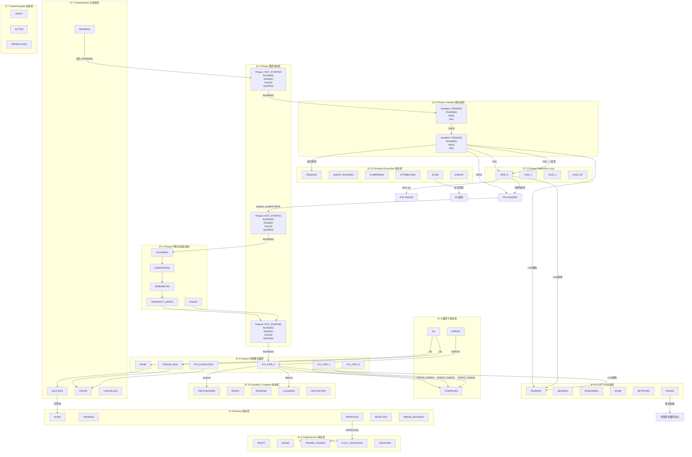

**联动规则说明：**

| 驱动方 | 被驱动方 | 触发条件 | 传播内容 |
|--------|---------|---------|---------|
| WorkflowRun | Phase调度 | RUNNING | 开始 Phase1 |
| Phase1 Handler1 | Handler2 | PASS | 顺序执行 |
| Handler2 | Reflection Loop | FAIL | 失败场景列表 |
| Reflection Loop | Phase1 | 成功/失败 | phase1_verdict |
| Phase1 | Phase2 | PASSED | code_skeleton (输入) |
| Phase2 | Phase3 | SUCCESS | composite_code |
| Phase3 | 外层修复循环 | RUNNING | 代码+用例 |
| 外层修复 | 编译 | STATIC_CHECK | 代码 |
| 编译 | 动态反思 | OK | compile_result |
| 外层修复 | WorkflowRun | DONE/DESIGN_BUG/FIX_EXHAUSTED | phase3_verdict |
| WorkflowRun | Review | SUCCESS | run_id |
| Review APPROVED | GraphVersion | 人工 | FULLY_VALIDATED |
| Phase3 | Sandbox Container | acquire/release | 容器生命周期 |

---

### §7.1 WorkflowRun 主状态机

**聚合根**：`WorkflowRun` **状态字段**：`status: WorkflowRunStatus`

#### 状态定义

| 状态        | 含义                                                         |
| ----------- | ------------------------------------------------------------ |
| `PENDING`   | Run 已创建，等待 Worker 认领                                 |
| `RUNNING`   | Worker 正在执行中                                            |
| `SUCCESS`   | 所有阶段完成且最终判定 valid                                 |
| `FAILED`    | 任意阶段失败（phase1 invalid / phase2 failed 非 design_bug / 系统错误） |
| `CANCELLED` | 用户主动取消                                                 |

#### 状态图

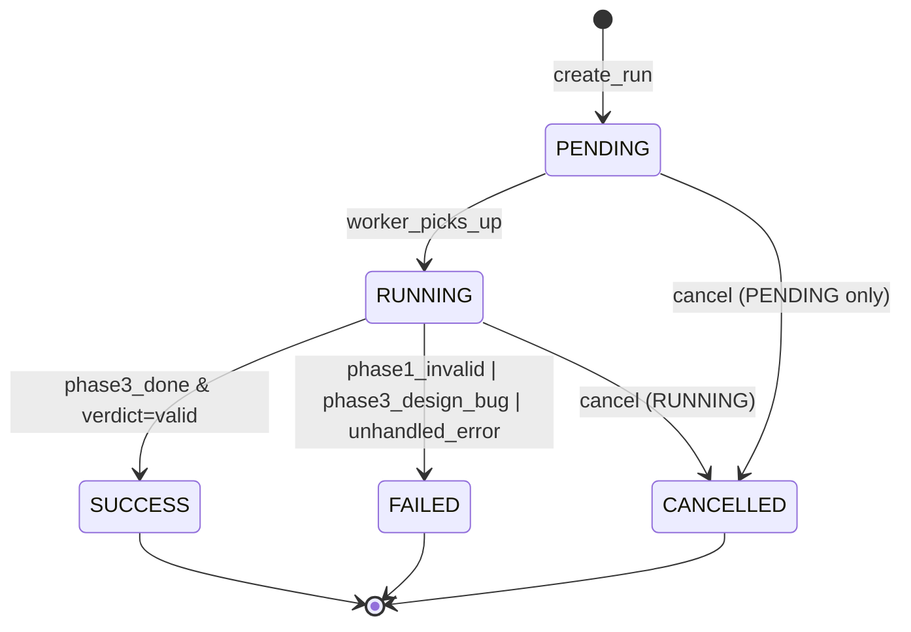

#### 转移规则

| 当前    | 触发                                | 目标      | 条件                                                        |
| ------- | ----------------------------------- | --------- | ----------------------------------------------------------- |
| PENDING | worker_picks_up                     | RUNNING   | Run 被 dequeue                                              |
| PENDING | cancel                              | CANCELLED | 用户请求 + 尚未被认领                                       |
| RUNNING | phase_state_machine.final = valid   | SUCCESS   | phase3_verdict == DONE && final_verdict == valid            |
| RUNNING | phase_state_machine.final = invalid | FAILED    | phase1_verdict == INVALID \|\| phase3_verdict == DESIGN_BUG |
| RUNNING | cancel                              | CANCELLED | 用户请求 + RUNNING 状态                                     |
| RUNNING | unhandled_exception                 | FAILED    | Worker 捕获未处理异常                                       |

#### 不变式

```
1. PENDING 状态只能由 create_run 写入
2. SUCCESS / FAILED / CANCELLED 为终态，不可再转移
3. status 变更必须通过 phase-state-machine.transition()
4. 每个转移必须写入 updated_at
5. version 字段乐观锁每次 +1
```

#### 并发保护

```python
# 乐观锁
UPDATE t_workflow_run
SET status = :new, version = version + 1, updated_at = :now
WHERE id = :id AND version = :expected_version
-- 命中 0 行 → OptimisticLockError → 重试 3 次
```

#### 崩溃恢复

```
Worker 崩溃 → Run 留在 RUNNING
定时扫描（每 5min）：SELECT * FROM t_workflow_run WHERE status = 'RUNNING' AND updated_at < now() - 30min
→ 重新入队（phase1_queue）
→ 注意：Phase3 外层修复迭代的中间状态从 MongoDB RunStep 恢复
```

#### 超时策略

```
RUNNING 状态超过 2 小时无进展 → 自动标记为 FAILED (TIMEOUT)
（outer_fix_iter 已达上限 + 阶段卡住的情况）
```

#### 发布事件

`RunCreated`, `RunStarted`, `RunFinished`, `RunCancelled`, `RunFailed`, `RunStatusTransitioned`

------

### §7.2 Phase 调度状态机

**关联**：WorkflowRun 上的阶段编排

#### 状态定义

每个 Phase 有独立状态：`phase1_status / phase2_status / phase3_status`

| 状态          | 含义                         |
| ------------- | ---------------------------- |
| `NOT_STARTED` | 未开始                       |
| `RUNNING`     | 执行中                       |
| `PASSED`      | 成功完成                     |
| `FAILED`      | 失败                         |
| `SKIPPED`     | 跳过（variant 不包含该阶段） |

#### 状态图（单 Phase）

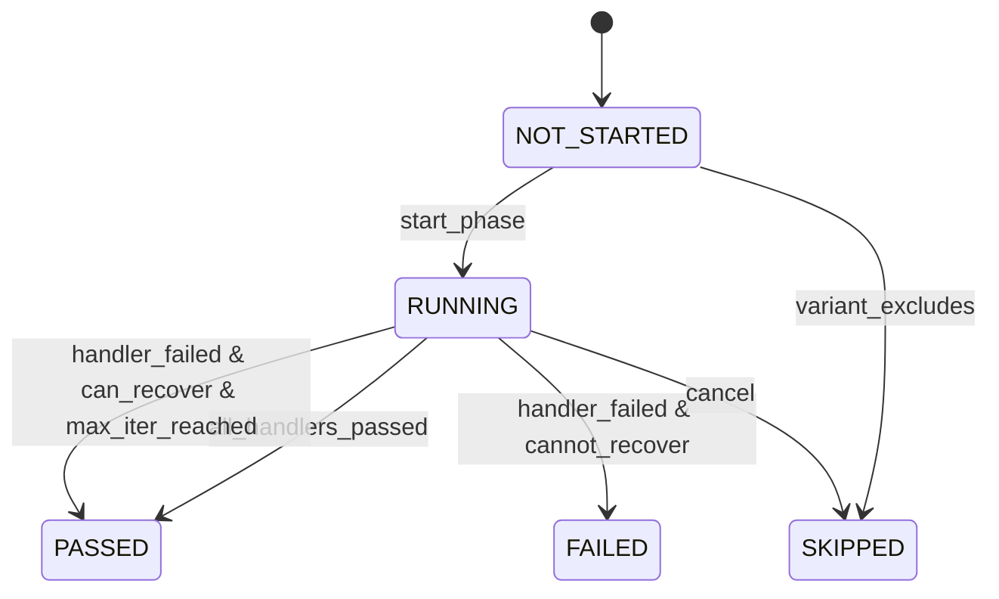

#### 调度顺序（由 phase-state-machine.next_phase 决定）

```
Phase1 未开始 → 开始 Phase1
Phase1 PASSED → variant.includes_phase2() ? 开始 Phase2 : 结束
Phase1 FAILED → 结束（最终 invalid）
Phase2 PASSED → variant.includes_phase3() ? 开始 Phase3 : 结束
Phase2 FAILED → variant.allow_phase3_on_p2_fail() ? 开始 Phase3 : 结束
Phase3 PASSED / FAILED / SKIPPED → 结束
```

#### 不变式

```
1. phase2 只有在 phase1 PASSED 时才能开始
2. phase3 只有在 phase2 PASSED（或 allow）时才能开始
3. 前置 phase 为 FAILED 时，后续 phase 必须 SKIPPED 或 NOT_STARTED
```

#### 并发保护

```
phase 状态变更是 WorkflowRun 更新的一部分，受同一乐观锁保护
同一 Run 的两个 Worker 不能同时处理同一个 phase
```

#### 崩溃恢复

```
Phase 执行中断 → 从最后一个成功 RunStep 恢复（MongoDB）
Phase1 Handler 链：恢复时重新从 last_successful_handler.next 开始
Phase3 修复循环：恢复时 outer_fix_iter 保持，重新进入 static_check
```

#### 超时策略

```
Phase1 整体：30 分钟超时（超时 → FAILED）
Phase2 整体：60 分钟超时
Phase3 单次 iteration：10 分钟超时；总修复循环 2 小时超时
```

#### 发布事件

`Phase1Started`, `Phase1Finished`, `Phase2Started`, `Phase2Finished`, `Phase3Started`, `Phase3Finished`

------

### §7.3 Phase1 Handler 链状态机

**关联**：Phase1 内部 Handler 编排

#### 状态定义

每个 Handler 实例有独立状态：

| 状态      | 含义     |
| --------- | -------- |
| `PENDING` | 等待执行 |
| `RUNNING` | 执行中   |
| `PASS`    | 通过     |
| `FAIL`    | 失败     |

#### 状态图

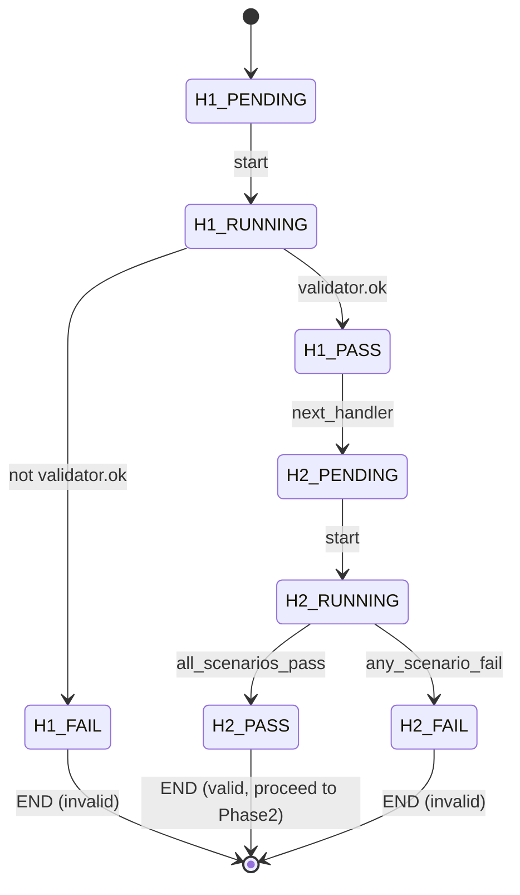

#### 内层反思循环（SDD / TDD）

Handler 2（scenario_run）失败后，不立即退出，可能触发：

```
H2_FAIL
  → decision = "fix_spec" (SDD 反思)
  → 修改节点 field_values
  → 重新跑 H2
  → 或 decision = "add_scenario" (TDD 反思)
  → 添加新 scenario
  → 重新跑 H2
  → max 3 次迭代
  → 仍 FAIL → H2_FAIL 最终退出
```

#### 不变式

```
1. Handler 按 handler_order 严格串行执行
2. 任一 FAIL 立即短路（除非是 SDD/TDD 反思循环内）
3. 反思循环次数有上限（max 3 次）
```

#### 并发保护

```
Handler 在单一 Worker 内串行执行，无需并发保护
不同 Run 的 Handler 完全独立
```

#### 崩溃恢复

```
Handler 执行中断 → RunStep 状态为 RUNNING → 从该 Handler 重新执行
```

#### 发布事件

`HandlerStarted`, `HandlerFinished`, `HandlerDecisionMade`

------

### §7.4 Phase2 代码生成状态机

**关联**：Phase2 内部步骤编排

#### 状态定义

| 状态             | 含义             |
| ---------------- | ---------------- |
| `PLANNING`       | 代码骨架规划中   |
| `GENERATING`     | 逐 Bundle 生成中 |
| `ASSEMBLING`     | 组装完整程序     |
| `SNAPSHOT_SAVED` | 快照已保存       |
| `FAILED`         | 生成失败         |

#### 状态图

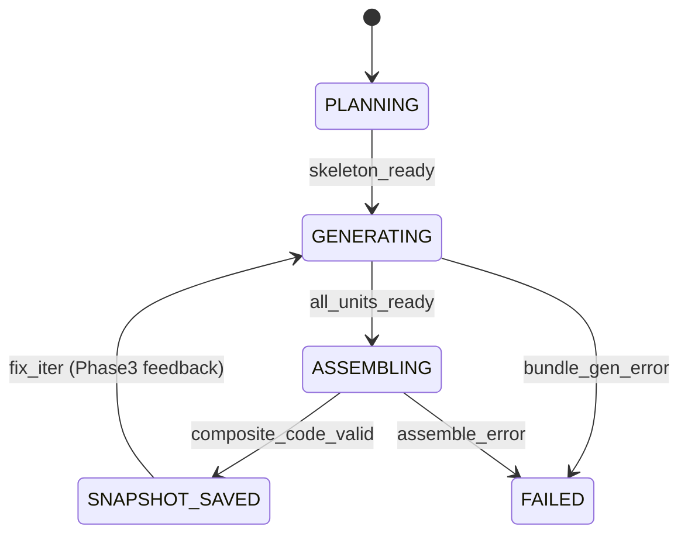

#### 不变式

```
1. GENERATING 前必须有 PLANNING 完成
2. ASSEMBLING 前必须有所有 CodeUnit 生成完毕
3. SNAPSHOT_SAVED 后才能进入 Phase3 编译
```

#### 并发保护

```
CodeUnit 生成跨 Bundle 并行，同 Bundle 内串行
快照保存使用 CodeSnapshotRepository（乐观锁）
```

#### 崩溃恢复

```
中断 → 按最后成功步骤重新执行
snapshot 保存失败 → 重试 3 次
```

#### 发布事件

`CodePlanFinished`, `CodeUnitGenerated`, `CodeAssembled`, `CodeSnapshotSaved`

------

### §7.5 Phase3 外层修复循环状态机

**关联**：Phase3 整体迭代控制

#### 状态定义

```
outer_fix_iter: int ∈ [0, MAX_FIX_ITER]  (MAX = 5)

子状态：
  STATIC_CHECK → COMPILE → SYNTHESIZE → EXECUTE → DYNAMIC_CHECK
```

#### 状态图

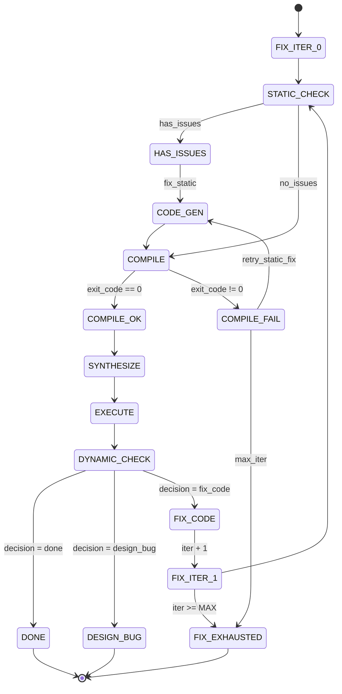

#### 转移条件

| 从            | 触发                            | 到            | 条件                    |
| ------------- | ------------------------------- | ------------- | ----------------------- |
| any           | iter >= MAX                     | FIX_EXHAUSTED | -                       |
| any           | decision = done                 | DONE          | -                       |
| any           | decision = design_bug           | DESIGN_BUG    | -                       |
| STATIC_CHECK  | has_issues                      | HAS_ISSUES    | static_issues not empty |
| STATIC_CHECK  | no_issues                       | COMPILE       | static_issues empty     |
| HAS_ISSUES    | fix applied                     | COMPILE       | -                       |
| COMPILE       | success                         | SYNTHESIZE    | compile_result.ok       |
| COMPILE       | failure & retries > 0           | CODE_GEN      | -                       |
| COMPILE       | failure & retries exhausted     | FIX_EXHAUSTED | -                       |
| DYNAMIC_CHECK | verdict = done                  | DONE          | -                       |
| DYNAMIC_CHECK | verdict = design_bug            | DESIGN_BUG    | -                       |
| DYNAMIC_CHECK | verdict = fix_code & iter < MAX | FIX_CODE      | -                       |

#### 不变式

```
1. outer_fix_iter 单调递增，永不递减
2. FIX_EXHAUSTED 为终态（最终 verdict = inconclusive）
3. DONE / DESIGN_BUG / FIX_EXHAUSTED 为终态
4. 每次 iteration 必须产生一个 CodeSnapshot
```

#### 并发保护

```
单一 Worker 串行执行一个 Run 的所有 iteration
（加锁 run_id，Redis 分布式锁）
```

#### 崩溃恢复

```
每次 iteration 结束持久化 state（含 outer_fix_iter）
重启后恢复 → 重新进入对应子状态
```

#### 超时策略

```
单次 iteration：10 分钟超时
总循环：2 小时超时（超时 → FIX_EXHAUSTED）
```

#### 发布事件

`FixLoopStarted`, `FixIterationStarted`, `FixIterationFinished`, `FixLoopEnded`

------

### §7.6 编译子状态机

**关联**：Phase3 内沙箱编译

#### 状态定义

| 状态        | 含义                |
| ----------- | ------------------- |
| `PREPARING` | 容器启动、文件复制  |
| `COMPILING` | cmake + make 执行中 |
| `OK`        | 编译成功，产物就绪  |
| `ERROR`     | 编译失败            |

#### 状态图

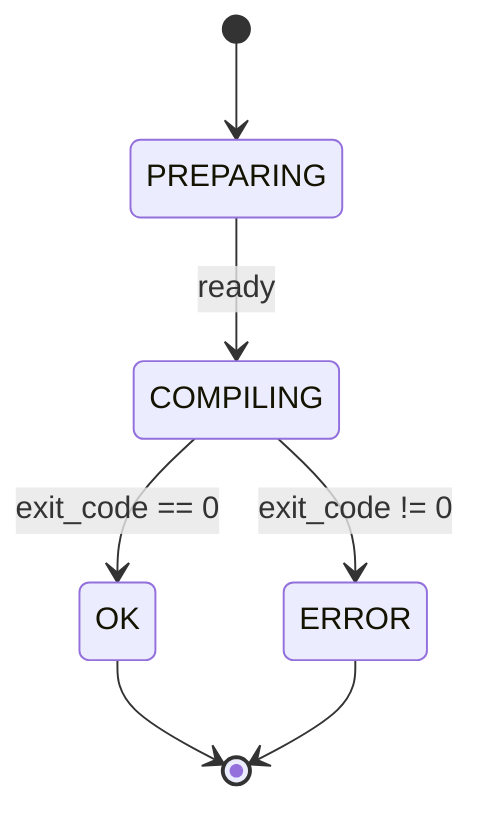

#### 不变式

```
1. OK 状态后才允许进入 SYNTHESIZE
2. 编译产物（artifacts）哈希必须稳定（相同代码 → 相同哈希）
```

#### 超时策略

```
PREPARING: 60s
COMPILING: 300s (5min)
超时 → ERROR
```

------

### §7.7 NodeTemplate 状态机

**聚合根**：`NodeTemplate` **状态字段**：`status: TemplateStatus`

#### 状态定义

| 状态         | 含义                 |
| ------------ | -------------------- |
| `DRAFT`      | 草稿，可编辑         |
| `ACTIVE`     | 已激活，使用中       |
| `DEPRECATED` | 已废弃，不可新增使用 |

#### 状态图

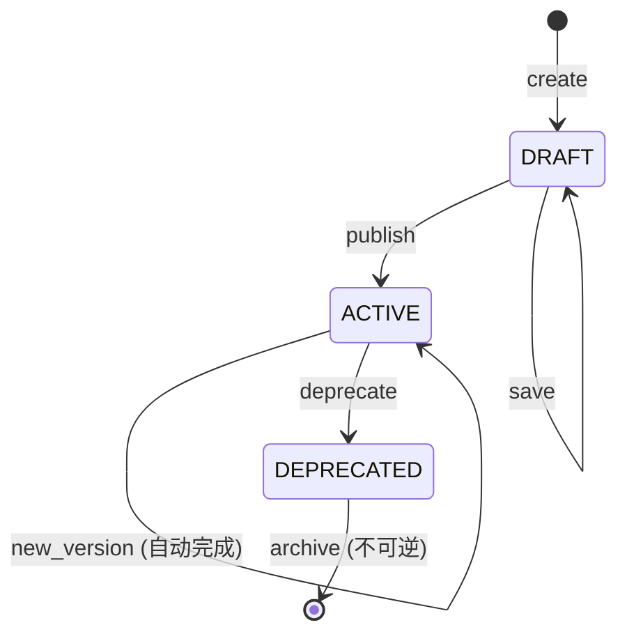

#### 转移规则

| 当前       | 触发                | 目标       |
| ---------- | ------------------- | ---------- |
| DRAFT      | publish             | ACTIVE     |
| ACTIVE     | new_version saved   | ACTIVE     |
| ACTIVE     | deprecate           | DEPRECATED |
| DEPRECATED | archive（系统自动） | -          |

#### 不变式

```
1. DEPRECATED 不可逆，不可再转回 ACTIVE
2. ACTIVE 模板删除前必须先 DEPRECATED
3. DEPRECATED 后新版本不能再基于它创建
```

#### 并发保护

```
UPDATE 时乐观锁 version 字段
```

------

### §7.8 GraphVersion 状态机（已拆分 VALIDATED）

**实体**：`GraphVersion` **状态字段**：`state: VersionState`

> **设计决策**：原 `VALIDATED` 单一状态无法区分"Phase1 通过"与"完整评审通过"两种语义。拆分为：
> - `PHASE1_PASSED`：Phase1 验证通过，可触发 Run
> - `FULLY_VALIDATED`：人工评审通过，图版本完全就绪

#### 状态定义

| 状态              | 含义                       |
| ----------------- | -------------------------- |
| `DRAFT`          | 草稿，未保存               |
| `SAVED`          | 已保存（不可变）           |
| `PHASE1_PASSED`  | Phase1 验证通过             |
| `FULLY_VALIDATED` | 人工评审通过               |
| `ARCHIVED`       | 已归档                     |

#### 状态图

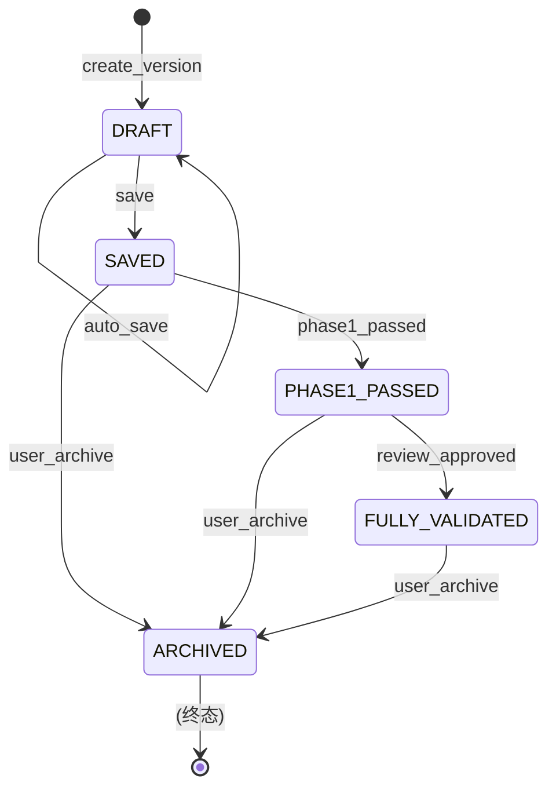

#### 转移规则

| 当前 | 触发 | 目标 | 条件 |
|------|------|------|------|
| DRAFT | save | SAVED | 手动保存 |
| DRAFT | auto_save | DRAFT | 自动保存（草稿） |
| SAVED | phase1_passed | PHASE1_PASSED | Phase1 verdict = valid |
| SAVED | user_archive | ARCHIVED | 手动归档 |
| PHASE1_PASSED | review_approved | FULLY_VALIDATED | Review verdict = APPROVED |
| PHASE1_PASSED | user_archive | ARCHIVED | 手动归档 |
| FULLY_VALIDATED | user_archive | ARCHIVED | 手动归档 |

#### 不变式

```
1. SAVED 后 snapshot 不可修改
2. PHASE1_PASSED 后才能触发 Run（即使未 FULLY_VALIDATED）
3. FULLY_VALIDATED 是人工评审通过的必要条件（可选，视 variant 而定）
4. ARCHIVED 后不可再用于 Run
5. PHASE1_PASSED 可跨 Run（同一版本可触发多次 Run）
```

#### 并发保护

```
同一 GraphVersion 并发 phase1_passed 转移：使用 GraphVersion 行级锁
同时只能有一个 Run 在 Phase1 中验证同一版本
```

#### 发布事件

`GraphVersionSaved`, `GraphVersionPhase1Passed`, `GraphVersionFullyValidated`, `GraphVersionArchived`

------

### §7.9 Review 状态机

**聚合根**：`GraphReview` **状态字段**：`verdict: ReviewStatus`

#### 状态定义

| 状态             | 含义           |
| ---------------- | -------------- |
| `NONE`           | Run 创建时默认 |
| `PENDING`        | 评审进行中     |
| `APPROVED`       | 评审通过       |
| `REJECTED`       | 评审拒绝       |
| `NEEDS_REVISION` | 需要修改后重审 |

#### 状态图

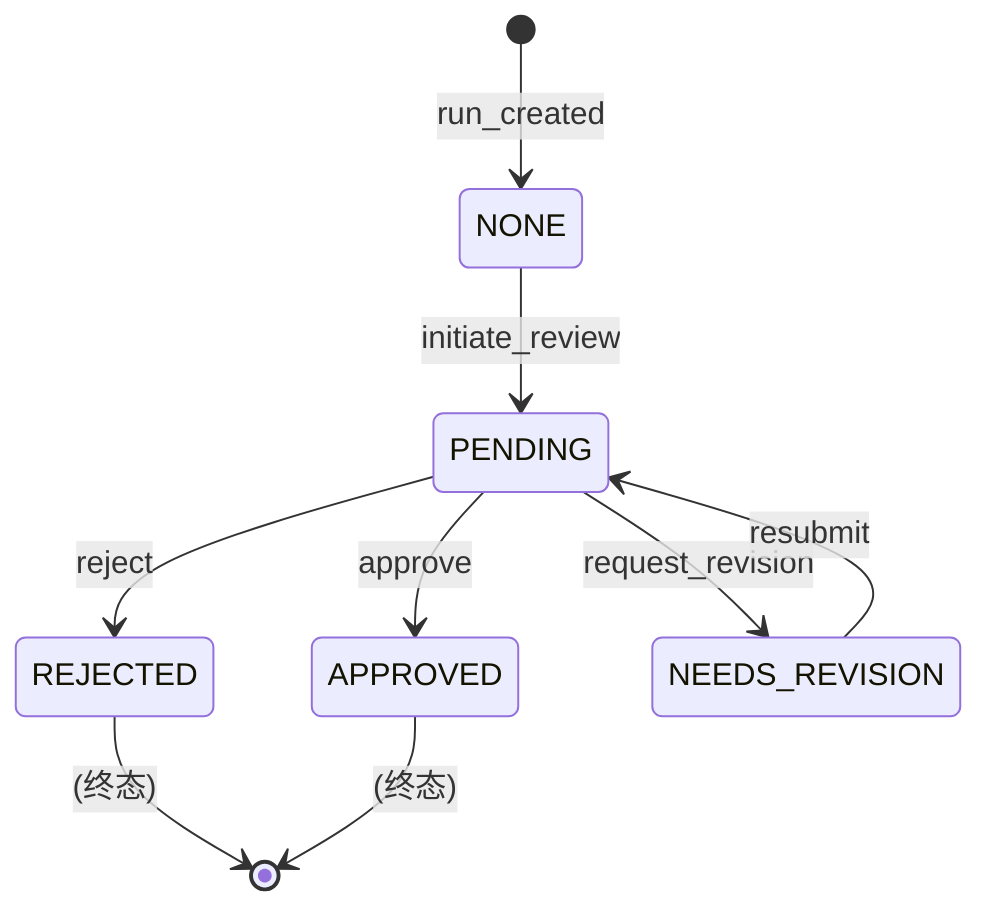

#### 不变式

```
1. APPROVED / REJECTED 为终态
2. NEEDS_REVISION → PENDING 后可再次流转
```

------

### §7.10 Sandbox Container 状态机

**实体**：`ContainerHandle` **状态字段**：`status: ContainerStatus`

#### 状态定义

| 状态           | 含义             |
| -------------- | ---------------- |
| `PROVISIONING` | 容器正在启动     |
| `READY`        | 就绪，可执行命令 |
| `RUNNING`      | 命令执行中       |
| `CLEANING`     | 执行完毕，清理中 |
| `DESTROYED`    | 已销毁（终态）   |

#### 状态图

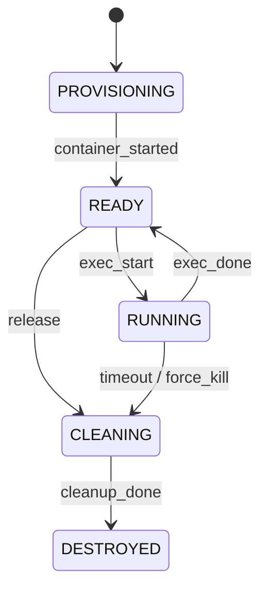

#### 不变式

```
1. DESTROYED 后不可再使用
2. RUNNING 超时强制进入 CLEANING
3. CLEANING 失败 → 标记为 orphan（由 Cron 兜底清理）
```

#### 超时策略

```
RUNNING 状态：默认 300s（可配置）
超时 → 强制杀进程 → CLEANING
```

#### 崩溃恢复

```
容器进程崩溃 → Cron 扫描 PROVISIONING / RUNNING 超时容器
→ 标记 DESTROYED → 归还容器池
```

------

### §7.11 LLM Call 状态机

**实体**：`LLMCall` **状态字段**：`status: LLMCallStatus`

#### 状态定义

| 状态        | 含义             |
| ----------- | ---------------- |
| `PENDING`   | 等待调度         |
| `SENDING`   | 请求发送中       |
| `STREAMING` | 流式接收中       |
| `DONE`      | 完成             |
| `RETRYING`  | 重试中           |
| `FAILED`    | 失败（重试耗尽） |

#### 状态图

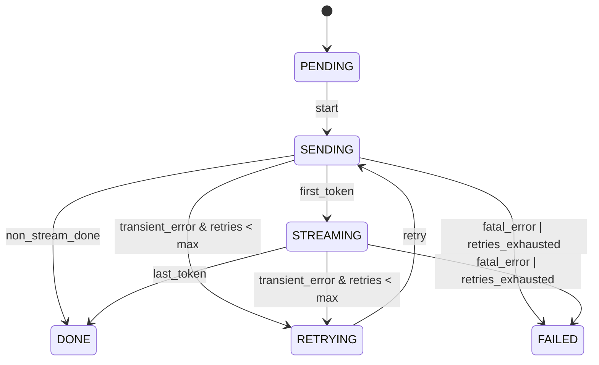

#### 转移规则

| 当前              | 触发                 | 目标      | 条件            |
| ----------------- | -------------------- | --------- | --------------- |
| PENDING           | start                | SENDING   | -               |
| SENDING           | first_token          | STREAMING | streaming mode  |
| SENDING           | response_received    | DONE      | non-streaming   |
| STREAMING         | last_token           | DONE      | -               |
| SENDING/STREAMING | error & retries < 3  | RETRYING  | transient error |
| SENDING/STREAMING | error & retries >= 3 | FAILED    | -               |
| RETRYING          | retry                | SENDING   | -               |

#### 不变式

```
1. RETRYING 最多 3 次（指数退避：10s, 30s, 90s）
2. 幂等键保证重复请求不重复消费 token
3. DONE / FAILED 为终态
```

#### 并发保护

```
幂等键：SHA256(provider + model + messages + tools)
相同幂等键的并发请求：first-write-wins
```

#### 崩溃恢复

```
Worker 崩溃时正在进行的 LLM Call → 下次重试时检测幂等键
→ 若是自己发起的 → 等待完成或标记 FAILED
→ 若是其他 Worker → 返回已有结果
```

------

### §7.12 Scenario Execution 状态机

**关联**：Phase1 场景执行

#### 状态定义

每个 Scenario 执行有独立状态：

| 状态            | 含义             |
| --------------- | ---------------- |
| `PENDING`       | 等待执行         |
| `AGENT_RUNNING` | Agent 循环执行中 |
| `COMPARING`     | 执行完毕，对比中 |
| `ATTRIBUTING`   | 归因分析中       |
| `DONE`          | 完成             |
| `ERROR`         | 异常             |

#### 状态图

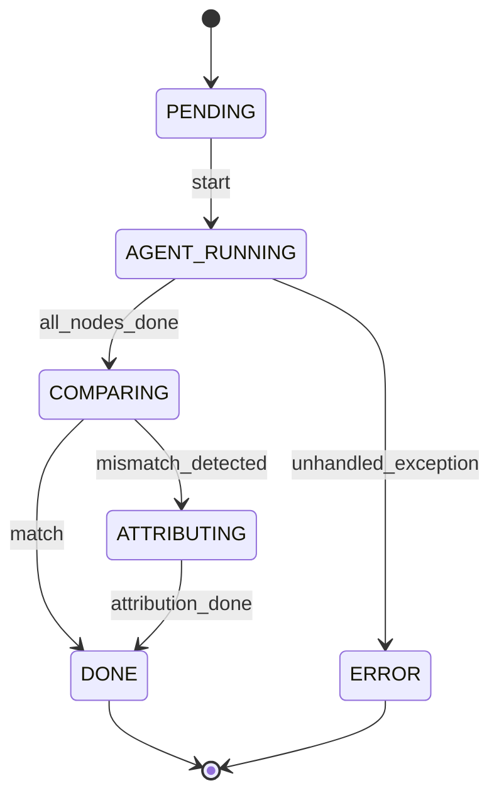

#### 不变式

```
1. 每个 Scenario 必须走 COMPARING（即使 pass 也要比对）
2. 归因（ATTRIBUTING）仅在 mismatch 时触发
3. DONE 必须有明确的 verdict（match=True/False）
```

#### 并发保护

```
Scenario 之间完全独立，可并行执行
同一 Scenario 的多次执行（重试）通过 idempotency_key 合并
```

#### 崩溃恢复

```
Scenario 执行中断 → RunStep 记录中断点 → 重新执行时跳过已完成节点
```

#### 超时策略

```
单个 Scenario：5 分钟超时
超时 → ERROR → ScenarioResult.error = "TIMEOUT"
```

#### 发布事件

`ScenarioStarted`, `ScenarioFinished`, `ScenarioComparisonDone`, `ScenarioAttributionDone`

------

### §7.13 Phase1 Reflection Loop 状态机（新）

**关联**：Phase1 Handler2（scenario_run）失败后触发的 SDD/TDD 反思循环
**驱动方**：handler-chain（当 Handler2 FAIL 时调用 phase1-reflector）
**持久化**：`outer_fix_iter` 写入 CascadeState，每次迭代结束立即持久化

#### 状态定义

```
iter: int ∈ [0, MAX_REFLECTION_ITER]   (MAX = 3)

子状态：
  ANALYZE    → 分析失败原因，获取 ReflectionDecision
  FIX_SPEC   → SDD：修改节点 field_values
  ADD_SCENARIO → TDD：添加新测试场景
  RERUN      → 重新执行 scenario_run Handler
  DONE       → 反思成功，退出循环（进入 phase1 PASS）
  GIVE_UP    → 反思耗尽，退出循环（进入 phase1 FAIL）
```

#### 状态图

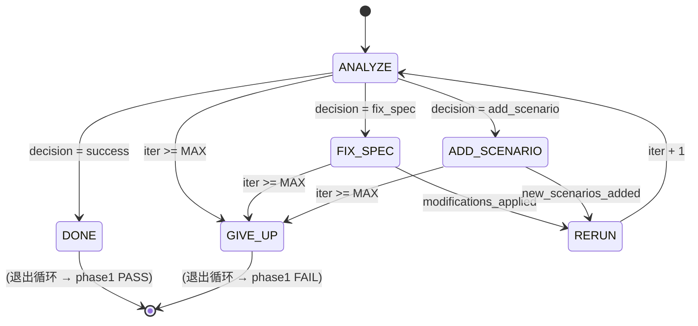

#### 转移规则

| 从 | 触发 | 到 | 条件 |
|----|------|----|------|
| ANALYZE | decision = fix_spec | FIX_SPEC | - |
| ANALYZE | decision = add_scenario | ADD_SCENARIO | - |
| ANALYZE | decision = success | DONE | 所有失败已修复 |
| ANALYZE | iter >= MAX | GIVE_UP | - |
| FIX_SPEC | modifications_applied | RERUN | field_values 已更新 |
| ADD_SCENARIO | new_scenarios_added | RERUN | scenarios 已追加 |
| RERUN | iter < MAX | ANALYZE | 新 iteration |
| RERUN | iter >= MAX | GIVE_UP | 达到上限 |
| FIX_SPEC | iter >= MAX | GIVE_UP | 到达上限仍失败 |

#### 不变式

```
1. iter 单调递增，永不递减
2. GIVE_UP 为终态（phase1_verdict = invalid）
3. DONE 为终态（phase1_verdict = valid）
4. 每次迭代必须产生 modifications 记录（用于崩溃恢复）
5. modifications 原子性：全部成功或全部回滚
```

#### 决策获取（forced schema）

```
ReflectionDecisionSchema:
{
  "decision": "fix_spec" | "add_scenario" | "success" | "give_up",
  "modifications": [
    {
      "instance_id": "...",
      "field": "...",
      "old_value": ...,
      "new_value": ...
    }
  ],
  "new_scenarios": [...],   // 当 decision = add_scenario 时
  "reason": "..."
}
```

#### 并发保护

```
反思循环在单一 Worker 内串行执行
加锁 run_id:reflection，确保同一 Run 不会并发进入两次反思
```

#### 崩溃恢复

```
每次迭代结束持久化：
  - CascadeState.iter = current_iter
  - CascadeState.reflection_modifications = [modifications]
  - RunStep 记录当前 iter

重启后：
  1. 从 MongoDB 恢复最后 RunStep
  2. 加载 reflection_modifications
  3. 从对应 iter 重新进入 ANALYZE 状态
  4. 已应用的 modifications 通过补偿事务回滚（如需要）
```

#### 超时策略

```
单次迭代：10 分钟超时
总循环：30 分钟超时（3次迭代 × 10min）
超时 → GIVE_UP
```

#### 发布事件

`ReflectionStarted`, `ReflectionDecisionMade`, `ReflectionIterationStarted`, `ReflectionIterationFinished`, `ReflectionLoopEnded`, `ReflectionGaveUp`

#### 与 Handler 链状态机的联动

```
§7.3 Handler2 FAIL
  → 调用 phase1-reflector.reflect_loop()
  → 进入 §7.13 Reflection Loop
  → DONE → handler-chain 收到 outcome → 重新 evaluate Handler2
  → GIVE_UP → handler-chain 短路 → phase1 最终 FAIL
```

---


## 第 8 章 分布式与可靠性设计

### §8.0 v2 补丁集（对前序章节的稳定性 / 分布式 / 扩展性修订）

> 本节是 v2 评审后追加的修订条目。它**修正/覆盖**前序章节中存在缺陷的设计点。
> 实施时以本节描述为准。每条都附带 **问题** → **修正** → **影响范围**，便于落地。

#### B1 Worker 存活检测：Lease + Heartbeat + Fencing Token（覆盖 §7.1 / §8.7）

**问题**：原方案仅用 `updated_at < now() - 30min` 的 Cron 扫描判断 Worker 死亡。30 分钟感知延迟过大，且无 fencing 机制，假死 Worker 复活后会与新接管 Worker 争抢同一 Run 的写入。

**修正**：

```
WorkflowRun 表新增字段：
  owner_worker_id: str | None    # 当前持有者
  lease_expires_at: datetime     # 租约到期
  fencing_epoch: bigint          # 单调递增，每次接管 +1

Worker 认领 Run：
  UPDATE t_workflow_run
  SET owner_worker_id = :me,
      lease_expires_at = NOW() + INTERVAL 60 SECOND,
      fencing_epoch = fencing_epoch + 1,
      version = version + 1
  WHERE id = :run_id
    AND status IN ('pending', 'running')
    AND (owner_worker_id IS NULL OR lease_expires_at < NOW())
    AND version = :expected_version

Worker 心跳（每 20s）：
  UPDATE t_workflow_run
  SET lease_expires_at = NOW() + INTERVAL 60 SECOND
  WHERE id = :run_id AND owner_worker_id = :me AND fencing_epoch = :my_epoch

Worker 写入任何状态前必须带 fencing_epoch；
DB 一侧 stored procedure 拒绝 epoch 落后的写入（防御假死复活的脏写）。
```

**死亡检测**：60 秒内无心跳即可被新 Worker 接管，比 30 分钟的 Cron 灵敏 30×。Cron 只做兜底（孤儿 Run > 5min 无心跳重入队）。

**影响范围**：§4.1.1 WorkflowRun 表结构、§6.1.3 worker-runtime、§7.1 主状态机崩溃恢复、§4.1.4 RunStep 写入需带 epoch。

---

#### B2 Saga 补偿：CodeSnapshot 引用计数（覆盖 §8.6.1）

**问题**：原方案"Phase2 失败 → 删除已创建的 CodeSnapshot"。但 §5.1.4 设计是按 `overall_hash` 共享快照，物理删除会破坏其他 Run 的引用。

**修正**：

```
t_code_snapshot 增加 ref_count: int (default 0)

每个 WorkflowRun 与其引用的 CodeSnapshot 之间维护 t_run_snapshot_ref 关联表：
  (run_id, snapshot_id, created_at)

补偿语义：
  Phase2 失败 → 删除 t_run_snapshot_ref 记录（unlink）
  → snapshot 自身不动
  → 后台 GC 任务每天扫一次 ref_count = 0 且 created_at < 7 天的 snapshot 才物理删除

物理删除前再次校验 ref_count（防止与并发 Run 引用冲突）。
```

**影响范围**：§5.1.4 code-snapshot、§8.6.1 Saga 表。

---

#### B3 Outbox 模式统一：所有跨存储写入走 Transactional Outbox（覆盖 §4.1.4 / §8.6.2）

**问题**：原文档对 RunStep / Trace / 事件存在两种不一致语义："best-effort 异步写 MongoDB" 与 "MySQL 事务内写 outbox"。两条路径并存导致 trace 缺失或重复。

**修正：统一规则**

| 数据类型 | 一致性要求 | 写入路径 |
|---------|----------|---------|
| WorkflowRun / RunStep 主表 | 强一致（业务真值） | MySQL 事务内直写 |
| 领域事件（含 RunStep 完成事件） | 至少一次投递 | 同事务写 t_outbox 表，relay 任务异步分发到 Redis Pub/Sub + MongoDB |
| 详细 trace（input/output payload） | 最多丢失少量 | 通过 outbox 投递；relay 任务消费时写 MongoDB |
| WebSocket 实时推送 | 尽力 | relay 任务投递到 Redis Pub/Sub 后由 websocket-pusher 扇出 |

**relay 任务**：单例（Redlock 选主），每 200ms 扫一次 outbox，按 (aggregate_id, occurred_at) 顺序投递；投递成功后标记已发送；失败保留重试（指数退避，最多 6 次后转死信表 + 告警）。

**影响范围**：§4.1.4 RunStep 写入路径、§6.3.1 trace-bus、§8.6.2 outbox 模式细化。

---

#### B4 取消通知：双通道（覆盖 §4.1.6）

**问题**：原方案靠 Redis Pub/Sub 单通道广播取消事件；订阅短暂离线即丢失。

**修正**：

```
取消请求 → 写入 cancel_token:{run_id} = {by, reason, at, epoch} (Redis Hash, TTL 24h)
        → 同时 publish "run.cancel" 频道（fast path）

Worker 端 CancelToken：
  1. publish 订阅（实时收到）
  2. 每 Step 起止 + 每 LLM 调用前后做一次 GET（slow path，兜底）
  3. 跨 LLM 长流式调用：每收到 N 个 token 检查一次

强杀策略（30s 未响应 → 操作系统级 SIGKILL）必须配合 fencing_epoch：
  被强杀的 Worker 复活后，新 epoch 已生效，旧 Worker 写入会被 DB 拒绝。
```

**影响范围**：§4.1.6 cancellation、§6.1.3 worker-runtime。

---

#### B5 状态机 + Step + 事件原子性：统一走 Outbox

**问题**：状态机更新 / RunStep 写入 / 领域事件发布三件事原本散在不同位置，没有事务边界。

**修正**：

```
应用层 WorkflowRunService.transition_status() 的实现合约：

  BEGIN TX
    1. SELECT ... FOR UPDATE WHERE id = ? AND version = ? AND fencing_epoch = ?
    2. PhaseStateMachine.validate_main_transition(...)
    3. UPDATE t_workflow_run SET status, version+1, updated_at, ...
    4. INSERT t_run_step (start/finish 视情况)
    5. INSERT t_outbox (event_type, payload, occurred_at, aggregate_id)
  COMMIT

  → relay 任务异步消费 outbox（B3）
```

**影响范围**：§4.1.1 / §4.1.2 / §6.1.3 worker-runtime 调用约束。

---

#### B6 Run 认领与取消 Race（覆盖 §4.1.6 / §7.1）

**问题**：用户在 Run 处于 PENDING 时取消，与 Worker dequeue 是 race。文档未定义胜者。

**修正**：

```
取消请求路径：
  1. 写 cancel_token 到 Redis（B4）
  2. 同事务里尝试更新 WorkflowRun：
     UPDATE t_workflow_run
     SET status = 'cancelled', version = version + 1
     WHERE id = ? AND status = 'pending' AND version = ?
     → 命中：直接终止
     → 0 行：说明 Worker 已认领，依赖 cancel_token 软取消

Worker 认领后第一件事：
  GET cancel_token:{run_id}
  存在 → 立即 transition(running → cancelled) 不进入业务

Worker 已进入 RUNNING：
  正常 cancel_token 检查（B4 路径）。
```

**影响范围**：§4.1.6 / §7.1。

---

#### B7 Deadline 透传链（修补全文）

**问题**：SimContext 有 deadline，但 deadline 怎么从 API 入参传到 Worker / LLM / Sandbox 没定义。

**修正**：

```
1. API 入参 RunCreateDTO 增加 hard_deadline: datetime | None (可选；默认 NOW + 2h)
2. 持久化到 t_workflow_run.hard_deadline
3. Worker 加载 Run 时计算剩余预算：budget = hard_deadline - now()
4. SimContext.deadline 由当前 Step 的子预算（按 phase 默认占比 + 剩余预算分配）
5. LLM Provider chat() 接收 timeout_ms 参数（必填）—— 由调用方传 min(provider_default, deadline剩余)
6. Sandbox run_command() 同样必填 timeout_s
7. 任意层若 deadline 已过，立即抛 DeadlineExceeded，不再发起新 IO
```

**影响范围**：§4.1.1 WorkflowRun 表、§3.1.3 SimContext、§6.2.1 LLMProvider 接口、§6.2.6 SandboxRuntime 接口。

---

#### B8 乐观锁重试策略

**修正**：

```python
RETRY_BACKOFF = [0.05, 0.1, 0.2, 0.5, 1.0]  # 秒
MAX_RETRIES = 5
on conflict:
  attempt < 5 → sleep(backoff[attempt] * (1 + uniform(0, 0.3))) → retry
  attempt = 5 → 抛 OptimisticLockExhausted → 上层路由到死信
```

替换原 §4.1.1 "重试 3 次"。

---

#### C1 队列实现统一：Celery + Redis List（不混用 Streams）

**问题**：原文档同时声明"Celery 任务"和"Stream-based 队列做 Celery broker 替代"。Celery 不支持 Streams 作 broker。

**修正：明确二选一为 Celery**

```
所有任务调度走 Celery broker = Redis (list 模式，默认)。
Streams 仅用于：
  - outbox relay 任务（B3）的事件传输
  - WebSocket 推送通道（替代经典 Pub/Sub 的不可靠性）

不存在"Celery 用 Streams"的混合形态。
```

**影响范围**：§6.4.3 redis-pubsub、§6.1.3 worker-runtime。

---

#### C2 Pub/Sub 限制：用 Streams 替代关键路径的 Pub/Sub

**修正**：

| 场景 | 选型 | 理由 |
|------|------|------|
| WebSocket 实时推送 | **Streams (consumer group)** | 客户端断线重连可补发未消费消息 |
| 取消信号广播 | **Pub/Sub + Hash 兜底**（B4） | 取消信号可丢，Hash 提供确定性查询 |
| 节点缓存失效 | **Pub/Sub** | 缓存失效可容忍少量延迟 |
| Run 状态变更（持久审计） | **Outbox + Streams** | B3 已覆盖 |

Redis Cluster sharded pub/sub（7.0+）必须启用，channel 按 `run_id` hash 路由。

**影响范围**：§6.1.2 websocket-pusher、§6.4.3。

---

#### C3 NodeRegistry 写后读主库（覆盖 §3.1.2）

**修正**：

```
模板写入流程：
  1. MySQL 主库写入新版本（事务内同时写 t_outbox）
  2. relay 任务投递 TemplateUpdated 事件
  3. 订阅端收到事件 → invalidate Redis 缓存 + 进程内 LRU
  4. 下次读 miss → 强制走主库一次（设置上下文标记 read_master_until = now + 2s）

避免"主从同步未完成 + 失效已生效 + 回到从库读旧值"的窗口。
```

---

#### C4 idempotency 后台清理删除（覆盖 §6.1.6）

**修正**：删除"后台任务扫描超时键"的描述。`SETNX ... PX=ttl` 自带过期，无需冗余清理。MySQL outbox 仅在 Redis 不可用时降级路径使用，由 relay 任务统一 GC。

---

#### C5 GraphVersion 并发 Phase1（覆盖 §7.8 不变式）

**修正**：删除"同时只能有一个 Run 在 Phase1 中验证同一版本"约束。同一不可变快照的多 Run 并行 Phase1 是合法的（验证结果幂等）。`PHASE1_PASSED` 转移仍要乐观锁，但不限并发。

---

#### C6 MongoDB 分片片键（覆盖 §6.4.2）

**修正**：

```
片键：{ run_id_hash: hashed }（hashed shard key）而非 run_id 明文
原因：run_id 由雪花/UUIDv7 生成单调递增，明文片键会形成热点分片。

run_step_details 集合：
  shard key: { run_id_hash: hashed }
  索引: { run_id: 1, started_at: -1 }   # 业务查询走二级索引
  TTL index: { finished_at: 1, expireAfterSeconds: 7776000 }
```

---

#### C7 Cache Stampede single-flight 落地细节（覆盖 §3.1.2）

**修正**：

```
miss 时：
  SET singleflight:{cache_key} owner=me NX PX 5000
  成功 → 我去查 DB → 写 cache → DEL singleflight
  失败 → 退避 50ms 后重试 GET cache（最多 10 次，约 500ms）
       → 仍 miss → 直接查从库（降级，避免无限等待）
```

---

#### C8 LLM 幂等键规范化（覆盖 §6.2.1 / §8.2.3）

**修正**：

```
def llm_idem_key(provider, model, messages, tools, output_schema) -> str:
    payload = {
        "p": provider,
        "m": model,
        "msgs": [_canon_msg(m) for m in messages],
        "tools": sorted([_canon_tool(t) for t in tools or []], key=lambda x: x["name"]),
        "schema": json.dumps(output_schema, sort_keys=True, separators=(",", ":")),
    }
    return hashlib.sha256(
        json.dumps(payload, sort_keys=True, ensure_ascii=False, separators=(",", ":")).encode()
    ).hexdigest()

_canon_msg / _canon_tool：
  - 字典 key 排序
  - 浮点保留 6 位
  - None / "" / 空列表统一删除
  - 字符串去前后空白
```

---

#### C9 Sandbox 节点容错（覆盖 §1.4 / §6.4.4）

**修正**：

```
每 sandbox 节点 Docker Daemon healthcheck（每 5s 通过 Docker Stats API）：
  - daemon down → Worker 标记自身 unhealthy → Celery 自动从 phase3_queue 摘除
  - 进行中的 Run → Worker 写 RunStep "infra_failed"，不立即 FAIL；
    通过 fencing 机制让另一节点接管（B1）
  - 节点故障告警 → 运维介入
```

---

#### C10 Sandbox 强化（覆盖 §5.2.2 / §5.2.4 / §6.4.4）

**修正强制要求**：

```
每个沙箱容器必须同时启用：
  - network_mode: none
  - read_only: true（rootfs 只读，仅 /tmp 可写且 tmpfs）
  - cap_drop: ALL
  - security_opt: [no-new-privileges, seccomp=<profile.json>, apparmor=<profile>]
  - userns_mode: host → 改用 user namespace 隔离（uid/gid 重映射）
  - cgroup: cpu/memory/pids/ulimit_fsize 全配置
  - oom_kill_disable: false
```

---

#### C11 trace_id 跨进程透传（覆盖 §6.3.1）

**修正**：

```
HTTP：W3C Trace Context（traceparent header）
Celery：在 task headers 中透传 traceparent / baggage
LLM 调用：通过 metadata.user_id + 自定义 metadata.trace_id 透传到 Provider
Sandbox：作为容器环境变量 X_TRACE_ID 注入

trace-bus emit 时自动从 contextvars 读取 trace_id / span_id，不需要业务层显式传。
```

---

#### C12 multi-region WebSocket（覆盖 §6.1.2）

**待决策**：当前 v2 假设单 region 部署。multi-region 推后到 v3 再处理（用 Pub/Sub 跨 region 桥接 / 用户连最近 region + 后端 sticky session）。本节仅记录 TBD。

---

#### D1 修订"新插件 ≤200 行"KPI（覆盖 §1.1）

**修正分级**：

| 扩展类型 | 实际代价 | KPI |
|---------|---------|----|
| 新 Handler / Validator / Simulator | 仅实现 ABC + 注册 | ≤200 行 |
| 新 LLM Provider | 实现 ABC + 配置 fallback | ≤300 行 |
| 新 CodegenTarget | 实现 ABC + 模板集 | ≤500 行 |
| 新 Phase | 需扩状态机表 + variant + 错误码 + 事件 | 800–1500 行（不再用"≤200 行"承诺） |
| 新 SandboxRuntime | 接口 + 工厂 + 配置 | ≤500 行 |

---

#### D2 CascadeState 开放扩展（覆盖 §4.1.3）

**修正**：在 CascadeState TypedDict 中加入 `extensions: Mapping[str, Any]`，未识别字段保留 + 警告，与 §3.1.1 NodeTemplateDefinition 对齐：

```python
class CascadeState(TypedDict, total=False):
    # ... 原字段
    extensions: Mapping[str, Any]   # 实验性 Phase / 自定义字段挂载点；未识别字段保留 + 警告
```

---

#### D3 状态机表驱动（覆盖 §4.1.2）

**修正**：MAIN_TRANSITIONS / next_phase 决策表保留为代码常量（性能 + 类型安全），但通过 feature-flag 支持"附加转移"实验：

```python
class PhaseStateMachine:
    @classmethod
    def validate_main_transition(cls, current, new):
        if new in cls.MAIN_TRANSITIONS.get(current, set()):
            return
        if feature_flag.enabled("experimental_transitions"):
            if (current, new) in cls.EXPERIMENTAL_TRANSITIONS:
                metrics.inc("state_machine.experimental_transition")
                return
        raise InvalidStateTransition(...)
```

---

#### D4 SandboxRuntime 抽象（覆盖 §6.2.6）

**修正**：抽象分两层：

```python
class SandboxRuntime(ABC):
    """容器/microVM 池管理（生命周期 + 资源）"""
    async def acquire(self, image, resources) -> SandboxHandle: ...
    async def release(self, handle) -> None: ...

class SandboxSession(ABC):
    """单次会话内的命令/文件操作（适合 Firecracker microVM 多次复用）"""
    async def exec(self, cmd, stdin, timeout) -> ExecResult: ...
    async def push_file(self, src, dst) -> None: ...
    async def pull_file(self, path) -> bytes: ...
```

Docker 实现把 acquire 后立刻销毁（per-task 容器）；Firecracker 实现可在同一 microVM 上跑多次 exec。

---

#### D5 Schema migration 外部化（覆盖 §9.6.1）

**修正**：把 MIGRATIONS 字典从源码挪到 `schema_migrations/cascade_state/v{N}_to_v{N+1}.py`，由 schema-migration 模块按版本号扫描加载。源码中只保留 `apply_migrations(state, target_v)` 调度入口。

---

#### D6 RBAC 角色统一（覆盖 §6.3.4 / §5.3.1）

**修正：统一为五元角色 + 资源级 ACL**

```
全局角色：admin / reviewer / editor / viewer / guest
资源级 ACL：每个 Graph / Template / Submission 维护 owner_id + acl: {user_id: role}
权限计算：max(全局角色, 资源 ACL 角色)

Review 矩阵中的 "owner" = 资源 ACL = owner，不再是独立角色。
```

---


### 8.1 可靠性设计原则

| 原则         | 具体措施                                      |
| ------------ | --------------------------------------------- |
| **失效安全** | 组件崩溃不影响整体；沙箱隔离；Worker 无状态   |
| **幂等设计** | 所有写操作幂等键；LLM 调用幂等；编译幂等      |
| **可恢复**   | 每个阶段持久化；崩溃后从最后状态恢复          |
| **最终一致** | 写后读保证（最终一致 < 1s）；状态机保证强一致 |
| **超时控制** | 所有 IO 操作有超时；超时→降级/重试            |
| **断路器**   | LLM 调用连续失败 3 次 → 断路器打开            |

### 8.2 幂等性设计（各层）

#### 8.2.1 API 层幂等

```
POST /runs
  Header: Idempotency-Key: {uuid}
  → redis.setnx(idemp_key, IN_PROGRESS, ttl=600s)
  → 业务处理
  → redis.set(idemp_key, result_ref, ttl=86400s)
  → MySQL 持久化

重复请求：
  存在且 IN_PROGRESS → 409 Conflict 或 202 Accepted
  存在且有 result_ref → 200 OK（返回缓存结果）
```

#### 8.2.2 Worker 层幂等

```
Phase Step 执行：
  每个 Step 有 idempotency_key = run_id + step_name + iteration_index
  → 执行前检查
  → 执行
  → 写入 Step 结果

崩溃恢复：
  Step RUNNING 且 updated_at > 30min → 重置为 PENDING 重新执行
```

#### 8.2.3 LLM 调用幂等

```
幂等键 = SHA256(provider + model + normalized_messages + tools + output_schema)
→ Redis setnx(idem_key, result, ttl=3600s)
→ 相同请求直接返回缓存结果（节省 token）
```

#### 8.2.4 编译幂等

```
composite_code overall_hash → 查询 CodeSnapshotRepository
  存在 → 复用 compile_result（相同代码无需重复编译）
  不存在 → 执行编译 → 存入 snapshot
```

### 8.3 分布式锁设计

#### 8.3.1 锁类型

| 锁           | 用途                     | TTL   | 算法    |
| ------------ | ------------------------ | ----- | ------- |
| Run 锁       | Worker 认领 Run          | 30min | Redlock |
| Phase 锁     | 防止同一 Run 两个 Worker | 15min | Redlock |
| Container 锁 | 容器分配                 | 10min | Redlock |
| 版本写入锁   | 模板版本号自增           | 5s    | Redlock |
| 领导选举     | Cron Beat 单例           | 15s   | Redlock |

#### 8.3.2 Redlock 实现

```python
class DistributedLock:
    async def acquire(self, key: str, ttl_s: int) -> bool:
        """尝试获取锁（TTL 到期自动释放）"""

    async def release(self, key: str, token: str) -> None:
        """释放锁（仅持有者能释放，Lua 脚本保证原子性）"""
```

#### 8.3.3 死锁预防

```
1. 所有锁 TTL 必须 > 操作超时时间
2. 禁止嵌套锁（同一线程不重复 acquire）
3. 超时锁自动释放（Redlock 自动）
4. 锁申请超时：5s，超时放弃
```

### 8.4 领导选举（单例任务）

#### 8.4.1 需要单例的任务

```
- Cron Beat（定时调度器）
- 孤儿 Run 清理任务（每 5min）
- MongoDB outbox 补偿任务（每 1min）
- 过期幂等键清理任务（每 10min）
```

#### 8.4.2 实现

```
Redis Redlock 选举：
  尝试获取 lock:leader:{task_name}
  TTL = 15s，续约每 5s
  成功 → 执行任务
  失败 → 等待下一次选举

选举周期 = 15s（确保 leader 崩溃后 15s 内选出新 leader）
```

### 8.5 断路器设计

```python
class CircuitBreaker:
    FAILURE_THRESHOLD = 3      # 连续失败 3 次
    RECOVERY_TIMEOUT = 60s     # 60s 后尝试半开
    HALF_OPEN_MAX_CALLS = 1    # 半开时最多 1 个请求

    def call(self, fn):
        if self.state == OPEN:
            raise CircuitOpenError
        try:
            result = fn()
            self.record_success()
            return result
        except Exception:
            self.record_failure()
            if self.failure_count >= self.FAILURE_THRESHOLD:
                self.state = OPEN
            raise
```

**应用场景**：

- LLM Provider 调用（连续 3 次失败 → 断路）
- MongoDB 写入（连续 3 次失败 → 降级到 MySQL outbox）
- Docker 操作（连续 2 次失败 → 降级到本地编译）

### 8.6 补偿与回滚

#### 8.6.1 Saga 补偿链

```
Run 创建成功 → Phase1 开始 → Phase2 开始 → Phase3 开始

任意步骤失败 → 按以下顺序补偿：
  Phase3 失败 → 无需补偿（无持久化变更）
  Phase2 失败 → 删除已创建的 CodeSnapshot
  Phase1 失败 → 无需补偿（无持久化变更）
```

#### 8.6.2 Outbox 模式（MongoDB 写入保障）

```
步骤：
  1. 业务操作 + outbox 记录 写在同一 MySQL 事务
  2. 后台任务每 1min 扫描 outbox
  3. 执行 MongoDB 写入
  4. 删除 outbox 记录

崩溃恢复：重启后继续扫描未完成的 outbox
```

### 8.7 崩溃恢复策略（按场景）

| 场景                        | 影响               | 恢复方式                                     |
| --------------------------- | ------------------ | -------------------------------------------- |
| Worker 在 Phase1 中崩溃     | Run 卡在 RUNNING   | 30min 后 Cron 重入队，从最后 RunStep 恢复    |
| Worker 在 Phase3 迭代中崩溃 | Run 卡在 RUNNING   | 恢复后从 `outer_fix_iter` 重新进入对应子状态 |
| API 节点崩溃                | 无状态，不影响     | LB 自动路由到其他节点                        |
| Redis Cluster 部分节点故障  | 缓存可用，锁不可用 | 降级：锁操作失败 → 拒绝写入                  |
| MySQL 主库故障              | 写不可用           | 自动切换到从库（只读）；写操作返回 503       |
| MongoDB 副本集故障          | Trace 写入暂缓     | 降级到 outbox + 本地 buffer                  |
| 沙箱容器不响应              | Run 卡住           | 容器超时（5min）→ 杀容器 → 标记 FAILED       |

### 8.8 限流与背压

```python
# API 层限流（按 user_id）
@limiter.limit("100/minute", key_func=lambda: g.user_id)
async def create_run(): ...

# Worker 队列限流
- phase1_queue: max 50 并发
- phase2_queue: max 30 并发
- phase3_queue: max 10 并发（沙箱资源密集）

# LLM 限流（按 provider）
- Claude: 50 req/min (user), 100 req/min (app)
- OpenAI: 60 req/min
```

### 8.9 监控与告警

| 指标                       | 告警阈值            |
| -------------------------- | ------------------- |
| Run 失败率                 | > 10% (5min window) |
| Phase1 平均耗时            | > 5min              |
| LLM 错误率                 | > 5%                |
| MongoDB 写入延迟 P99       | > 500ms             |
| 沙箱容器获取等待           | > 30s               |
| 活跃 Run 卡在 RUNNING > 2h | > 0                 |
| Worker CPU 使用率          | > 80% (持续 5min)   |

------

## 第 9 章 扩展性机制

### 9.1 插件注册体系总览

| 扩展点          | 接口/基类               | 注册位置                           | 示例                 |
| --------------- | ----------------------- | ---------------------------------- | -------------------- |
| 新 Handler      | `HandlerStep` 子类      | `HandlerRegistry.register()`       | `coverage_check`     |
| 新 Simulator    | `NodeSimulator` 子类    | `NodeSimulatorFactory.register()`  | `WasmSimulator`      |
| 新 Validator    | `ForestVisitor` 子类    | `VisitorRegistry.register()`       | `D3ANamingCheck`     |
| 新 LLM Provider | `LLMProvider` 子类      | `LLMProviderFactory.register()`    | `GeminiProvider`     |
| 新代码生成目标  | `CodegenTarget` 子类    | `CodegenTargetFactory.register()`  | `RustCodegenTarget`  |
| 新沙箱运行时    | `SandboxRuntime` 子类   | `SandboxRuntimeFactory.register()` | `FirecrackerRuntime` |
| 新 Phase        | `BasePipelineStep` 子类 | `PipelineBuilder` 装配             | `Phase4PerfTest`     |

### 9.2 Handler 扩展（示例：新增 coverage_check）

```python
# 1. 实现 Handler
class CoverageCheckHandler(HandlerStep):
    name = "coverage_check"
    handler_order = 30  # 在 scenario_run 之后

    async def _handle(self, state: CascadeState, trace: TraceEmitter) -> HandlerOutcome:
        coverage = compute_coverage(state["scenario_results"])
        if coverage < 0.8:
            return HandlerOutcome(
                decision="fail",
                reason=f"Coverage {coverage} < 0.8",
                issues=[],
            )
        return HandlerOutcome(decision="pass", reason="", issues=[])

# 2. 注册（boot 时或配置驱动）
handler_registry.register(CoverageCheckHandler)

# 3. 无需修改 Phase1 编排逻辑，HandlerChainExecutor 自动包含
```

### 9.3 LLM Provider 扩展（示例：加 Gemini）

```python
# 1. 实现 Provider
class GeminiProvider(LLMProvider):
    async def chat(self, messages, tools, output_schema, ...) -> LLMResponse:
        response = await gemini.generate_content(
            contents=messages_to_gemini_format(messages),
            tools=tools,
            generation_config={"response_mime_type": "application/json"} if output_schema else None,
        )
        return LLMResponse(...)

# 2. 注册
llm_provider_factory.register("gemini", GeminiProvider)

# 3. 配置使用
# settings: LLM_DEFAULT_PROVIDER=gemini
# 或在 Template 中指定 provider_override="gemini"
```

### 9.4 CodegenTarget 扩展（示例：加 Rust）

```python
# 1. 实现 Target
class RustCodegenTarget(CodegenTarget):
    language = "rust"

    def bundle_class_template(self, bundle, nodes) -> str:
        return f"pub struct {bundle.name} {{ ... }}"

# 2. 注册
codegen_target_factory.register("rust", RustCodegenTarget)

# 3. 使用
codegen_target = codegen_target_factory.get("rust")
```

### 9.5 SandboxRuntime 扩展（示例：加 Firecracker）

```python
# 1. 实现 Runtime
class FirecrackerRuntime(SandboxRuntime):
    async def run_command(self, cmd, stdin, timeout_s, cpu_limit, mem_limit_mb):
        # 使用 Firecracker SDK
        ...

# 2. 注册
sandbox_runtime_factory.register("firecracker", FirecrackerRuntime)

# 3. 配置
# settings: SANDBOX_RUNTIME=firecracker
```

### 9.6 Schema 演进策略

#### 9.6.1 CascadeState Schema 演进

```python
# 当前版本：schema_version = 1
# 升级到 v2：

MIGRATIONS: dict[int, Callable[[dict], dict]] = {
    1: lambda s: {
        **s,
        "schema_version": 2,
        # 新增字段默认值
        "retry_count": 0,
        # 旧字段重命名
        "provided_scenarios": s.get("scenarios", []),  # v1 教训
    },
    2: lambda s: {**s, "schema_version": 3, ...},
}

def upgrade_state(state: dict, target_v: int) -> CascadeState:
    current = state.get("schema_version", 1)
    while current < target_v:
        state = MIGRATIONS[current](state)
        current += 1
    return state
```

#### 9.6.2 向后兼容原则

```
1. 只添加字段，不删除字段
2. 只添加枚举值，不移除枚举值
3. 添加的字段必须有默认值
4. 重大变更：schema_version +major
```

#### 9.6.3 NodeTemplateDefinition 演进

```python
class NodeTemplateDefinition:
    schema_version: int = 1

    def upgrade(self, target_v: int) -> "NodeTemplateDefinition":
        # 按版本渐进升级
```

### 9.7 特性开关（灰度发布）

```python
# 开关定义
FEATURE_FLAGS = {
    "phase3_direct": FeatureFlag(key="phase3_direct", enabled=False, rollout=0.0),
    "rust_codegen": FeatureFlag(key="rust_codegen", enabled=True, rollout=0.1),
    "new_handler_chain": FeatureFlag(key="new_handler_chain", enabled=False, user_ids=[1,2,3]),
}

# 使用
if await ff.is_enabled("rust_codegen", user_id):
    target = codegen_target_factory.get("rust")
else:
    target = codegen_target_factory.get("cpp")
```

------

## 第 10 章 TBD（D3A 留白）与迁移路径

### 10.1 D3A 相关 TBD 项

| TBD 项             | 当前状态     | 依赖 D3A 什么        | 影响模块         | 现在能定的事                            |
| ------------------ | ------------ | -------------------- | ---------------- | --------------------------------------- |
| D3A 节点 Schema    | **完全 TBD** | 具体指令定义         | node-definition  | `NodeTemplateDefinition` 的结构载体已定 |
| D3A 输入格式       | **完全 TBD** | 指令输入格式         | case-synthesizer | 输入规范化为 JSON Schema（内容待填）    |
| D3A 输出格式       | **完全 TBD** | 指令输出格式         | case-synthesizer | 同上                                    |
| D3A → C++ 映射模板 | **完全 TBD** | 指令到代码的对应关系 | codegen-target   | `CodegenTarget` 接口已定，模板槽位已留  |
| D3A 节点模拟器     | **完全 TBD** | 模拟 D3A 节点行为    | node-simulator   | `HybridSimulator` 接口已定              |
| D3A 内置模板包     | **完全 TBD** | 官方 D3A 节点集      | node-library     | seed 数据位置已定                       |

### 10.2 后续补全 D3A 的操作路径

```
1. 确定 D3A 指令规范（JSON Schema + 语义）
   → 产出：dd3a-schema.json

2. 实现 codegen-target
   → 新建 CppD3ACodegenTarget 类
   → 注册 factory
   → 不动现有 Phase2 逻辑

3. 填充 node-library 种子数据
   → JSON Pack 导入
   → 不动 node-registry

4. 实现/扩展 simulator
   → 实现 D3ASimulator
   → 注册到 factory

5. 扩展 case-synthesizer
   → 加 D3A 格式支持
   → 不动 sandbox-executor
```

### 10.3 v1 → v2 迁移路径（针对已实现的 Phase1）

```
1. CascadeState schema_version 字段从无 → 1
   → 启动时自动升级

2. provided_scenarios + scenarios 合并
   → 代码层：CascadeState.scenarios 唯一来源
   → 数据迁移：MySQL 中 old scenarios + provided_scenarios → new scenarios
   → 迁移脚本：migrate_01_merge_scenarios.py

3. PhaseStateMachine 替代 PhaseRouter
   → 移除 PhaseRouter 所有条件判断
   → 替换为 phase_state_machine.next_phase()
   → 回归测试覆盖

4. Forced Schema 输出
   → llm-output-schema 服务化
   → 所有 LLM 调用改走 forced_chat()
   → 回归测试验证无自由文本推断

5. ToolUseResult 严格分离
   → 扫描所有 simulator 实现
   → 检查 output_json / content 分离
   → 回归测试验证
```

### 10.4 术语表（完整版）

| 术语            | 类型   | 定义                                                         |
| --------------- | ------ | ------------------------------------------------------------ |
| Aggregate Root  | DDD    | 唯一修改入口：WorkflowRun、CascadeForest、NodeTemplate、GraphReview |
| BC              | DDD    | Bounded Context，限界上下文                                  |
| Entity          | DDD    | 有生命周期：Bundle、NodeInstance、Edge、RunStep、GraphVersion |
| Value Object    | DDD    | 不可变：NodeTemplateDefinition、CascadeState、SimResult      |
| Domain Service  | DDD    | 无状态逻辑：DesignValidator、PhaseStateMachine、NodeSimulatorFactory |
| ACL             | DDD    | Anti-Corruption Layer，集成层                                |
| SimContext      | 系统   | Simulator 执行上下文                                         |
| SimResult       | 系统   | Simulator 执行结果                                           |
| HandlerOutcome  | 系统   | Phase1 Handler 执行结果                                      |
| Fix Loop        | 系统   | Phase3 外层修复循环（outer_fix_iter）                        |
| Idempotency Key | 可靠性 | 用于幂等控制的唯一键                                         |
| Redlock         | 可靠性 | Redis 分布式锁算法                                           |
| Outbox          | 可靠性 | 可靠消息模式：事务 + 异步消息                                |
| Circuit Breaker | 可靠性 | 断路器：快速失败防止级联                                     |
| Schema Version  | 演进   | 用于追踪状态对象的格式版本                                   |
| D3A             | 业务   | 指令集规范（待定）                                           |

### 10.5 错误码总表（66 个）

#### RUN 系列（Run 执行）

| 错误码 | 含义 | HTTP 状态 | 处理方式 |
|--------|------|----------|---------|
| `RUN_001` | Run 不存在 | 404 | 幂等返回成功 |
| `RUN_002` | 状态不允许此操作 | 409 | 返回错误信息 |
| `RUN_003` | Run 已终态 | 409 | 幂等返回成功 |
| `RUN_004` | Run 超过并发上限 | 429 | 排队或降级 |
| `RUN_005` | Run 已取消 | 409 | 幂等返回成功 |
| `RUN_006` | Run 执行超时（2h） | 504 | 重新入队或标记 TIMEOUT |
| `RUN_007` | Run 不属于当前用户 | 403 | 权限拒绝 |
| `RUN_008` | Run 触发频率超限 | 429 | 限流 |

#### GRAPH 系列（图与版本）

| 错误码 | 含义 | HTTP 状态 | 处理方式 |
|--------|------|----------|---------|
| `GRAPH_001` | 图不存在 | 404 | - |
| `GRAPH_002` | 版本号冲突 | 409 | 提示刷新 |
| `GRAPH_003` | 版本已归档，不可编辑 | 410 | 提示创建新版本 |
| `GRAPH_004` | 图属于其他用户，无权限 | 403 | - |
| `GRAPH_005` | 图名已存在（同一用户） | 409 | 提示改名 |
| `GRAPH_006` | 森林 JSON 结构非法 | 422 | 返回结构错误列表 |
| `GRAPH_007` | Bundle 引用了不存在的 NodeInstance | 422 | 返回具体 instance_id |
| `GRAPH_008` | 边引用了不存在的节点 | 422 | 返回具体 edge_id |

#### NODE / TEMPLATE 系列（节点模板）

| 错误码 | 含义 | HTTP 状态 | 处理方式 |
|--------|------|----------|---------|
| `TEMPLATE_001` | 模板不存在 | 404 | - |
| `TEMPLATE_002` | 权限不足 | 403 | - |
| `TEMPLATE_003` | 模板已废弃，无法使用 | 410 | 提示 Fork |
| `TEMPLATE_004` | 模板名称已存在（同一 owner scope） | 409 | 提示改名 |
| `TEMPLATE_005` | Schema 格式非法 | 422 | 返回具体验证错误 |
| `TEMPLATE_006` | 模板状态不允许此操作（如 DRAFT 状态触发 Run） | 409 | - |
| `TEMPLATE_007` | 模板 Fork 目标不存在 | 404 | - |

#### PHASE / HANDLER 系列（阶段执行）

| 错误码 | 含义 | HTTP 状态 | 处理方式 |
|--------|------|----------|---------|
| `PHASE_001` | Phase 执行超时 | 504 | 重新入队 |
| `PHASE_002` | Handler 链失败 | 200 | verdict 已在 result 中 |
| `PHASE_003` | Phase 输入状态非法 | 422 | 检查前置 Phase |
| `PHASE_004` | Handler 内部错误（未捕获异常） | 500 | 重试 3 次仍失败 → FAILED |
| `PHASE_005` | Handler 执行结果 Schema 验证失败 | 500 | 记录错误，降级 |
| `PHASE_006` | 场景执行超时（5min/场景） | 504 | 标记 TIMEOUT，继续下一场景 |
| `PHASE_007` | 场景执行失败（预期输出不匹配） | 200 | verdict = invalid |
| `PHASE_008` | 反思循环达到最大迭代 | 200 | verdict = inconclusive |

#### CODE / PHASE2 系列（代码生成）

| 错误码 | 含义 | HTTP 状态 | 处理方式 |
|--------|------|----------|---------|
| `CODE_001` | 代码骨架规划失败 | 500 | 降级，跳过 Phase2 |
| `CODE_002` | 代码生成 LLM 调用失败 | 503 | 断路器 → 降级 |
| `CODE_003` | 代码组装失败（模板缺失） | 500 | 记录错误 |
| `CODE_004` | 代码 Snapshot 保存失败 | 500 | 重试 3 次 |
| `CODE_005` | 代码哈希冲突 | 409 | 忽略，视为成功 |
| `CODE_006` | 目标语言不支持 | 422 | 选择支持的模型 |

#### SANDBOX / PHASE3 系列（沙箱执行）

| 错误码 | 含义 | HTTP 状态 | 处理方式 |
|--------|------|----------|---------|
| `SANDBOX_001` | 沙箱获取超时（容器池耗尽） | 503 | 重试，等待容器释放 |
| `SANDBOX_002` | 编译失败（CMake/Make 错误） | 200 | verdict 在 result 中 |
| `SANDBOX_003` | 沙箱容器启动失败 | 503 | 重试 3 次仍失败 → FAILED |
| `SANDBOX_004` | 沙箱执行超时 | 200 | verdict = timeout |
| `SANDBOX_005` | 沙箱进程崩溃 | 500 | 记录 crash log，标记 FAILED |
| `SANDBOX_006` | 沙箱网络隔离被破坏 | 500 | 杀容器，报警，标记 FAILED |
| `SANDBOX_007` | 用例结果写入 MongoDB 失败 | 200 | 降级到 MySQL outbox |

#### LLM 系列（语言模型调用）

| 错误码 | 含义 | HTTP 状态 | 处理方式 |
|--------|------|----------|---------|
| `LLM_001` | LLM 调用失败（网络/timeout） | 503 | 断路器 |
| `LLM_002` | Schema 验证失败（输出不符合 schema） | 500 | 重试 2 次仍失败 → LLM_004 |
| `LLM_003` | Provider Rate Limit | 429 | 等待后重试（指数退避） |
| `LLM_004` | LLM 输出格式错误（连续多次） | 500 | 降级到备用模型 |
| `LLM_005` | Token 预算超限 | 429 | 排队或降级到便宜模型 |
| `LLM_006` | Provider 不可用（断路器打开） | 503 | 等待恢复或切换 Provider |
| `LLM_007` | LLM 请求超时 | 504 | 重试 3 次 |

#### REVIEW 系列（评审）

| 错误码 | 含义 | HTTP 状态 | 处理方式 |
|--------|------|----------|---------|
| `REVIEW_001` | 评审不存在 | 404 | - |
| `REVIEW_002` | 评审人权限不足 | 403 | - |
| `REVIEW_003` | 评审状态不允许此操作（如 APPROVED 再次评审） | 409 | - |
| `REVIEW_004` | Run 未完成，无法发起评审 | 422 | 等待 Run 结束 |
| `REVIEW_005` | 批注目标不存在 | 404 | - |
| `REVIEW_006` | 批注解析权限不足 | 403 | - |

#### SYSTEM 系列（系统级）

| 错误码 | 含义 | HTTP 状态 | 处理方式 |
|--------|------|----------|---------|
| `IDEM_001` | 幂等键冲突 | 409 | 返回已有结果 |
| `IDEM_002` | 幂等键格式非法 | 422 | - |
| `LOCK_001` | 获取锁超时 | 503 | 重试 |
| `LOCK_002` | 锁已存在（其他 Worker 持有） | 409 | 等待或放弃 |
| `QUEUE_001` | 队列满，任务被拒绝 | 503 | 降级或重试 |
| `QUEUE_002` | 队列消息序列化失败 | 500 | 记录错误 |
| `DB_001` | 数据库连接超时 | 503 | 重试 |
| `DB_002` | 数据库事务冲突（乐观锁） | 409 | 重试 3 次 |
| `DB_003` | MongoDB 写入失败 | 500 | 降级到 MySQL outbox |

---

### 10.6 领域事件总表（62 个）

> 总计 = Run 10 + Phase1 8 + Phase2 6 + Phase3 10 + Step 4 + Template 5 + GraphVersion 5 + Review 6 + Comment 3 + Sandbox/LLM 4 + Cost 1 = **62**

#### Run 生命周期事件（10 个）

| 事件 | 发布时机 | 消费者 |
|------|---------|--------|
| `RunCreated` | 创建 Run | WebSocket, AuditLog |
| `RunStarted` | Run 被 Worker 认领 | WebSocket, AuditLog |
| `RunQueued` | Run 入队等待 | WebSocket |
| `RunDequeued` | Run 被 Worker 取出 | WebSocket |
| `RunStatusTransitioned` | Run 状态转移（通用） | Trace |
| `RunPhaseEntered` | Run 进入新 Phase | WebSocket, Metrics |
| `RunPhaseFinished` | Run Phase 完成 | WebSocket, Metrics |
| `RunFinished` | Run 达到终态 | WebSocket, AuditLog |
| `RunCancelled` | Run 被取消 | WebSocket, AuditLog |
| `RunFailed` | Run 失败（含原因） | WebSocket, AuditLog, Metrics |

#### Phase1 事件（8 个）

| 事件 | 发布时机 | 消费者 |
|------|---------|--------|
| `Phase1Started` | Phase1 开始 | WebSocket |
| `Phase1Finished` | Phase1 结束（PASS/FAIL） | WebSocket, Metrics |
| `HandlerStarted` | Handler 开始执行 | Trace |
| `HandlerFinished` | Handler 执行完成 | Trace |
| `HandlerDecisionMade` | Handler 做出决策（pass/fail） | Trace |
| `ReflectionStarted` | SDD/TDD 反思开始 | Trace |
| `ReflectionDecisionMade` | 反思决策生成 | Trace |
| `ReflectionLoopEnded` | 反思循环结束 | Trace, Metrics |

#### Phase2 事件（6 个）

| 事件 | 发布时机 | 消费者 |
|------|---------|--------|
| `Phase2Started` | Phase2 开始 | WebSocket |
| `Phase2Finished` | Phase2 结束 | WebSocket, Metrics |
| `CodePlanFinished` | 代码骨架规划完成 | Trace |
| `CodeUnitGenerated` | 单个 Bundle 代码生成完成 | Trace |
| `CodeAssembled` | 代码组装完成 | Trace |
| `CodeSnapshotSaved` | 代码快照保存 | Trace, Metrics |

#### Phase3 / 修复循环事件（10 个）

| 事件 | 发布时机 | 消费者 |
|------|---------|--------|
| `Phase3Started` | Phase3 开始 | WebSocket |
| `Phase3Finished` | Phase3 结束 | WebSocket, Metrics |
| `FixLoopStarted` | 修复循环开始 | WebSocket |
| `FixIterationStarted` | 每次修复迭代开始 | WebSocket |
| `FixIterationFinished` | 每次修复迭代结束 | WebSocket |
| `FixLoopEnded` | 修复循环结束 | WebSocket, Metrics |
| `StaticCheckStarted` | 静态检查开始 | Trace |
| `StaticCheckFinished` | 静态检查完成 | Trace |
| `CompileStarted` | 编译开始 | Trace |
| `CompileFinished` | 编译完成 | Trace, Metrics |

#### Step / Trace 事件（4 个）

| 事件 | 发布时机 | 消费者 |
|------|---------|--------|
| `StepStarted` | Step 开始 | Trace |
| `StepFinished` | Step 结束 | Trace, Metrics |
| `StepRetried` | Step 重试 | Trace |
| `StepCancelled` | Step 被取消 | Trace |

#### NodeTemplate 事件（5 个）

| 事件 | 发布时机 | 消费者 |
|------|---------|--------|
| `TemplateCreated` | 模板创建 | AuditLog |
| `TemplateUpdated` | 模板更新 | TemplateRegistry, Cache |
| `TemplatePublished` | 模板发布（Draft→Active） | TemplateRegistry, Cache |
| `TemplateForked` | 模板被 Fork | AuditLog |
| `TemplateDeprecated` | 模板废弃 | TemplateRegistry, Cache |

#### GraphVersion 事件（5 个）

| 事件 | 发布时机 | 消费者 |
|------|---------|--------|
| `GraphVersionSaved` | 图版本保存 | AuditLog |
| `GraphVersionPhase1Passed` | Phase1 通过（→ PHASE1_PASSED） | WebSocket, Metrics |
| `GraphVersionFullyValidated` | 评审通过（→ FULLY_VALIDATED） | WebSocket |
| `GraphVersionArchived` | 图版本归档 | AuditLog |
| `GraphDiffComputed` | 版本 Diff 计算完成 | WebSocket |

#### Review 事件（6 个）

| 事件 | 发布时机 | 消费者 |
|------|---------|--------|
| `ReviewInitiated` | 评审发起 | AuditLog |
| `ReviewPhaseEntered` | 进入评审中 | WebSocket |
| `ReviewApproved` | 评审通过 | AuditLog, WebSocket |
| `ReviewRejected` | 评审拒绝 | AuditLog, WebSocket |
| `ReviewRevisionRequested` | 需要修改 | AuditLog, WebSocket |
| `ReviewFinished` | 评审达到终态 | AuditLog, WebSocket |

#### 批注事件（3 个）

| 事件 | 发布时机 | 消费者 |
|------|---------|--------|
| `CommentAdded` | 批注添加 | WebSocket |
| `CommentResolved` | 批注已解析 | WebSocket |
| `CommentReplied` | 批注被回复 | WebSocket |

#### 沙箱/LLM 基础设施事件（4 个）

| 事件 | 发布时机 | 消费者 |
|------|---------|--------|
| `ContainerAcquired` | 沙箱容器获取 | Metrics |
| `ContainerReleased` | 沙箱容器释放 | Metrics |
| `ContainerDestroyed` | 沙箱容器销毁 | Metrics |
| `LLMCallCompleted` | LLM 调用完成 | Metrics, AuditLog |

#### 成本控制事件（1 个）

| 事件 | 发布时机 | 消费者 |
|------|---------|--------|
| `BudgetThresholdExceeded` | 预算达到 80% 阈值 | Metrics, Alert |

------

### 10.7 待决策架构问题（v2 → v3 之间需要拍板）

> 这三条都是 v2 已知的"概念边界还没拉直"的地方。v2 当前实现先按"现状"运行（即旧设计），但前序章节中已经为下面的目标方案预留了字段（如 `WorkflowRun.run_kind`、CascadeState.fix_suggestion 的语义）。每条决定后再做一次 v3 重构。

#### R1 Run 是"验证流程"还是"执行流程"——是否拆成两类

**现状**：单一 `WorkflowRun` 聚合用 `pipeline_variant` 区分 `phase1_only / phase1_phase2 / full / phase3_direct`。一个字段同时承担"我要验证图设计"与"我要生成代码并跑测试"两种语义。

**问题**：

1. `final_verdict` 对 `phase1_only` Run 而言只表达"图是否符合规约"，对 `full` Run 表达"图 + 生成代码 + 沙箱测试是否全过"——同一个字段承载两种结论，下游消费者必须先看 variant 再看 verdict。
2. SLA 不一样：验证类 Run 期望分钟级，代码生成类 Run 可以接受小时级；混在同一队列限流策略冲突。
3. 重试策略不一样：验证可以幂等重跑，代码生成会消耗 token、产出 CodeSnapshot，重试要谨慎。

**三个候选方案**：

| 方案 | 描述 | 利 | 弊 |
|-----|------|----|----|
| **A. 保持单聚合** | 维持现状，只澄清 final_verdict 在 variant 维度的语义表 | 改动最小 | 概念混淆持续；下游必须 variant-aware |
| **B. 加 RunKind 显化意图（已在 v2 文档中预埋字段）** | 单聚合 + `run_kind: VALIDATION / CODEGEN / FULL`；不同 kind 用不同队列、不同超时、不同 SLA | 数据模型不动；下游可仅消费一种 kind | run_kind 与 pipeline_variant 仍部分冗余 |
| **C. 拆成两类聚合** | `ValidationRun`（绑 GraphVersion）与 `CodegenRun`（绑 PHASE1_PASSED 的 GraphVersion + 触发的 ValidationRun）；删 pipeline_variant | 语义最清晰；状态机可精简 | API/DB schema 大改；现有 phase3_direct 类需求要单独建模 |

**推荐**：B（v2 已预埋）。它保留 §7.1 主状态机不变，只在调度/限流/重试这些"操作面"按 run_kind 分桶。

**v2 → v3 迁移路径**（若采纳 B → 后续走 C）：

```
v2.x:
  - WorkflowRun 已有 run_kind 字段（v2 修订）
  - pipeline_variant 仍存在，由 run_kind 推导默认值
  - 调度层按 run_kind 分队列：
      VALIDATION → phase1_queue (高优、限流松)
      CODEGEN    → phase2_queue + phase3_queue
      FULL       → phase1_queue → 转 phase2_queue

v3:
  - 评估是否需要拆聚合（C 方案）
  - 若拆：CodegenRun.parent_validation_run_id 关联，保证 PHASE1_PASSED 前置
```

---

#### R2 Phase1 反思是"自动改图"还是"生成修改建议"

**现状**（v2 文档 §4.2.6 / §7.13）：反思在 forest 副本上直接应用 `modifications`（`fix_spec` 改 field_values；`add_scenario` 追加场景），随后重跑 scenario_run。

**问题**：

1. **不可变破坏**：被验证的 forest 与用户保存的 GraphVersion 不再等价。"Phase1 通过"实际是"Phase1 在反思修改后的副本上通过"，用户回看图时看到的图未必能再次通过。
2. **责任不清**：反思决定的 modifications 是否需要用户确认？什么场景下系统可自治？现有设计是无条件自治。
3. **审计困难**：自动改的字段没有 GraphVersion 版本号，回溯链断裂。

**两个候选方案**：

| 方案 | 描述 | 利 | 弊 |
|-----|------|----|----|
| **S. suggest_only（推荐默认）** | 反思仅产出结构化 `ChangeSet`（写入 RunStep），不应用；Run 落 `phase1_verdict = inconclusive` + `suggested_changeset_id`；用户确认后由 API 创建新 GraphVersion 重跑 | 不可变性保留；审计完整；用户可选择 | 路径变长；自动 CI 场景需要额外 auto-apply 闸 |
| **A. auto_apply（实验/批跑）** | 反思应用到副本并重跑；通过后**强制 fork 出新 GraphVersion**（不在原版本上声明 PHASE1_PASSED）；变更归属于"反思自动 fork" | CI/批跑友好 | 仍需独立 fork 逻辑；feature-flag 控制 |

**推荐策略**：

```
默认 S 模式（suggest_only）；
通过 feature-flag "phase1_reflection_auto_apply" + RunCreateDTO.options.reflection_mode = "auto_apply"
显式启用 A 模式；
A 模式下反思成功必须 fork 新 GraphVersion，原版本保持原状。
```

**影响章节**：§4.2.6 phase1-reflector、§7.13 状态机（GIVE_UP 含义改为"反思未能自动解决，已落 ChangeSet"）、§3.2.2 GraphVersion fork 接口、§6.1.5 pipeline-variant。

---

#### R3 Review 绑定 Run、GraphVersion，还是单独抽 Submission

**现状**（v2 文档 §5.3.1）：`GraphReview.run_id` 绑 Run，但 APPROVED 时去更新 GraphVersion → FULLY_VALIDATED。Run 是过程对象（短命），评审主语放在 Run 上，导致：

1. 同一 GraphVersion 可能多次触发 Run（重试、不同 variant）—— 哪个 Run 的评审有效？
2. Run CANCELLED / FAILED 后，已开始的 Review 怎么办？
3. NEEDS_REVISION 后用户改图触发新 Run，`GraphReview.run_id` 是否要更新？

**三个候选方案**：

| 方案 | 描述 | 利 | 弊 |
|-----|------|----|----|
| **a. Review 绑 Run（v2 现状）** | 不动 | 改动最小 | 上述三个问题持续 |
| **b. Review 绑 GraphVersion** | review.graph_version_id；同一版本一个 review 实例 | 简单 | 仍解决不了"同版本反复重审"和"评审进行中版本被 archive"的语义 |
| **c. 引入 Submission 聚合（推荐 v3）** | `Submission(graph_version_id, submitter, purpose)` 触发若干 Run；Review 绑 Submission；Submission APPROVED → GraphVersion → FULLY_VALIDATED | 边界最清晰；多次提审是新 Submission；Run 重试不影响 Review | 新增聚合 + API + 表；迁移工作量较大 |

**推荐**：

- v2 当前先做最小修补：移除 `WorkflowRun.review_status` 写入路径（已在 A13 中标记 deprecated），评审状态一律走 review-workflow 服务读，避免下游误用。
- v3 引入 Submission：

```python
@dataclass
class Submission:
    id: str                            # sub_xxxxxxxx
    graph_version_id: str              # 不可变
    submitter_id: int
    purpose: str                       # "release" | "internal_review" | "experiment"
    status: SubmissionStatus           # OPEN | APPROVED | REJECTED | WITHDRAWN
    review_id: str | None              # 关联的评审
    triggered_run_ids: list[str]       # 此 Submission 触发的所有 Run
    created_at: datetime

# Review 改绑：review.submission_id 而非 review.run_id
# GraphVersion → FULLY_VALIDATED 由 Submission APPROVED 驱动
# NEEDS_REVISION：现有 Submission 保持 OPEN，用户修图后创建新 Submission
```

**影响章节**：§5.3.1 review-workflow、§7.8 GraphVersion 状态机（FULLY_VALIDATED 触发源换成 Submission）、§7.9 Review 状态机（绑定主语改名）、§6.1.1 API 路由新增 `/api/v1/submissions`。

---

### 10.8 v2 已落地修订（速查）

> 与本节（§10.7）的"待决策"区分开：以下是 v2 评审中**已经动手改进文档**的条目，不需要二次确认。

- A1–A14：所有"标题数 ≠ 实际数"、章节号错位、字段定义遗漏 — 见目录 / 各章节修正点
- B1–B8：可靠性补丁集（fencing、引用计数补偿、outbox 统一、双通道取消、原子性、race 处理、deadline 链、退避策略）—— §8.0
- C1–C12：分布式补丁集（队列实现、Pub/Sub vs Streams、缓存协议、idempotency 清理、并发约束、分片片键、single-flight、规范化、节点容错、容器强化、trace 透传、multi-region 留 v3）—— §8.0
- D1–D6：扩展性补丁集（KPI 分级、CascadeState extensions、状态机表驱动、SandboxRuntime 双层抽象、migration 外部化、RBAC 统一）—— §8.0

---

*文档版本: v2.0（2026-04-28 修订）* *创建日期: 2026-04-27* *下次评审: D3A 规范确定 + R1/R2/R3 拍板后入 v3*
