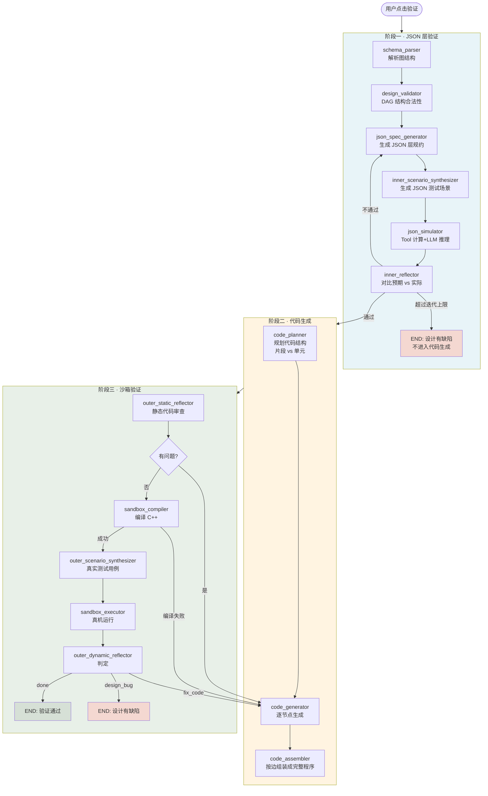
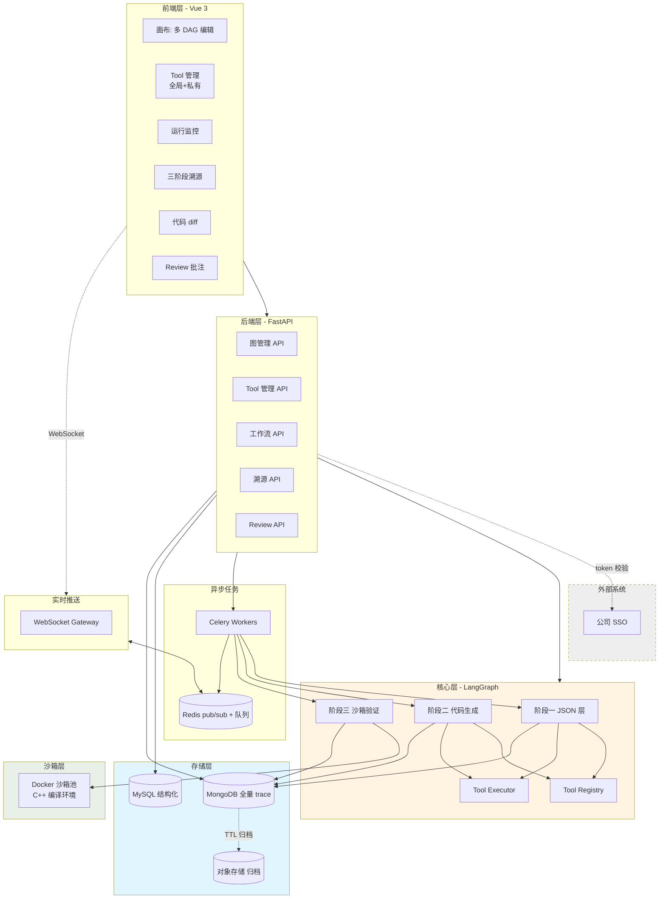
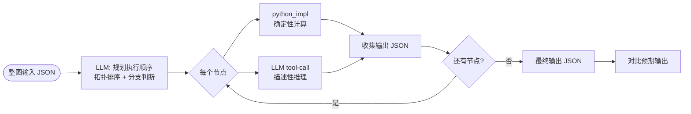
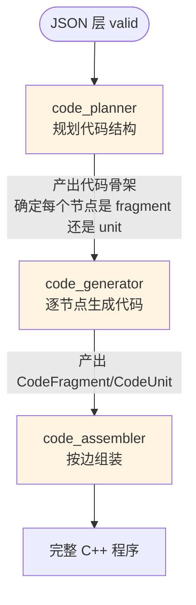
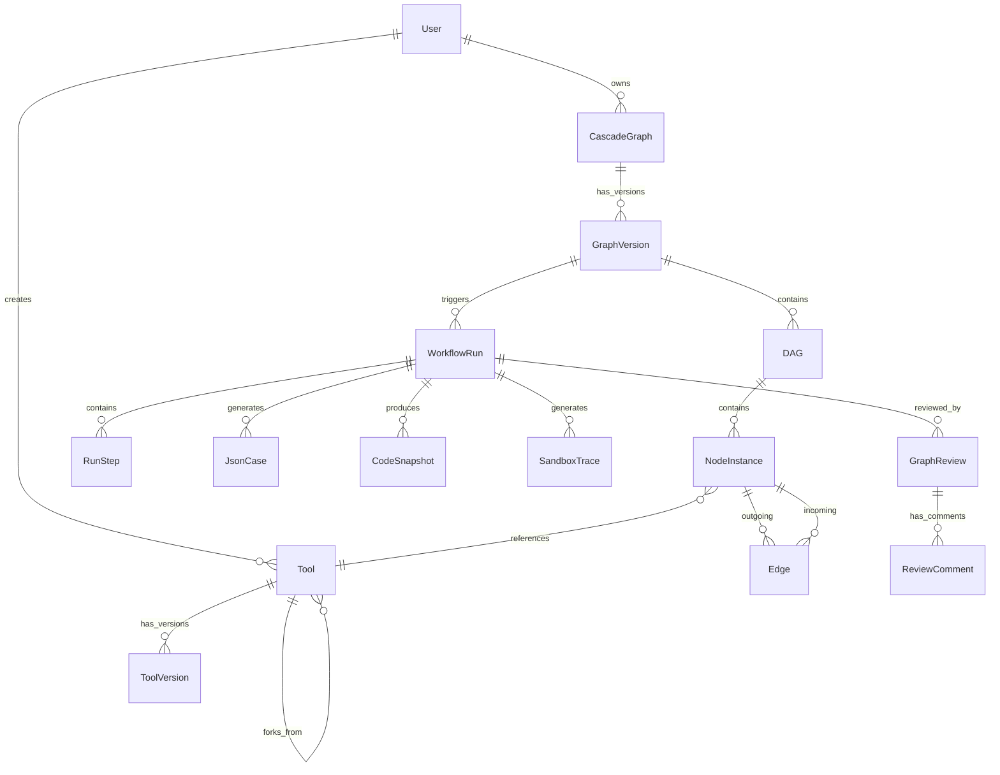
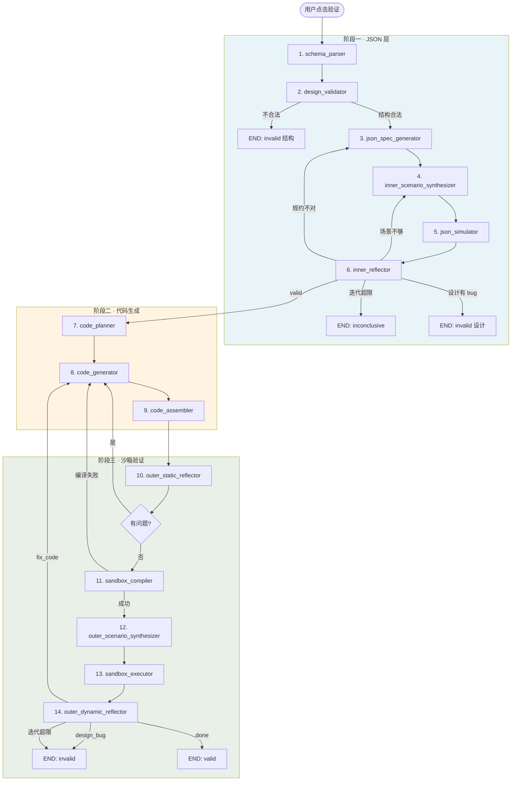
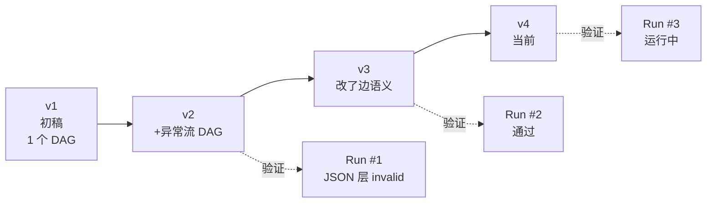
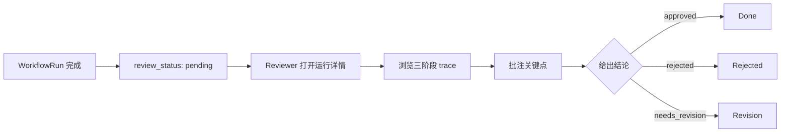
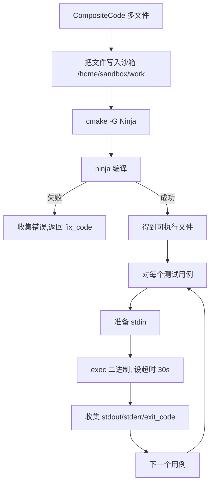

# 级跳设计平台 — 系统设计文档 v5

> **版本**:v5 · 2026-04
> **状态**:Draft,供评审
> **适用范围**:平台 v1 首发版本(单人编辑、公司内部部署)
>
> **v5 主要变化(相对 v4)**:
> 1. 节点抽象升级为 **Tool**:每个节点类型注册一个 Tool,description 就是 prompt,input_schema 就是字段约束
> 2. 正确性判定下沉到 **JSON 层**:先在 JSON 层用 SDD/TDD 保证设计对,再去生成代码
> 3. 图结构升级为 **DAG 森林**:一张级跳图可以有多个 root、多个 DAG 并存
> 4. 边的语义明确:画布侧是"流向",代码侧是"实例 A 的某字段指向实例 B"(对象引用)
> 5. SDD/TDD **分两层**:内层在 JSON(主防线)、外层在沙箱(编译+真实用例,兜底)
> 6. 代码生成粒度明确:小节点 → 片段,大节点 → 小整体,整图 → 完整 C++ 程序

---

## 目录

1. [项目背景与目标](#1-项目背景与目标)
2. [核心概念与术语](#2-核心概念与术语)
3. [总体架构:三阶段流水线](#3-总体架构三阶段流水线)
4. [节点即 Tool:核心抽象](#4-节点即-tool核心抽象)
5. [图结构:DAG 森林](#5-图结构dag-森林)
6. [第一阶段:JSON 层验证](#6-第一阶段json-层验证)
7. [第二阶段:C++ 代码生成](#7-第二阶段c-代码生成)
8. [第三阶段:沙箱编译与真实用例(外层 SDD/TDD)](#8-第三阶段沙箱编译与真实用例外层-sddtdd)
9. [领域模型](#9-领域模型)
10. [LangGraph 工作流设计](#10-langgraph-工作流设计)
11. [Tool 注册、版本与管理](#11-tool-注册版本与管理)
12. [图版本与代码版本管理](#12-图版本与代码版本管理)
13. [人工 Review 与批注](#13-人工-review-与批注)
14. [身份与权限](#14-身份与权限)
15. [API 接口设计](#15-api-接口设计)
16. [执行溯源(全量 Trace)](#16-执行溯源全量-trace)
17. [沙箱与安全执行](#17-沙箱与安全执行)
18. [可观测性与错误处理](#18-可观测性与错误处理)
19. [非功能性需求](#19-非功能性需求)
20. [部署与运维](#20-部署与运维)
21. [配置管理](#21-配置管理)
22. [数据初始化与迁移](#22-数据初始化与迁移)
23. [测试策略](#23-测试策略)
24. [目录结构](#24-目录结构)
25. [关键技术决策](#25-关键技术决策)
26. [实施路线图](#26-实施路线图)
27. [附录](#27-附录)

---

## 1. 项目背景与目标

### 1.1 业务背景

在硬件/协议/流程设计领域,工程师需要设计 D3A"**级跳**"(Cascade/Jump)逻辑 —— 一系列带状态和条件跳转的处理步骤。这些步骤本质上是**由 30+ 种"指令节点"排列组合**出来的 DAG。

传统方式:工程师手工写 C++ 代码实现整张图 → 编译 → 硬件上跑 → 出 bug → 回头改。周期以周计。

### 1.2 平台目标

让工程师 **用可视化方式拖拉拽完成级跳设计** → 平台 **自动用 JSON 验证正确性,再生成 C++ 代码,再跑真实用例** → 回答一个核心问题:**这张级跳图设计得对不对?**

### 1.3 核心洞察(v5 新增)

**"设计对不对"不等于"代码写得好不好"**。

过去的错误假设:"生成代码 → 跑用例" 就能判断设计是否正确。实际上,**代码生成本身引入的噪声**会掩盖设计错误 —— 你不知道是设计有问题还是 AI 写代码写崩了。

v5 的正确做法:把"**设计本身对不对**"和"**代码实现对不对**"**彻底分开**。

- **设计正确性** = 给定输入 JSON,节点/子图按照业务语义应该产出什么输出 JSON。**这一层完全不碰代码**
- **代码正确性** = 生成的 C++ 代码在真实编译环境 + 真实用例下行为正确

第一层通过了,才值得进第二层。第一层都通不过,生成代码毫无意义。

### 1.4 核心价值链(v5)

```
用户拖拉拽 (多 DAG 森林)
  ↓
结构化设计 (D3A JSON)
  ↓
┌──────────── 第一阶段: JSON 层 ────────────┐
│ AI 用 Tool 对节点做 JSON 模拟执行           │
│   · 单节点: 输入 JSON → 输出 JSON 对不对      │
│   · 整图:   输入 JSON → 走完 DAG → 输出对不对 │
│ 内层 SDD (规约反思) + 内层 TDD (场景反思)    │
└────────────────────────────────────────────┘
  ↓ (JSON 层判定 valid 才往下)
┌──────────── 第二阶段: 代码生成 ────────────┐
│ 小节点 → 代码片段                           │
│ 大节点 → function / class                  │
│ 整图   → 组装成完整 C++ 程序                │
│ 边     → 代码里"实例 A.field = 实例 B"      │
└────────────────────────────────────────────┘
  ↓
┌──────────── 第三阶段: 沙箱验证 ────────────┐
│ Docker 沙箱真的编译 C++                     │
│ 跑真实测试用例                               │
│ 外层 SDD (静态反思) + 外层 TDD (动态反思)    │
└────────────────────────────────────────────┘
  ↓
输出: 设计 + 代码双重正确性判定 + 全流程可溯源
  ↓
人工 Review 批注 (最终把关)
```

### 1.5 设计原则

| 原则 | 含义 |
| --- | --- |
| **设计与实现分离** | JSON 层保证"想得对",代码层保证"写得对" |
| **Fail Fast** | JSON 层不通过就不浪费 LLM token 去生成代码 |
| **节点即 Tool** | 每种节点类型 = 一个注册的 Tool,扩展靠加 Tool,不靠改核心 |
| **一切可溯源** | 每次 JSON 模拟、每次代码生成、每次沙箱执行都留痕 |
| **一切可重放** | 给定同一输入 + 工具版本 + 模型版本,结果可复现 |
| **快照优先** | 引用外部可变对象(Tool / 节点定义)必须快照,不能只存 ID |
| **人类兜底** | AI 给判定,人可推翻,最终以 Reviewer 为准 |
| **降级优于崩溃** | JSON 层不收敛 → 告知失败证据,不强行生代码 |

### 1.6 非目标(v1 显式不做)

- 图的协作编辑(多人同时编辑同一张图)
- 图的分享、复制到其他用户
- Tool 的审批流
- 生成 C++ 代码的真实硬件部署
- Tool 的 A/B 实验平台

---

## 2. 核心概念与术语

| 术语 | 英文 | 定义 |
| --- | --- | --- |
| 指令节点(类型) | NodeType / Tool | 30+ 种"级跳指令",每种注册为一个 Tool。Tool.description = 节点 prompt,Tool.input_schema = 字段约束 |
| Tool 版本 | ToolVersion | 每次 Tool 定义变更产生一个不可变版本 |
| 节点实例 | NodeInstance | 用户在图里拖出的一个节点,引用某个 Tool(带版本) |
| DAG | DAG | 一组通过边连接的节点实例,有且仅有若干 root |
| 级跳图 | CascadeGraph | **一组 DAG 的集合(森林)**,每张图属于单个用户 |
| 图版本 | GraphVersion | 图的一次快照(每次保存产生) |
| 边 | Edge | 画布侧是"流向",代码侧是"实例 A 的某字段 = 实例 B"(对象引用) |
| 工作流运行 | WorkflowRun | 一次完整的"验证某张图"的执行,跨三个阶段 |
| 运行步骤 | RunStep | WorkflowRun 中的单个节点执行记录 |
| JSON 测试用例 | JsonCase | (input_json, expected_output_json) 对,用于 JSON 层 TDD |
| JSON 模拟结果 | JsonSimResult | Tool 计算 + LLM 推理产出的一次模拟输出 |
| 代码片段 | CodeFragment | 单个小节点生成的代码片段(几行 C++) |
| 代码单元 | CodeUnit | 单个大节点生成的 function / class |
| 完整代码 | CompositeCode | 整张图组装后产出的完整 C++ 程序 |
| 沙箱执行记录 | SandboxTrace | 一次沙箱内编译 + 执行的完整记录 |
| Review | GraphReview | 对运行结果的人工审阅 + 批注 |
| SDD(内层) | Inner-SDD | JSON 层的规约驱动反思 |
| TDD(内层) | Inner-TDD | JSON 层的场景驱动反思 |
| SDD(外层) | Outer-SDD | 沙箱侧的代码静态反思 |
| TDD(外层) | Outer-TDD | 沙箱侧的代码动态执行反思 |

---

## 3. 总体架构:三阶段流水线

### 3.1 三阶段全景



### 3.2 三阶段职责对照

| 阶段 | 在哪里运行 | 输入 | 产出 | 判定什么 | 不通过的代价 |
| --- | --- | --- | --- | --- | --- |
| **一 · JSON 层** | 后端 Python 进程(Tool 计算)+ LLM(推理) | 图结构 + JSON 测试场景 | JSON 模拟结果 + valid/invalid | **设计意图对不对** | 不进入代码生成,省 LLM 成本 |
| **二 · 代码生成** | 后端进程 + LLM | JSON 层通过的图 | 片段 / 单元 / 完整 C++ 程序 | (不单独判定) | 失败直接进阶段三做反思 |
| **三 · 沙箱验证** | Docker 沙箱 + LLM | 完整 C++ 程序 + 真实用例 | 编译结果 + 执行结果 + valid/invalid | **代码实现对不对** | 触发代码回修,或判定 design_bug |

### 3.3 分层架构



### 3.4 技术栈

| 层 | 技术 | 版本(目标) | 备注 |
| --- | --- | --- | --- |
| 前端 | Vue 3 + TypeScript | 3.4+ | Composition API |
| 前端画布 | VueFlow | 1.x | 支持多 root / DAG 森林布局 |
| 前端状态 | Pinia | 2.x | |
| 前端构建 | Vite | 5.x | |
| 后端 | Python 3.11 + FastAPI | FastAPI 0.110+ | async 优先 |
| ORM | SQLAlchemy 2.0 | async 模式 | |
| 迁移 | Alembic | 1.13+ | |
| 任务 | Celery | 5.x | |
| 实时 | WebSocket + Redis pub/sub | - | |
| 关系库 | MySQL | 8.0 | utf8mb4 |
| 文档库 | MongoDB | 6.0 | trace |
| 缓存/队列 | Redis | 7.x | |
| 沙箱 | Docker + C++ 编译环境(gcc/clang) | 24+ | |
| AI 编排 | LangGraph | 最新稳定 | |
| LLM | Claude / GPT-class | 可配置 | 支持 tool-calling |
| 反向代理 | Nginx | 1.25+ | |
| 部署 | Kubernetes 或 Docker Compose | - | |

---
## 4. 节点即 Tool:核心抽象

### 4.1 设计理念

每个"指令节点"**就是一个 Tool**。不是"节点定义附带一段 prompt",而是**节点定义本身符合 Tool 协议**。

这一个决定带来的好处:

- **prompt 不再是独立数据**:Tool 的 `description` 字段天然承担"告诉 LLM 这个节点是干什么的"
- **字段校验自动化**:Tool 的 `input_schema`(JSON Schema)同时做前端表单渲染和 AI 入参校验
- **LLM 调用统一**:JSON 层的"模拟一个节点执行"就是一次标准 tool-call,LLM 通过 `name` 选 Tool、给 `arguments`、拿 `output`
- **扩展靠加 Tool,不改核心**:新增一种指令 → 注册一个新 Tool 即可,8 节点 LangGraph 流程不动

### 4.2 Tool 的规范结构

```yaml
# 一个 Tool 的完整定义(存在数据库里)
name: IndexTableLookup                    # 唯一标识
category: table_ops                        # 分类(UI 用)
scope: global                              # global / private
version: 3                                 # Tool 自身的版本
display_name: 索引表查询                    # UI 显示用

description: |                             # ← 这就是过去的 "prompt"
  这是一个查表类指令节点。
  语义:根据输入的 key,在一张预定义的索引表里查找匹配项,返回对应 value。

  业务约束:
  - 表大小上限: {{fields.MaxEntryNum}}
  - 键宽度: {{fields.EntrySize}} 字节
  - Mask 为 null 时等价全 1 掩码

  在 JSON 层应该返回:
  - 命中: { "hit": true, "value": <对应值>, "index": <命中位置> }
  - 未命中: { "hit": false, "value": null, "index": null }

  在 C++ 代码层:
  - 生成一个 inline function,不生成 class
  - 使用 std::array 存 entries,命中后立刻 return

input_schema:                              # ← 这就是过去的 field_schema
  type: object
  required: [EntrySize, MaxEntryNum]
  properties:
    EntrySize:
      type: integer
      minimum: 1
      maximum: 64
      description: 键宽度(字节)
    MaxEntryNum:
      type: integer
      minimum: 1
    Mask:
      type: [integer, "null"]
      description: 可选掩码,null 代表全 1

output_schema:                             # ← 新增:JSON 层输出的 schema
  type: object
  required: [hit]
  properties:
    hit: { type: boolean }
    value: { }
    index: { type: [integer, "null"] }

json_simulator:                            # ← 新增:JSON 层怎么算
  engine: hybrid                           # pure_python / llm / hybrid
  python_impl: builtin.index_table_lookup  # hybrid/pure_python 时指向 Python 函数
  llm_fallback: true                       # 表里没预置逻辑时,让 LLM 推理

code_generation_hints:                     # 代码生成提示
  granularity: fragment                    # fragment / unit
  style_hints:
    - 使用 std::array 而不是 std::vector,大小由 MaxEntryNum 决定
    - 命中即 return,不做后续遍历
  forbidden:
    - 不允许使用动态分配
    - 不允许抛异常
  example_fragment: |
    auto lookup = [&](uint32_t key) -> std::optional<Value> {
      for (size_t i = 0; i < {{fields.MaxEntryNum}} && i < entries.size(); ++i) {
        if ((entries[i].key & effective_mask) == (key & effective_mask)) {
          return entries[i].value;
        }
      }
      return std::nullopt;
    };

edge_semantics:                            # ← 新增:出边在代码层怎么映射
  - field: next_on_hit
    description: 命中时流向哪个实例(对应到 C++ 里的实例指针/引用)
  - field: next_on_miss
    description: 未命中时流向哪个实例

metadata:
  status: active                           # draft / active / deprecated
  owner_id: null                           # private 时填写
  forked_from_tool_id: null
  created_by: admin_user_42
  created_at: 2026-04-10T10:00:00Z
```

### 4.3 Tool 的分类(30+)

按业务语义分成几大类(v1 预估):

| 类别 | 示例 Tool | 预估数量 | 代码粒度 |
| --- | --- | --- | --- |
| **查表类** | IndexTableLookup, HashTableLookup, LongestPrefixMatch | ~5 | fragment |
| **位运算类** | BitMaskFilter, BitFieldExtract, BitFieldInsert | ~4 | fragment |
| **状态类** | StateTransition, StateMachine, StateGuard | ~3 | unit(class) |
| **路由/判定类** | Router, ConditionalBranch, PolicyMatcher | ~4 | unit(function) |
| **数据处理类** | PacketParser, FieldModifier, Checksum | ~5 | unit |
| **统计/计数类** | Counter, RateLimiter, Histogram | ~3 | unit(class) |
| **IO/接口类** | InputGate, OutputGate, ExternalCall | ~3 | unit |
| **组合类**(含子图) | SubGraphRef, Loop, Parallel | ~3 | unit |
| **其他专用** | (按业务扩展) | ~5 | 视情况 |

新增一个 Tool = 写一份 YAML 定义 + 可选的 Python 模拟逻辑 + 可选的 C++ 片段样板。**不需要改 LangGraph 8 节点主流程**。

### 4.4 Tool 的两种 scope

和 v4 一致的 global / private 机制,但这次主体是 Tool:

| | global(全局 Tool) | private(私有 Tool) |
| --- | --- | --- |
| 谁创建 | 管理员 | 任何用户 |
| 谁可见 | 所有用户 | 仅所有者(+ admin 审计) |
| 典型用途 | 官方 30+ 指令 | 用户实验、临时定制 |
| Fork | 用户可 Fork 全局到私有 | 私有可 clone 为新私有 |

### 4.5 Tool 在运行时的三种用法

同一个 Tool 在不同阶段扮演不同角色:

| 阶段 | 怎么用 Tool | Tool 的什么字段被消费 |
| --- | --- | --- |
| **图编辑时** | 前端从 Tool Registry 拉列表渲染到节点库 | `name, display_name, input_schema` |
| **JSON 层验证** | LangGraph 节点把 Tool 注册到 LLM,LLM 用 tool-call 调用;或直接调 `json_simulator.python_impl` | `description, input_schema, output_schema, json_simulator` |
| **代码生成** | LangGraph 节点把 Tool 的 `description + code_generation_hints + example_fragment` 喂给 LLM 作为生成指导 | `description, code_generation_hints, edge_semantics` |

### 4.6 Tool 版本化

每次 Tool 定义变更 → 产生一个不可变 `ToolVersion` 快照。

- `tool.version` 字段指向"当前激活版本"
- `tool_version` 表保存所有历史版本的完整定义
- 图里的 `NodeInstance` **快照引用** Tool 定义(连同版本号),保证老图不受 Tool 升级影响
- Review 时可查"这次运行用的是 Tool 的哪一版"

详见 [§11 Tool 注册、版本与管理](#11-tool-注册版本与管理)。

---

## 5. 图结构:DAG 森林

### 5.1 从单 DAG 到森林

v4 默认一张级跳图 = 一个 DAG(单起点,单或多终点)。

**v5 承认现实**:业务里一张完整的级跳图**可能是多个独立 DAG 的并列**。

```
CascadeGraph (用户视角的"一张图")
├── DAG 1  (root: InputGate_A)
│   └── ... 若干节点 ...
├── DAG 2  (root: InputGate_B)
│   └── ... 若干节点 ...
└── DAG 3  (root: Trigger_C)
    └── ... 若干节点 ...
```

这些 DAG 之间**在画布上并列、不互相连接**,但在语义上它们属于同一"任务包"(比如"完整的报文处理流水线"可能有"入向流 / 出向流 / 异常流"三个 DAG)。

### 5.2 DAG 的定义

对平台而言,一个 DAG 必须满足:

1. **无环**:运行时校验,检测到环直接返回 `invalid design`
2. **有至少一个 root**:root 定义为"入度为 0 的节点"
3. **可达**:所有节点都应从某个 root 可达;孤立节点 UI 给出警告
4. **单一 DAG 内的连通性**:同一 DAG 内所有节点通过无向边连通

### 5.3 边的双重语义

这是 v5 的关键设计。**同一条边在不同层有不同含义**:

```
┌─────────────────┬────────────────────┬────────────────────────┐
│   画布层(UI)    │    逻辑层(JSON)    │       代码层(C++)      │
├─────────────────┼────────────────────┼────────────────────────┤
│ A ────▶ B       │ A 的输出 JSON       │ A 实例的某个字段       │
│ "流向"          │ 作为 B 的输入        │ 指向 B 的实例          │
│                 │ (数据流语义)        │ (对象引用语义)         │
└─────────────────┴────────────────────┴────────────────────────┘
```

**具体落到代码里**,以 IndexTableLookup 为例:

```cpp
class IndexTableLookup {
public:
  // 边的代码侧语义:两个出边分别映射为两个字段
  Node* next_on_hit;   // ← 画布上这个节点命中分支连到哪个节点
  Node* next_on_miss;  // ← 画布上未命中分支连到哪个节点

  void execute(Packet& p) {
    auto result = lookup(p.key);
    if (result.has_value()) {
      p.value = *result;
      if (next_on_hit) next_on_hit->execute(p);
    } else {
      if (next_on_miss) next_on_miss->execute(p);
    }
  }
};
```

Tool 定义里的 `edge_semantics` 字段告诉代码生成器"**每个出边对应实例上的哪个字段**"。没有这个映射,代码生成器没法把画布上的边翻译成 C++ 里的指针。

### 5.4 图的 JSON 表达

```json
{
  "graph_version_id": "v_xxx",
  "version_number": 3,
  "dags": [
    {
      "dag_id": "dag_1",
      "name": "入向处理流",
      "roots": ["n_001"],
      "nodes": [
        {
          "instance_id": "n_001",
          "tool_id": 42,
          "tool_version": 3,
          "tool_snapshot": { /* 完整快照 */ },
          "instance_name": "解析报文",
          "field_values": { "Protocol": "IPv4" },
          "position": { "x": 100, "y": 80 }
        },
        { "instance_id": "n_002", "tool_id": 7, "...": "..." }
      ],
      "edges": [
        {
          "edge_id": "e_1",
          "from": "n_001",
          "from_port": "parsed",
          "to": "n_002",
          "to_port": "in",
          "edge_semantic": "next_on_success"
        }
      ]
    },
    {
      "dag_id": "dag_2",
      "name": "异常流",
      "roots": ["n_101"],
      "nodes": [ /* ... */ ],
      "edges": [ /* ... */ ]
    }
  ]
}
```

**关键字段**:

- `dags[]`:森林中的多个 DAG
- `roots[]`:一个 DAG 可能有多个 root(少见但允许)
- `edges[].edge_semantic`:必须取值于源节点 Tool 的 `edge_semantics` 字段定义的名字之一,否则校验失败

### 5.5 画布层的视觉组织

前端 UI 需要:

- 每个 DAG 有独立的视觉"泳道"或显式边界框
- 支持"新建 DAG" 操作(画布右键菜单)
- 跨 DAG 不允许连线(拖线时检测 `from` 和 `to` 不在同一 DAG,拒绝)
- 每个 DAG 可独立命名、折叠/展开
- root 节点有明显视觉标识(三角标)

---

## 6. 第一阶段:JSON 层验证

### 6.1 为什么要有 JSON 层

**问题**:如果直接从"图"跳到"C++ 代码",出问题时分不清是设计错了还是 AI 代码写崩了。

**解法**:在不触碰代码的情况下,**用 JSON 形式模拟一次执行**,就能回答"设计意图对不对"。

**前提**:每个 Tool 都规定了清晰的输入 JSON schema 和输出 JSON schema。Tool 定义本身就已经把"节点收到 X 应该返回 Y"讲清楚了。剩下的事:验证这个"X → Y"的映射是否符合业务预期。

### 6.2 JSON 层的两个验证粒度

**单节点粒度**:

```
输入 JSON → [单个 Tool 实例] → 输出 JSON
           对比预期输出 → pass / fail
```

用途:Tool 本身的正确性(开发 Tool 时的单元测试)、节点实例字段填错时快速发现。

**整图粒度**:

```
输入 JSON → [DAG root] → 节点 A → 节点 B → ... → 最终输出 JSON
                                                对比预期 → pass / fail
```

用途:回答"这张图设计对不对"。这是平台的核心价值。

### 6.3 JSON 层执行引擎(hybrid 模式)

**核心策略**:Tool 层做确定性计算,LLM 层做推理和规划。



### 6.4 每个 Tool 的三档执行能力

Tool 定义里的 `json_simulator.engine` 决定这个 Tool 的 JSON 层怎么算:

| 档位 | 适用场景 | 实现方式 |
| --- | --- | --- |
| `pure_python` | 纯算法,语义确定(查表、位运算、哈希) | 后端写 Python 函数,输入 JSON 调用,直接产出输出 JSON,**不经过 LLM** |
| `llm` | 语义模糊,无法穷举(复杂状态机、包含领域知识的判定) | 把 Tool 的 description 和输入 JSON 喂给 LLM,LLM 推理输出 JSON |
| `hybrid` | 主体确定但有配置分支 | 先尝试 python_impl,无法处理的情况走 LLM fallback |

**30+ Tool 里大多数**(查表、位运算、状态转换等)应该是 `pure_python` —— 又快又稳又便宜。少数复杂的(含启发式判断的 Router、业务专用 PolicyMatcher)走 `llm` 或 `hybrid`。

### 6.5 Python 模拟器约定

```python
# backend/app/tool_runtime/simulators/index_table_lookup.py

from app.tool_runtime.base import ToolSimulator, SimContext, SimResult

class IndexTableLookupSim(ToolSimulator):
    tool_name = "IndexTableLookup"

    def run(self, fields: dict, input_json: dict, ctx: SimContext) -> SimResult:
        """
        fields: 节点实例的字段值 (EntrySize / MaxEntryNum / Mask)
        input_json: 上游节点传入的 JSON (比如 { "key": 12345 })
        ctx: 运行时上下文(可读测试数据、表数据等)
        """
        entries = ctx.get_table("entries") or []
        mask = fields.get("Mask")
        eff_mask = mask if mask is not None else ~0

        key = input_json["key"]
        for i, entry in enumerate(entries[:fields["MaxEntryNum"]]):
            if (entry["key"] & eff_mask) == (key & eff_mask):
                return SimResult(output={"hit": True, "value": entry["value"], "index": i})
        return SimResult(output={"hit": False, "value": None, "index": None})
```

**约定**:

- 模拟器只做纯计算,不读数据库、不发网络
- 所有外部输入(表数据、初始状态)通过 `ctx` 注入
- 抛异常视为"节点报错",由 json_simulator LangGraph 节点捕获并记录

### 6.6 LLM 模拟 Tool 的做法

当某个 Tool 的 `engine = llm` 时,LangGraph 节点执行这样的流程:

1. 把 Tool 的 `description`(渲染后)作为 system prompt
2. 把 Tool 的 `input_schema` 和 `output_schema` 告诉 LLM
3. 把当前节点实例的 `field_values` 和上游传来的 `input_json` 作为用户消息
4. LLM 产出 `output_json`,校验是否符合 `output_schema`;不符合返回错误
5. 记录完整 trace(prompt + thinking + response)

### 6.7 第一阶段 LangGraph 节点清单

| # | 节点 | 职责 | 使用的 LLM? |
| --- | --- | --- | --- |
| 1 | `schema_parser` | 解析图(JSON)成内存结构 | 否 |
| 2 | `design_validator` | 检查 DAG 合法性(无环、roots 存在、节点类型合法、字段值符合 Tool input_schema) | 否 |
| 3 | `json_spec_generator` | **LLM**:根据图结构 + 所有 Tool 的 description,生成"整图应该做什么"的 JSON 层规约 | 是 |
| 4 | `inner_scenario_synthesizer` | **LLM**:根据规约生成 (输入 JSON, 预期输出 JSON) 测试场景若干条 | 是 |
| 5 | `json_simulator` | 对每个场景,按拓扑顺序逐节点调用 Tool 的 `json_simulator` 产出实际输出 | 混合(按 Tool 决定) |
| 6 | `inner_reflector` | **LLM**:对比预期 vs 实际,判断差异是"设计错了"还是"场景设错了"还是"模拟器 bug",决定反思方向 | 是 |

### 6.8 内层 SDD/TDD

**内层 SDD(规约驱动反思)**:

- `json_spec_generator` 写完规约后,`inner_reflector` 先静态看一遍规约(用 LLM),找出"这个规约和图结构对不上的地方"
- 不通过 → 回到 `json_spec_generator` 重写,最多 3 次

**内层 TDD(场景驱动反思)**:

- `inner_scenario_synthesizer` 生成场景 → `json_simulator` 执行 → `inner_reflector` 对比
- 发现差异 → 按原因分派:
  - 设计错 → **直接判 design_bug,终止**(这是 v5 的关键!不再继续生成代码浪费 token)
  - 场景错 → 让 `inner_scenario_synthesizer` 再生成
  - 模拟器 bug → 记录,但不影响判定(通知开发者)
- 最多 5 次迭代

### 6.9 第一阶段的输出

```json
{
  "phase": "json_validation",
  "verdict": "valid" | "invalid" | "inconclusive",
  "covered_scenarios": 7,
  "passed_scenarios": 7,
  "failed_scenarios": [],
  "spec": { /* 生成的 JSON 层规约 */ },
  "recommendations": [
    "建议在 dag_1 增加空包处理分支"
  ]
}
```

只有 `verdict = valid` 才进入第二阶段。

---
## 7. 第二阶段:C++ 代码生成

### 7.1 生成的粒度:片段 vs 单元

每个 Tool 在定义里声明 `code_generation_hints.granularity`:

| 粒度 | 含义 | 示例 | 在最终代码里的形态 |
| --- | --- | --- | --- |
| `fragment` | 代码片段,几行 C++ | 位运算、简单查表 | **被内联**到上游调用者的函数体 |
| `unit` | 独立的 function 或 class | 状态机、完整包解析 | **独立的** function/class 定义 |

**为什么这样分**:硬件代码最在乎性能。把小节点内联能省函数调用开销;大节点独立有清晰边界方便 review。Tool 定义时就把这个决策做掉,代码生成器不用猜。

### 7.2 代码生成流程



**三个 LangGraph 节点**:

1. **`code_planner`**:规划整体代码结构。输出"项目骨架"——有哪些文件、每个节点生成到哪个函数里、unit 节点的类名怎么起。
2. **`code_generator`**:按拓扑顺序对每个节点生成代码。每个节点:
   - 读 Tool 的 `description` + `code_generation_hints` + `example_fragment`
   - 读节点实例的 `field_values`
   - 读上游节点的输出类型、下游节点的入参类型
   - 输出对应的 CodeFragment 或 CodeUnit
3. **`code_assembler`**:按 DAG 结构组装:
   - 按 `edge_semantics` 把边翻译成实例字段赋值(`instanceA.next_on_hit = &instanceB`)
   - fragment 内联到调用链里
   - unit 独立声明,实例化时关联起来
   - 生成 main / 入口函数

### 7.3 代码组装:边如何翻译成代码

这是 v5 新增的关键细节。

以一张 DAG 为例:

```
 [PacketParser] ─parsed──▶ [IndexTableLookup] ─hit──▶ [StateTransition]
                                              └─miss─▶ [Drop]
```

Tool 定义里 `IndexTableLookup.edge_semantics`:

```yaml
edge_semantics:
  - field: next_on_hit
  - field: next_on_miss
```

`code_assembler` 生成:

```cpp
// 声明(unit 节点独立)
PacketParser     parser;
IndexTableLookup lookup;
StateTransition  state_advance;
DropHandler      drop;

// 组装:边 → 实例字段赋值
parser.next = &lookup;
lookup.next_on_hit  = &state_advance;
lookup.next_on_miss = &drop;

// 入口
int main(int argc, char** argv) {
  Packet p = read_input();
  parser.execute(p);
  return 0;
}
```

**如果某个节点是 fragment**:它的代码直接内联到上游的 `execute` 里,**不产生独立实例**。边在这种情况下退化为"代码片段的控制流"。

### 7.4 代码生成不独立做反思

**关键设计选择**:第二阶段 **没有** "SDD/TDD 反思"。

为什么?因为反思的职责已经被拆到前后两层:

- JSON 层(阶段一)保证**设计**对
- 沙箱层(阶段三)保证**代码实现**对

阶段二如果生成的代码有问题,由阶段三的编译/静态检查/动态执行揭露出来,**触发重回 code_generator**(而不是在阶段二内部循环)。这样避免反思循环嵌套过深。

### 7.5 代码产物

一次 WorkflowRun 的阶段二产出:

```
output/
├── include/
│   ├── cascade_nodes.hpp          # 所有 unit 节点的声明
│   └── cascade_types.hpp           # 公共类型
├── src/
│   ├── cascade_nodes.cpp           # unit 节点实现
│   └── main.cpp                    # 入口 + 实例化 + 边组装
├── CMakeLists.txt
└── metadata.json                   # 节点→代码位置的映射(给 trace 用)
```

**metadata.json** 示例:

```json
{
  "graph_version_id": "v_xxx",
  "run_id": "r_xxx",
  "node_to_code": [
    {
      "instance_id": "n_001",
      "tool_name": "PacketParser",
      "granularity": "unit",
      "location": "src/cascade_nodes.cpp:45-120",
      "entity": "class PacketParser"
    },
    {
      "instance_id": "n_002",
      "tool_name": "BitMaskFilter",
      "granularity": "fragment",
      "location": "src/cascade_nodes.cpp:88-91 (inlined in PacketParser::execute)",
      "entity": "(inlined)"
    }
  ]
}
```

Review 时点任意一个节点,UI 能直接跳到代码里对应位置。

---

## 8. 第三阶段:沙箱编译与真实用例(外层 SDD/TDD)

### 8.1 职责

第一阶段已经保证了**设计对**,第二阶段产出了**完整 C++ 代码**。第三阶段的职责是确认**代码实现对**:

- 代码能否编译通过
- 代码在真实用例上的行为是否符合预期
- 代码有没有明显的静态问题(未定义行为、资源泄漏、边界问题)

### 8.2 沙箱环境

- Docker 镜像预装 gcc/clang、CMake、常用静态检查工具(clang-tidy、cppcheck)
- 镜像 digest 在配置中固定,保证可重放
- 资源限制、网络隔离等见 [§17 沙箱与安全执行](#17-沙箱与安全执行)

### 8.3 第三阶段 LangGraph 节点

| # | 节点 | 职责 |
| --- | --- | --- |
| 1 | `outer_static_reflector` | 编译前静态检查:clang-tidy + 人工规则(不允许的头文件、可疑指针用法等),LLM 辅助解读 warning |
| 2 | `sandbox_compiler` | 在沙箱里真实编译,收集编译器输出 |
| 3 | `outer_scenario_synthesizer` | **LLM**:基于 JSON 层通过的场景,转换/扩展成真实用例(binary 输入) |
| 4 | `sandbox_executor` | 在沙箱里跑编译产物 + 用例,收集实际输出 |
| 5 | `outer_dynamic_reflector` | **LLM**:对比实际输出 vs 预期,判定 done / fix_code / design_bug |

### 8.4 第三阶段的三种结局

| 结局 | 触发条件 | 后续动作 |
| --- | --- | --- |
| `done` | 所有用例通过 | run 结束,`final_verdict = valid` |
| `fix_code` | 有编译错 或 某些用例失败但原因可归因为代码问题 | 回 `code_generator`,最多 N 次 |
| `design_bug` | 失败模式显示是设计本身问题(JSON 层没覆盖到的)| 结束;`final_verdict = design_bug`,附上证据 |

### 8.5 外层反思的特殊情形

**编译失败**:最直接的代码层 bug。外层 SDD 静态检查出的问题也算。统一进"代码回修"分支。

**用例失败但原因模糊**:outer_dynamic_reflector 需要判断是"编码实现错"还是"JSON 层没捕捉到的设计漏洞"。v1 保守做法:不确定时倾向标 `fix_code`(给代码生成多一次机会),若依然失败才升级为 `design_bug`。

**全部通过**:`done`。

### 8.6 第三阶段的产出

```json
{
  "phase": "sandbox_validation",
  "compile_result": "success",
  "static_issues": [],
  "test_cases": [
    {"name": "路由命中 - 常规", "verdict": "pass", "duration_ms": 12},
    {"name": "路由未命中 - 默认丢弃", "verdict": "pass", "duration_ms": 8},
    {"name": "边界 - 空输入", "verdict": "fail", "expected": "...", "actual": "..."}
  ],
  "final_verdict": "fix_code" | "done" | "design_bug"
}
```

### 8.7 全局迭代上限

```python
INNER_SDD_MAX   = 3    # JSON 层规约反思
INNER_TDD_MAX   = 5    # JSON 层场景反思
OUTER_FIX_MAX   = 3    # 沙箱触发的代码回修
GLOBAL_TIMEOUT  = 900  # 整个 run 的全局超时(秒)
```

---

## 9. 领域模型

### 9.1 核心实体关系



### 9.2 Tool 相关实体

**Tool(指令节点类型)**

```
- id, name (唯一), display_name
- category
- scope: "global" | "private"
- owner_id (scope=private 时必填)
- forked_from_tool_id (可空)
- current_version_id (指向 tool_version 表)
- status: draft / active / deprecated
- created_by, created_at, updated_at
```

**ToolVersion(Tool 版本快照)**

```
- id, tool_id, version_number (自增)
- definition: JSON
    {
      description,
      input_schema,
      output_schema,
      json_simulator: {engine, python_impl, llm_fallback},
      code_generation_hints,
      edge_semantics,
      metadata
    }
- change_note: 本次修改说明
- definition_hash: sha256
- created_by, created_at
```

### 9.3 图相关实体

**CascadeGraph**

```
- id, name, description
- owner_id
- latest_version_id
- status: draft / validating / validated / failed
- created_at, updated_at
```

**GraphVersion** — 每次保存一个版本,内容是**森林**

```
- id, graph_id, version_number
- snapshot: JSON { dags: [...] }   ← v5 结构:森林
- commit_message
- parent_version_id
- created_by, created_at
```

**DAG** — 森林中的单个 DAG(逻辑上属于 GraphVersion,物理上可以反范式化进 snapshot)

```
- dag_id (在 snapshot 里的局部 id)
- name
- roots: [instance_id,...]
```

**NodeInstance**

```
- instance_id
- tool_id
- tool_version         ← 记录当时用的是 Tool 的哪一版
- tool_snapshot: JSON  ← 整份 Tool 定义快照(防升级污染)
- instance_name
- field_values: JSON
- position: {x, y}
```

**Edge**

```
- edge_id
- from (instance_id), from_port
- to (instance_id), to_port
- edge_semantic        ← 映射到源 Tool.edge_semantics 里的字段名
```

### 9.4 运行相关实体

**WorkflowRun**

```
- id, graph_version_id
- status: pending / running / success / failed / cancelled
- started_at, finished_at
- triggered_by
- phase1_verdict: null / valid / invalid / inconclusive
- phase2_status:  null / success / failed
- phase3_verdict: null / done / design_bug / fix_exhausted
- final_verdict:  null / valid / invalid
- summary: JSON
- review_status: none / pending / approved / rejected
- error_code, error_message
```

**RunStep**

```
- id, run_id
- phase: 1 / 2 / 3
- node_name (schema_parser / json_simulator / code_generator / ...)
- iteration_index
- status: success / failed / skipped
- mongo_ref: ObjectId
- duration_ms, started_at
- summary
```

**JsonCase(JSON 层测试用例)**

```
- id, run_id
- phase: "inner"  (区别于沙箱侧的 outer 用例,在另一张表)
- scenario_name
- input_json: JSON
- expected_output_json: JSON
- actual_output_json: JSON (执行后填)
- verdict: pass / fail / error
- reason: text (fail 时)
- created_by_step_id
```

**SandboxCase(沙箱侧测试用例)**

```
- id, run_id
- scenario_name
- input_bytes: BLOB (或 JSON 描述怎么生成)
- expected: JSON
- actual: JSON
- verdict
- duration_ms
```

**CodeSnapshot**(每次 code_generator 迭代产出)

```
- id, run_id, iteration
- source: "initial" | "fixed_after_static" | "fixed_after_dynamic"
- files: JSON (多文件: path → content 列表)
- overall_hash
- issues_fixed
- created_at
```

**SandboxTrace**(沙箱内单次执行的完整记录)

```
- id, run_id
- kind: "compile" | "test_run"
- stdin, stdout, stderr
- exit_code
- duration_ms
- meta: JSON
```

**GraphReview / ReviewComment** — 与 v4 一致。

### 9.5 MongoDB trace

MySQL 只存摘要;MongoDB 存全量:

```javascript
// run_step_details
{
  _id: ObjectId,
  run_id, step_id,
  phase: 1,
  node_name: "json_simulator",
  iteration: 0,

  input_state: {...},
  tool_calls: [                       // ← v5: 重点,Tool 调用全留痕
    {
      tool_name: "IndexTableLookup",
      tool_version_id: 128,
      engine: "pure_python",
      instance_id: "n_002",
      field_values: {...},
      input_json: {...},
      output_json: {...},
      duration_ms: 3,
      error: null
    }
  ],
  llm_calls: [                        // ← LLM 推理环节
    {
      model: "claude-sonnet-4-6",
      system_prompt: "...",           // tool desc 渲染后
      user_prompt: "...",
      thinking: "...",
      response: "...",
      tokens: {input, output, thinking},
      duration_ms: ...
    }
  ],
  output_state: {...},
  decision, decision_reason
}
```

### 9.6 关键索引

| 表 | 索引 | 用途 |
| --- | --- | --- |
| `tool` | `(scope, status)`、`(owner_id, scope)`、UNIQUE `(name, scope, owner_id)` | 列表页 + 防重名 |
| `tool_version` | `(tool_id, version_number DESC)` | 版本历史 |
| `cascade_graph` | `(owner_id, updated_at DESC)` | 我的图 |
| `graph_version` | `(graph_id, version_number DESC)` | 版本历史 |
| `workflow_run` | `(graph_version_id, started_at DESC)`、`(triggered_by, started_at DESC)`、`(status)` | 运行列表 |
| `run_step` | `(run_id, phase, started_at)` | 按阶段时间线 |
| `json_case` | `(run_id, verdict)` | 失败用例列表 |
| `sandbox_case` | `(run_id, verdict)` | 同上 |
| `code_snapshot` | `(run_id, iteration)` | diff 列表 |

MongoDB:

| 集合 | 索引 |
| --- | --- |
| `run_step_details` | `{run_id:1, step_id:1}` unique;`{created_at:1}` TTL=90d |
| `sandbox_traces` | `{run_id:1}`;TTL=90d |

---

## 10. LangGraph 工作流设计

### 10.1 总览(三阶段合计 ~14 节点)



### 10.2 节点契约速查

| # | 阶段 | 节点 | 输入(state 里关键字段) | 输出 | 是否调 LLM |
| --- | --- | --- | --- | --- | --- |
| 1 | 1 | schema_parser | raw_graph_json | parsed_forest | 否 |
| 2 | 1 | design_validator | parsed_forest | validation_errors | 否 |
| 3 | 1 | json_spec_generator | parsed_forest + 所有 Tool 定义 | json_spec | 是 |
| 4 | 1 | inner_scenario_synthesizer | json_spec | json_cases (若干) | 是 |
| 5 | 1 | json_simulator | json_cases + parsed_forest | json_sim_results | Tool 决定 |
| 6 | 1 | inner_reflector | json_cases + 实际结果 | decision | 是 |
| 7 | 2 | code_planner | parsed_forest(已通过 JSON 层) | code_skeleton | 是 |
| 8 | 2 | code_generator | code_skeleton + Tool 定义 | code_units / fragments | 是 |
| 9 | 2 | code_assembler | 单元代码 + 边 | composite_code (多文件) | 否 |
| 10 | 3 | outer_static_reflector | composite_code | static_issues | 是(解读) |
| 11 | 3 | sandbox_compiler | composite_code | compile_result | 否(调 Docker) |
| 12 | 3 | outer_scenario_synthesizer | json_spec + composite_code | sandbox_cases | 是 |
| 13 | 3 | sandbox_executor | binary + sandbox_cases | execution_results | 否(调 Docker) |
| 14 | 3 | outer_dynamic_reflector | execution_results | decision | 是 |

### 10.3 State 定义

```python
from typing import TypedDict, Literal, Optional

class CascadeState(TypedDict):
    # 元信息
    run_id: str
    graph_version_id: str

    # 阶段一
    raw_graph_json: dict
    parsed_forest: Optional[dict]        # { dags: [...] }
    validation_errors: list[dict]
    json_spec: Optional[dict]
    json_cases: list[dict]               # [{input_json, expected_output_json}]
    json_sim_results: list[dict]         # [{case_id, actual_output, verdict}]
    inner_sdd_iter: int
    inner_tdd_iter: int
    phase1_verdict: Optional[Literal["valid", "invalid", "inconclusive"]]

    # 阶段二
    code_skeleton: Optional[dict]
    code_units: list[dict]               # 每个节点生成的代码单元
    composite_code: Optional[dict]       # {files: {path: content}}
    code_snapshots: list[str]            # CodeSnapshot id 列表

    # 阶段三
    static_issues: list[dict]
    compile_result: Optional[dict]
    sandbox_cases: list[dict]
    execution_results: list[dict]
    outer_fix_iter: int
    phase3_verdict: Optional[Literal["done", "design_bug", "fix_exhausted"]]

    # 收敛控制
    decision: Literal["fix_spec", "add_scenario", "fix_code", "design_bug", "done", "in_progress"]
    final_verdict: Optional[Literal["valid", "invalid", "inconclusive"]]

    # 溯源
    messages: list
    step_history: list[str]
```

### 10.4 路由函数(核心片段)

```python
INNER_SDD_MAX = 3
INNER_TDD_MAX = 5
OUTER_FIX_MAX = 3

def route_after_inner_reflector(state) -> str:
    d = state["decision"]
    if d == "design_bug":
        state["final_verdict"] = "invalid"
        return END
    if d == "fix_spec":
        if state["inner_sdd_iter"] >= INNER_SDD_MAX:
            state["final_verdict"] = "inconclusive"
            return END
        return "json_spec_generator"
    if d == "add_scenario":
        if state["inner_tdd_iter"] >= INNER_TDD_MAX:
            # TDD 没收敛,但没明确判定 bug,保守给 inconclusive
            state["final_verdict"] = "inconclusive"
            return END
        return "inner_scenario_synthesizer"
    if d == "done":
        state["phase1_verdict"] = "valid"
        return "code_planner"   # 进入阶段二
    return END

def route_after_outer_dynamic_reflector(state) -> str:
    d = state["decision"]
    if d == "done":
        state["final_verdict"] = "valid"
        return END
    if d == "fix_code":
        if state["outer_fix_iter"] >= OUTER_FIX_MAX:
            state["final_verdict"] = "inconclusive"
            return END
        return "code_generator"
    if d == "design_bug":
        # 阶段三反向发现设计问题,终止
        state["final_verdict"] = "invalid"
        return END
    return END
```

### 10.5 节点执行通用模式(伪代码)

```python
async def generic_node(state, node_name, phase):
    step_id = uuid()
    started = now()

    try:
        # 1. 执行节点核心逻辑
        result = await do_node_logic(state)

        # 2. 写 MongoDB 全量 trace
        mongo_ref = await mongo_trace.write({
            "run_id": state["run_id"],
            "step_id": step_id,
            "phase": phase,
            "node_name": node_name,
            "input_state": sanitize(state),
            "tool_calls": result.tool_calls,       # ← v5 新增
            "llm_calls": result.llm_calls,
            "output_state": sanitize(result.new_state),
        })

        # 3. 写 MySQL 摘要
        await run_step_repo.create(
            id=step_id, run_id=state["run_id"], phase=phase,
            node_name=node_name, status="success",
            mongo_ref=mongo_ref, duration_ms=now()-started,
            summary=result.summary,
        )

        # 4. pub/sub 推 WebSocket
        await redis.publish(f"run:{state['run_id']}:events", {
            "type": "step_completed",
            "step_id": step_id,
            "phase": phase,
            "node_name": node_name,
        })

        return result.new_state

    except Exception as e:
        logger.exception(f"{node_name} failed")
        await run_step_repo.create(..., status="failed", error=str(e))
        raise
```

### 10.6 异常与降级

| 场景 | 行为 |
| --- | --- |
| Tool 的 python_impl 抛异常 | 对应 JsonCase 标 `error`,进入 inner_reflector 决策 |
| LLM 调用失败(网络) | 指数退避重试 3 次;全失败 → 当前 step failed,run failed |
| LLM 返回不符合 output_schema | 再给 1 次机会;仍失败 → 标 `error` |
| 沙箱起不来 | 重试 2 次换容器;仍失败 → `SANDBOX_UNAVAILABLE` |
| 沙箱编译超时 | 视为编译失败,进"代码回修" |
| 沙箱执行超时 | 对应用例标 fail,带 `timeout=true` 标记 |
| JSON 层 inner_reflector 判 design_bug | **终止整个 run,不进入阶段二**,这是平台关键信号 |
| 全局超时 | Celery 硬超时 kill,run 状态 failed |

---
## 11. Tool 注册、版本与管理

### 11.1 Tool Registry

启动时加载,运行时缓存。单例服务。

```python
class ToolRegistry:
    """启动后加载所有 active 的 Tool 定义,提供 LLM / LangGraph 使用"""

    def get(self, name: str, version: Optional[int] = None) -> ToolVersion:
        """按 name 取 Tool;version 为空取当前激活版本"""

    def for_llm(self, names: list[str]) -> list[dict]:
        """转成 Anthropic/OpenAI tool-call 协议的格式列表"""

    def get_simulator(self, name: str) -> ToolSimulator:
        """取该 Tool 注册的 Python 模拟器(engine=pure_python 或 hybrid)"""

    def reload(self, tool_id: Optional[int] = None):
        """热重载:单个 Tool 或全量。失效本地缓存 + Redis pub/sub 通知其他进程"""
```

### 11.2 Tool 定义的两种来源

| 来源 | 说明 | 适用 |
| --- | --- | --- |
| **代码仓库种子** | 放在 `backend/tools/seed/*.yaml`,首次启动导入数据库 | v1 的 30+ 全局 Tool |
| **UI 创建** | 管理员/用户在前端新建 | 后续增加 Tool 的常规方式 |

两者结构完全一样(YAML)。种子走 Git 做 Code Review,UI 创建立即生效。

### 11.3 Python 模拟器的注册

```python
# backend/app/tool_runtime/registry.py
SIMULATOR_REGISTRY = {
    "IndexTableLookup": "app.tool_runtime.simulators.index_table_lookup:IndexTableLookupSim",
    "BitMaskFilter":    "app.tool_runtime.simulators.bit_mask_filter:BitMaskFilterSim",
    # ... 30+ 项
}
```

Tool YAML 里的 `json_simulator.python_impl` 必须是 `SIMULATOR_REGISTRY` 里已注册的 key;注册表变更走 Git,保证"有 Python 模拟器的 Tool 都是经过 Code Review 的"。

### 11.4 Tool 版本化

- 每次 `PUT /api/tools/{id}` 都产生一份新的 `tool_version` 记录,`version_number` 自增
- Tool 表的 `current_version_id` 指向最新激活版本
- 历史版本永不删除
- 图里的 NodeInstance 带 `tool_version`(和 `tool_snapshot`),**保证历史图不受 Tool 升级影响**

### 11.5 Tool UI

管理 Tool 的页面由两个视图组成:

**列表视图**(30+ 节点按分类折叠):

```
[ 查表类 (5) ▾ ]
  · IndexTableLookup            Global   v3   active   ✏
  · HashTableLookup             Global   v1   active   ✏
  · LongestPrefixMatch          Global   v2   draft    ✏
  · MyCustomLookup (张工)        Private  v5   active   ✏   ←私有
[ 位运算类 (4) ▸ ]
[ 状态类 (3) ▸ ]
...
```

**编辑视图**(带 tab):

- **基础信息**:name, category, display_name, scope
- **描述(Prompt)**:大文本框,Markdown 编辑器,右侧实时预览。这就是 tool description
- **字段(input_schema)**:可视化 JSON Schema 编辑器
- **输出(output_schema)**:同上
- **JSON 模拟器**:选 engine,填 python_impl(下拉,从 SIMULATOR_REGISTRY 取)
- **代码生成提示**:granularity 单选、style_hints 列表、example_fragment 代码编辑器
- **边语义**:edge_semantics 数组编辑器
- **版本历史**:时间线 + diff + 回滚
- **预览**:给定示例字段值,看渲染后的 description / input_schema / 完整 prompt

### 11.6 Tool 定义的校验

保存时后端校验:

- `name` 在同 scope 下唯一
- `input_schema` / `output_schema` 是合法 JSON Schema
- `json_simulator.python_impl` 如果非空,必须在 SIMULATOR_REGISTRY 里
- `description` 长度 <= 15000 字符(配置)
- 敏感词过滤(prompt 注入防护)
- `edge_semantics[].field` 不重名,且符合 C++ 标识符规则

### 11.7 私有 Tool 的安全边界

- 私有 Tool 仅在其所有者的图里生效,**不会被其他用户的 LangGraph 运行加载**
- 私有 Tool 的 `json_simulator.engine` **不能选 pure_python / hybrid**(因为 Python 实现必须走 SIMULATOR_REGISTRY,这是 admin 维护的)
- 用户只能用 `engine: llm` 方式让 LLM 解读 description 得到 JSON 输出
- 这个约束让"私有 Tool" 不会带来代码注入风险

### 11.8 Tool 管理的审计

所有 Tool 的写操作都记 `audit_log`:

- 创建 / 修改 / 删除 Tool
- 发布新 Tool 版本
- 管理员查看他人私有 Tool(越权审计触发)

---

## 12. 图版本与代码版本管理

### 12.1 图版本("保存即版本")

同 v4,每次"保存"产生不可变 `GraphVersion`。

v5 的变化:`GraphVersion.snapshot` 结构是**森林**,包含多个 DAG。



### 12.2 图 Diff

前端展示的图 diff 需要比 v4 更细:

- 新增/删除的 **DAG**(森林级变化)
- 在某 DAG 内新增/删除节点
- 节点字段值变化(引用哪个 Tool + Tool 版本 + field_values)
- 新增/删除的边、边的 `edge_semantic` 变化

### 12.3 代码版本

每次 `code_generator` 输出一份 `CodeSnapshot`(多文件),`iteration` 累加。

UI 在运行详情页的"代码"标签提供:

- 版本列表:列出本次 Run 的所有 CodeSnapshot
- 代码查看:文件树 + 文件内容
- Diff 对比:任选两版,支持单文件 side-by-side 对比
- 关联信息:从 `metadata.node_to_code` 反查某个节点被生成到哪里

### 12.4 Diff 实现

后端用 Python `difflib` 生成 unified diff;前端 `diff2html` 渲染。多文件 diff 聚合成:

```json
{
  "added_files": ["src/extra.cpp"],
  "removed_files": [],
  "modified_files": [
    { "path": "src/cascade_nodes.cpp", "additions": 12, "deletions": 3, "diff": "..." },
    { "path": "include/cascade_nodes.hpp", "additions": 1, "deletions": 0, "diff": "..." }
  ]
}
```

---

## 13. 人工 Review 与批注

(与 v4 结构一致,v5 主要补充针对三阶段的批注目标。)

### 13.1 Review 流程



### 13.2 批注粒度(v5 扩充)

| 目标类型 | target_type | target_ref 示例 |
| --- | --- | --- |
| 运行步骤(含阶段号) | `step` | `step_id=xxx` |
| JSON 测试场景 | `json_case` | `json_case_id=yyy` |
| JSON 模拟结果 | `json_sim` | `case_id=yyy` |
| 沙箱测试用例 | `sandbox_case` | `sandbox_case_id=zzz` |
| 代码行 | `code` | `snapshot_id=www:file=src/x.cpp:line=42` |
| LLM 调用 | `llm_call` | `step_id=xxx:call_index=0` |
| Tool 调用 | `tool_call` | `step_id=xxx:tool_call_index=2` |

### 13.3 Review UI 要点

- **三阶段时间线**:一个 tab 一个阶段,每阶段独立展开;批注小红点标在对应步骤
- **代码 diff**:支持行内批注,跨文件
- **JSON 用例视图**:双栏(预期 vs 实际),行内可批注差异
- **批注列表侧栏**:可跳转到对应位置

### 13.4 Review 和 AI 判定的关系

```
phase1_verdict = valid   # JSON 层 AI 判定
phase3_verdict = done    # 沙箱层 AI 判定
final_verdict  = valid   # AI 综合判定
review_status  = approved # 人工最终判定
```

四者独立。AI 说 valid,Reviewer 可以 reject;AI 说 invalid,Reviewer 也可以强制 approved(需填写理由,审计留痕)。**最终以 Reviewer 为准**。

### 13.5 Reviewer 的选定

v1:任何登录用户可 Review 任意 Run。未来可扩展角色(reviewer / approver)。

---

## 14. 身份与权限

> **现状**:平台认证已接入公司统一身份服务(SSO)。本节不展开 SSO 协议,只描述**平台侧契约与权限模型**。

### 14.1 身份模型

- **身份来源**:公司 SSO 唯一事实源
- **平台本地**:`user` 表缓存镜像,以 SSO 下发的 `external_id` 作为稳定唯一键
- **懒创建**:首次登录后自动建 `user` 行

### 14.2 平台侧契约

认证中间件产出 `CurrentUser`,业务代码**永远**只依赖这个对象:

```python
class CurrentUser:
    id: int
    external_id: str
    username: str
    display_name: str
    email: str
    roles: list[str]
    is_admin: bool
```

### 14.3 角色模型(极简 RBAC)

| 角色 | 来源 | 权限 |
| --- | --- | --- |
| `user` | 默认所有登录用户 | 管理自己的私有 Tool、私有图、自己的 Run;查看全局 Tool;对任意 Run 做 Review |
| `admin` | 白名单 或 SSO 属性映射 | user 全部 + 管理全局 Tool + 查看他人私有资源(审计)+ 系统操作(reload Tool 等) |

Admin 的赋予:

1. `admin_users(external_id, granted_by, granted_at)` 表白名单 —— SRE 维护,PR 入库
2. SSO 属性映射 —— SSO 下发 role 属性里含约定值,中间件自动补 admin

### 14.4 鉴权矩阵

| 资源 | 动作 | 允许条件 |
| --- | --- | --- |
| 图 | 查/改/删 | owner 或 admin |
| 图版本 | 回滚 | owner 或 admin |
| WorkflowRun | 查看/取消 | triggered_by 或 admin |
| 运行 trace | 查看 | 能看到对应 Run 的任何人 |
| Review | 发起 | 任何登录用户 |
| Review / Comment | 修改/解决 | 作者或 admin |
| Review / Comment | 删除 | 仅 admin |
| 全局 Tool | 写 | 仅 admin |
| Tool 模板 | 写 | 仅 admin |
| 他人私有 Tool 查看 | 查看 | 仅 admin(审计日志必记) |
| 系统 Tool reload | 触发 | 仅 admin |

### 14.5 鉴权实现

```python
# 统一依赖
async def require_user(request: Request) -> CurrentUser: ...
async def require_admin(u: CurrentUser = Depends(require_user)) -> CurrentUser:
    if not u.is_admin: raise HTTPException(403)
    return u

# 资源级
async def require_graph_owner(
    graph_id: int,
    u: CurrentUser = Depends(require_user),
    repo: GraphRepo = Depends(),
):
    g = await repo.get(graph_id)
    if not g: raise HTTPException(404)
    if g.owner_id != u.id and not u.is_admin:
        raise HTTPException(403)
    return g
```

### 14.6 审计日志

所有**写操作**和**跨 owner 读**(admin 查他人私有)都写 `audit_log`:

```
- actor_user_id, action, target_type, target_id,
  result (ok/denied), ip, user_agent, trace_id, created_at
```

---
## 15. API 接口设计

### 15.1 模块划分

| 模块 | 前缀 | 说明 |
| --- | --- | --- |
| 认证(业务壳) | `/api/auth` | `/me`、`/logout` |
| **Tool 管理** | `/api/tools` | 30+ Tool 的 CRUD + 版本 |
| 图 | `/api/graphs` | 图 CRUD |
| 图版本 | `/api/graphs/{id}/versions` | |
| 工作流 | `/api/runs` | 触发、查询 |
| 运行步骤 | `/api/runs/{id}/steps` | 按阶段 |
| JSON 用例 | `/api/runs/{id}/json-cases` | 阶段一的测试场景 |
| 代码 | `/api/runs/{id}/code` | |
| 沙箱用例 | `/api/runs/{id}/sandbox-cases` | |
| Review | `/api/runs/{id}/reviews` | |
| 审计 | `/api/audit-logs` | 仅 admin |
| 健康检查 | `/healthz` / `/readyz` | 无鉴权 |

### 15.2 Tool 接口

```
# 查询
GET    /api/tools?scope=global                        全局 Tool
GET    /api/tools?scope=private                       我的私有
GET    /api/tools?scope=all                           所有可见
GET    /api/tools?category=table_ops                  按分类
GET    /api/tools/{id}                                Tool 详情(当前版本完整定义)
GET    /api/tools/categories                          所有分类 + 计数

# 写(全局仅 admin;私有自己能改)
POST   /api/tools/global                              创建全局 Tool
POST   /api/tools/private                             创建私有 Tool
PUT    /api/tools/{id}                                修改(生成新版本)
  Body: { definition: {...}, change_note }
DELETE /api/tools/{id}                                软删除

# 版本
GET    /api/tools/{id}/versions                       版本列表
GET    /api/tools/{id}/versions/{ver}                 特定版本
GET    /api/tools/{id}/versions/diff?v1=&v2=          diff
POST   /api/tools/{id}/versions/{ver}/activate        切到某版本作为 current
POST   /api/tools/{id}/versions/{ver}/restore         基于某版本创建新版本

# 高级
POST   /api/tools/{id}/fork                           Fork 全局到我的私有
POST   /api/tools/{id}/validate                       校验 Tool 定义合法性(不落库)
POST   /api/tools/{id}/preview                        给示例 field 值,预览 description 渲染
POST   /api/tools/{id}/simulate                       单节点 JSON 模拟(给 input,返回 output)
  Body: { field_values, input_json }
POST   /api/tools/registry/reload                     热重载 Registry(仅 admin)
```

### 15.3 图接口

```
GET    /api/graphs                                    我的图列表
POST   /api/graphs                                    创建图
GET    /api/graphs/{id}                               详情
PUT    /api/graphs/{id}                               更新元信息
DELETE /api/graphs/{id}                               删除

# 草稿(自动保存工作区)
GET    /api/graphs/{id}/draft
PUT    /api/graphs/{id}/draft

# 版本
GET    /api/graphs/{id}/versions
POST   /api/graphs/{id}/versions                      保存为新版本
  Body: { snapshot: {dags:[...]}, commit_message, parent_version_id }
GET    /api/graphs/{id}/versions/{ver}
GET    /api/graphs/{id}/versions/diff?v1=&v2=
POST   /api/graphs/{id}/versions/{ver}/restore
```

### 15.4 运行接口

```
POST   /api/runs                                      触发验证
  Body: { graph_version_id, options: { skip_phase3: false } }
  Return: { run_id, status }
GET    /api/runs                                      我的运行历史
GET    /api/runs/{id}                                 详情
GET    /api/runs/{id}/status                          轻量状态
POST   /api/runs/{id}/cancel                          取消

# WebSocket
WS     /api/runs/{id}/stream                          订阅事件
```

### 15.5 溯源接口(按阶段)

```
GET    /api/runs/{id}/phases                          三阶段摘要(每阶段的结论 + 耗时)
GET    /api/runs/{id}/steps?phase=1                   步骤列表(按阶段筛)
GET    /api/runs/{id}/steps/{step_id}                 步骤详情(全量走 MongoDB)
GET    /api/runs/{id}/timeline                        整体时间线
GET    /api/runs/{id}/dag                             实际执行路径

# 阶段一
GET    /api/runs/{id}/json-cases                      JSON 用例列表
GET    /api/runs/{id}/json-cases/{cid}                用例详情(含 actual vs expected)
GET    /api/runs/{id}/json-spec                       生成的 JSON 层规约

# 阶段二
GET    /api/runs/{id}/code/snapshots                  所有快照
GET    /api/runs/{id}/code/snapshots/{sid}            特定快照(多文件)
GET    /api/runs/{id}/code/diff?from=&to=             diff
GET    /api/runs/{id}/code/node-mapping               node_to_code 映射

# 阶段三
GET    /api/runs/{id}/sandbox/compile                 编译结果
GET    /api/runs/{id}/sandbox-cases                   沙箱用例列表
GET    /api/runs/{id}/sandbox-cases/{sid}             用例详情
GET    /api/runs/{id}/sandbox-cases/{sid}/traces      执行 trace
```

### 15.6 Review 接口

```
POST   /api/runs/{id}/reviews
GET    /api/runs/{id}/reviews
GET    /api/runs/{id}/reviews/{rid}

POST   /api/runs/{id}/reviews/{rid}/comments
PUT    /api/runs/{id}/reviews/{rid}/comments/{cid}/resolve
DELETE /api/runs/{id}/reviews/{rid}/comments/{cid}
```

### 15.7 返回格式与错误码

**统一返回体**:

```json
{ "code": 0, "message": "ok", "data": {...}, "trace_id": "..." }
```

**HTTP 状态码**:与 v4 一致(200/201/204/400/401/403/404/409/422/429/500/503)。

**业务错误码**(非 0 时):

| 前缀 | 示例 | 含义 |
| --- | --- | --- |
| `AUTH_` | AUTH_EXPIRED | 认证 |
| `PERM_` | PERM_NOT_OWNER | 鉴权 |
| `VALIDATION_` | VALIDATION_TOOL_SCHEMA_INVALID、VALIDATION_GRAPH_HAS_CYCLE | 校验 |
| `BUSINESS_` | BUSINESS_PHASE1_INVALID_DESIGN | 业务规则 |
| `CONFLICT_` | CONFLICT_STALE_VERSION | 并发 |
| `DEPENDENCY_` | DEPENDENCY_LLM_UNAVAILABLE、DEPENDENCY_SANDBOX_UNAVAILABLE | 下游 |
| `INTERNAL_` | INTERNAL_UNEXPECTED | 内部 |

### 15.8 幂等性与并发

- `POST /api/runs`:支持 `Idempotency-Key`,1 小时内同 key 返回同一 run_id
- `PUT /api/graphs/{id}/versions`:body 带 `parent_version_id`,冲突返回 409
- 草稿:last-write-wins

### 15.9 限流

| 范围 | 限制 |
| --- | --- |
| 单用户 · POST /api/runs | 10/分钟、50/小时 |
| 单用户 · 写接口 | 60/分钟 |
| 单用户 · WS 连接 | 同时 5 个 |
| 单用户 · Tool 单节点 simulate | 30/分钟(因为便宜,放松点) |
| 全局 · LLM 并发 | 见 §21 配置 |
| 全局 · 沙箱并发 | 见 §21 配置 |

---

## 16. 执行溯源(全量 Trace)

### 16.1 为什么 trace 是命根子

平台的核心价值是回答"这张图设计得对不对"。一旦判断有误,用户追问"为什么",**必须有能力把 AI 的每一步思考、每一次 Tool 调用、每一次代码生成、每一次沙箱执行都回放出来**。

### 16.2 分层存储

| 层级 | 位置 | 保留期 | 用途 |
| --- | --- | --- | --- |
| L1 摘要 | MySQL.run_step + MySQL.json_case + MySQL.sandbox_case + MySQL.code_snapshot | 永久 | 列表、筛选、统计 |
| L2 全量 | MongoDB.run_step_details、MongoDB.sandbox_traces | 90 天 | 展示、排查 |
| L3 归档 | 对象存储(gzip 压缩 JSON) | 1 年+ | 审计、训练数据 |

### 16.3 全量存什么(v5 重点:Tool 调用)

**LLM 调用**每次完整保留:

- 模型名 + 版本
- 完整 system / user prompt(包含 tool-call 协议的 tools 定义)
- thinking / response / tool_use(如果有)
- tokens / 耗时
- Prompt 模板 hash(哪个 Tool 的哪一版 description)

**Tool 调用**(v5 重点)每次完整保留:

```javascript
{
  tool_name: "IndexTableLookup",
  tool_version_id: 128,            // ← 指向 tool_version 表
  engine: "pure_python",           // pure_python / llm / hybrid
  instance_id: "n_002",            // 图里哪个节点实例触发的
  field_values: {...},
  input_json: {...},               // 完整入参
  output_json: {...},              // 完整出参
  duration_ms: 3,
  error: null,
  // 如果走了 llm 兜底
  llm_fallback_used: false,
  llm_call_ref: null
}
```

**沙箱 trace**每次完整保留:

- stdin / stdout / stderr
- exit_code / 退出信号
- 编译器 warning / error 全文
- 资源使用(cpu / memory 峰值)

### 16.4 Prompt Hash 与可重放

每次运行的 trace 里:

- 每个 Tool 的 `tool_version_id` + `definition_hash`
- 每次 LLM 调用的 `system_prompt_hash`
- 沙箱镜像 `digest`
- Random seed(如果有)
- LLM 模型 `name + version`

配合 `temperature=0` 的模型 + 保存 response 做 mock 回放,历史运行可精确离线复现。

### 16.5 实时推送

前端打开 Run 详情:

1. REST 拉已完成的步骤
2. WebSocket 订阅后续事件
3. Worker 每完成一步 → Redis pub/sub → WS 广播

消息类型:

```json
{
  "type": "step_started" | "step_completed" | "phase_started" | "phase_completed" | "tool_called" | "llm_chunk" | "run_finished",
  "run_id": "...",
  "phase": 1,
  "step_id": "...",
  "payload": {...}
}
```

### 16.6 归档与清理

- MongoDB 两集合都配 TTL 90 天
- 每天 03:00 定时任务把当日完成的 Run 全量 trace 聚合成 JSON,gzip 写对象存储 `archive/{yyyy}/{mm}/{run_id}.json.gz`
- MySQL 的 Run 表保留 `archive_url`,用户查老数据走归档
- 审计日志每月归档

---

## 17. 沙箱与安全执行

### 17.1 沙箱职责(v5)

现在沙箱只负责**阶段三**:编译 C++ + 跑用例。阶段一的 JSON 模拟不需要沙箱(Tool 的 Python 模拟器跑在后端进程里就够安全,纯计算、无 IO)。

### 17.2 沙箱镜像

```dockerfile
FROM ubuntu:22.04
RUN apt-get update && apt-get install -y \
    g++ clang cmake ninja-build \
    clang-tidy cppcheck \
    valgrind gdb \
    && rm -rf /var/lib/apt/lists/*

# 预置通用库头文件(按业务定制)
COPY cascade-runtime /opt/cascade-runtime

# 非 root
RUN useradd -m -u 10001 sandbox
USER sandbox
WORKDIR /home/sandbox/work
```

镜像 digest 固定在配置里,升级走 PR。

### 17.3 沙箱规格

```yaml
image: cascade-sandbox@sha256:<digest>
network_mode: none
mem_limit: 1g                     # 编译 C++ 吃内存,比 v4 的 512m 高
cpus: 1.5
pids_limit: 200
read_only: true
tmpfs:
  /tmp: size=256m,mode=1777
  /home/sandbox/work: size=512m,mode=0700,uid=10001
cap_drop: [ALL]
security_opt:
  - no-new-privileges
  - seccomp=/etc/sandbox/seccomp.json
user: "10001:10001"
ulimits:
  nofile: 512
  nproc: 128
```

每次用完销毁,不重用(因为编译产物、临时文件需要彻底清)。

### 17.4 沙箱池

- 维护一个固定大小的预热池(默认 4)
- Celery 任务取容器 → `docker exec` 执行 → 销毁 → 补一个新的
- 池子用 Redis List 做分配锁

### 17.5 编译 & 执行流程



### 17.6 Prompt 注入与滥用防护

**Tool 层的防护**(比 v4 更严):

- Tool description 长度 ≤ 15000 字符(配置)
- 敏感词黑名单扫描
- 私有 Tool `engine` 只能是 `llm`(禁掉 pure_python,见 §11.7)
- 所有 Tool 定义内容写 trace

**沙箱层的防护**:生成的代码**无法突破容器**,即使 LLM 生成恶意代码也无影响。

### 17.7 数据分类与脱敏

| 数据 | 分类 | 处理 |
| --- | --- | --- |
| 用户身份 | PII | 日志脱敏;不进 LLM prompt |
| 业务图内容 | 内部 | owner 可见 + admin 审计 |
| Tool description | 可能含业务知识 | 和图数据同级保护 |
| LLM / Tool 调用 trace | 业务敏感 | MongoDB + TTL + 归档压缩 |
| 认证 token | 敏感 | 从不写日志;trace 过滤 Authorization 头 |
| 审计日志 | 敏感 | 仅 admin 可读,保留 1 年 |

---

## 18. 可观测性与错误处理

### 18.1 日志(结构化 JSON)

字段约定:

```json
{
  "ts": "2026-04-17T10:15:30.123Z",
  "level": "INFO",
  "logger": "app.langgraph.json_simulator",
  "trace_id": "...",
  "span_id": "...",
  "user_id": 42,
  "run_id": "r_...",
  "phase": 1,
  "step_id": "...",
  "msg": "json_case_failed",
  "extra": { "case_id": "...", "reason": "..." }
}
```

**敏感字段过滤中间件**:`password`、`token`、`Authorization`、`cookie` 全替换为 `***`。

### 18.2 Trace ID 贯穿

1. Nginx 生成/透传 `X-Trace-Id`
2. FastAPI 中间件写入 `contextvars`
3. Celery 任务 headers 传递,Worker 端恢复
4. 响应体带 `trace_id`,前端展示

### 18.3 Metrics(Prometheus)

**RED 指标**(每个 HTTP 端点 + Celery 任务):`*_total`、`*_errors_total`、`*_duration_seconds`

**业务指标(v5 重点)**:

- `workflow_run_total{phase1_verdict, phase3_verdict, final_verdict}` — 三阶段判定分布
- `workflow_run_duration_seconds{phase}` — 分阶段耗时
- `tool_calls_total{tool_name, engine, verdict}` — 每种 Tool 的调用量和成败
- `tool_call_duration_seconds{tool_name, engine}`
- `llm_calls_total{model, node_name}` / `llm_tokens_total{model, kind}`
- `sandbox_compile_total{verdict}` / `sandbox_compile_duration_seconds`
- `sandbox_run_total{verdict}` / `sandbox_run_duration_seconds`
- `sandbox_pool_available` (gauge)
- `inner_sdd_iterations` / `inner_tdd_iterations` / `outer_fix_iterations` (histogram)
- `phase1_early_termination_total` — **v5 关键**:JSON 层直接判 invalid,未进入代码生成的次数(省 token 的效果监控)

### 18.4 告警(示例)

| 告警 | 触发 | 通知 |
| --- | --- | --- |
| API 5xx 率 > 2% | 5 分钟 | 值班群 |
| p95 响应时间 > 1s | 10 分钟 | 值班群 |
| LLM 失败率 > 10% | 5 分钟 | 值班群 + 负责人 |
| **某个 Tool pure_python 执行失败率 > 5%** | 10 分钟 | 负责人(模拟器可能有 bug) |
| 沙箱池可用 < 1 超 3 分钟 | - | 值班群 |
| **phase1_verdict=invalid 占比 > 50%(24h)** | - | 负责人(Tool 质量/prompt 退化?) |
| Celery 积压 > 50 | 5 分钟 | 值班群 |
| MongoDB 失联 | 立即 | 值班群 + 电话 |

### 18.5 错误处理

**领域异常**:

```python
class DomainError(Exception): ...
class NotFound(DomainError): http_status = 404
class Forbidden(DomainError): http_status = 403
class Conflict(DomainError): http_status = 409
class BusinessError(DomainError): http_status = 422
class DependencyError(DomainError): http_status = 503
```

**全局异常处理器**:把领域异常转标准返回体;未知异常记日志 + 返回 500 + trace_id。

**LangGraph 节点内异常**:try/except 包住,写 `RunStep.status=failed` + `error_message`,让整个 run 优雅失败而不是进程崩。

---

## 19. 非功能性需求

### 19.1 性能目标

| 指标 | 目标 | 口径 |
| --- | --- | --- |
| API 非验证类 p50 | < 150ms | /api/tools, /api/graphs |
| API p95 | < 500ms | 同上 |
| 图保存(中等图,50 节点,2 个 DAG) | < 400ms | POST /versions |
| 运行详情页首屏 | < 1s | 最近 30 个 steps 摘要 |
| WebSocket 事件推送延迟 | < 500ms | Worker 到浏览器 |
| **阶段一 JSON 层**(典型图) | < 60 秒 | p50 |
| **阶段二 代码生成**(典型图) | < 120 秒 | p50 |
| **阶段三 沙箱编译+执行**(典型图) | < 180 秒 | p50 |
| 单次 Run 端到端(典型) | < 5 分钟 | p50 |
| 单次 Run 端到端(最坏) | < 15 分钟 | 受各迭代上限 + GLOBAL_TIMEOUT 约束 |
| **Tool 单节点 simulate** | < 500ms | pure_python;LLM Tool 会更慢 |

### 19.2 容量规划

| 维度 | v1 目标 |
| --- | --- |
| 并发在线用户 | 50 |
| 同时运行 Run | 15(沙箱池限制) |
| 日均 Run | 500 |
| 日均 LLM 调用 | ~15000(上升是因为多了 JSON 层推理) |
| **日均 Tool 调用** | ~50000(pure_python 为主,成本低) |
| 90 天累计 MongoDB | ~150GB |
| 图节点上限 | 100(单图,跨 DAG 合计) |
| DAG 数上限 | 10(单图) |
| Tool 数上限 | ~100(30+ 全局 + 每用户少量私有) |
| Tool description 上限 | 15000 字符 |

### 19.3 可用性

- API / Worker / WS 每个至少 2 副本
- LLM 不可用 → POST /runs 返回 DEPENDENCY_LLM_UNAVAILABLE
- Mongo 不可用 → trace 详情降级为"暂不可用",其他功能正常
- Redis 不可用 → WS 降级为 2s 轮询;Celery 停工(必须修)
- 沙箱不可用 → 阶段三降级为"仅 JSON 层判定",Run 完成但带 `phase3 = skipped` 标记
- SLO(v1):API 可用性 99.5%;Run 成功率 ≥ 95%

### 19.4 可扩展性

- 三类进程(API / Worker / WS)无状态,横向扩容
- MySQL v1 单实例,查询设计不引入跨表大扫描
- MongoDB 单副本集,文档带 run_id,未来按 run_id 分片
- LangGraph 长任务都在 Celery,不阻塞 API

### 19.5 浏览器兼容

Chrome / Edge / Safari 近两年版本。不支持 IE。桌面优先。

---
## 20. 部署与运维

### 20.1 部署形态

两套部署模板并存:

1. **Docker Compose**(小团队 / Staging):一台机全上
2. **Kubernetes**(生产):接入公司 K8s 平台

应用代码只认环境变量 + 配置文件,对部署方式无感知。

### 20.2 Docker Compose 组成

```yaml
services:
  nginx:
  frontend:
  api:              # FastAPI uvicorn ×2
  worker:           # Celery ×N
  ws:               # WebSocket 网关 ×2
  scheduler:        # Celery beat(归档、清理)
  mysql:
  mongo:
  redis:
  # 沙箱通过挂载 docker.sock 由 worker 调用
```

### 20.3 Kubernetes 视图

```
Deployment: api              replicas=2, HPA cpu 70%
Deployment: worker           replicas=4, 弹性
Deployment: ws               replicas=2
CronJob:    archive-run      每天 03:00
CronJob:    cleanup          每天 04:00
Service:    api, ws          ClusterIP
Ingress:    cascade.corp     Nginx ingress, TLS
ConfigMap:  app-config
Secret:     app-secrets      LLM key, DB 密码
PVC:        tool-seed-pv     Tool 种子目录(可选)
```

**沙箱在 K8s**:单独 Node Pool(打 `workload=sandbox` taint),Worker 通过 DinD 或独立 sandbox-runner 调用;生产推荐 **gVisor / Kata** 替代 runc。

### 20.4 镜像与发布

- CI 构建:`backend`、`frontend`、`sandbox` 三个镜像,打 `<git_sha>` 和 `<branch>` tag
- Staging 自动部署 main;Prod 手动在 tag 上触发
- 回滚:`kubectl rollout undo` 或切 compose 镜像 tag

### 20.5 备份与恢复

| 数据 | 策略 | RPO/RTO |
| --- | --- | --- |
| MySQL | 每天全量 + binlog 持续归档 | 5min / 1h |
| MongoDB | 每天 mongodump | 24h / 2h |
| 对象存储归档 | 自身多副本 | — |
| 配置 / K8s manifests | Git 版本化 | 秒级 |

**每季度**演练一次真实从备份恢复。

### 20.6 Runbook

单独维护 `docs/runbook.md`,至少包括:

- LLM 失败告警处置
- 沙箱池耗尽处置
- Celery 积压处置
- MongoDB 失联处置
- 新增 admin 操作
- 切换 LLM 供应商操作
- 滚动发布 / 回滚
- 数据库迁移(Alembic)
- **Tool 种子首次导入**(v5 新增)
- **Tool Python 模拟器更新**(v5 新增)

---

## 21. 配置管理

### 21.1 配置分层

```
默认值(代码) < 配置文件(config.yaml) < 环境变量 < 运行时动态(数据库)
```

敏感项(LLM key、DB 密码)**只走环境变量 / Secret**。

### 21.2 静态配置清单

| Key | 类型 | 默认 | 说明 |
| --- | --- | --- | --- |
| `APP_ENV` | enum | dev | dev/staging/prod |
| `DATABASE_URL` | string | — | MySQL |
| `MONGODB_URL` | string | — | |
| `REDIS_URL` | string | — | |
| `CELERY_BROKER_URL` | string | = REDIS_URL | |
| `LLM_PROVIDER` | enum | claude | |
| `LLM_API_KEY` | secret | — | 必须 Secret 下发 |
| `LLM_MODEL_DEFAULT` | string | claude-sonnet-4-6 | |
| `LLM_TIMEOUT_SECONDS` | int | 120 | |
| `LLM_MAX_CONCURRENCY` | int | 20 | |
| `SANDBOX_IMAGE` | string | cascade-sandbox@sha256:... | digest 固定 |
| `SANDBOX_POOL_SIZE` | int | 4 | |
| `SANDBOX_COMPILE_TIMEOUT` | int | 120 | 编译超时 |
| `SANDBOX_RUN_TIMEOUT` | int | 30 | 单用例执行超时 |
| `INNER_SDD_MAX` | int | 3 | |
| `INNER_TDD_MAX` | int | 5 | |
| `OUTER_FIX_MAX` | int | 3 | |
| `WORKFLOW_GLOBAL_TIMEOUT` | int | 900 | 整个 Run 超时 |
| `TOOL_DESCRIPTION_MAX_LENGTH` | int | 15000 | |
| `TOOL_INJECTION_BLOCKLIST` | list | (内置) | 可覆盖 |
| `MONGO_TRACE_TTL_DAYS` | int | 90 | |
| `ARCHIVE_BUCKET` | string | — | 归档桶 |
| `ARCHIVE_ENABLED` | bool | false | |
| `SSO_*` | — | — | 认证中间件消费 |
| `ADMIN_EXTERNAL_IDS` | csv | — | admin 白名单 |
| `RATE_LIMIT_RUN_PER_MIN` | int | 10 | |
| `LOG_LEVEL` | enum | INFO | |

### 21.3 运行时动态配置

| Key | 存哪 | 谁改 |
| --- | --- | --- |
| 当前启用的 LLM model | `app_setting` 表 | admin UI |
| 敏感词黑名单增补 | `app_setting` 表 | admin UI |
| Tool 的 prompt / schema | `tool_version` 表 | admin / 用户 UI |

由 `SettingService` 读取,10s 本地缓存 + Redis pub/sub 失效通知。

### 21.4 Feature Flag

`app_setting` 表里 `feature.<name>` 键值对:

```python
if settings.feature("skip_phase3_for_quick_check"):
    ...
```

---

## 22. 数据初始化与迁移

### 22.1 首次部署数据初始化

1. **Tool 种子**:扫描 `backend/tools/seed/*.yaml` 导入 `tool` / `tool_version` 表(按 `name` 幂等,已存在则跳过,已存在但 hash 不同则报错提醒)
2. **首个 admin**:由 `ADMIN_EXTERNAL_IDS` 决定
3. **Python 模拟器注册表**:随代码一起发布,启动时校验"所有 pure_python Tool 都在 registry 里"

CLI:

```
python -m app.cli init-db
python -m app.cli seed-tools          # 导入 Tool 种子
python -m app.cli verify-simulators   # 校验 Python 模拟器都注册了
python -m app.cli grant-admin --external-id abc
```

### 22.2 Alembic 规范

- 所有 schema 变更走 migration 文件,不手改线上库
- 每个 migration 可 downgrade(或显式标注不可逆)
- 大表改 schema 用"双写 + 回填 + 切换"

### 22.3 MongoDB Schema 演进

- 每个集合文档带 `schema_version` 字段
- 读路径容忍多版本
- 不可兼容变更写一次性脚本

### 22.4 数据清理

| 任务 | 频率 | 动作 |
| --- | --- | --- |
| MongoDB TTL | 内置,每分钟 | 清 90 天前文档 |
| MySQL 软删除硬清理 | 每天 04:00 | `deleted_at < NOW()-90d` 物理删 |
| Trace 归档 | 每天 03:00 | 前一天完成 Run trace 打包到对象存储 |
| 审计日志归档 | 每月 | 超 1 年打包到对象存储 |

### 22.5 兼容性策略

- 加字段默认加,不删老字段
- 不重命名已上线字段;要改 → 新增 + 双写 + 废弃
- 枚举只加不减;遇到未知枚举 fallback
- 前后端版本跳跃:后端 `/healthz` 带 `api_version`,前端初始化对比,差过大强制刷新

---

## 23. 测试策略

### 23.1 测试金字塔

```
        ┌────────────────┐
        │   E2E (少)     │  Cypress/Playwright
        ├────────────────┤
        │ 集成 (适中)     │  FastAPI TestClient + 测试 DB + Mock LLM
        ├────────────────┤
        │单元测试(多)    │  纯函数、Tool 模拟器、服务层
        └────────────────┘
```

### 23.2 单元测试重点(v5)

**Tool 模拟器的单元测试**(核心):

- 30+ Tool 的 `pure_python` 模拟器,**每个**都要有完整单元测试
- 约定 `tests/tool_simulators/test_<tool_name>.py`
- 覆盖:正常路径、边界值、非法输入、输出 schema 是否合法
- CI 强制覆盖率 ≥ 90%(这一块是 JSON 层正确性的基础,最该测透)

**Tool 定义 YAML 的 CI 校验**:

- 每个 Tool YAML 都过 JSON Schema 校验 + 交叉引用校验
- `example_fragment` 的 `{{...}}` 占位符跟 `input_schema` 对得上
- `edge_semantics` 里的字段名符合 C++ 标识符规则

**服务层 / 仓储层**:sqlite 内存库 + pytest-asyncio,覆盖率 ≥ 80%

### 23.3 集成测试

- 真实 MySQL + MongoDB + Redis;LLM 和沙箱 mock
- 关键用例:
  - 登录 → 建图 → 保存版本 → 触发 run(mock LLM + mock sandbox)→ 三阶段各自成功路径
  - **JSON 层不通过,不进入代码生成**(关键路径)
  - 沙箱编译失败 → 触发回修
  - 权限越权 → 404
  - 并发保存冲突 → 409
  - 限流 → 429

### 23.4 LangGraph 专项

- 每个节点单独测(给定 state 输入 → 断言 state 输出 + trace 写入)
- 路由函数测所有分支
- End-to-end 用固定 LLM mock 跑几类:
  - 一次通过(所有阶段 pass)
  - JSON 层发现 design_bug(提前终止)
  - JSON 过 → 沙箱编译失败 → 回修 → 过
  - 所有迭代都不收敛

### 23.5 Prompt 回归测试(v5)

Tool description 改动容易无声退化:

- `tests/prompt_regressions/` 下一组"代表性图 + 固定场景 + 期望判定"
- CI 每日跑一次真实 LLM,结果变化发告警
- 不阻塞 PR,只监测

### 23.6 沙箱专项

- 沙箱 runner 层单测(启停、超时、资源限制)
- 已知"坏代码"样本验证沙箱能拦截(死循环、内存爆炸、文件写、网络访问)
- 已知"好代码"样本验证能编译通过 + 跑通

### 23.7 前端测试

- 单元:Vitest + Vue Test Utils
- E2E:Playwright 覆盖"登录 → 建图(多 DAG)→ 运行 → 看 trace"
- 画布交互(拖拽、连线、跨 DAG 拒绝连线)用 visual regression

### 23.8 性能负载

v1 上线前跑一轮:

- k6 模拟 50 并发用户浏览图 + 详情,验证 §19.1 目标
- 并发 15 个 Run,观察沙箱池 / Celery / LLM 并发实际表现

---

## 24. 目录结构

```
cascade-design-platform/
├── backend/
│   ├── app/
│   │   ├── main.py
│   │   ├── config.py
│   │   ├── settings_service.py
│   │   ├── middlewares/
│   │   │   ├── auth.py              # SSO → CurrentUser
│   │   │   ├── trace_id.py
│   │   │   ├── error_handler.py
│   │   │   └── rate_limit.py
│   │   ├── api/
│   │   │   ├── auth.py
│   │   │   ├── tools.py             # ★ Tool 管理
│   │   │   ├── graphs.py
│   │   │   ├── runs.py
│   │   │   ├── steps.py
│   │   │   ├── json_cases.py        # ★ 阶段一用例
│   │   │   ├── code.py
│   │   │   ├── sandbox_cases.py     # ★ 阶段三用例
│   │   │   ├── reviews.py
│   │   │   ├── audit_logs.py
│   │   │   └── health.py
│   │   ├── models/
│   │   │   ├── mysql/
│   │   │   │   ├── user.py
│   │   │   │   ├── tool.py          # ★
│   │   │   │   ├── tool_version.py  # ★
│   │   │   │   ├── cascade_graph.py
│   │   │   │   ├── graph_version.py
│   │   │   │   ├── graph_draft.py
│   │   │   │   ├── workflow_run.py
│   │   │   │   ├── run_step.py
│   │   │   │   ├── json_case.py     # ★
│   │   │   │   ├── sandbox_case.py  # ★
│   │   │   │   ├── code_snapshot.py
│   │   │   │   ├── graph_review.py
│   │   │   │   ├── review_comment.py
│   │   │   │   ├── audit_log.py
│   │   │   │   └── app_setting.py
│   │   │   └── mongo/
│   │   │       ├── run_step_detail.py
│   │   │       └── sandbox_trace.py
│   │   ├── schemas/
│   │   ├── services/
│   │   │   ├── tool_service.py      # ★
│   │   │   ├── graph_service.py
│   │   │   ├── run_service.py
│   │   │   ├── review_service.py
│   │   │   ├── trace_service.py
│   │   │   ├── audit_service.py
│   │   │   └── archive_service.py
│   │   ├── repositories/
│   │   ├── tool_runtime/            # ★ v5 新模块
│   │   │   ├── base.py              # ToolSimulator 抽象基类、SimContext、SimResult
│   │   │   ├── registry.py          # ToolRegistry / SIMULATOR_REGISTRY
│   │   │   ├── loader.py            # 从 DB 加载 Tool 定义
│   │   │   ├── json_schema_validator.py
│   │   │   ├── simulators/          # ★ 每个 Tool 的 Python 模拟器
│   │   │   │   ├── index_table_lookup.py
│   │   │   │   ├── bit_mask_filter.py
│   │   │   │   ├── state_transition.py
│   │   │   │   ├── ... (30+)
│   │   │   │   └── __init__.py
│   │   │   └── code_gen/            # 代码生成辅助
│   │   │       ├── fragment_inliner.py
│   │   │       ├── unit_emitter.py
│   │   │       └── edge_mapper.py
│   │   ├── langgraph/
│   │   │   ├── graph.py             # StateGraph(三阶段)
│   │   │   ├── state.py
│   │   │   ├── nodes/
│   │   │   │   ├── phase1_json/     # ★ 阶段一
│   │   │   │   │   ├── schema_parser.py
│   │   │   │   │   ├── design_validator.py
│   │   │   │   │   ├── json_spec_generator.py
│   │   │   │   │   ├── inner_scenario_synthesizer.py
│   │   │   │   │   ├── json_simulator.py
│   │   │   │   │   └── inner_reflector.py
│   │   │   │   ├── phase2_code/     # ★ 阶段二
│   │   │   │   │   ├── code_planner.py
│   │   │   │   │   ├── code_generator.py
│   │   │   │   │   └── code_assembler.py
│   │   │   │   └── phase3_sandbox/  # ★ 阶段三
│   │   │   │       ├── outer_static_reflector.py
│   │   │   │       ├── sandbox_compiler.py
│   │   │   │       ├── outer_scenario_synthesizer.py
│   │   │   │       ├── sandbox_executor.py
│   │   │   │       └── outer_dynamic_reflector.py
│   │   │   ├── prompts/             # 系统 prompt(文件系统)
│   │   │   │   ├── phase1_*.md
│   │   │   │   ├── phase2_*.md
│   │   │   │   └── phase3_*.md
│   │   │   └── trace.py
│   │   ├── sandbox/
│   │   │   ├── client.py
│   │   │   ├── docker_runner.py
│   │   │   ├── pool.py
│   │   │   └── compiler.py
│   │   ├── realtime/
│   │   │   ├── ws_gateway.py
│   │   │   └── pubsub.py
│   │   ├── workers/
│   │   │   ├── celery_app.py
│   │   │   ├── run_worker.py
│   │   │   ├── archive_worker.py
│   │   │   └── cleanup_worker.py
│   │   ├── cli/
│   │   │   ├── init_db.py
│   │   │   ├── seed_tools.py        # ★
│   │   │   ├── verify_simulators.py # ★
│   │   │   └── grant_admin.py
│   │   └── utils/
│   ├── tools/                       # ★ Tool 种子目录
│   │   └── seed/
│   │       ├── index_table_lookup.yaml
│   │       ├── bit_mask_filter.yaml
│   │       ├── state_transition.yaml
│   │       └── ... (30+)
│   ├── migrations/                  # alembic
│   ├── tests/
│   │   ├── unit/
│   │   ├── integration/
│   │   ├── langgraph/
│   │   ├── tool_simulators/         # ★ 每个模拟器一个测试文件
│   │   │   ├── test_index_table_lookup.py
│   │   │   └── ... (30+)
│   │   └── prompt_regressions/
│   ├── pyproject.toml
│   └── Dockerfile
│
├── frontend/
│   ├── src/
│   │   ├── main.ts
│   │   ├── App.vue
│   │   ├── router/
│   │   ├── stores/
│   │   ├── api/
│   │   ├── views/
│   │   │   ├── GraphEditor/         # 多 DAG 画布
│   │   │   │   ├── CanvasForest.vue # ★ 森林视图
│   │   │   │   ├── DagLane.vue      # ★ DAG 泳道
│   │   │   │   └── NodeProps.vue
│   │   │   ├── GraphList/
│   │   │   ├── GraphVersions/
│   │   │   ├── ToolManager/         # ★ Tool 管理
│   │   │   │   ├── ToolList.vue
│   │   │   │   ├── ToolEditor.vue
│   │   │   │   ├── PromptEditor.vue # description 编辑
│   │   │   │   ├── SchemaEditor.vue # input/output_schema
│   │   │   │   ├── CodeHintsEditor.vue
│   │   │   │   ├── EdgeSemanticsEditor.vue
│   │   │   │   ├── ToolVersions.vue
│   │   │   │   └── ToolPreview.vue  # 单节点 simulate 调试
│   │   │   ├── RunDetail/           # 三阶段 tab
│   │   │   │   ├── Phase1View.vue
│   │   │   │   ├── Phase2View.vue
│   │   │   │   ├── Phase3View.vue
│   │   │   │   └── StepDetail.vue
│   │   │   ├── RunHistory/
│   │   │   ├── CodeDiff/
│   │   │   ├── Admin/
│   │   │   └── SystemPromptViewer/
│   │   ├── components/
│   │   │   ├── canvas/              # VueFlow 封装 + 森林布局
│   │   │   ├── trace/
│   │   │   ├── diff/
│   │   │   ├── review/
│   │   │   └── common/
│   │   └── types/
│   ├── tests/
│   ├── package.json
│   └── vite.config.ts
│
├── deploy/
│   ├── compose/
│   ├── k8s/ (base / overlays)
│   └── nginx/
├── docs/
│   ├── design.md                    # 本文档
│   ├── api.md
│   ├── runbook.md
│   ├── tool-authoring.md            # ★ 怎么写一个新 Tool
│   └── adr/
├── .github/workflows/               # 或 .gitlab-ci.yml
└── README.md
```

### 24.1 代码量预估(v5 约 35000 行)

| 模块 | 行数 | 备注 |
| --- | --- | --- |
| backend/api | ~3200 | Tool 管理 + 多阶段接口 |
| backend/services | ~4000 | |
| backend/models + repositories | ~3200 | |
| **backend/tool_runtime** | **~4000** | ★ v5 新增,含 30+ 模拟器各 ~100 行 |
| backend/langgraph | ~5500 | 三阶段 14 节点 |
| backend/sandbox | ~2800 | C++ 编译环境 |
| backend/realtime | ~900 | |
| backend/workers + cli | ~1200 | |
| backend/middlewares + utils | ~1000 | |
| **backend/tests** | **~5500** | 模拟器测试大头 |
| backend/tools/seed YAML | ~1500 行文本 | 30+ Tool 定义 |
| frontend/画布(含森林) | ~3500 | |
| frontend/Tool 编辑器 | ~2500 | |
| frontend/三阶段运行详情 | ~2500 | |
| frontend/代码 diff | ~800 | |
| frontend/review | ~1000 | |
| frontend/Admin + 其他 | ~2500 | |
| 部署脚本 | ~600 | |
| **合计** | **~35000** | |

---

## 25. 关键技术决策

### 25.1 为什么把正确性判定下沉到 JSON 层

**把"设计对不对"和"代码实现对不对"拆开**,是 v5 的核心决策。理由:

- 代码层噪声大:LLM 生成 C++ 本身不稳定,把这层噪声和设计层的语义错误混在一起,bug 归因困难
- 成本低:JSON 模拟(尤其是 pure_python)几乎不烧 token,发现 design_bug 能省下后续几十次 LLM 调用
- 更快反馈:用户点验证 → 1 分钟内就能知道设计有没有问题,不用等到代码生成完再告诉他
- 对 Tool 作者更友好:Tool 作者写好 Python 模拟器 + 输入输出 schema,就算完成了 JSON 层的贡献,不需要懂 C++ 代码生成

**代价**:每个 Tool 必须有清晰的 JSON 层契约(input_schema、output_schema、模拟器),增加了 Tool 作者的工作量。v1 30 个 Tool,每个大约 3-5 天工作量,共 1-2 人月,可接受。

### 25.2 为什么节点 = Tool

- LLM 对 tool-calling 协议天然原生支持,可直接用
- 一次决策,多处复用:Tool.description 既是 prompt、input_schema 既是校验
- 扩展成本低:加 Tool = 加 YAML + (可选)加 Python 模拟器,不需要改 LangGraph 主流程
- 与未来演进兼容:将来如果多种 LLM 切换,tool-calling 是跨供应商最稳定的协议

### 25.3 为什么 JSON 层保留 LLM 推理(hybrid)

- 业务里总有**无法用纯代码描述**的节点(比如"判断这个状态转换是否符合协议规范",规则复杂且演进)
- 纯 Python 模拟器刚性,表达力不够
- hybrid 让简单节点省钱,复杂节点灵活

### 25.4 为什么 MySQL + MongoDB 混合

- **MySQL**:Tool、图、版本、Review、摘要 —— 强关系 + 事务
- **MongoDB**:全量 trace,嵌套深、结构多变、大 JSON
- 只用 MySQL:要么拆子表导致查询昂贵,要么 JSON 字段索引困难

### 25.5 为什么 LangGraph 跑 Celery

FastAPI 不能跑长时任务(三阶段加起来可能 5-15 分钟)。用户点"验证" → FastAPI 入库 + 下发 Celery → Worker 跑 LangGraph → Redis pub/sub → WebSocket。

### 25.6 为什么节点定义要快照到图

Tool 被改 / 被删,已保存的图版本不能跟着变(否则历史不可重现)。代价是数据冗余,但可接受。

### 25.7 为什么沙箱用 Docker + seccomp

见 [§17](#17-沙箱与安全执行)。生产推荐 gVisor / Kata 替代默认 runc。

### 25.8 为什么 DAG 森林而不是单 DAG

业务反馈:一张"级跳图"实际上可能包含多个独立并列的处理流。把森林作为一等公民,比强行画成一个连通图但留一堆虚拟边干净。

### 25.9 为什么边要有双重语义

画布侧用户关心的是"流向",代码侧关心的是"对象指针"。不同 Tool 的出边含义差别巨大(例如 `next_on_hit` vs `next_on_miss`),需要在 Tool 定义里显式声明,才能正确生成 C++ 代码。

### 25.10 认证方案选型

接入公司 SSO,不自建。业务代码只认 `CurrentUser` 抽象,未来换认证方式不影响业务层。

### 25.11 前端画布选型

**VueFlow** — 原生 Vue、支持多根、社区活跃。备选 AntV X6、LogicFlow。

### 25.12 决策记录(ADR)

每项决策单独成文放 `docs/adr/`:

- ADR-001 MySQL + MongoDB 混合
- ADR-002 LangGraph + Celery
- ADR-003 **节点即 Tool**(v5 新增)
- ADR-004 **JSON 层验证前置**(v5 新增)
- ADR-005 **DAG 森林 + 双重边语义**(v5 新增)
- ADR-006 VueFlow 作为画布引擎
- ADR-007 Docker 沙箱 + seccomp 策略
- ADR-008 接入公司 SSO
- ADR-009 极简 RBAC(user / admin)
- ADR-010 **Tool 模拟器三档引擎**(v5 新增)

---

## 26. 实施路线图

### 26.1 里程碑

**M1:基础骨架 + Tool 抽象 (3 周)**

- 后端脚手架(FastAPI + SQLAlchemy + Alembic)
- 前端脚手架(Vue + Pinia + 路由)
- Docker Compose 一键起环境
- MySQL + MongoDB + Redis + Celery 打通
- SSO 接入(已完成)
- CurrentUser 抽象、鉴权依赖、审计日志中间件
- 结构化日志 + trace_id 贯穿 + 健康检查
- **Tool 模型 + ToolVersion 模型 + ToolRegistry 基础**

**M2:Tool 作者流程 (4 周)**

- Tool CRUD API(全局 + 私有)
- Tool 编辑器 UI(description、schema、hints、edge_semantics、版本历史)
- Tool 预览(渲染 description、单节点 simulate 测试)
- **SIMULATOR_REGISTRY 机制 + 基类**
- **首批 10 个 Tool 的 Python 模拟器实现**(最简单的查表/位运算先做)
- Tool 种子导入 CLI + CI 的 YAML 校验

**M3:图编辑 + 森林 (3 周)**

- 画布核心(VueFlow)+ **森林布局(多 DAG 并列)**
- 节点拖入、连线、**跨 DAG 连线拒绝**
- 字段表单(由 Tool input_schema 驱动)
- 图保存 → GraphVersion(乐观并发)
- 草稿自动保存
- 版本历史 + diff + 从历史新建

**M4:阶段一 JSON 层 LangGraph (4 周)** ★ 核心

- 6 节点 LangGraph 主流程
- Prompt Loader(系统 prompt 文件 + Tool description 数据库)
- Tool 调用执行器(pure_python / llm / hybrid)
- 全量 Trace 写入
- **JsonCase 生成与执行**
- 内层 SDD + 内层 TDD 反思循环
- 剩余 20+ Tool 的 Python 模拟器

**M5:阶段二 代码生成 + 阶段三 沙箱 (5 周)**

- code_planner + code_generator + code_assembler
- **边翻译成代码**(edge_semantics 映射)
- 沙箱镜像(C++ 编译环境)
- 沙箱池实现
- outer_static_reflector + sandbox_compiler
- outer_scenario_synthesizer + sandbox_executor
- outer_dynamic_reflector + 代码回修循环
- CodeSnapshot 多文件管理

**M6:溯源与运行监控 (3 周)**

- WebSocket 实时推送
- **三阶段时间线 UI**
- LLM call 详情、**Tool call 详情**、沙箱 trace 详情
- 代码 diff 视图(多文件)
- JsonCase / SandboxCase 视图

**M7:Review + 批注 (2 周)**

- Review 创建 / 查看
- 行内批注(代码、用例、步骤)
- 批注列表 + 跳转

**M8:调优与完善 (3 周)**

- Tool description 迭代优化
- 沙箱仿真能力扩展
- 性能优化(大图 / 长 trace)
- 限流、幂等、并发冲突
- 归档任务上线

**M9:生产化 (2 周)**

- K8s manifest
- 监控告警配置 + 演练
- 备份恢复演练
- 压测
- Runbook 完整化

**总计约 29 周 / 7 个月 / 3 人团队**

> 比 v4 的 21 周长,主要增加:30+ Tool 模拟器(+3 周)、DAG 森林画布(+1 周)、JSON 层独立阶段(+3 周)、多文件代码生成(+1 周)。这些都是 v5 的核心价值点。

### 26.2 风险

| 风险 | 影响 | 缓解 |
| --- | --- | --- |
| 30+ Tool 的 Python 模拟器工作量大 | 高 | 分批推进,首批 10 个可起步;YAML + 框架降单个成本 |
| Tool 作者写不好 description | 高 | 提供模板 + 预览 + 单节点 simulate 调试工具 |
| JSON 层语义和 C++ 层不一致 | 高 | example_fragment 和 Python 模拟器必须做 Cross-Validation(给同样输入产同样输出) |
| C++ 代码生成质量差 | 高 | 多模型 + 严格 prompt + 沙箱兜底 + 外层反思 |
| LLM 生成不符合 output_schema | 中 | 提供 1 次格式纠正机会;仍失败标 error |
| DAG 森林画布交互复杂 | 中 | v1 简化:不允许跨 DAG 连线,禁复杂操作 |
| LangGraph 14 节点状态管理复杂 | 中 | 严格 State TypedDict;每节点幂等写 trace |
| 沙箱编译环境体积大 | 低 | 预构建镜像 + 拉取缓存 |
| MongoDB trace 爆炸 | 低 | TTL 90 天 + 归档 |
| Prompt 注入 | 中 | 长度限制 + 敏感词 + 私有 Tool 禁 pure_python |

### 26.3 v2 扩展方向

- 图协作编辑(CRDT)
- 图分享 / 模板
- Tool 审批流 + 跨团队市场
- Prompt A/B 测试
- Reviewer 角色细化
- 多租户
- 基于 trace 训练专用小模型
- 代码生成支持其他语言(Rust / Go)
- 沙箱仿真能力扩展到协议栈 / FPGA 仿真器

---

## 27. 附录

### 附录 A:一个 Tool 的完整生命周期(IndexTableLookup 示例)

1. **Tool 作者** 写 YAML `tools/seed/index_table_lookup.yaml`(或 UI 直接创建),填 description / input_schema / output_schema / code_generation_hints / edge_semantics
2. **Tool 作者** 写 Python 模拟器 `app/tool_runtime/simulators/index_table_lookup.py`,注册到 SIMULATOR_REGISTRY
3. **Tool 作者** 写单元测试 `tests/tool_simulators/test_index_table_lookup.py`,覆盖主要场景
4. CI 跑:YAML 校验 + 模拟器测试 + cross-validation
5. Merge → 部署 → 种子导入 → Tool 出现在前端节点库
6. **用户** 拖这个节点到画布 → 填字段 → 保存 → 触发验证
7. **阶段一**:
   - `schema_parser` 读 Tool snapshot
   - `design_validator` 校验字段值符合 input_schema
   - `json_spec_generator` 结合 description 生成规约
   - `inner_scenario_synthesizer` 生成 JSON 用例 `{ "key": 12345 }` 期望 `{ "hit": true, "value": ... }`
   - `json_simulator` 调 Python 模拟器,得到实际 `{ "hit": true, "value": ... }`
   - `inner_reflector` 对比 → 通过
8. **阶段二**:
   - `code_planner` 识别 `granularity=fragment`,决定内联
   - `code_generator` 基于 example_fragment + description 生成 C++ 代码片段
   - `code_assembler` 按 edge_semantics 组装
9. **阶段三**:沙箱编译 + 跑真实包 → 通过 → done
10. Reviewer 看到全部 trace,approve

**关键追溯性**:任何一次运行的 trace 里都记录了 `tool_version_id`,即便 Tool 后续升级,历史运行依然能精确回放。

### 附录 B:Tool YAML 模板

参见 §4.2 的完整示例。官方模板放在 `docs/tool-authoring.md`,含 5 种常见类型模板(查表、位运算、状态机、路由、组合)。

### 附录 C:待确认清单

1. ☐ 首批 30 个 Tool 的具体清单(与业务方确认)
2. ☐ C++ 运行时库 `cascade-runtime` 的内容(packet 结构、基础类型、工具函数)
3. ☐ 沙箱测试用例的格式(二进制包 / JSON / DSL?)
4. ☐ 是否允许普通用户创建私有 Tool 且 engine=llm?(v1 建议允许)
5. ☐ Tool description 长度上限(默认 15000,可调)
6. ☐ v1 是否需要 Tool / 图搜索?
7. ☐ LLM 服务选型与预算
8. ☐ 部署环境(公有云 / 私有化 IDC)
9. ☐ 对象存储选型
10. ☐ 首批 admin 名单 & 维护流程

### 附录 D:术语缩写

| 缩写 | 全称 | 含义 |
| --- | --- | --- |
| SDD | Spec-Driven Development | 规约驱动反思 |
| TDD | Test-Driven Development | 场景驱动反思 |
| DAG | Directed Acyclic Graph | 有向无环图 |
| RBAC | Role-Based Access Control | 基于角色的访问控制 |
| SSO | Single Sign-On | 单点登录 |
| RPO | Recovery Point Objective | 可容忍数据丢失窗 |
| RTO | Recovery Time Objective | 可容忍恢复时间 |
| SLO | Service Level Objective | 服务级别目标 |
| PII | Personally Identifiable Information | 个人身份信息 |
| ADR | Architecture Decision Record | 架构决策记录 |

### 附录 E:文档维护约定

- 本文档为 v1 交付前设计定稿。任何 PR 引入架构级变更(新依赖、新服务、新表、对外接口不兼容)必须同步更新对应章节,并在 `docs/adr/` 下新增 ADR
- 新增 Tool 不要求更新本文档(但 `docs/tool-authoring.md` 里的 Tool 清单要更新)
- 小改动(字段、错误码、文案)不强制 ADR,但要更新对应表格
- Owner:平台技术负责人;Reviewer:2 位模块负责人
